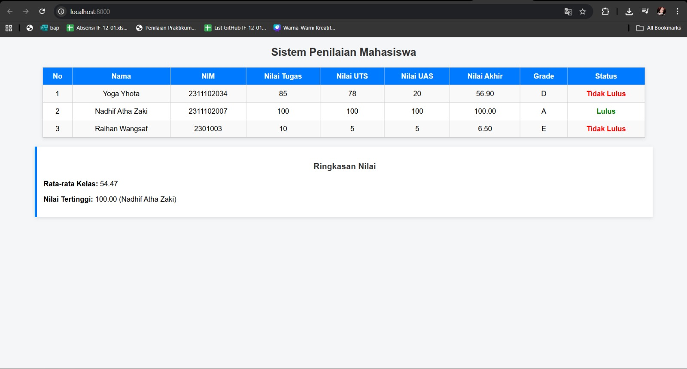

<div align="center">
  <br />
  <h1>LAPORAN PRAKTIKUM <br>APLIKASI BERBASIS PLATFORM</h1>
  <br />
  <h3>TUGAS MODUL 9 <br> PHP: SISTEM PENILAIAN MAHASISWA</h3>
  <br />
  <br />
   
  <br />
  <br />
  <br />
  <br />
  <h3>Disusun Oleh :</h3>
  <p>
    <strong>NADHIF ATHA ZAKI</strong><br>
    <strong>2311102007</strong><br>
    <strong>S1 IF-11-01</strong>
  </p>
  <br />
  <br />
  <h3>Dosen Pengampu :</h3>
  <p>
    <strong>Dimas Fanny Hebrasianto Permadi, S.ST., M.Kom</strong>
  </p>
  <br />
  <br />
    <h4>Asisten Praktikum :</h4>
    <strong> Apri Pandu Wicaksono </strong> <br>
    <strong>Rangga Pradarrell Fathi</strong>
  <br />
  <h3>LABORATORIUM HIGH PERFORMANCE
 <br>FAKULTAS INFORMATIKA <br>UNIVERSITAS TELKOM PURWOKERTO <br>2026</h3>
</div>

---

## Dasar Teori

Dalam praktikum pengembangan sistem penilaian mahasiswa menggunakan PHP, terdapat beberapa konsep teori dasar yang digunakan:

1. **PHP (Hypertext Preprocessor):** Bahasa skrip *server-side* sumber terbuka yang ditanamkan pada HTML, digunakan secara luas untuk pengembangan web dinamis dan pemrosesan sistem logika di sisi *backend*.
2. **Array Asosiatif:** Merupakan jenis struktur data koleksi *array* di PHP dimana setiap nilainya dipetakan ke kunci (*key*) bertipe *string* alih-alih indeks numerik. Ini sangat berguna untuk menyimpan data berpasangan secara spesifik menyerupai baris pada *record* basis data (contoh: `"nama" => "Yoga Yhota"`).
3. **Fungsi (Function):** Blok set instruksi kode terisolasi yang dapat dipanggil kembali, menerima parameter *(input)* dan mengembalikan nilai *(output)* untuk menjalankan tugas spesifik. Menggunakan fungsi membuat kode lebih efisien, modular, dan dapat digunakan ulang *(reusable)* tanpa harus ditulis berulang.
4. **Struktur Kontrol (Kondisional & Perulangan):** Elemen logika krusial untuk mengatur alur program. **Kondisional** (`if`, `elseif`, `else`) menentukan blok percabangan yang dieksekusi berdasarkan kondisi *true/false*. Sedangkan **perulangan iterasi** (`foreach`) digunakan untuk menavigasi setiap item di dalam struktur *array* secara berulang untuk efisiensi *rendering* data.

---

## 1. Implementasi Persyaratan Tugas (Kebutuhan Sistem)

Program Sistem Penilaian Mahasiswa ini dirancang untuk memenuhi semua syarat wajib pada soal dengan mengimplementasikan komponen-komponen utama PHP dalam satu file tunggal `index.php`.

### 1.1 Array Asosiatif untuk Menyimpan Data Mahasiswa (Minimal 3 Data)

Penyimpanan data statis menggunakan struktur *array asosiatif*, sehingga setiap elemen (seperti `"nama"`, `"nim"`, dll.) memiliki *key*-nya masing-masing. Program menyimpan 3 data mahasiswa sesuai ketentuan soal.

```php
$mahasiswa = [
    [
        "nama" => "Yoga Yhota",
        "nim" => "2311102034",
        "nilai_tugas" => 85,
        "nilai_uts" => 78,
        "nilai_uas" => 20
    ],
    [
        "nama" => "Nadhif Atha Zaki",
        "nim" => "2311102007",
        "nilai_tugas" => 100,
        "nilai_uts" => 100,
        "nilai_uas" => 100
    ],
    [
        "nama" => "Raihan Wangsaf",
        "nim" => "2311102003",
        "nilai_tugas" => 10,
        "nilai_uts" => 5,
        "nilai_uas" => 5
    ]
];
```

### 1.2 Gunakan *Function* dan *Operator Aritmatika* Menghitung Nilai Akhir

Perhitungan melibatkan operator aritmatika (`+` untuk penjumlahan dan `*` untuk perkalian bobot persentase) yang dibungkus dalam fungsi `hitungNilaiAkhir()`. Bobot yang digunakan adalah: Tugas 30%, UTS 30%, dan UAS 40%.

```php
function hitungNilaiAkhir($tugas, $uts, $uas)
{
    // Bobot: tugas 30%, UTS 30%, UAS 40%
    return ($tugas * 0.30) + ($uts * 0.30) + ($uas * 0.40);
}
```

### 1.3 Gunakan *If/Else* untuk Menentukan Grade

Untuk mengkonversi nilai angka ke huruf grade, digunakan kondisional `if/elseif/else` dalam fungsi `tentukanGrade()`. Pemilihan kondisional ini cocok karena cakupan gradasinya luas (A hingga E).

```php
function tentukanGrade($nilaiAkhir)
{
    if ($nilaiAkhir >= 85) {
        return "A";
    } elseif ($nilaiAkhir >= 75) {
        return "B";
    } elseif ($nilaiAkhir >= 65) {
        return "C";
    } elseif ($nilaiAkhir >= 50) {
        return "D";
    } else {
        return "E";
    }
}
```

### 1.4 Gunakan *Operator Perbandingan* untuk Menentukan Kelulusan

Operator perbandingan **lebih besar sama dengan (`>=`)** digunakan untuk menyeleksi ambang batas kelulusan dalam fungsi `tentukanStatus()`. Mahasiswa dinyatakan lulus jika nilai akhir mencapai minimal 65.

```php
function tentukanStatus($nilaiAkhir)
{
    if ($nilaiAkhir >= 65) {
        return "Lulus";
    } else {
        return "Tidak Lulus";
    }
}
```

### 1.5 Gunakan *Looping (Perulangan)* untuk Memproses dan Menampilkan Data

Proses rekapitulasi data menggunakan *looping* `foreach` untuk menghitung nilai akhir setiap mahasiswa, menentukan grade dan status, sekaligus menghitung total nilai untuk rata-rata kelas dan mencari nilai tertinggi.

```php
foreach ($mahasiswa as $key => $mhs) {
    $nilaiAkhir = hitungNilaiAkhir($mhs["nilai_tugas"], $mhs["nilai_uts"], $mhs["nilai_uas"]);
    $grade = tentukanGrade($nilaiAkhir);
    $status = tentukanStatus($nilaiAkhir);

    // Simpan hasil ke array
    $mahasiswa[$key]["nilai_akhir"] = $nilaiAkhir;
    $mahasiswa[$key]["grade"] = $grade;
    $mahasiswa[$key]["status"] = $status;

    // Hitung total untuk rata-rata
    $totalNilai += $nilaiAkhir;

    // Cari nilai tertinggi
    if ($nilaiAkhir > $nilaiTertinggi) {
        $nilaiTertinggi = $nilaiAkhir;
        $mahasiswaTertinggi = $mhs["nama"];
    }
}
```

Hasil yang telah diproses kemudian ditampilkan dalam tabel HTML menggunakan `foreach` kedua di bagian *view*:

```php
<?php foreach ($mahasiswa as $index => $mhs): ?>
<tr>
    <td><?= $index + 1; ?></td>
    <td><?= $mhs["nama"]; ?></td>
    <td><?= $mhs["nim"]; ?></td>
    <td><?= $mhs["nilai_tugas"]; ?></td>
    <td><?= $mhs["nilai_uts"]; ?></td>
    <td><?= $mhs["nilai_uas"]; ?></td>
    <td><?= number_format($mhs["nilai_akhir"], 2); ?></td>
    <td><?= $mhs["grade"]; ?></td>
    <td class="<?= ($mhs["status"] == 'Lulus') ? 'lulus' : 'tidak-lulus'; ?>">
        <?= $mhs["status"]; ?>
    </td>
</tr>
<?php endforeach; ?>
```

---

## 2. Penjelasan Kode Sumber (Arsitektur Single-File)

Seluruh logika dan tampilan program dikemas dalam satu file `index.php` dengan struktur yang terbagi menjadi dua bagian utama:

1. **Bagian PHP (Logika Backend):** Terletak di bagian atas file, sebelum tag HTML. Berisi definisi array mahasiswa, tiga fungsi utama (`hitungNilaiAkhir`, `tentukanGrade`, `tentukanStatus`), serta blok `foreach` untuk memproses seluruh data dan menghitung statistik kelas (rata-rata dan nilai tertinggi).

2. **Bagian HTML (Tampilan Frontend):** Terletak setelah bagian PHP. Berisi markup HTML lengkap dengan styling CSS *inline* menggunakan tag `<style>`, tabel hasil penilaian yang diisi secara dinamis melalui PHP *short echo tag* (`<?= ?>`), dan bagian ringkasan nilai kelas di bagian bawah halaman.

Pendekatan *single-file* ini sederhana dan cocok untuk skala proyek kecil karena tidak memerlukan konfigurasi tambahan dan langsung dapat dijalankan melalui web server lokal seperti XAMPP atau PHP Built-in Server.

---

## 3. Hasil Tampilan (Screenshots) Aplikasi

Berikut adalah lampiran screenshot dari Web Sistem Penilaian ketika berhasil dieksekusi melalui localhost. Halaman menampilkan tabel lengkap berisi nama, NIM, nilai tugas, nilai UTS, nilai UAS, nilai akhir, grade, dan status kelulusan setiap mahasiswa, serta ringkasan rata-rata kelas dan nilai tertinggi di bagian bawah.

* Screenshot tampilan Web Sistem Penilaian Mahasiswa (Full):




---

## 4. Referensi

- **PHP Documentation - Arrays**: [https://www.php.net/manual/en/language.types.array.php](https://www.php.net/manual/en/language.types.array.php)
- **PHP Documentation - Functions**: [https://www.php.net/manual/en/language.functions.php](https://www.php.net/manual/en/language.functions.php)
- **PHP Documentation - Control Structures**: [https://www.php.net/manual/en/language.control-structures.php](https://www.php.net/manual/en/language.control-structures.php)
- **PHP Documentation - `number_format()`**: [https://www.php.net/manual/en/function.number-format.php](https://www.php.net/manual/en/function.number-format.php)
- **PHP Documentation - Operators (Arithmetic & Comparison)**: [https://www.php.net/manual/en/language.operators.php](https://www.php.net/manual/en/language.operators.php)
- **MDN Web Docs - HTML Tables**: [https://developer.mozilla.org/en-US/docs/Web/HTML/Element/table](https://developer.mozilla.org/en-US/docs/Web/HTML/Element/table)
- **MDN Web Docs - CSS (Inline Styling)**: [https://developer.mozilla.org/en-US/docs/Web/CSS](https://developer.mozilla.org/en-US/docs/Web/CSS)