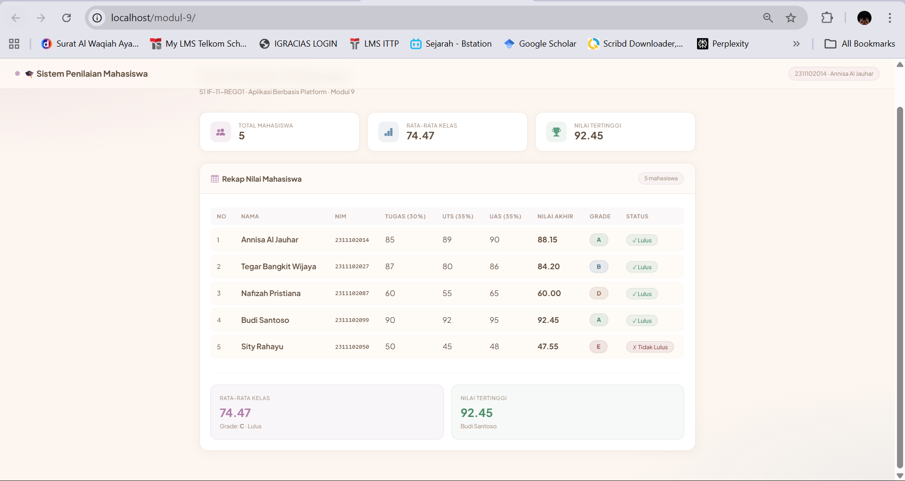

<div align="center">

# LAPORAN PRAKTIKUM
# APLIKASI BERBASIS PLATFORM

---

## MODUL 9
## SISTEM PENILAIAN MAHASISWA DENGAN PHP

---


---

**Disusun Oleh :**

**ANNISA AL JAUHAR**

**2311102014**

**S1 IF-11-REG01**

---

**Dosen Pengampu :**

Dimas Fanny Hebrasianto Permadi, S.ST., M.Kom

---

**PROGRAM STUDI S1 INFORMATIKA**

**FAKULTAS INFORMATIKA**

**UNIVERSITAS TELKOM PURWOKERTO**

**2025/2026**

</div>

---

## 1. Dasar Teori

### PHP (Hypertext Preprocessor)
PHP adalah bahasa pemrograman server-side yang dirancang khusus untuk pengembangan web. PHP dijalankan di sisi server sehingga hasil eksekusinya dikirimkan ke browser pengguna dalam bentuk HTML. PHP mendukung berbagai paradigma pemrograman seperti prosedural dan berorientasi objek. Pada praktikum ini PHP digunakan sebagai bahasa utama untuk membangun sistem penilaian mahasiswa yang menghitung nilai akhir, menentukan grade, dan menampilkan status kelulusan.

### Array Asosiatif PHP
Array asosiatif adalah tipe array di PHP yang menggunakan key berupa string sebagai indeks elemen, bukan angka seperti array biasa. Dengan array asosiatif, data dapat diakses menggunakan nama key yang bermakna seperti `nama`, `nim`, atau `nilai_tugas`. Pada praktikum ini array asosiatif digunakan untuk menyimpan data setiap mahasiswa dalam satu elemen array sehingga data terstruktur dengan rapi dan mudah diakses menggunakan key yang deskriptif.

### Function PHP
Function adalah blok kode yang dapat dipanggil berulang kali dengan nama tertentu. PHP mendukung pembuatan function dengan parameter dan nilai kembalian (return value). Pada praktikum ini terdapat tiga function utama yaitu `hitungNilaiAkhir()` untuk menghitung nilai akhir berdasarkan bobot tugas, UTS, dan UAS, `tentukanGrade()` untuk menentukan grade berdasarkan nilai akhir, serta `tentukanStatus()` untuk menentukan apakah mahasiswa lulus atau tidak lulus.

### Operator Aritmatika dan Perbandingan
Operator aritmatika digunakan untuk melakukan perhitungan matematika seperti penjumlahan, pengurangan, perkalian, dan pembagian. Operator perbandingan digunakan untuk membandingkan dua nilai dan menghasilkan boolean true atau false. Pada praktikum ini operator aritmatika digunakan untuk menghitung nilai akhir dengan rumus `(tugas × 0.3) + (UTS × 0.35) + (UAS × 0.35)`, sedangkan operator perbandingan digunakan dalam struktur if/else untuk menentukan grade dan status kelulusan mahasiswa.

### Struktur Kontrol if/else
Struktur kontrol if/else digunakan untuk menjalankan blok kode tertentu berdasarkan kondisi yang dievaluasi. PHP mendukung if, elseif, dan else untuk membuat percabangan logika. Pada praktikum ini if/else digunakan dalam function `tentukanGrade()` dengan lima kondisi untuk grade A (≥85), B (≥75), C (≥65), D (≥55), dan E (di bawah 55), serta dalam function `tentukanStatus()` untuk menentukan lulus jika nilai akhir ≥55 dan tidak lulus jika di bawah 55.

### Loop foreach PHP
Loop foreach digunakan untuk mengiterasi setiap elemen dalam array secara berurutan. Foreach sangat cocok digunakan dengan array asosiatif karena dapat langsung mengakses setiap elemen beserta key-nya. Pada praktikum ini foreach digunakan sebanyak dua kali, yaitu pertama untuk menghitung nilai akhir semua mahasiswa sekaligus mencari nilai tertinggi menggunakan referensi `&$mhs`, dan kedua untuk menampilkan setiap baris data mahasiswa pada tabel HTML.

### Bootstrap 5
Bootstrap 5 adalah framework CSS open-source yang menyediakan komponen antarmuka yang responsif dan modern. Bootstrap memiliki grid system, komponen tabel, card, badge, dan berbagai utilitas CSS yang memudahkan pembuatan tampilan web. Pada praktikum ini Bootstrap 5 digunakan untuk membangun tampilan sistem penilaian mahasiswa dengan desain yang menarik menggunakan stat card, tabel responsif, badge berwarna untuk setiap grade, serta summary box untuk menampilkan rata-rata kelas dan nilai tertinggi.

---

## 2. Struktur Project
```
penilaian-mahasiswa/
└── index.php          (file utama: logika PHP + tampilan HTML)
```

---

## 3. Source Code

### index.php
```php
<?php
// Nama  : Annisa Al Jauhar
// NIM   : 2311102014
// Kelas : S1 IF-11-REG01

// Array asosiatif data mahasiswa
$mahasiswa = [
    [
        "nama" => "Annisa Al Jauhar",
        "nim" => "2311102014",
        "nilai_tugas" => 85,
        "nilai_uts" => 89,
        "nilai_uas" => 90
    ],
    [
        "nama" => "Tegar Bangkit Wijaya",
        "nim" => "2311102027",
        "nilai_tugas" => 87,
        "nilai_uts" => 80,
        "nilai_uas" => 86
    ],
    [
        "nama" => "Nafizah Pristiana",
        "nim" => "2311102087",
        "nilai_tugas" => 60,
        "nilai_uts" => 55,
        "nilai_uas" => 65
    ],
    [
        "nama" => "Budi Santoso",
        "nim" => "2311102099",
        "nilai_tugas" => 90,
        "nilai_uts" => 92,
        "nilai_uas" => 95
    ],
    [
        "nama" => "Sity Rahayu",
        "nim" => "2311102050",
        "nilai_tugas" => 50,
        "nilai_uts" => 45,
        "nilai_uas" => 48
    ]
];

// Function hitung nilai akhir
function hitungNilaiAkhir($tugas, $uts, $uas) {
    return ($tugas * 0.3) + ($uts * 0.35) + ($uas * 0.35);
}

// Function menentukan grade
function tentukanGrade($nilai) {
    if ($nilai >= 85) {
        return "A";
    } elseif ($nilai >= 75) {
        return "B";
    } elseif ($nilai >= 65) {
        return "C";
    } elseif ($nilai >= 55) {
        return "D";
    } else {
        return "E";
    }
}

// Function menentukan status
function tentukanStatus($nilai) {
    if ($nilai >= 55) {
        return "Lulus";
    } else {
        return "Tidak Lulus";
    }
}

// Hitung nilai akhir semua mahasiswa
$totalNilai = 0;
$nilaiTertinggi = 0;
$namaTertinggi = "";

foreach ($mahasiswa as &$mhs) {
    $mhs["nilai_akhir"] = hitungNilaiAkhir($mhs["nilai_tugas"], $mhs["nilai_uts"], $mhs["nilai_uas"]);
    $mhs["grade"] = tentukanGrade($mhs["nilai_akhir"]);
    $mhs["status"] = tentukanStatus($mhs["nilai_akhir"]);
    $totalNilai += $mhs["nilai_akhir"];
    if ($mhs["nilai_akhir"] > $nilaiTertinggi) {
        $nilaiTertinggi = $mhs["nilai_akhir"];
        $namaTertinggi = $mhs["nama"];
    }
}
unset($mhs); // FIX: hapus reference agar foreach HTML tidak bug

$rataRata = $totalNilai / count($mahasiswa);
?>

<!DOCTYPE html>
<html lang="id">
<head>
    <meta charset="UTF-8">
    <meta name="viewport" content="width=device-width, initial-scale=1.0">
    <title>Sistem Penilaian Mahasiswa</title>
    <link href="https://cdn.jsdelivr.net/npm/bootstrap@5.3.2/dist/css/bootstrap.min.css" rel="stylesheet">
    <link href="https://cdn.jsdelivr.net/npm/bootstrap-icons@1.11.3/font/bootstrap-icons.min.css" rel="stylesheet">
    <link href="https://fonts.googleapis.com/css2?family=Plus+Jakarta+Sans:wght@300;400;500;600;700&display=swap" rel="stylesheet">
    <style>
        :root {
            --bg:       #fdf6f0;
            --surface:  #fff9f5;
            --card:     #ffffff;
            --border:   #f0e6dd;
            --primary:  #c9a4c2;
            --primary2: #a4b8c9;
            --accent:   #c9bfa4;
            --text:     #5c4a3a;
            --muted:    #a08c7e;
            --green:    #a4c9b4;
            --red:      #c9a4a4;
            --yellow:   #c9c4a4;
            --blue:     #a4b4c9;
            --orange:   #c9b4a4;
        }

        * { box-sizing: border-box; }

        body {
            background: var(--bg);
            color: var(--text);
            font-family: 'Plus Jakarta Sans', sans-serif;
            min-height: 100vh;
        }

        body::before {
            content: '';
            position: fixed;
            inset: 0;
            z-index: 0;
            pointer-events: none;
            background:
                radial-gradient(ellipse 60% 40% at 0% 0%, rgba(201,164,194,0.18) 0%, transparent 60%),
                radial-gradient(ellipse 50% 40% at 100% 100%, rgba(164,184,201,0.15) 0%, transparent 60%);
        }

        .wrapper { position: relative; z-index: 1; }

        .topbar {
            background: rgba(255,249,245,0.85);
            backdrop-filter: blur(12px);
            border-bottom: 1px solid var(--border);
            padding: 0 2rem;
            height: 64px;
            display: flex;
            align-items: center;
            justify-content: space-between;
            position: sticky;
            top: 0;
            z-index: 100;
        }

        .brand {
            font-weight: 700;
            font-size: 1.1rem;
            color: var(--text);
            display: flex;
            align-items: center;
            gap: 0.5rem;
        }

        .brand-dot {
            width: 10px; height: 10px;
            border-radius: 50%;
            background: var(--primary);
        }

        .topbar-id {
            font-size: 0.78rem;
            color: var(--muted);
            background: rgba(201,164,194,0.1);
            border: 1px solid rgba(201,164,194,0.3);
            padding: 0.25rem 0.75rem;
            border-radius: 30px;
        }

        .main {
            max-width: 1100px;
            margin: 0 auto;
            padding: 2.5rem 1.5rem 4rem;
        }

        .page-title {
            font-size: 1.6rem;
            font-weight: 700;
            color: var(--text);
            margin-bottom: 0.3rem;
        }

        .page-sub {
            font-size: 0.85rem;
            color: var(--muted);
            margin-bottom: 2rem;
        }

        .stat-card {
            background: var(--card);
            border: 1px solid var(--border);
            border-radius: 16px;
            padding: 1.2rem 1.4rem;
            display: flex;
            align-items: center;
            gap: 1rem;
            box-shadow: 0 2px 12px rgba(92,74,58,0.06);
            transition: transform 0.2s;
        }

        .stat-card:hover { transform: translateY(-2px); }

        .stat-ico {
            width: 44px; height: 44px;
            border-radius: 12px;
            display: flex; align-items: center; justify-content: center;
            font-size: 1.2rem;
            flex-shrink: 0;
        }

        .ico-pink   { background: rgba(201,164,194,0.18); color: #b07ca8; }
        .ico-blue   { background: rgba(164,184,201,0.18); color: #6a90ae; }
        .ico-green  { background: rgba(164,201,180,0.18); color: #5f9e7e; }

        .stat-lbl {
            font-size: 0.72rem;
            color: var(--muted);
            text-transform: uppercase;
            letter-spacing: 0.06em;
        }

        .stat-val {
            font-size: 1.35rem;
            font-weight: 700;
            color: var(--text);
            line-height: 1.2;
        }

        .gcard {
            background: var(--card);
            border: 1px solid var(--border);
            border-radius: 18px;
            overflow: hidden;
            box-shadow: 0 2px 20px rgba(92,74,58,0.07);
        }

        .gcard-head {
            padding: 1.2rem 1.5rem;
            border-bottom: 1px solid var(--border);
            display: flex;
            align-items: center;
            justify-content: space-between;
            background: rgba(253,246,240,0.5);
        }

        .gcard-title {
            font-weight: 700;
            font-size: 0.97rem;
            color: var(--text);
            display: flex;
            align-items: center;
            gap: 0.5rem;
        }

        .gcard-title i { color: var(--primary); }

        .gcard-body { padding: 1.4rem; }

        table { width: 100%; border-collapse: separate; border-spacing: 0 6px; }

        table thead th {
            background: rgba(201,164,194,0.08) !important;
            color: var(--muted) !important;
            font-size: 0.72rem !important;
            text-transform: uppercase !important;
            letter-spacing: 0.08em !important;
            border: none !important;
            padding: 10px 14px !important;
            font-weight: 600 !important;
        }

        table thead th:first-child { border-radius: 10px 0 0 10px; }
        table thead th:last-child  { border-radius: 0 10px 10px 0; }

        table tbody td {
            background: rgba(253,246,240,0.6) !important;
            color: var(--text) !important;
            border: none !important;
            padding: 12px 14px !important;
            vertical-align: middle !important;
            transition: background 0.2s;
        }

        table tbody tr:hover td {
            background: rgba(201,164,194,0.08) !important;
        }

        table tbody td:first-child { border-radius: 10px 0 0 10px; }
        table tbody td:last-child  { border-radius: 0 10px 10px 0; }

        .grade-badge {
            display: inline-block;
            padding: 3px 14px;
            border-radius: 30px;
            font-size: 0.78rem;
            font-weight: 700;
            letter-spacing: 0.04em;
        }

        .grade-A { background: rgba(164,201,180,0.25); color: #4a8c68; border: 1px solid rgba(164,201,180,0.4); }
        .grade-B { background: rgba(164,184,201,0.25); color: #4a6e8c; border: 1px solid rgba(164,184,201,0.4); }
        .grade-C { background: rgba(201,196,164,0.25); color: #8c7e4a; border: 1px solid rgba(201,196,164,0.4); }
        .grade-D { background: rgba(201,180,164,0.25); color: #8c5e4a; border: 1px solid rgba(201,180,164,0.4); }
        .grade-E { background: rgba(201,164,164,0.25); color: #8c4a4a; border: 1px solid rgba(201,164,164,0.4); }

        .status-lulus {
            background: rgba(164,201,180,0.2);
            color: #4a8c68;
            border: 1px solid rgba(164,201,180,0.35);
            padding: 3px 12px;
            border-radius: 30px;
            font-size: 0.76rem;
            font-weight: 500;
        }

        .status-tidak {
            background: rgba(201,164,164,0.2);
            color: #8c4a4a;
            border: 1px solid rgba(201,164,164,0.35);
            padding: 3px 12px;
            border-radius: 30px;
            font-size: 0.76rem;
            font-weight: 500;
        }

        .nim-text {
            font-family: monospace;
            font-size: 0.82rem;
            color: var(--muted);
        }

        .summary-box {
            border-radius: 14px;
            padding: 1.2rem;
        }

        .summary-box .s-label {
            font-size: 0.7rem;
            text-transform: uppercase;
            letter-spacing: 0.07em;
            color: var(--muted);
            margin-bottom: 4px;
        }

        .summary-box .s-val {
            font-size: 1.5rem;
            font-weight: 700;
        }

        .summary-box .s-sub {
            font-size: 0.76rem;
            color: var(--muted);
            margin-top: 2px;
        }

        .box-purple {
            background: rgba(201,164,194,0.1);
            border: 1px solid rgba(201,164,194,0.25);
        }

        .box-purple .s-val { color: #b07ca8; }

        .box-green {
            background: rgba(164,201,180,0.1);
            border: 1px solid rgba(164,201,180,0.25);
        }

        .box-green .s-val { color: #4a8c68; }

        .divider {
            border: none;
            border-top: 1px solid var(--border);
            margin: 1.5rem 0;
        }

        @media (max-width: 768px) {
            .topbar { padding: 0 1rem; }
            .main { padding: 1.5rem 1rem 3rem; }
        }
    </style>
</head>
<body>
<div class="wrapper">

    <nav class="topbar">
        <div class="brand">
            <div class="brand-dot"></div>
            🎓 Sistem Penilaian Mahasiswa
        </div>
        <span class="topbar-id">2311102014 · Annisa Al Jauhar</span>
    </nav>

    <div class="main">

        <div class="page-title">Data Penilaian Mahasiswa</div>
        <div class="page-sub">S1 IF-11-REG01 · Aplikasi Berbasis Platform · Modul 9</div>

        <!-- STATS -->
        <div class="row g-3 mb-4">
            <div class="col-md-4">
                <div class="stat-card">
                    <div class="stat-ico ico-pink"><i class="bi bi-people-fill"></i></div>
                    <div>
                        <div class="stat-lbl">Total Mahasiswa</div>
                        <div class="stat-val"><?= count($mahasiswa) ?></div>
                    </div>
                </div>
            </div>
            <div class="col-md-4">
                <div class="stat-card">
                    <div class="stat-ico ico-blue"><i class="bi bi-bar-chart-fill"></i></div>
                    <div>
                        <div class="stat-lbl">Rata-rata Kelas</div>
                        <div class="stat-val"><?= number_format($rataRata, 2) ?></div>
                    </div>
                </div>
            </div>
            <div class="col-md-4">
                <div class="stat-card">
                    <div class="stat-ico ico-green"><i class="bi bi-trophy-fill"></i></div>
                    <div>
                        <div class="stat-lbl">Nilai Tertinggi</div>
                        <div class="stat-val"><?= number_format($nilaiTertinggi, 2) ?></div>
                    </div>
                </div>
            </div>
        </div>

        <!-- TABLE CARD -->
        <div class="gcard">
            <div class="gcard-head">
                <div class="gcard-title">
                    <i class="bi bi-table"></i> Rekap Nilai Mahasiswa
                </div>
                <span style="font-size:0.74rem; color:var(--muted); background:rgba(201,164,194,0.1); border:1px solid rgba(201,164,194,0.25); padding:0.2rem 0.7rem; border-radius:20px;">
                    <?= count($mahasiswa) ?> mahasiswa
                </span>
            </div>
            <div class="gcard-body">
                <div class="table-responsive">
                    <table>
                        <thead>
                            <tr>
                                <th>No</th>
                                <th>Nama</th>
                                <th>NIM</th>
                                <th>Tugas (30%)</th>
                                <th>UTS (35%)</th>
                                <th>UAS (35%)</th>
                                <th>Nilai Akhir</th>
                                <th>Grade</th>
                                <th>Status</th>
                            </tr>
                        </thead>
                        <tbody>
                            <?php $no = 1; foreach ($mahasiswa as $mhs): ?>
                            <tr>
                                <td style="color:var(--muted); font-size:0.82rem;"><?= $no++ ?></td>
                                <td style="font-weight:600;"><?= $mhs["nama"] ?></td>
                                <td class="nim-text"><?= $mhs["nim"] ?></td>
                                <td><?= $mhs["nilai_tugas"] ?></td>
                                <td><?= $mhs["nilai_uts"] ?></td>
                                <td><?= $mhs["nilai_uas"] ?></td>
                                <td><strong><?= number_format($mhs["nilai_akhir"], 2) ?></strong></td>
                                <td><span class="grade-badge grade-<?= $mhs['grade'] ?>"><?= $mhs["grade"] ?></span></td>
                                <td>
                                    <?php if ($mhs["status"] == "Lulus"): ?>
                                        <span class="status-lulus">✓ Lulus</span>
                                    <?php else: ?>
                                        <span class="status-tidak">✗ Tidak Lulus</span>
                                    <?php endif; ?>
                                </td>
                            </tr>
                            <?php endforeach; ?>
                        </tbody>
                    </table>
                </div>

                <hr class="divider">

                <!-- SUMMARY -->
                <div class="row g-3">
                    <div class="col-md-6">
                        <div class="summary-box box-purple">
                            <div class="s-label">Rata-rata Kelas</div>
                            <div class="s-val"><?= number_format($rataRata, 2) ?></div>
                            <div class="s-sub">Grade: <strong><?= tentukanGrade($rataRata) ?></strong> · <?= tentukanStatus($rataRata) ?></div>
                        </div>
                    </div>
                    <div class="col-md-6">
                        <div class="summary-box box-green">
                            <div class="s-label">Nilai Tertinggi</div>
                            <div class="s-val"><?= number_format($nilaiTertinggi, 2) ?></div>
                            <div class="s-sub"><?= $namaTertinggi ?></div>
                        </div>
                    </div>
                </div>

            </div>
        </div>

    </div>
</div>

<script src="https://cdn.jsdelivr.net/npm/bootstrap@5.3.2/dist/js/bootstrap.bundle.min.js"></script>
</body>
</html>
```

---

## 4. Langkah-Langkah Penggunaan

### 4.1 Tampilan Halaman Sistem Penilaian Mahasiswa
Saat aplikasi dibuka di browser melalui XAMPP pada alamat `http://localhost/modul-9/`, akan tampil halaman Sistem Penilaian Mahasiswa dengan desain berbasis Bootstrap 5. Di bagian atas terdapat navbar yang menampilkan nama aplikasi dan identitas mahasiswa. Di bawah navbar terdapat tiga buah stat card yang menampilkan Total Mahasiswa, Rata-rata Kelas, dan Nilai Tertinggi. Bagian utama menampilkan tabel rekap nilai seluruh mahasiswa yang memuat kolom Nama, NIM, Nilai Tugas, Nilai UTS, Nilai UAS, Nilai Akhir, Grade, dan Status kelulusan. Di bagian bawah tabel terdapat dua summary box yang merangkum rata-rata kelas beserta grade dan status, serta menampilkan nilai tertinggi beserta nama mahasiswa yang meraihnya.



---

## 5. Cara Menjalankan Aplikasi
```bash
# 1. Pastikan XAMPP sudah terinstal dan Apache sudah aktif

# 2. Salin folder project ke direktori htdocs XAMPP
#    Contoh: C:\xampp\htdocs\penilaian-mahasiswa\

# 3. Buka browser dan akses aplikasi
http://localhost/modul-9/
```