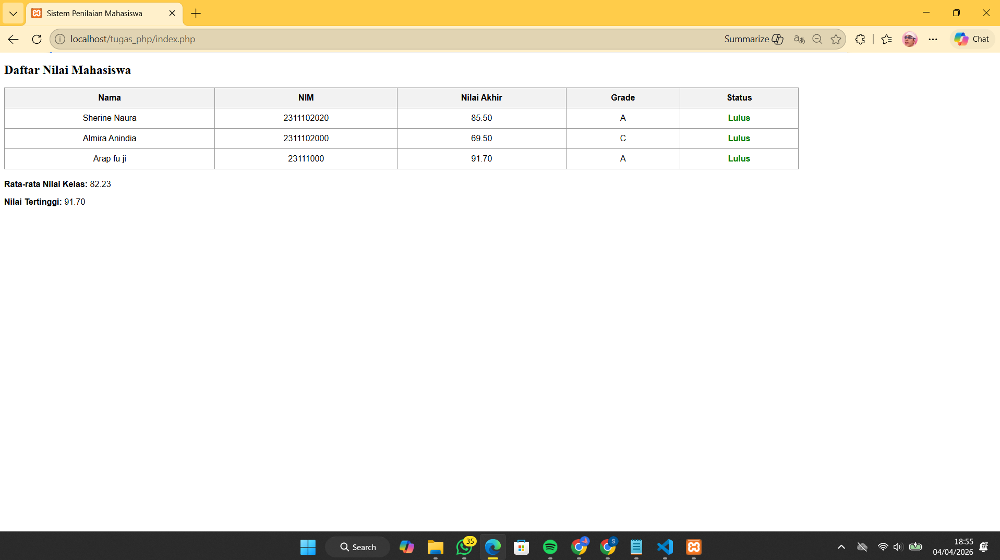

<div align="center">

# LAPORAN PRAKTIKUM
# APLIKASI BERBASIS PLATFORM

---

## MODUL 9
## PHP

---


---

**Disusun Oleh :**

**SHERINE NAURA EARLY GUNAWAN**

**2311102020**

**S1 IF-11-REG01**

---

**Dosen Pengampu :**

Dimas Fanny Hebrasianto Permadi, S.ST., M.Kom

---

**PROGRAM STUDI S1 INFORMATIKA**

**FAKULTAS INFORMATIKA**

**UNIVERSITAS TELKOM PURWOKERTO**

**2025/2026**

</div>

---

## 1. Dasar Teori
**PHP** adalah bahasa server side scripting yaitu teknologi pemrograman dimana script atau programnya dikompilasi dan diterjemahkan di sisi server. Fungsi utamanya untuk menerima permintaan dari browser dan mengirimkan kembali hasilnya dalam bentuk halaman web (HTML). Berikut merupakan variabel yang digunakan untuk menyimpan nilai, data, atau informasi:
- Simbol: Nama variabel selalu diawali dengan tanda $.
- Aturan Nama: Harus diawali huruf atau underscore (_), tidak boleh mengandung spasi, dan bersifat case sensitive (membedakan huruf besar dan kecil).
- Tipe Data: PHP mendukung 8 tipe data primitif, di antaranya: Boolean, Integer, Float, String, Array, Object, Resource, dan NULL.

---

## 2. Source Code

```php
<?php
$daftar_mahasiswa = [
    [
        "nama" => "Sherine Naura",
        "nim" => "2311102020",
        "tugas" => 85,
        "uts" => 80,
        "uas" => 90
    ],
    [
        "nama" => "Almira Anindia",
        "nim" => "2311102000",
        "tugas" => 70,
        "uts" => 75,
        "uas" => 65
    ],
    [
        "nama" => "Arap fu ji",
        "nim" => "23111000",
        "tugas" => 95,
        "uts" => 88,
        "uas" => 92
    ]
];

function hitungNilaiAkhir($tugas, $uts, $uas)
{
    return ($tugas * 0.3) + ($uts * 0.3) + ($uas * 0.4);
}

function tentukanGrade($nilai)
{
    if ($nilai >= 85) return "A";
    elseif ($nilai >= 75) return "B";
    elseif ($nilai >= 60) return "C";
    elseif ($nilai >= 50) return "D";
    else return "E";
}

$total_nilai_kelas = 0;
$nilai_tertinggi = 0;
?>

<!DOCTYPE html>
<html lang="id">

<head>
    <meta charset="UTF-8">
    <title>Sistem Penilaian Mahasiswa</title>
    <style>
        table {
            width: 80%;
            border-collapse: collapse;
            margin: 20px 0;
            font-family: sans-serif;
        }

        th,
        td {
            border: 1px solid #999;
            padding: 10px;
            text-align: center;
        }

        th {
            background-color: #f2f2f2;
        }

        .lulus {
            color: green;
            font-weight: bold;
        }

        .tidak-lulus {
            color: red;
            font-weight: bold;
        }
    </style>
</head>

<body>

    <h2>Daftar Nilai Mahasiswa</h2>

    <table>
        <thead>
            <tr>
                <th>Nama</th>
                <th>NIM</th>
                <th>Nilai Akhir</th>
                <th>Grade</th>
                <th>Status</th>
            </tr>
        </thead>
        <tbody>
            <?php

            foreach ($daftar_mahasiswa as $mhs) :
                $nilai_akhir = hitungNilaiAkhir($mhs['tugas'], $mhs['uts'], $mhs['uas']);
                $grade = tentukanGrade($nilai_akhir);

                $status = ($nilai_akhir >= 60) ? "Lulus" : "Tidak Lulus";
                $class_status = ($status == "Lulus") ? "lulus" : "tidak-lulus";

                $total_nilai_kelas += $nilai_akhir;
                if ($nilai_akhir > $nilai_tertinggi) {
                    $nilai_tertinggi = $nilai_akhir;
                }
            ?>
                <tr>
                    <td><?= $mhs['nama']; ?></td>
                    <td><?= $mhs['nim']; ?></td>
                    <td><?= number_format($nilai_akhir, 2); ?></td>
                    <td><?= $grade; ?></td>
                    <td class="<?= $class_status; ?>"><?= $status; ?></td>
                </tr>
            <?php endforeach; ?>
        </tbody>
    </table>

    <?php

    $rata_rata = $total_nilai_kelas / count($daftar_mahasiswa);
    ?>

    <div style="font-family: sans-serif;">
        <p><strong>Rata-rata Nilai Kelas:</strong> <?= number_format($rata_rata, 2); ?></p>
        <p><strong>Nilai Tertinggi:</strong> <?= number_format($nilai_tertinggi, 2); ?></p>
    </div>

</body>

</html>
```

## Penjelasan Kode 
Pada program diatas, sistem bekerja dengan menyimpan data mentah ke Array Asosiatif `$daftar_mahasiswa`, dimana setiap elemen data memiliki kunci spesifik seperti nama, NIM, dan komponen nilai yang berasal dari nilai tugas, UTS, dan UAS. Pengolahan data dilakukan menggunakan dua fungsi utama, fungsi `hitungNilaiAkhir` yang menerapkan operator aritmatika berdasarkan persentase tertentu, dan fungsi `tentukanGrade` yang menggunakan kondisi If-Else untuk mengklasifikasikan hasil angka kedalam indeks huruf. 

Proses penyajian data dilakukan menggunakan perulangan `foreach`, yang secara iteratif memproses setiap data mahasiswa dan menampilkan data ke dalam baris Tabel HTML. Di dalam iterasi tersebutm program menjalankan logika Operator Perbandingan untuk menentukan status kelulusan (Lulus >= 60)

---

### 3. Hasil
<div align="center">
    
</div>