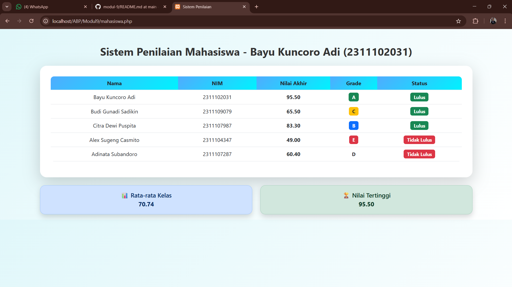

<div align="center">
  <br />
  <h1>LAPORAN PRAKTIKUM <br>APLIKASI BERBASIS PLATFORM</h1>
  <br />
  <h3> MODUL 09 <br> PHP </h3>
  <br />
   
  <br />
  <br />
  <br />
  <h3>Disusun Oleh :</h3>
  <p>
    <strong>Bayu Kuncoro Adi</strong><br>
    <strong>2311102031</strong><br>
    <strong>S1 IF-11-01</strong>
  </p>
  <br />
  <h3>Dosen Pengampu :</h3>
  <p>
    <strong>Dimas Fanny Hebrasianto Permadi, S.ST., M.Kom</strong>
  </p>
  <br />
  <br />
    <h4>Asisten Praktikum :</h4>
    <strong> Apri Pandu Wicaksono </strong> <br>
    <strong>Rangga Pradarrell Fathi</strong>
  <br />
  <h3>LABORATORIUM HIGH PERFORMANCE
 <br>FAKULTAS INFORMATIKA <br>UNIVERSITAS TELKOM PURWOKERTO <br>2026</h3>
</div>

---

## 1. Dasar Teori

## 📘 Dasar Teori

### 🔹 PHP (Hypertext Preprocessor)

PHP (Hypertext Preprocessor) adalah bahasa pemrograman yang berjalan di sisi server (*server-side scripting*), yang berfungsi untuk memproses data dan menghasilkan output berupa halaman web dinamis. Kode PHP akan dieksekusi di server, kemudian hasilnya dikirim ke browser dalam bentuk HTML sehingga tidak terlihat langsung oleh pengguna.

PHP banyak digunakan dalam pengembangan web karena kemampuannya dalam:

* Mengolah data input dari pengguna
* Mengelola logika aplikasi
* Berinteraksi dengan database
* Menghasilkan konten dinamis

Dalam sistem penilaian mahasiswa, PHP digunakan untuk melakukan perhitungan nilai, menentukan grade, serta menampilkan hasil dalam bentuk tabel HTML.

---

### 🔹 Array Asosiatif

Array asosiatif adalah struktur data dalam PHP yang menyimpan data dalam bentuk pasangan *key* dan *value*. Berbeda dengan array biasa yang menggunakan indeks numerik, array asosiatif menggunakan nama kunci sehingga lebih mudah dipahami dan dikelola.

Contoh:

```php
$mahasiswa = [
    "nama" => "Bayu",
    "nim" => "2311102031"
];
```

Pada sistem ini, array asosiatif digunakan untuk menyimpan data mahasiswa yang memiliki beberapa atribut, seperti:

* Nama
* NIM
* Nilai tugas
* Nilai UTS
* Nilai UAS

Penggunaan array asosiatif memudahkan dalam pengolahan data karena setiap nilai dapat diakses langsung berdasarkan key-nya.

---

### 🔹 Function (Fungsi)

Function adalah sekumpulan perintah dalam program yang digunakan untuk menjalankan tugas tertentu dan dapat dipanggil berulang kali. Penggunaan function membuat kode lebih terstruktur, modular, dan mudah dipelihara.

Dalam sistem ini, function digunakan untuk:

* Menghitung nilai akhir mahasiswa
* Menentukan grade berdasarkan nilai akhir
* Menentukan status kelulusan

Contoh:

```php
function hitungNilaiAkhir($tugas, $uts, $uas) {
    return ($tugas * 0.3) + ($uts * 0.3) + ($uas * 0.4);
}
```

---

### 🔹 Operator

Operator adalah simbol yang digunakan untuk melakukan operasi terhadap suatu nilai atau variabel.

#### 1. Operator Aritmatika

Digunakan untuk melakukan perhitungan matematis, seperti:

* Penjumlahan (+)
* Perkalian (*)

Contoh:

```php
($tugas * 0.3) + ($uts * 0.3) + ($uas * 0.4)
```

#### 2. Operator Perbandingan

Digunakan untuk membandingkan dua nilai dan menghasilkan nilai boolean (true atau false).

Contoh:

```php
$nilai >= 65
```

Operator ini digunakan untuk menentukan apakah mahasiswa lulus atau tidak.

---

### 🔹 Struktur Kontrol

Struktur kontrol adalah mekanisme dalam pemrograman yang digunakan untuk mengatur alur eksekusi program berdasarkan kondisi tertentu.

#### 1. Percabangan (if/else)

Digunakan untuk pengambilan keputusan berdasarkan kondisi.

Contoh:

```php
if ($nilai >= 85) {
    return "A";
} elseif ($nilai >= 75) {
    return "B";
}
```

Dalam sistem ini, percabangan digunakan untuk:

* Menentukan grade
* Menentukan status kelulusan

---

#### 2. Perulangan (Loop)

Perulangan digunakan untuk menjalankan kode secara berulang selama kondisi tertentu terpenuhi.

Contoh:

```php
foreach ($mahasiswa as $m) {
    // menampilkan data mahasiswa
}
```

Dalam sistem ini, loop digunakan untuk:

* Menampilkan seluruh data mahasiswa
* Menghindari penulisan kode berulang

---


## 2. Sourcecode 

### Sourcecode penilaianmahasiswabayu.php
<?php
$mahasiswa = [
    ["nama"=>"Bayu Kuncoro Adi","nim"=>"2311102031","tugas"=>97,"uts"=>96,"uas"=>94],
    ["nama"=>"Budi Gunadi Sadikin","nim"=>"2311109079","tugas"=>60,"uts"=>65,"uas"=>70],
    ["nama"=>"Citra Dewi Puspita","nim"=>"2311107987","tugas"=>80,"uts"=>75,"uas"=>92],
    ["nama"=>"Alex Sugeng Casmito","nim"=>"2311104347","tugas"=>60,"uts"=>50,"uas"=>40],
    ["nama"=>"Adinata Subandoro","nim"=>"2311107287","tugas"=>70,"uts"=>62,"uas"=>52]
];

function hitungNilaiAkhir($t,$u,$ua){
    return ($t*0.3)+($u*0.3)+($ua*0.4);
}

function grade($n){
    if($n>=85) return "A";
    elseif($n>=75) return "B";
    elseif($n>=65) return "C";
    elseif($n>=50) return "D";
    else return "E";
}

function status($n){
    return ($n>=65) ? "Lulus" : "Tidak Lulus";
}

$total = 0;
$max = 0;
?>

<!DOCTYPE html>
<html>
<head>
    <title>Sistem Penilaian</title>
    <link href="https://cdn.jsdelivr.net/npm/bootstrap@5.3.0/dist/css/bootstrap.min.css" rel="stylesheet">

    <style>
        body {
            background: linear-gradient(135deg, #e0f7fa, #ffffff);
            font-family: 'Segoe UI', Tahoma, Geneva, Verdana, sans-serif;
        }

        .card {
            border-radius: 20px;
            border: none;
        }

        .table {
            border-radius: 10px;
            overflow: hidden;
        }

        th {
            background: linear-gradient(135deg, #4facfe, #00f2fe);
            color: white;
        }

        .badge-grade {
            font-size: 14px;
            padding: 6px 10px;
        }

        .title {
            font-weight: bold;
            color: #333;
        }

        .summary-box {
            border-radius: 15px;
            font-size: 18px;
            font-weight: 500;
        }
    </style>
</head>

<body>

<div class="container mt-5">
    <h2 class="text-center mb-4 title">Sistem Penilaian Mahasiswa - Bayu Kuncoro Adi (2311102031)</h2>

    <div class="card shadow-lg p-3">
        <div class="card-body">
            <table class="table table-hover text-center align-middle">
                <thead>
                    <tr>
                        <th>Nama</th>
                        <th>NIM</th>
                        <th>Nilai Akhir</th>
                        <th>Grade</th>
                        <th>Status</th>
                    </tr>
                </thead>
                <tbody>

                <?php foreach($mahasiswa as $m){
                    $na = hitungNilaiAkhir($m['tugas'],$m['uts'],$m['uas']);
                    $g = grade($na);
                    $s = status($na);

                    $total += $na;
                    if($na > $max) $max = $na;

                    // warna grade
                    $warnaGrade = match($g) {
                        "A" => "bg-success",
                        "B" => "bg-primary",
                        "C" => "bg-warning text-dark",
                        "D" => "bg-orange text-dark",
                        default => "bg-danger"
                    };
                ?>
                    <tr>
                        <td><?= $m['nama'] ?></td>
                        <td><?= $m['nim'] ?></td>
                        <td><b><?= number_format($na,2) ?></b></td>
                        <td>
                            <span class="badge <?= $warnaGrade ?> badge-grade"><?= $g ?></span>
                        </td>
                        <td>
                            <span class="badge <?= ($s=="Lulus")?'bg-success':'bg-danger' ?> badge-grade">
                                <?= $s ?>
                            </span>
                        </td>
                    </tr>
                <?php } ?>

                </tbody>
            </table>
        </div>
    </div>

    <?php $avg = $total / count($mahasiswa); ?>

    <div class="row text-center mt-4">
        <div class="col-md-6">
            <div class="alert alert-primary shadow summary-box">
                📊 Rata-rata Kelas <br>
                <b><?= number_format($avg,2) ?></b>
            </div>
        </div>
        <div class="col-md-6">
            <div class="alert alert-success shadow summary-box">
                🏆 Nilai Tertinggi <br>
                <b><?= number_format($max,2) ?></b>
            </div>
        </div>
    </div>
</div>

</body>
</html>


## OUTPUT PROGRAM

<p align="center">
  
</p>


## Penjelasan Program Sistem Penilaian Mahasiswa

### 1. Inisialisasi Data Mahasiswa

```php
$mahasiswa = [
    ["nama"=>"Bayu Kuncoro Adi","nim"=>"2311102031","tugas"=>97,"uts"=>96,"uas"=>94],
    ...
];
```

Bagian ini digunakan untuk menyimpan data mahasiswa dalam bentuk **array multidimensi (array asosiatif)**.
Setiap mahasiswa memiliki beberapa atribut:

* `nama` → Nama mahasiswa
* `nim` → Nomor Induk Mahasiswa
* `tugas` → Nilai tugas
* `uts` → Nilai Ujian Tengah Semester
* `uas` → Nilai Ujian Akhir Semester

Struktur ini memungkinkan penyimpanan banyak data mahasiswa dalam satu variabel.

---

### 2. Function Menghitung Nilai Akhir

```php
function hitungNilaiAkhir($t,$u,$ua){
    return ($t*0.3)+($u*0.3)+($ua*0.4);
}
```

Fungsi ini digunakan untuk menghitung nilai akhir berdasarkan bobot:

* Tugas = 30%
* UTS = 30%
* UAS = 40%

Fungsi menerima 3 parameter:

* `$t` → nilai tugas
* `$u` → nilai UTS
* `$ua` → nilai UAS

Kemudian mengembalikan hasil perhitungan nilai akhir.

---

### 3. Function Menentukan Grade

```php
function grade($n){
    if($n>=85) return "A";
    elseif($n>=75) return "B";
    elseif($n>=65) return "C";
    elseif($n>=50) return "D";
    else return "E";
}
```

Fungsi ini digunakan untuk menentukan **grade nilai** berdasarkan nilai akhir:

* A → ≥ 85
* B → ≥ 75
* C → ≥ 65
* D → ≥ 50
* E → < 50

Menggunakan struktur kontrol `if/elseif/else`.

---

### 4. Function Status Kelulusan

```php
function status($n){
    return ($n>=65) ? "Lulus" : "Tidak Lulus";
}
```

Fungsi ini menggunakan **operator ternary** untuk menentukan:

* "Lulus" jika nilai ≥ 65
* "Tidak Lulus" jika nilai < 65

---

### 5. Variabel Perhitungan Global

```php
$total = 0;
$max = 0;
```

Digunakan untuk:

* `$total` → menjumlahkan seluruh nilai akhir mahasiswa
* `$max` → menyimpan nilai tertinggi

---

### 6. Struktur HTML & Bootstrap

```html
<link href="https://cdn.jsdelivr.net/npm/bootstrap@5.3.0/dist/css/bootstrap.min.css" rel="stylesheet">
```

Digunakan untuk mempercantik tampilan dengan framework **Bootstrap**.
Program juga menggunakan CSS tambahan untuk:

* Background gradasi
* Card dengan sudut melengkung
* Tabel yang lebih modern

---

### 7. Perulangan Data Mahasiswa

```php
<?php foreach($mahasiswa as $m){ ?>
```

Digunakan untuk melakukan iterasi (loop) pada seluruh data mahasiswa.

Di dalam loop dilakukan:

* Menghitung nilai akhir
* Menentukan grade
* Menentukan status
* Menambahkan ke total nilai
* Mencari nilai tertinggi

---

### 8. Perhitungan Nilai dalam Loop

```php
$na = hitungNilaiAkhir($m['tugas'],$m['uts'],$m['uas']);
$g = grade($na);
$s = status($na);
```

Setiap data mahasiswa diproses dengan:

* Fungsi nilai akhir
* Fungsi grade
* Fungsi status

---

### 9. Menentukan Warna Grade

```php
$warnaGrade = match($g) {
    "A" => "bg-success",
    "B" => "bg-primary",
    "C" => "bg-warning text-dark",
    "D" => "bg-orange text-dark",
    default => "bg-danger"
};
```

Menggunakan **match expression (PHP 8)** untuk menentukan warna badge:

* A → Hijau
* B → Biru
* C → Kuning
* D → Oranye
* E → Merah

---

### 10. Menampilkan Data ke Tabel

```php
<td><?= $m['nama'] ?></td>
<td><?= $m['nim'] ?></td>
<td><?= number_format($na,2) ?></td>
```

Data ditampilkan dalam tabel HTML menggunakan:

* `<?= ?>` → shorthand PHP echo
* `number_format()` → format angka desimal

---

### 11. Menentukan Nilai Tertinggi

```php
if($na > $max) $max = $na;
```

Digunakan untuk mencari nilai tertinggi dari seluruh mahasiswa.

---

### 12. Menghitung Rata-rata Kelas

```php
$avg = $total / count($mahasiswa);
```

Rata-rata diperoleh dari:

* Total nilai akhir dibagi jumlah mahasiswa

---

### 13. Menampilkan Rata-rata & Nilai Tertinggi

```php
<?= number_format($avg,2) ?>
<?= number_format($max,2) ?>
```

Ditampilkan dalam bentuk **alert Bootstrap** agar lebih menarik.

---

## Kesimpulan

Program ini memanfaatkan:

* Array asosiatif untuk penyimpanan data
* Function untuk modularisasi kode
* Operator untuk perhitungan dan logika
* Struktur kontrol untuk pengambilan keputusan
* Loop untuk menampilkan data

Sehingga menghasilkan sistem penilaian mahasiswa yang:

* Dinamis
* Terstruktur
* Mudah dikembangkan
* Memiliki tampilan yang menarik

---

## Referensi

[1] PHP Documentation. (2024). *Arrays in PHP*.
   https://www.php.net/manual/en/language.types.array.php

[2] PHP Documentation. (2024). *User Defined Functions*.
   https://www.php.net/manual/en/functions.user-defined.php

[3] PHP Documentation. (2024). *Control Structures (if, else, foreach)*.
   https://www.php.net/manual/en/language.control-structures.php

[4] PHP Documentation. (2024). *Operators in PHP*.
   https://www.php.net/manual/en/language.operators.php

[5] PHP Documentation. (2024). *match Expression (PHP 8)*.
   https://www.php.net/manual/en/control-structures.match.php

[6] Bootstrap Documentation. (2024). *Bootstrap 5 Components & Tables*.
   https://getbootstrap.com/docs/5.3/

[7] Kadir, A. (2018). *Dasar Pemrograman Web Dinamis Menggunakan PHP*. Andi Publisher.

[8] [Modul 09 PHP](https://drive.google.com/drive/folders/1ug7dmm-aVF-NG9-YT5kT519HdGmkXaD-) </br>
