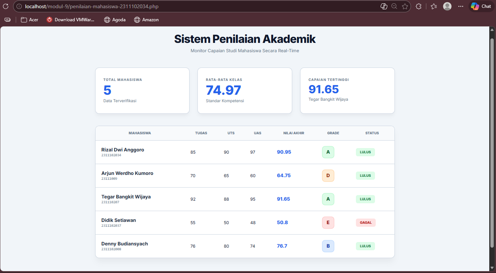

<div align="center">
  <br />
  <h1>LAPORAN PRAKTIKUM <br>APLIKASI BERBASIS PLATFORM</h1>
  <br />
  <h3>MODUL 9 PHP<br>  Sistem Penilaian Mahasiswa </h3>
  <br />
   
  <br />
  <br />
  <br />
  <h3>Disusun Oleh :</h3>
  <p>
    <strong>Rizal Dwi Anggoro</strong><br>
    <strong>2311102034</strong><br>
    <strong>IF-11-REG01</strong>
  </p>
  <br />
  <h3>Dosen Pengampu :</h3>
  <p>
    <strong>Dimas Fanny Hebrasianto Permadi, S.ST., M.Kom</strong>
  </p>
  <br />
  <br />
    <h4>Asisten Praktikum :</h4>
    <strong> Apri Pandu Wicaksono </strong> <br>
    <strong>Rangga Pradarrell Fathi</strong>
  <br />
  <h3>LABORATORIUM HIGH PERFORMANCE
 <br>FAKULTAS INFORMATIKA <br>UNIVERSITAS TELKOM PURWOKERTO <br>2026</h3>
</div>

---

## 1. DASAR TEORI
### 1.1 Pengertian PHP
PHP (Hypertext Preprocessor) adalah bahasa pemrograman server-side yang digunakan untuk membuat halaman web dinamis. PHP dapat dipadukan dengan HTML untuk menghasilkan tampilan web yang interaktif.

Pada kode yang digunakan, PHP berfungsi untuk:

Mengolah data mahasiswa
- Menghitung nilai akhir
- Menentukan grade dan status
- Menampilkan data ke dalam tabel HTML

### 1.2 Array Asosiatif
Array asosiatif adalah array yang menggunakan key (kunci) sebagai pengganti indeks angka.

Contoh pada kode:
```php
$mahasiswa = [
    ["nama" => "Rizal", "nim" => "...", "nilai_tugas" => 85]
];
```
Fungsinya:
- Menyimpan data mahasiswa secara terstruktur
- Memudahkan pemanggilan data berdasarkan nama field

### 1.3 Konstanta (define)
Konstanta adalah nilai tetap yang tidak bisa diubah selama program berjalan.

Contoh:
```php
define('BOBOT_TUGAS', 0.30);
```
Digunakan untuk:

- Menentukan bobot penilaian (tugas, UTS, UAS)
- Membuat kode lebih rapi dan mudah diubah

### 1.4 Function (Fungsi)
Function adalah blok kode yang digunakan untuk melakukan tugas tertentu.

Contoh:
```php
function hitungNilaiAkhir($tugas, $uts, $uas)
```
Fungsi dalam program:
- Menghitung nilai akhir mahasiswa
- Menentukan grade

Keuntungan:
- Menghindari pengulangan kode
- Membuat program lebih terstruktur

### 1.5 Operator Aritmatika
Digunakan untuk melakukan perhitungan matematika.

Contoh pada kode:
```php
($tugas * BOBOT_TUGAS) + ($uts * BOBOT_UTS)
```
Operator yang digunakan:

- `*` (perkalian)
- `+` (penjumlahan)

### 1.6 Percabangan (Conditional)
Digunakan untuk menentukan keputusan berdasarkan kondisi.

Pada kode digunakan:
- match (pengganti if-else modern di PHP)

Contoh:
```php
return match (true) {
    $nilai >= 85 => "A",
```
Fungsi:
- Menentukan grade berdasarkan nilai

### 1.7 Operator Perbandingan
Digunakan untuk membandingkan nilai.

Contoh:
```php
($akhir >= 60) ? "LULUS" : "GAGAL"
```
Operator yang digunakan:
- `>=` (lebih besar sama dengan)

Fungsi:
- Menentukan status kelulusan

### 1.8 Perulangan (Looping)
Digunakan untuk menampilkan data secara berulang.

Contoh:
```php
foreach ($mahasiswa as $mhs)
```
Fungsi:
- Mengolah setiap data mahasiswa
- Menampilkan data ke tabel

### 1.9 Pengolahan Data (Array Processing)
Dalam program dilakukan:
- Menambahkan data baru ke array (array_merge)
- Menghitung total nilai
- Mencari nilai tertinggi
- Menghitung rata-rata

### 1.10 HTML dalam PHP
PHP dapat digabung dengan HTML untuk menampilkan data.

Contoh:
```php
<?= $row['nama'] ?>
```
Fungsi:
- Menampilkan data dari PHP ke halaman web

### 1.11 Keamanan Dasar (htmlspecialchars)
Digunakan untuk mencegah serangan XSS.

Contoh:
```php
htmlspecialchars($row['nama'])
```
Fungsi:
- Menghindari input berbahaya dari user

### 1.12 Konsep Sistem Penilaian

Sistem penilaian mahasiswa menggunakan:

- Bobot nilai:
  - Tugas = 30%
  - UTS = 35%
  - UAS = 35%
- Kriteria:
  - Grade (A–E)
  - Status (Lulus/Gagal)

  ---

## 2. PENJELASAN CODE
### 2.1 Baris 1-5 Konstanta Bobot Nilai
```php
<?php
// Logika tetap sama seperti sebelumnya
define('BOBOT_TUGAS', 0.30);
define('BOBOT_UTS', 0.35);
define('BOBOT_UAS', 0.35);
```
Penjelasan:
- Mendefinisikan konstanta untuk bobot penilaian
- Digunakan dalam perhitungan nilai akhir
- Nilai tidak bisa diubah selama program berjalan

### 2.2 Baris 7–13 Data Mahasiswa
```php
$mahasiswa = [
    ["nama" => "Rizal Dwi Anggoro", "nim" => "2311102034", "nilai_tugas" => 85, "nilai_uts" => 90, "nilai_uas" => 97],
    ["nama" => "Arjun Werdho Kumoro", "nim" => "23111009", "nilai_tugas" => 70, "nilai_uts" => 65, "nilai_uas" => 60],
    ["nama" => "Tegar Bangkit Wijaya",   "nim" => "231110207", "nilai_tugas" => 92, "nilai_uts" => 88, "nilai_uas" => 95],
    ["nama" => "Didik Setiawan", "nim" => "2311102037", "nilai_tugas" => 55, "nilai_uts" => 50, "nilai_uas" => 48],
    ["nama" => "Denny Budiansyach",   "nim" => "2311102008", "nilai_tugas" => 76, "nilai_uts" => 80, "nilai_uas" => 74],
];
```
Penjelasan:
- Array asosiatif untuk menyimpan data mahasiswa
- Setiap mahasiswa memiliki:
- nama
- nim
- nilai tugas
- nilai uts
- nilai uas

### 2.3 Baris 15–17 Function Hitung Nilai Akhir
```php
function hitungNilaiAkhir(float $tugas, float $uts, float $uas): float {
    return ($tugas * BOBOT_TUGAS) + ($uts * BOBOT_UTS) + ($uas * BOBOT_UAS);
}
```
Penjelasan:
- Fungsi untuk menghitung nilai akhir
- Menggunakan rumus: `(tugas × 30%) + (uts × 35%) + (uas × 35%)`
- Menggunakan operator aritmatika `(*, +)`

### 2.4 Baris 19–27 Function Menentukan Grade
```php 
function tentukanGrade(float $nilai): string {
    return match (true) {
        $nilai >= 85 => "A",
        $nilai >= 75 => "B",
        $nilai >= 65 => "C",
        $nilai >= 55 => "D",
        default      => "E",
    };
}
```
Penjelasan:
- Menentukan grade berdasarkan nilai akhir
- Menggunakan match (percabangan modern PHP)
- Kriteria:
  - ≥85 => A
  - ≥75 => B
  - ≥65 => C
  - ≥55 => D
  - <55 => E

### 2.5 Baris 29–32 Inisialisasi Variabel
```php
$hasil = [];
$totalNilai = 0;
$nilaiTertinggi = -1;
$mhsTerbaik = "";
```
Penjelasan:
- $hasil => menyimpan data yang sudah diproses
- $totalNilai => untuk menghitung rata-rata
- $nilaiTertinggi => menyimpan nilai tertinggi
- $mhsTerbaik => menyimpan nama mahasiswa terbaik

### 2.6 Baris 34–46 Perulangan & Proses Data
```php
foreach ($mahasiswa as $mhs) {
    $akhir = hitungNilaiAkhir($mhs["nilai_tugas"], $mhs["nilai_uts"], $mhs["nilai_uas"]);
    $totalNilai += $akhir;
    if ($akhir > $nilaiTertinggi) {
        $nilaiTertinggi = $akhir;
        $mhsTerbaik = $mhs["nama"];
    }
    $hasil[] = array_merge($mhs, [
        "nilai_akhir" => round($akhir, 2),
        "grade"       => tentukanGrade($akhir),
        "status"      => ($akhir >= 60) ? "LULUS" : "GAGAL"
    ]);
}
```
Penjelasan:
- Loop untuk membaca setiap data mahasiswa
- Di dalamnya:
  - Hitung nilai akhir
  - Tambahkan ke total nilai
  - Cek nilai tertinggi
  - Simpan hasil ke array $hasil

### 2.7 Rata-rata Kelas
```php
$jumlahMhs = count($mahasiswa);
$rataRata  = $jumlahMhs > 0 ? round($totalNilai / $jumlahMhs, 2) : 0;
```
Penjelasan:
- Menghitung jumlah mahasiswa
- Menghitung rata-rata nilai

### 2.8 Baris 52-160 CSS
```css
<!DOCTYPE html>
<html lang="id">
<head>
    <meta charset="UTF-8">
    <meta name="viewport" content="width=device-width, initial-scale=1.0">
    <title>Sistem Penilaian Akademik - Large View</title>
    <link href="https://fonts.googleapis.com/css2?family=Inter:wght@400;600;700;800&display=swap" rel="stylesheet">
    
    <style>
        :root {
            --bg: #f1f5f9;
            --card-bg: #ffffff;
            --primary: #2563eb;
            --text-main: #0f172a;
            --text-muted: #64748b;
            --border: #cbd5e1;
            --success: #10b981;
            --danger: #ef4444;
        }

        * { margin: 0; padding: 0; box-sizing: border-box; }

        body {
            font-family: 'Inter', sans-serif;
            background-color: var(--bg);
            color: var(--text-main);
            padding: 3rem 1.5rem;
        }

        /* 1. Kontainer dibikin lebih lebar (1200px) */
        .container { max-width: 1200px; margin: 0 auto; }

        header { margin-bottom: 3.5rem; text-align: center; }
        /* 2. Judul diperbesar */
        header h1 { font-size: 2.8rem; font-weight: 800; letter-spacing: -0.03em; }
        header p { font-size: 1.1rem; color: var(--text-muted); margin-top: 0.7rem; }

        /* 3. Stat Cards lebih besar */
        .grid-stats {
            display: grid;
            grid-template-columns: repeat(auto-fit, minmax(300px, 1fr));
            gap: 2rem;
            margin-bottom: 3rem;
        }

        .stat-box {
            background: var(--card-bg);
            padding: 2.5rem 2rem;
            border-radius: 16px;
            border: 1px solid var(--border);
            box-shadow: 0 10px 15px -3px rgba(0,0,0,0.05);
        }

        .stat-label { font-size: 0.85rem; font-weight: 700; color: var(--text-muted); text-transform: uppercase; letter-spacing: 0.1em; }
        /* 4. Angka statistik diperbesar (3rem) */
        .stat-value { font-size: 3.2rem; font-weight: 800; margin-top: 0.5rem; color: var(--primary); line-height: 1; }
        .stat-sub { font-size: 1rem; color: var(--text-muted); margin-top: 0.5rem; font-weight: 500; }

        /* 5. Tabel dengan ukuran teks lebih nyaman */
        .table-container {
            background: var(--card-bg);
            border-radius: 16px;
            border: 1px solid var(--border);
            overflow-x: auto;
            box-shadow: 0 20px 25px -5px rgba(0,0,0,0.05);
        }

        table { width: 100%; border-collapse: collapse; min-width: 900px; }
        th {
            background: #f8fafc;
            padding: 1.25rem 1.5rem;
            font-size: 0.85rem;
            text-transform: uppercase;
            font-weight: 800;
            color: var(--text-muted);
            border-bottom: 2px solid var(--border);
        }

        /* 6. Row padding ditambah agar lebih tinggi */
        td { padding: 1.5rem; border-top: 1px solid var(--border); font-size: 1.05rem; vertical-align: middle; }
        
        .mhs-info .name { font-size: 1.2rem; font-weight: 700; color: #1e293b; }
        .mhs-info .nim { font-size: 0.9rem; color: var(--text-muted); font-family: monospace; margin-top: 2px; }

        /* 7. Badge & Grade lebih besar */
        .badge {
            padding: 0.5rem 1rem;
            border-radius: 8px;
            font-size: 0.85rem;
            font-weight: 800;
            text-transform: uppercase;
        }
        .badge-success { background: #dcfce7; color: #15803d; }
        .badge-danger { background: #fee2e2; color: #b91c1c; }
        
        .grade-circle {
            width: 45px; height: 45px;
            display: inline-flex; align-items: center; justify-content: center;
            border-radius: 10px; font-weight: 800; font-size: 1.2rem;
        }

        .A { background: #dcfce7; color: #166534; box-shadow: 0 0 0 2px #bbf7d0; }
        .B { background: #dbeafe; color: #1e40af; box-shadow: 0 0 0 2px #bfdbfe; }
        .C { background: #fef9c3; color: #854d0e; box-shadow: 0 0 0 2px #fef08a; }
        .D { background: #ffedd5; color: #9a3412; box-shadow: 0 0 0 2px #fed7aa; }
        .E { background: #fee2e2; color: #991b1b; box-shadow: 0 0 0 2px #fecaca; }

        footer { text-align: center; margin-top: 4rem; font-size: 1rem; color: var(--text-muted); font-weight: 500; }
    </style>
```
Penjelasan :
Pada bagian `<style>` berisi kode CSS yang digunakan untuk mengatur tampilan halaman. Pada `:root` didefinisikan variabel warna seperti background, teks, border, serta warna untuk status agar lebih konsisten dan mudah diubah.

Selanjutnya, selector `*` digunakan untuk mengatur margin dan padding semua elemen menjadi nol serta menggunakan `box-sizing: border-box` agar ukuran elemen lebih rapi. Pada bagian body, diatur font, warna latar belakang, warna teks, serta jarak agar tampilan tidak terlalu rapat.

Class `.container` digunakan untuk membatasi lebar halaman dan memposisikannya di tengah. Bagian header diatur agar teks berada di tengah dengan judul yang lebih besar dan tebal, serta deskripsi dengan warna lebih lembut.

Pada `.grid-stats`, digunakan layout grid untuk menampilkan beberapa kotak statistik secara rapi. Setiap `.stat-box` diberi background, padding, border, dan bayangan agar terlihat seperti kartu. Teks di dalamnya diatur menggunakan .stat-label, `.stat-value`, dan .stat-sub, di mana nilai utama dibuat lebih menonjol.

Bagian `.table-container` berfungsi sebagai pembungkus tabel agar tampil seperti kartu dan bisa di-scroll jika layar kecil. Tabel diatur agar memenuhi lebar container dengan garis yang rapi, sedangkan `header tabel` dibuat lebih jelas dengan background dan border.

Isi tabel `(td)` diberi padding agar nyaman dibaca. Class `.mhs-info` mengatur tampilan nama dan NIM, di mana nama dibuat lebih besar dan NIM lebih kecil.

Class `.badge` digunakan untuk menampilkan status dengan warna, yaitu hijau untuk lulus dan merah untuk gagal. Sedangkan `.grade-circle` digunakan untuk menampilkan grade dengan warna berbeda sesuai kategori.

Terakhir, bagian footer diatur agar teks berada di tengah dengan tampilan yang lebih ringan dan diberi jarak dari konten utama.

### 2.9 Baris 161-230
```html
</head>
<body>

    <div class="container">
        <header>
            <h1>Sistem Penilaian Akademik</h1>
            <p>Monitor Capaian Studi Mahasiswa Secara Real-Time</p>
        </header>

        <div class="grid-stats">
            <div class="stat-box">
                <div class="stat-label">Total Mahasiswa</div>
                <div class="stat-value"><?= $jumlahMhs ?></div>
                <div class="stat-sub">Data Terverifikasi</div>
            </div>
            <div class="stat-box">
                <div class="stat-label">Rata-rata Kelas</div>
                <div class="stat-value"><?= $rataRata ?></div>
                <div class="stat-sub">Standar Kompetensi</div>
            </div>
            <div class="stat-box">
                <div class="stat-label">Capaian Tertinggi</div>
                <div class="stat-value" style="font-size: 2.8rem;"><?= $nilaiTertinggi ?></div>
                <div class="stat-sub"><?= htmlspecialchars($mhsTerbaik) ?></div>
            </div>
        </div>

        <div class="table-container">
            <table>
                <thead>
                    <tr>
                        <th>Mahasiswa</th>
                        <th>Tugas</th>
                        <th>UTS</th>
                        <th>UAS</th>
                        <th>Nilai Akhir</th>
                        <th>Grade</th>
                        <th>Status</th>
                    </tr>
                </thead>
                <tbody>
                    <?php foreach ($hasil as $row): ?>
                    <tr>
                        <td class="mhs-info">
                            <div class="name"><?= htmlspecialchars($row['nama']) ?></div>
                            <div class="nim"><?= $row['nim'] ?></div>
                        </td>
                        <td><?= $row['nilai_tugas'] ?></td>
                        <td><?= $row['nilai_uts'] ?></td>
                        <td><?= $row['nilai_uas'] ?></td>
                        <td style="font-weight: 800; color: var(--primary); font-size: 1.2rem;"><?= $row['nilai_akhir'] ?></td>
                        <td><span class="grade-circle <?= $row['grade'] ?>"><?= $row['grade'] ?></span></td>
                        <td>
                            <span class="badge <?= $row['status'] === 'LULUS' ? 'badge-success' : 'badge-danger' ?>">
                                <?= $row['status'] ?>
                            </span>
                        </td>
                    </tr>
                    <?php endforeach; ?>
                </tbody>
            </table>
        </div>

        <footer>
            &copy; <?= date("Y") ?> &bull; Dashboard Akademik Profesional
        </footer>
    </div>

</body>
</html>
```
Penjelasan :
Pada bagian ini dimulai dengan penutup tag `<head>` dan dilanjutkan dengan `<body>` sebagai awal isi halaman. Seluruh konten dibungkus dalam `<div class="container">` agar tampilan rapi dan terpusat.

Bagian `<header>` menampilkan judul “Sistem Penilaian Akademik” dan deskripsi singkat sebagai informasi utama halaman.

Selanjutnya terdapat bagian grid-stats yang menampilkan tiga data utama yaitu jumlah mahasiswa, rata-rata kelas, dan nilai tertinggi. Data tersebut ditampilkan menggunakan sintaks PHP `<?= ?>` yang berfungsi untuk menampilkan nilai dari variabel seperti $jumlahMhs, $rataRata, dan $nilaiTertinggi. Nama mahasiswa terbaik ditampilkan menggunakan `htmlspecialchars()` untuk keamanan.

Berikutnya terdapat bagian tabel yang dibungkus dalam `table-container.` Tabel ini menampilkan data mahasiswa seperti nama, NIM, nilai tugas, UTS, UAS, nilai akhir, grade, dan status.

Data dalam tabel ditampilkan menggunakan perulangan `foreach`, sehingga setiap mahasiswa ditampilkan secara otomatis. Nama mahasiswa diamankan menggunakan `htmlspecialchars().` Nilai akhir ditampilkan lebih menonjol, sedangkan grade ditampilkan dengan warna sesuai kategori (A–E).

Status kelulusan ditentukan menggunakan operator ternary, yaitu jika “LULUS” akan berwarna hijau, dan jika tidak akan berwarna merah.

Terakhir, terdapat bagian `<footer>` yang menampilkan tahun secara otomatis menggunakan date("Y") serta teks penutup. Kemudian ditutup dengan tag `</body>` dan `</html>` sebagai akhir halaman.

---
## 3. HASIL


---
## Referensi
1. https://www.php.net
2. https://www.w3schools.com/php
3. https://www.w3schools.com/html
4. https://www.w3schools.com/css
5. https://developer.mozilla.org
5. https://www.geeksforgeeks.org/php-tutorials
7. https://www.tutorialspoint.com/php
8. https://www.programiz.com/php
