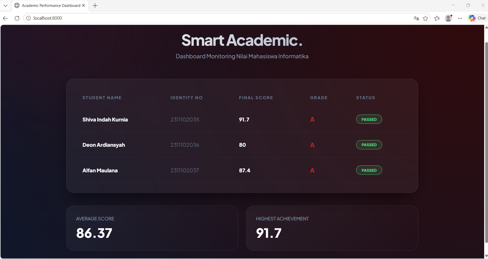

<div align="center">
  <br />
  <h1>LAPORAN PRAKTIKUM <br> APLIKASI BERBASIS PLATFORM</h1>
  <br />
  <h3>MODUL 9 <br> PHP</h3>
  <br />
  
  <br />
  <br />
  <br />
  <h3>Disusun Oleh :</h3>
  <p>
    <strong>Shiva Indah Kurnia</strong><br>
    <strong>2311102035</strong><br>
    <strong>S1 IF-11-01</strong>
  </p>
  <br />
  <h3>Dosen Pengampu :</h3>
  <p>
    <strong>Dimas Fanny Hebrasianto Permadi, S.ST., M.Kom</strong>
  </p>
  <br />
  <br />
  <h4>Asisten Praktikum :</h4>
  <strong>Apri Pandu Wicaksono</strong> <br>
  <strong>Rangga Pradarrell Fathi</strong>
  <br />
  <br />
  <br />
  <br />
  <h3>LABORATORIUM HIGH PERFORMANCE <br> FAKULTAS INFORMATIKA <br> UNIVERSITAS TELKOM PURWOKERTO <br> 2026</h3>
</div>

---

## 1. Dasar Teori

**PHP** merupakan bahasa pemrograman server-side yang krusial dalam pembuatan situs web dinamis karena kemampuannya mengolah logika, memproses input, dan menghasilkan konten yang disesuaikan sebelum dikirimkan ke peramban, berbeda dengan HTML atau CSS yang hanya berfokus pada elemen visual. Dalam tahap pengajaran awal, PHP memungkinkan pengelolaan data tanpa database melalui penggunaan array asosiatif yang menyimpan informasi dalam pasangan kunci dan nilai, sehingga data mahasiswa seperti nama dan komponen nilai menjadi lebih mudah diatur serta diakses. Logika program ini dijalankan menggunakan operator aritmatika dan perbandingan untuk menghitung nilai akhir berdasarkan bobot, sementara struktur percabangan if/else berfungsi untuk menentukan predikat nilai beserta status kelulusan mereka. Selain itu, penggunaan perulangan foreach memungkinkan sistem menyisir seluruh data dalam array dan menampilkannya secara otomatis ke dalam format tabel HTML yang rapi. Implementasi praktikum ini akhirnya menghasilkan Sistem Penilaian Mahasiswa yang menggunakan sinergi PHP, HTML, dan CSS untuk melakukan penghitungan nilai otomatis, mengidentifikasi predikat, serta menganalisis skor tertinggi dan rata-rata kelas dalam tampilan antarmuka yang bersih serta profesional.


## 2. Penjelasan Kode PHP, HTML, dan CSS

### Kode Program (`index.php`)

```php
<?php
// Data Mahasiswa (Array Asosiatif)
$mahasiswa = [
    ["nama" => "Shiva Indah Kurnia", "nim" => "2311102035", "tugas" => 95, "uts" => 88, "uas" => 92],
    ["nama" => "Naraya Revta", "nim" => "2311102036", "tugas" => 78, "uts" => 82, "uas" => 80],
    ["nama" => "Mohammad Alfan", "nim" => "2311102037", "tugas" => 88, "uts" => 90, "uas" => 85]
];

// Logic Functions
function hitungNilaiAkhir($tugas, $uts, $uas) {
    return round(($tugas * 0.3) + ($uts * 0.3) + ($uas * 0.4), 2);
}

function tentukanGrade($n) {
    if ($n >= 80) return "A";
    if ($n >= 70) return "B";
    if ($n >= 60) return "C";
    if ($n >= 50) return "D";
    return "E";
}

$total = 0; $tertinggi = 0;
?>

<!DOCTYPE html>
<html lang="id">
<head>
    <meta charset="UTF-8">
    <title>Academic Performance Dashboard</title>
    <link href="https://fonts.googleapis.com/css2?family=Plus+Jakarta+Sans:wght@300;400;600;800&display=swap" rel="stylesheet">
    <style>
        :root {
            --primary: #B31217; /* Tel-U Red */
            --accent: #FF3D43;
            --bg: #0f172a; /* Dark Luxury Blue/Black */
            --card: rgba(255, 255, 255, 0.03);
            --glass: rgba(255, 255, 255, 0.05);
            --text: #f8fafc;
        }

        * { margin: 0; padding: 0; box-sizing: border-box; }

        body {
            font-family: 'Plus Jakarta Sans', sans-serif;
            background: radial-gradient(circle at top right, #310a0b, var(--bg));
            color: var(--text);
            min-height: 100vh;
            padding: 60px 20px;
            overflow-x: hidden;
        }

        /* Background Deco */
        body::before {
            content: ""; position: absolute; top: -10%; left: -10%; width: 40%; height: 40%;
            background: var(--primary); filter: blur(150px); opacity: 0.15; z-index: -1;
        }

        .wrapper {
            max-width: 1100px;
            margin: 0 auto;
            animation: slideUp 1s cubic-bezier(0.2, 0.8, 0.2, 1);
        }

        header { text-align: center; margin-bottom: 60px; }
        header h1 { 
            font-size: 3rem; font-weight: 800; letter-spacing: -2px; 
            background: linear-gradient(to right, #fff, #94a3b8);
            -webkit-background-clip: text; -webkit-text-fill-color: transparent;
        }
        header p { color: #94a3b8; font-size: 1.1rem; margin-top: 10px; }

        /* Glass Table */
        .table-container {
            background: var(--glass);
            backdrop-filter: blur(20px);
            border: 1px solid rgba(255,255,255,0.1);
            border-radius: 24px;
            padding: 30px;
            box-shadow: 0 25px 50px -12px rgba(0,0,0,0.5);
            margin-bottom: 40px;
        }

        table { width: 100%; border-collapse: collapse; }
        th { 
            text-align: left; padding: 20px; color: #64748b; 
            font-size: 0.8rem; text-transform: uppercase; letter-spacing: 2px;
        }
        td { padding: 25px 20px; border-bottom: 1px solid rgba(255,255,255,0.05); transition: 0.3s; }
        
        tr:hover td { background: rgba(255,255,255,0.02); color: var(--accent); transform: scale(1.01); }

        /* Grade Badges */
        .grade {
            font-weight: 800; font-size: 1.2rem;
            background: linear-gradient(45deg, var(--primary), var(--accent));
            -webkit-background-clip: text; -webkit-text-fill-color: transparent;
        }

        .status {
            display: inline-block; padding: 6px 16px; border-radius: 100px;
            font-size: 0.75rem; font-weight: 700; border: 1px solid currentColor;
        }
        .lulus { color: #4ade80; background: rgba(74, 222, 128, 0.1); }
        .gagal { color: #f87171; background: rgba(248, 113, 113, 0.1); }

        /* Stats Section */
        .stats { display: grid; grid-template-columns: repeat(2, 1fr); gap: 25px; }
        .stat-card {
            background: linear-gradient(135deg, rgba(255,255,255,0.05) 0%, rgba(255,255,255,0) 100%);
            border: 1px solid rgba(255,255,255,0.1);
            padding: 30px; border-radius: 24px; transition: 0.4s;
        }
        .stat-card:hover { border-color: var(--primary); transform: translateY(-5px); }
        .stat-card span { display: block; color: #94a3b8; font-size: 0.9rem; margin-bottom: 10px; }
        .stat-card h2 { font-size: 2.5rem; font-weight: 800; color: #fff; }

        @keyframes slideUp {
            from { opacity: 0; transform: translateY(50px); }
            to { opacity: 1; transform: translateY(0); }
        }
    </style>
</head>
<body>

<div class="wrapper">
    <header>
        <h1>Smart Academic.</h1>
        <p>Dashboard Monitoring Nilai Mahasiswa Informatika</p>
    </header>

    <div class="table-container">
        <table>
            <thead>
                <tr>
                    <th>Student Name</th>
                    <th>Identity No</th>
                    <th>Final Score</th>
                    <th>Grade</th>
                    <th>Status</th>
                </tr>
            </thead>
            <tbody>
                <?php foreach ($mahasiswa as $mhs): 
                    $na = hitungNilaiAkhir($mhs['tugas'], $mhs['uts'], $mhs['uas']);
                    $g = tentukanGrade($na);
                    $total += $na;
                    if($na > $tertinggi) $tertinggi = $na;
                ?>
                <tr>
                    <td><strong><?= $mhs['nama'] ?></strong></td>
                    <td style="color: #64748b;"><?= $mhs['nim'] ?></td>
                    <td><strong><?= $na ?></strong></td>
                    <td class="grade"><?= $g ?></td>
                    <td>
                        <span class="status <?= ($na >= 60) ? 'lulus' : 'gagal' ?>">
                            <?= ($na >= 60) ? 'PASSED' : 'RETAKE' ?>
                        </span>
                    </td>
                </tr>
                <?php endforeach; ?>
            </tbody>
        </table>
    </div>

    <div class="stats">
        <div class="stat-card">
            <span>AVERAGE SCORE</span>
            <h2><?= round($total/count($mahasiswa), 2) ?></h2>
        </div>
        <div class="stat-card">
            <span>HIGHEST ACHIEVEMENT</span>
            <h2><?= $tertinggi ?></h2>
        </div>
    </div>
</div>

</body>
</html>
```
---

### Penjelasan Kode

---

### 1. PHP (The Logic & Data Layer)

Pada bagian paling atas, saya menggunakan PHP sebagai otak dari aplikasi ini. Kode diawali dengan pembuatan Array Asosiatif $mahasiswa yang berfungsi sebagai basis data sementara untuk menyimpan informasi nama, NIM, dan nilai. Penerapkan fungsi matematika melalui hitungNilaiAkhir untuk memproses operator aritmatika sesuai bobot persentase yang ditentukan. Selain itu, ada logika pengkondisian (if/else) untuk menentukan grade secara otomatis. Keunggulan PHP di sini adalah kemampuannya melakukan iterasi menggunakan foreach untuk memproses data massal, sehingga tidak perlu menulis baris tabel satu per satu secara manual. Semua perhitungan ini terjadi di sisi server sebelum hasilnya dikirimkan ke browser.

---

### 2. HTML (The Structural Layer)

HTML dalam kode ini bertindak sebagai kerangka atau tulang punggung yang menyusun anatomi halaman web. disini menggunakan elemen (table), (thead), dan (tbody) untuk mengorganisir data mahasiswa agar tampil rapi dalam baris dan kolom. Penggunaan tag semantik seperti (h1) dan header memberikan hierarki informasi yang jelas, sehingga browser (dan mesin pencari) paham mana judul utama dan mana konten pendukung. Struktur HTML ini dibuat dinamis; artinya, tag (tr) (baris tabel) akan dibuat secara otomatis oleh PHP sebanyak jumlah data yang ada di dalam array, memastikan efisiensi penulisan kode.

### 3. CSS

Menerapkan Glassmorphism melalui properti backdrop-filter: blur(), yang memberikan efek kaca transparan pada wadah tabel. Selain itu, aspek kreatif muncul pada penggunaan Global Variables (:root) untuk konsistensi warna dan animasi @keyframes yang membuat elemen web muncul dengan gerakan slide-up yang halus saat halaman dimuat. Efek hover pada baris tabel memberikan feedback visual instan kepada pengguna, menciptakan pengalaman antarmuka yang interaktif dan profesional.

---

### Hasil Tampilan (Screenshot)



---

## 3. Kesimpulan

Berdasarkan hasil pembuatan program ini, dapat disimpulkan bahwa struktur aplikasi berbasis web terdiri dari tiga komponen utama yang saling terintegrasi: PHP sebagai pengolah logika di sisi server (back-end), HTML sebagai penyusun kerangka data, dan CSS sebagai pengatur antarmuka pengguna (front-end). Penggunaan Array Asosiatif dalam PHP terbukti efektif untuk mengelola data terstruktur seperti biodata mahasiswa, sementara penerapan Function dan Control Flow (if-else/looping) mempermudah otomatisasi perhitungan nilai serta penentuan status kelulusan secara dinamis. Dari sisi tampilan, penerapan teknik modern seperti glassmorphism dan animasi transparan pada CSS berhasil meningkatkan aspek fungsionalitas dan estetika dashboard, sehingga data yang disajikan lebih mudah dibaca dan terlihat profesional. Secara teknis, pemisahan antara logika perhitungan dan struktur tampilan ini merupakan implementasi dasar yang krusial dalam pengembangan perangkat lunak yang bersih dan terorganisir.

---

## 4. Referensi

- Modul Praktikum Aplikasi Berbasis Platform – Modul 9 PHP  
- W3Schools PHP Tutorial : https://www.w3schools.com/php/
- Bootstrap 5 Official Documentation - Tables : https://getbootstrap.com/docs/5.3/content/tables/
