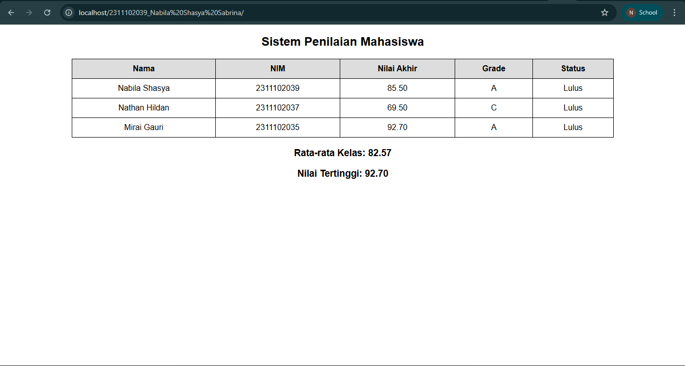

<div align="center">

&nbsp; <br />

&nbsp; <h1>LAPORAN PRAKTIKUM <br>APLIKASI BERBASIS PLATFORM</h1>

&nbsp; <br />

&nbsp; <h3>COTS-2 <br></h3>

&nbsp; <br />

&nbsp; <br />

&nbsp; 

&nbsp; <br />

&nbsp; <br />

&nbsp; <h3>Disusun Oleh :</h3>

&nbsp; <p>

&nbsp;   <strong>Nabila Shasya Sabrina</strong><br>

&nbsp;   <strong>2311102039</strong><br>

&nbsp;   <strong>S1 IF-11-01</strong>

&nbsp; </p>

&nbsp; <br />

&nbsp; <br />

&nbsp; <h3>Dosen Pengampu :</h3>

&nbsp; <p>

&nbsp;   <strong>Dimas Fanny Hebrasianto Permadi, S.ST., M.Kom</strong>

&nbsp; </p>

&nbsp; <br />

&nbsp; <br />

&nbsp; <h4>Asisten Praktikum :</h4>

&nbsp; <strong>Apri Pandu Wicaksono</strong> <br>

&nbsp; <strong>Rangga Pradarrell Fathi</strong>

&nbsp; <br />

&nbsp; <h3>LABORATORIUM HIGH PERFORMANCE

&nbsp;<br>FAKULTAS INFORMATIKA <br>UNIVERSITAS TELKOM PURWOKERTO <br>2026</h3>

</div>

---

## 1. Dasar Teori

Dalam praktikum pembuatan sistem penilaian mahasiswa menggunakan PHP, terdapat beberapa konsep dasar yang diterapkan dalam kode program.

1. **PHP (Hypertext Preprocessor)** digunakan sebagai bahasa pemrograman sisi server yang disisipkan ke dalam HTML untuk membangun halaman web dinamis. Pada program ini, PHP berperan dalam memproses data mahasiswa, menghitung nilai akhir, serta menampilkan hasilnya ke dalam tabel HTML.

2. **Array asosiatif** digunakan untuk menyimpan data mahasiswa dalam bentuk pasangan key-value, seperti nama, nim, tugas, uts, dan uas. Struktur ini memudahkan pengelolaan data karena setiap nilai dapat diakses berdasarkan nama kunci yang jelas, sehingga menyerupai data dalam sebuah tabel.

3. **Fungsi (function)** digunakan untuk memisahkan proses perhitungan, seperti menghitung nilai akhir dan menentukan grade. Dengan menggunakan fungsi, kode menjadi lebih terstruktur, mudah dibaca, dan dapat digunakan kembali tanpa perlu menuliskan ulang logika yang sama.

4. **Struktur kontrol**, seperti if-elseif-else dan foreach, digunakan untuk mengatur alur program. Percabangan if digunakan untuk menentukan grade dan status kelulusan berdasarkan nilai akhir, sedangkan perulangan foreach digunakan untuk menampilkan seluruh data mahasiswa secara otomatis dalam tabel tanpa harus menulis kode berulang.

---

## 2. Struktur Project

```bash
2311102039_Nabila Shasya Sabrina/
└── index.php          
```

---

## 3. Source Code

```php
<?php
// ==========================
// DATA MAHASISWA
// ==========================
$mahasiswa = [
    [
        "nama" => "Nabila Shasya",
        "nim" => "2311102039",
        "tugas" => 85,
        "uts" => 80,
        "uas" => 90
    ],
    [
        "nama" => "Nathan Hildan",
        "nim" => "2311102037",
        "tugas" => 70,
        "uts" => 75,
        "uas" => 65
    ],
    [
        "nama" => "Mirai Gauri",
        "nim" => "2311102035",
        "tugas" => 95,
        "uts" => 90,
        "uas" => 93
    ]
];

// ==========================
// FUNCTION NILAI AKHIR
// ==========================
function hitungNilaiAkhir($tugas, $uts, $uas) {
    return (0.3 * $tugas) + (0.3 * $uts) + (0.4 * $uas);
}

// ==========================
// FUNCTION GRADE
// ==========================
function getGrade($nilai) {
    if ($nilai >= 85) {
        return "A";
    } elseif ($nilai >= 75) {
        return "B";
    } elseif ($nilai >= 65) {
        return "C";
    } elseif ($nilai >= 50) {
        return "D";
    } else {
        return "E";
    }
}

// ==========================
// INISIALISASI
// ==========================
$totalNilai = 0;
$nilaiTertinggi = 0;
?>

<!DOCTYPE html>
<html>
<head>
    <title>Sistem Penilaian Mahasiswa</title>
    <style>
        body {
            font-family: Arial;
        }
        h2 {
            text-align: center;
        }
        table {
            border-collapse: collapse;
            width: 80%;
            margin: 20px auto;
        }
        th, td {
            border: 1px solid black;
            padding: 10px;
            text-align: center;
        }
        th {
            background-color: #ddd;
        }
    </style>
</head>
<body>

<h2>Sistem Penilaian Mahasiswa</h2>

<table>
    <tr>
        <th>Nama</th>
        <th>NIM</th>
        <th>Nilai Akhir</th>
        <th>Grade</th>
        <th>Status</th>
    </tr>

<?php
// ==========================
// LOOP DATA
// ==========================
foreach ($mahasiswa as $mhs) {

    $nilaiAkhir = hitungNilaiAkhir($mhs['tugas'], $mhs['uts'], $mhs['uas']);
    $grade = getGrade($nilaiAkhir);

    // Status kelulusan
    if ($nilaiAkhir >= 60) {
        $status = "Lulus";
    } else {
        $status = "Tidak Lulus";
    }

    // Hitung total
    $totalNilai += $nilaiAkhir;

    // Cek nilai tertinggi
    if ($nilaiAkhir > $nilaiTertinggi) {
        $nilaiTertinggi = $nilaiAkhir;
    }

    echo "<tr>
            <td>{$mhs['nama']}</td>
            <td>{$mhs['nim']}</td>
            <td>" . number_format($nilaiAkhir, 2) . "</td>
            <td>$grade</td>
            <td>$status</td>
          </tr>";
}

// ==========================
// HITUNG RATA-RATA
// ==========================
$rataRata = $totalNilai / count($mahasiswa);
?>

</table>

<h3 style="text-align:center;">
    Rata-rata Kelas: <?php echo number_format($rataRata, 2); ?>
</h3>

<h3 style="text-align:center;">
    Nilai Tertinggi: <?php echo number_format($nilaiTertinggi, 2); ?>
</h3>

</body>
</html>
```

---

## 4. Penjelasan Code

Program dimulai dengan deklarasi array asosiatif yang berisi data mahasiswa. Setiap mahasiswa memiliki atribut nama, NIM, nilai tugas, UTS, dan UAS.

Selanjutnya dibuat fungsi `hitungNilaiAkhir()` untuk menghitung nilai akhir berdasarkan bobot tertentu, yaitu 30% tugas, 30% UTS, dan 40% UAS.

Fungsi `getGrade()` digunakan untuk menentukan grade berdasarkan nilai akhir menggunakan struktur percabangan `if-elseif-else`.

Program kemudian melakukan perulangan menggunakan foreach untuk memproses setiap data mahasiswa. Di dalam perulangan:

Nilai akhir dihitung
Grade ditentukan
Status kelulusan ditentukan (≥ 60 = Lulus)
Nilai dijumlahkan untuk menghitung rata-rata
Nilai tertinggi dicari

Hasilnya ditampilkan dalam bentuk tabel HTML, dan di bagian bawah ditampilkan rata-rata kelas serta nilai tertinggi.

---

## 5. Cara Menampilkan Aplikasi

1. **Copy Project ke htdocs**

```bash
D:\Program Files (x86)\htdocs\2311102039_Nabila Shasya Sabrina
```

2. **Jalankan Apache**

3. **Buka di browser**

```bash
http://localhost/2311102039_Nabila Shasya Sabrina
```

## 6. Hasil Tampilan


