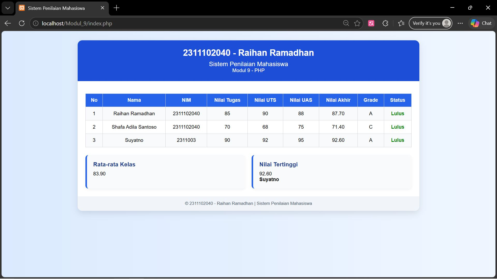

<div align="center">

# LAPORAN PRAKTIKUM  
# APLIKASI BERBASIS PLATFORM

## MODUL 9
## PHP


### Disusun Oleh
**Raihan Ramadhan**  
2311102040  
S1 IF-11-REG01  

### Dosen Pengampu
**Dimas Fanny Hebrasianto Permadi, S.ST., M.Kom**

### Asisten Praktikum
Apri Pandu Wicaksono  
Rangga Pradarrell Fathi  

### LABORATORIUM HIGH PERFORMANCE  
FAKULTAS INFORMATIKA  
UNIVERSITAS TELKOM PURWOKERTO  
2026

</div>

---

# 1. Dasar Teori

Web Server merupakan sebuah perangkat lunak dalam server yang berfungsi menerima permintaan (request) berupa halaman web melalui HTTP atau HTTPS dari client yang dikenal dengan web browser dan mengirimkan kembali (response) hasilnya dalam bentuk halaman-halaman web yang umumnya berbentuk dokumen HTML.

Selain itu, dalam pengembangan web dinamis, digunakan bahasa pemrograman server-side seperti **PHP (Hypertext Preprocessor)**. PHP adalah bahasa pemrograman yang berjalan di sisi server dan digunakan untuk mengolah data sebelum ditampilkan ke pengguna. PHP memungkinkan pembuatan aplikasi web yang interaktif, seperti sistem penilaian mahasiswa.

## Konsep yang Digunakan

### 1. Array Asosiatif
Array asosiatif adalah struktur data yang menyimpan pasangan **key** dan **value**. Dalam program ini digunakan untuk menyimpan data mahasiswa seperti nama, NIM, dan nilai.

### 2. Function (Fungsi)
Fungsi digunakan untuk mengelompokkan kode agar lebih terstruktur dan dapat digunakan kembali, seperti fungsi untuk menghitung nilai akhir.

### 3. Operator Aritmatika
Digunakan untuk melakukan perhitungan matematika, seperti:
- Penjumlahan
- Perkalian  
Dalam kasus ini digunakan untuk menghitung nilai akhir mahasiswa.

### 4. Operator Perbandingan
Digunakan untuk membandingkan nilai, seperti:
- Menentukan grade
- Menentukan status kelulusan

### 5. Percabangan (if/else)
Digunakan untuk pengambilan keputusan berdasarkan kondisi tertentu, misalnya:
- Menentukan grade berdasarkan nilai akhir

### 6. Perulangan (Looping)
Digunakan untuk menampilkan data secara berulang, seperti menampilkan daftar mahasiswa dalam tabel.

### 7. HTML (HyperText Markup Language)
HTML digunakan untuk menampilkan data dalam bentuk halaman web, termasuk tabel untuk menampilkan hasil penilaian mahasiswa.

---

# 1. Implementasi Persyaratan Tugas (Kebutuhan Sistem)

Program Sistem Penilaian Mahasiswa ini dirancang untuk memenuhi seluruh persyaratan pada tugas Modul 9 PHP. Implementasi dilakukan dengan memanfaatkan fitur dasar PHP seperti **array asosiatif**, **function**, **operator aritmatika**, **operator perbandingan**, **percabangan**, **looping**, dan **tabel HTML** untuk menampilkan hasil akhir.

---

## 1.1 Array Asosiatif untuk Menyimpan Data Mahasiswa

Data mahasiswa disimpan menggunakan **array asosiatif**, sehingga setiap data memiliki key yang jelas seperti `nama`, `nim`, `nilai_tugas`, `nilai_uts`, dan `nilai_uas`. Pada program ini terdapat minimal 3 data mahasiswa yang disimpan di dalam variabel `$mahasiswa`.

```php
<?php
$mahasiswa = [
    [
        "nama" => "Raihan Ramadhan",
        "nim" => "2311102040",
        "nilai_tugas" => 85,
        "nilai_uts" => 90,
        "nilai_uas" => 88
    ],
    [
        "nama" => "Shafa Adila Santoso",
        "nim" => "2311102040",
        "nilai_tugas" => 70,
        "nilai_uts" => 68,
        "nilai_uas" => 75
    ],
    [
        "nama" => "Suyatno",
        "nim" => "231112099",
        "nilai_tugas" => 90,
        "nilai_uts" => 92,
        "nilai_uas" => 95
    ]
];
?>
```
## 1.2 Penggunaan Function dan Operator Aritmatika untuk Menghitung Nilai Akhir

Perhitungan nilai akhir dilakukan menggunakan sebuah function bernama hitungNilaiAkhir(). Fungsi ini memanfaatkan operator aritmatika berupa perkalian (*) dan penjumlahan (+) untuk menghitung nilai akhir berdasarkan bobot tugas 30%, UTS 30%, dan UAS 40%.

```php
<?php
function hitungNilaiAkhir($tugas, $uts, $uas) {
    return ($tugas * 0.30) + ($uts * 0.30) + ($uas * 0.40);
}
?>
```

## 1.3 Penggunaan If/Else untuk Menentukan Grade

Penentuan grade dilakukan dengan menggunakan percabangan if/else. Nilai akhir mahasiswa akan diklasifikasikan ke dalam grade A, B, C, D, atau E sesuai rentang nilai yang telah ditentukan.

```php
<?php
function tentukanGrade($nilaiAkhir) {
    if ($nilaiAkhir >= 85) {
        return "A";
    } elseif ($nilaiAkhir >= 75) {
        return "B";
    } elseif ($nilaiAkhir >= 65) {
        return "C";
    } elseif ($nilaiAkhir >= 50) {
        return "D";
    } else {
        return "E";
    }
}
?>
```
## 1.4 Penggunaan Operator Perbandingan untuk Menentukan Status Kelulusan

Status kelulusan ditentukan menggunakan operator perbandingan >=. Pada program ini, mahasiswa dinyatakan Lulus apabila nilai akhirnya lebih dari atau sama dengan 65, dan Tidak Lulus apabila nilainya di bawah 65.

```php
<?php
function tentukanStatus($nilaiAkhir) {
    return ($nilaiAkhir >= 65) ? "Lulus" : "Tidak Lulus";
}
?>
```
## 1.5 Penggunaan Loop untuk Menampilkan Seluruh Data Mahasiswa

Untuk menampilkan seluruh data mahasiswa, program menggunakan loop foreach. Perulangan ini membaca setiap data mahasiswa dari array $mahasiswa, lalu menghitung nilai akhir, grade, dan status secara otomatis.

```php
<?php
$no = 1;
foreach ($mahasiswa as $mhs) {
    $nilaiAkhir = hitungNilaiAkhir($mhs["nilai_tugas"], $mhs["nilai_uts"], $mhs["nilai_uas"]);
    $grade = tentukanGrade($nilaiAkhir);
    $status = tentukanStatus($nilaiAkhir);

    $totalNilai += $nilaiAkhir;

    if ($nilaiAkhir > $nilaiTertinggi) {
        $nilaiTertinggi = $nilaiAkhir;
        $namaNilaiTertinggi = $mhs["nama"];
    }

    $classStatus = ($status == "Lulus") ? "lulus" : "tidak-lulus";

    echo "<tr>";
    echo "<td>$no</td>";
    echo "<td>{$mhs['nama']}</td>";
    echo "<td>{$mhs['nim']}</td>";
    echo "<td>{$mhs['nilai_tugas']}</td>";
    echo "<td>{$mhs['nilai_uts']}</td>";
    echo "<td>{$mhs['nilai_uas']}</td>";
    echo "<td>" . number_format($nilaiAkhir, 2) . "</td>";
    echo "<td>$grade</td>";
    echo "<td class='$classStatus'>$status</td>";
    echo "</tr>";

    $no++;
}
?>
```
## 1.6 Menampilkan Hasil dalam Bentuk Tabel HTML

Hasil pengolahan data ditampilkan menggunakan tabel HTML agar informasi mahasiswa lebih rapi dan mudah dibaca. Tabel ini memuat kolom nomor, nama, NIM, nilai tugas, nilai UTS, nilai UAS, nilai akhir, grade, dan status.

```html
<table>
    <tr>
        <th>No</th>
        <th>Nama</th>
        <th>NIM</th>
        <th>Nilai Tugas</th>
        <th>Nilai UTS</th>
        <th>Nilai UAS</th>
        <th>Nilai Akhir</th>
        <th>Grade</th>
        <th>Status</th>
    </tr>

Baris data pada tabel ditampilkan secara dinamis melalui perintah echo di dalam perulangan foreach.

echo "<tr>";
echo "<td>$no</td>";
echo "<td>{$mhs['nama']}</td>";
echo "<td>{$mhs['nim']}</td>";
echo "<td>{$mhs['nilai_tugas']}</td>";
echo "<td>{$mhs['nilai_uts']}</td>";
echo "<td>{$mhs['nilai_uas']}</td>";
echo "<td>" . number_format($nilaiAkhir, 2) . "</td>";
echo "<td>$grade</td>";
echo "<td class='$classStatus'>$status</td>";
echo "</tr>";
```


## 1.7 Perhitungan Rata-Rata Kelas dan Nilai Tertinggi

Selain menampilkan data mahasiswa, program juga menghitung rata-rata kelas dan nilai tertinggi. Nilai rata-rata diperoleh dari total seluruh nilai akhir dibagi jumlah mahasiswa, sedangkan nilai tertinggi dicari selama proses perulangan data berlangsung.

```php
<?php
$rataRataKelas = $totalNilai / count($mahasiswa);
?>
```

Nilai tertinggi ditentukan dengan membandingkan setiap nilai akhir mahasiswa:

```php
<?php
if ($nilaiAkhir > $nilaiTertinggi) {
    $nilaiTertinggi = $nilaiAkhir;
    $namaNilaiTertinggi = $mhs["nama"];
}
?>
```
## 3. Hasil Tampilan (Screenshots) Aplikasi Penilaian HTML Murni

Berikut merupakan dokumentasi berupa *mock-up* atau tangkapan layar dari Web Sistem Penilaian yang telah berhasil dijalankan melalui localhost. Tampilan website juga dilengkapi dengan informasi tambahan berupa rata-rata nilai kelas dan nilai tertinggi yang ditampilkan pada bagian dashboard.



## 4. Referensi

1. Kadir, Abdul. (2018). *Dasar Pemrograman Web Dinamis Menggunakan PHP*. Yogyakarta: Andi.  
2. Sidik, Betha. (2014). *Pemrograman Web dengan PHP*. Bandung: Informatika.  
3. MDN Web Docs. (2024). *HTML: HyperText Markup Language*. https://developer.mozilla.org/  
4. PHP.net. (2024). *PHP Manual*. https://www.php.net/manual/en/  
5. W3Schools. (2024). *HTML Tutorial*. https://www.w3schools.com/html/  