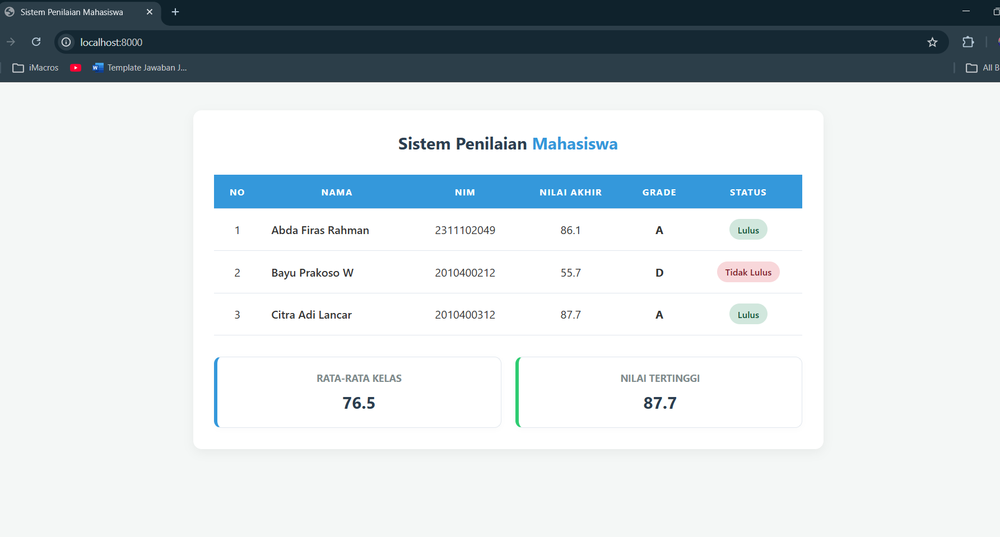

<div align="center">
  <br />

  <h1>LAPORAN PRAKTIKUM <br>
  APLIKASI BERBASIS PLATFORM
  </h1>

  <br />

  <h3>MODUL 9 <br>
  PHP - Sistem Penilaian Mahasiswa
  </h3>

  <br />

  <p align="center">

</p>

  <br />
  <br />
  <br />

  <h3>Disusun Oleh :</h3>

  <p>
    <strong>Abda Firas Rahman</strong><br>
    <strong>2311102049</strong><br>
    <strong>S1 IF-11-REG01</strong>
  </p>

  <br />

  <h3>Dosen Pengampu :</h3>

  <p>
    <strong>Dimas Fanny Hebrasianto Permadi, S.ST., M.Kom</strong>
  </p>
  
  <br />
  <br />
    <h4>Asisten Praktikum :</h4>
    <strong>Apri Pandu Wicaksono </strong> <br>
    <strong>Rangga Pradarrell Fathi</strong>
  <br />

  <h3>LABORATORIUM HIGH PERFORMANCE
 <br>FAKULTAS INFORMATIKA <br>UNIVERSITAS TELKOM PURWOKERTO <br>2026</h3>
</div>

<hr>

### Dasar Teori
1. Pengenalan PHP (Hypertext Preprocessor)
PHP adalah bahasa pemrograman server-side scripting yang dirancang khusus untuk pengembangan web. Sebagai bahasa server-side, kode PHP dieksekusi di server sebelum hasilnya dikirimkan ke browser dalam bentuk HTML. PHP bersifat open-source dan sangat populer digunakan karena kemampuannya dalam mengolah data dinamis dan berintegrasi dengan berbagai jenis database.

2. Array Asosiatif
Konsep penyimpanan data mahasiswa (Nama, NIM, Nilai) menggunakan "kunci" (key) berupa teks sehingga data lebih terorganisir dan mudah dipanggil

3. Function (Fungsi)
Fungsi adalah blok kode terpisah yang dirancang untuk menjalankan tugas spesifik secara modular. Dengan menggunakan fungsi, kita menerapkan prinsip DRY (Don’t Repeat Yourself) di mana logika perhitungan yang kompleks cukup ditulis sekali namun bisa dipanggil berkali-kali untuk data mahasiswa yang berbeda. Fungsi ini menerima parameter (input nilai mentah) dan mengembalikan hasil proses (return value) berupa nilai akhir atau grade huruf. Pemisahan logika ke dalam fungsi sangat membantu dalam pemeliharaan kode (maintenance) jika di kemudian hari terdapat perubahan rumus penilaian.

4. Logika Dasar & Kontrol (Operator & If/Else/Loop)
    - Operator Aritmatika & Perbandingan: Digunakan sebagai dasar perhitungan bobot nilai (perkalian dan penjumlahan) serta penentuan ambang batas kelulusan menggunakan operator relasional (>=).

    - Struktur Kondisional (If/Else): Berfungsi sebagai pengambil keputusan untuk mengonversi nilai angka menjadi kategori grade tertentu (A hingga E) berdasarkan rentang kriteria yang telah ditetapkan.

    - Struktur Perulangan (Foreach): Merupakan mekanisme untuk menyisir setiap elemen di dalam array secara sistematis. Dengan foreach data mahasiswa yang bersifat dinamis dapat ditampilkan ke dalam baris tabel HTML secara otomatis tanpa harus menulis baris kode satu per satu secara manual.

5. Run menggunakan php -S localhost:8000
Perintah php -S localhost:8000 merupakan fitur bawaan PHP yang dikenal sebagai Built-in Web Server yang memungkinkan pengembang untuk menjalankan aplikasi web secara lokal tanpa perlu menginstal atau menjalankan server eksternal seperti Apache melalui XAMPP. Dalam struktur perintah tersebut, kata php berfungsi memanggil program utama PHP yang terpasang di sistem bendera -S (kapital) mengaktifkan mode server, sementara localhost adalah alamat lokal komputer dan 8000 merupakan nomor port yang digunakan sebagai jalur akses virtual.

Secara teknis ketika perintah ini dieksekusi di dalam terminal pada direktori proyek tertentu, PHP akan secara otomatis memetakan folder tersebut sebagai document root dan mencari file index.php untuk dirender setiap kali ada permintaan masuk dari browser. Metode ini sangat efisien bagi pengembang karena sifatnya yang sangat ringan, hemat sumber daya memori RAM, serta mampu menampilkan log aktivitas dan pesan kesalahan secara real-time langsung di jendela terminal sehingga proses perbaikan kode (debugging) menjadi jauh lebih cepat dan praktis selama tahap pengembangan aplikasi.

## Kode program 
Berikut adalah kode program:

### index.php
```php
<?php require_once 'logika.php'; ?>

<!DOCTYPE html>
<html lang="id">
<head>
    <meta charset="UTF-8">
    <meta name="viewport" content="width=device-width, initial-scale=1.0">
    <title>Sistem Penilaian Mahasiswa</title>
    <style>
        /*Abda Firas Rahman - 2311102049 - IF-REG-01 */
        * {
            box-sizing: border-box;
            margin: 0;
            padding: 0;
        }
        body {
            font-family: 'Segoe UI', Tahoma, Geneva, Verdana, sans-serif;
            background-color: #b6d0c8;
            color: #333;
            padding: 40px 20px;
        }
        
        /* Container biar ke tengaH */
        .container {
            max-width: 900px;
            margin: 0 auto;
            background: #ffffff;
            padding: 30px;
            border-radius: 12px;
            box-shadow: 0 5px 15px rgba(0, 0, 0, 0.05);
        }

        /* Header Title */
        .header-title {
            text-align: center;
            margin-bottom: 30px;
            color: #2c3e50;
        }
        .header-title span {
            color: #3498db;
        }

        table {
            width: 100%;
            border-collapse: collapse;
            margin-bottom: 30px;
        }
        th, td {
            padding: 15px;
            text-align: center;
            border-bottom: 1px solid #e0e6ed;
        }
        th {
            background-color: #3498db;
            color: #ffffff;
            text-transform: uppercase;
            font-size: 13px;
            letter-spacing: 1px;
        }
        /* Efek hover nya*/
        tbody tr:hover {
            background-color: #f8fafc;
            transition: 0.3s ease;
        }

        /* Styling Badge Status */
        .badge {
            padding: 6px 12px;
            border-radius: 20px;
            font-size: 13px;
            font-weight: 600;
            display: inline-block;
        }
        .status-lulus {
            background-color: #d1e7dd;
            color: #0f5132;
        }
        .status-gagal {
            background-color: #f8d7da;
            color: #842029;
        }

        /* Styling Summary Cards */
        .summary-container {
            display: flex;
            gap: 20px;
            justify-content: space-between;
        }
        .summary-card {
            flex: 1;
            background: #ffffff;
            padding: 20px;
            border-radius: 10px;
            border: 1px solid #e0e6ed;
            border-left: 5px solid #3498db;
            box-shadow: 0 2px 8px rgba(0,0,0,0.02);
            text-align: center;
        }
        .summary-card.tertinggi {
            border-left-color: #2ecc71;
        }
        .summary-card h4 {
            font-size: 14px;
            color: #7f8c8d;
            margin-bottom: 10px;
            text-transform: uppercase;
        }
        .summary-card p {
            font-size: 24px;
            font-weight: bold;
            color: #2c3e50;
        }
    </style>
</head>
<body>

    <div class="container">
        <div class="header-title">
            <h2>Sistem Penilaian <span>Mahasiswa</span></h2>
        </div>

        <table>
            <thead>
                <tr>
                    <th>No</th>
                    <th>Nama</th>
                    <th>NIM</th>
                    <th>Nilai Akhir</th>
                    <th>Grade</th>
                    <th>Status</th>
                </tr>
            </thead>
            <tbody>
                <?php foreach ($hasil_penilaian as $index => $mhs): ?>
                    <tr>
                        <td><?= $index + 1 ?></td>
                        <td style="text-align: left; font-weight: 500;"><?= htmlspecialchars($mhs['nama']) ?></td>
                        <td><?= htmlspecialchars($mhs['nim']) ?></td>
                        <td><?= number_format($mhs['nilai_akhir'], 1) ?></td>
                        <td><strong><?= $mhs['grade'] ?></strong></td>
                        <td>
                            <span class="badge <?= $mhs['class_css'] ?>">
                                <?= $mhs['status'] ?>
                            </span>
                        </td>
                    </tr>
                <?php endforeach; ?>
            </tbody>
        </table>

        <div class="summary-container">
            <div class="summary-card">
                <h4>Rata-rata Kelas</h4>
                <p><?= number_format($rata_rata_kelas, 1) ?></p>
            </div>
            <div class="summary-card tertinggi">
                <h4>Nilai Tertinggi</h4>
                <p><?= number_format($nilai_tertinggi, 1) ?></p>
            </div>
        </div>
    </div>

</body>
</html>
```
File ini  bertugas untuk menampilkan hasil perhitungan ke dalam bentuk halaman web. Di baris paling atas perintah require_once digunakan untuk menarik semua data yang sudah diolah dari file logic.php. 

Pada bagian inti file ini juga kembali menggunakan perulangan foreach tepat di dalam tag `<tbody>` pada tabel HTML. Perulangan ini secara otomatis akan mencetak baris (`<tr>`) dan kolom (`<td>`) baru sesuai dengan jumlah data mahasiswa yang ada. variabel rata-rata kelas dan nilai tertinggi yang sudah dihitung sebelumnya langsung dicetak ke dalam komponen kotak ringkasan (summary card).

### logika.php 
```php
<?php
// Array Asosiatif Data Mahasiswa nya
$data_mahasiswa = [
    [
        "nama" => "Abda Firas Rahman",
        "nim" => "2311102049",
        "nilai_tugas" => 85,
        "nilai_uts" => 82,
        "nilai_uas" => 90
    ],
    [
        "nama" => "Bayu Prakoso W",
        "nim" => "2010400212",
        "nilai_tugas" => 59,
        "nilai_uts" => 60,
        "nilai_uas" => 50
    ],
    [
        "nama" => "Citra Adi Lancar",
        "nim" => "2010400312",
        "nilai_tugas" => 90,
        "nilai_uts" => 85,
        "nilai_uas" => 88
    ],
];
// Abda Firas Rahman - 2311102049 - IF-REG-01
// Function menghitung nilai akhir
function hitungNilaiAkhir($tugas, $uts, $uas) {
    return ($tugas * 0.3) + ($uts * 0.3) + ($uas * 0.4);
}

// Menentukan nilai
function tentukanGrade($nilai) {
    if ($nilai >= 80) return "A";
    if ($nilai >= 70) return "B";
    if ($nilai >= 60) return "C";
    if ($nilai >= 50) return "D";
    return "E";
}

// variabel untuk perhitungan
$total_nilai_kelas = 0;
$nilai_tertinggi = 0;
$jumlah_mhs = count($data_mahasiswa);
$hasil_penilaian = [];

// Proses pengolahan data sebelum dikirim ke View
foreach ($data_mahasiswa as $mhs) {
    $nilai_akhir = hitungNilaiAkhir($mhs['nilai_tugas'], $mhs['nilai_uts'], $mhs['nilai_uas']);
    $grade = tentukanGrade($nilai_akhir);
    $status = ($nilai_akhir >= 60) ? "Lulus" : "Tidak Lulus";
    
    $total_nilai_kelas += $nilai_akhir;
    if ($nilai_akhir > $nilai_tertinggi) {
        $nilai_tertinggi = $nilai_akhir;
    }

    // Memasukkan hasil kalkulasi ke dalam array baru
    $mhs['nilai_akhir'] = $nilai_akhir;
    $mhs['grade'] = $grade;
    $mhs['status'] = $status;
    $mhs['class_css'] = ($status == "Lulus") ? "status-lulus" : "status-gagal";
    
    $hasil_penilaian[] = $mhs;
}

$rata_rata_kelas = $total_nilai_kelas / $jumlah_mhs;
?>
```
File ini khusus menangani data dan logika program tanpa ada campuran kode HTML. Di sini data mentah mahasiswa disiapkan terlebih dahulu menggunakan array asosiatif. Program kemudian memproses data tersebut menggunakan perulangan (foreach) untuk mengeksekusi dua function utama yaitu menghitung persentase nilai akhir dengan operator aritmatika dan menentukan grade dengan struktur if/else. Selama perulangan berjalan sistem juga mengecek batas kelulusan, menghitung nilai rata-rata serta mencari nilai tertinggi kelas lalu mengumpulkan semua hasil yang sudah matang tersebut ke dalam sebuah array baru.

### Tampilan Hasil Kode Program:



