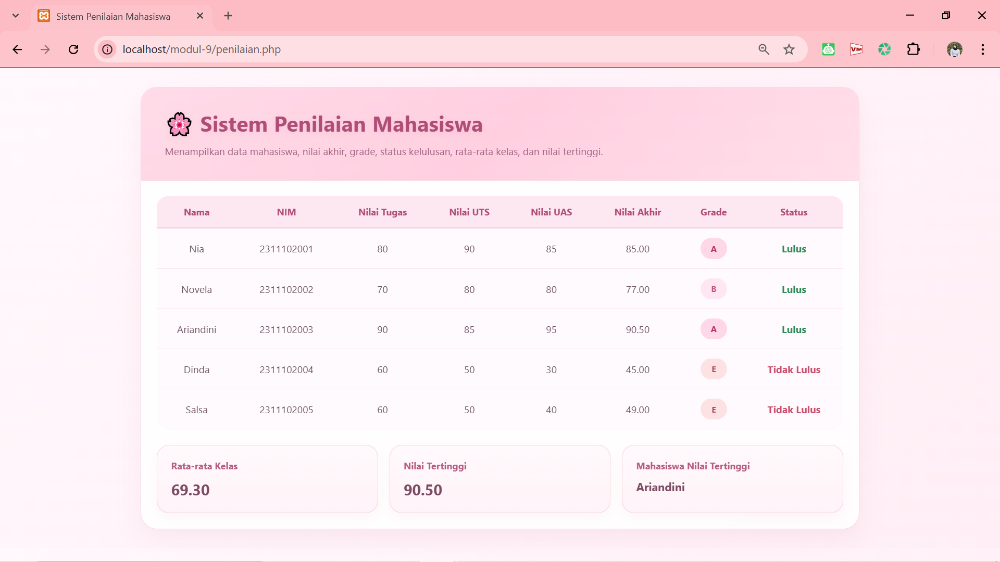

<div align="center">
  <br />
  <h1>LAPORAN PRAKTIKUM <br> APLIKASI BERBASIS PLATFORM</h1>
  <br />
  <h3>MODUL 9 <br> PHP</h3>
  <br />
  
  <br />
  <br />
  <br />
  <h3>Disusun Oleh :</h3>
  <p>
    <strong>Nia Novela Ariandini</strong><br>
    <strong>2311102057</strong><br>
    <strong>S1 IF-11-01</strong>
  </p>
  <br />
  <h3>Dosen Pengampu :</h3>
  <p>
    <strong>Dimas Fanny Hebrasianto Permadi, S.ST., M.Kom</strong>
  </p>
  <br />
  <br />
  <h4>Asisten Praktikum :</h4>
  <strong>Apri Pandu Wicaksono</strong> <br>
  <strong>Rangga Pradarrell Fathi</strong>
  <br />
  <br />
  <br />
  <br />
  <h3>LABORATORIUM HIGH PERFORMANCE <br> FAKULTAS INFORMATIKA <br> UNIVERSITAS TELKOM PURWOKERTO <br> 2026</h3>
</div>

---

## 1. Dasar Teori

**PHP** merupakan bahasa pemrograman yang banyak digunakan untuk membangun website dinamis, terutama pada sisi **server-side**. Artinya, kode PHP diproses terlebih dahulu di server, lalu hasilnya dikirim ke browser dalam bentuk HTML. Berbeda dengan HTML dan CSS yang langsung berhubungan dengan tampilan halaman, PHP lebih berperan dalam mengatur logika program, mengolah data, dan menghasilkan konten secara dinamis sesuai kebutuhan.

Dalam pengembangan web, PHP sering digunakan untuk mengelola data, memproses input dari pengguna, melakukan perhitungan, serta menghubungkan website dengan database. Namun, pada tahap dasar, PHP juga dapat digunakan tanpa database, misalnya dengan memanfaatkan **array** untuk menyimpan sekumpulan data sementara di dalam program. Dengan cara ini, mahasiswa dapat memahami alur pengolahan data sebelum masuk ke tahap pengembangan yang lebih kompleks.

Salah satu konsep penting dalam PHP adalah penggunaan **array asosiatif**, yaitu array yang menyimpan data dalam bentuk pasangan **key** dan **value**. Pada program penilaian mahasiswa, array asosiatif digunakan untuk menyimpan data seperti nama, NIM, nilai tugas, nilai UTS, dan nilai UAS. Struktur ini memudahkan proses pengambilan data karena setiap nilai dapat diakses berdasarkan nama kuncinya.

Selain array, PHP juga mendukung penggunaan **function** untuk memisahkan logika program menjadi bagian-bagian yang lebih terstruktur. Function membantu program menjadi lebih rapi, mudah dibaca, dan dapat digunakan kembali. Dalam kasus sistem penilaian mahasiswa, function dapat dipakai untuk menghitung nilai akhir berdasarkan bobot nilai tugas, UTS, dan UAS.

PHP juga menyediakan percabangan seperti **if/else** yang berguna untuk menentukan kondisi tertentu, misalnya menentukan grade berdasarkan nilai akhir, serta menentukan status kelulusan mahasiswa. Selain itu, terdapat juga **operator aritmatika** untuk melakukan perhitungan nilai, dan **operator perbandingan** untuk membandingkan hasil nilai dengan batas kelulusan yang telah ditentukan.

Untuk menampilkan data yang jumlahnya lebih dari satu, PHP biasanya menggunakan **perulangan** seperti `foreach`. Dengan perulangan ini, seluruh data mahasiswa yang tersimpan di dalam array dapat ditampilkan satu per satu ke dalam bentuk tabel HTML. Hasil akhirnya, program tidak hanya mampu mengolah data, tetapi juga dapat menyajikannya dalam tampilan yang rapi dan mudah dibaca oleh pengguna.

Pada praktikum ini, PHP digunakan untuk membuat **Sistem Penilaian Mahasiswa** yang berfungsi menampilkan data beberapa mahasiswa, menghitung nilai akhir, menentukan grade, menentukan status kelulusan, serta menampilkan rata-rata kelas dan nilai tertinggi. Program ini juga dipadukan dengan HTML dan CSS agar hasil tampilan lebih menarik, rapi, dan nyaman dilihat.

---

## 2. Penjelasan Kode PHP, HTML, dan CSS

### Kode Program (`penilaian.php`)

```php
<?php
$mahasiswa = [
    [
        "nama" => "Nia",
        "nim" => "2311102001",
        "tugas" => 80,
        "uts" => 90,
        "uas" => 85
    ],
    [
        "nama" => "Novela",
        "nim" => "2311102002",
        "tugas" => 70,
        "uts" => 80,
        "uas" => 80
    ],
    [
        "nama" => "Ariandini",
        "nim" => "2311102003",
        "tugas" => 90,
        "uts" => 85,
        "uas" => 95
    ],
    [
        "nama" => "Dinda",
        "nim" => "2311102004",
        "tugas" => 60,
        "uts" => 50,
        "uas" => 30
    ],
    [
        "nama" => "Salsa",
        "nim" => "2311102005",
        "tugas" => 60,
        "uts" => 50,
        "uas" => 40
    ]
];

function hitungNilaiAkhir($tugas, $uts, $uas) {
    return ($tugas * 0.3) + ($uts * 0.3) + ($uas * 0.4);
}

function tentukanGrade($nilai) {
    if ($nilai >= 85) {
        return "A";
    } elseif ($nilai >= 75) {
        return "B";
    } elseif ($nilai >= 65) {
        return "C";
    } elseif ($nilai >= 50) {
        return "D";
    } else {
        return "E";
    }
}

$totalNilai = 0;
$nilaiTertinggi = 0;
$namaTertinggi = "";
?>

<!DOCTYPE html>
<html lang="id">
<head>
    <meta charset="UTF-8">
    <meta name="viewport" content="width=device-width, initial-scale=1.0">
    <title>Sistem Penilaian Mahasiswa</title>
    <style>
        * {
            box-sizing: border-box;
            font-family: 'Segoe UI', Arial, sans-serif;
        }

        body {
            margin: 0;
            padding: 30px;
            background: linear-gradient(135deg, #fff8fc, #ffeef5);
            color: #5c4252;
        }

        .container {
            max-width: 1150px;
            margin: 0 auto;
        }

        .card {
            background: rgba(255, 255, 255, 0.9);
            backdrop-filter: blur(10px);
            border: 1px solid #f7d8e5;
            border-radius: 26px;
            box-shadow: 0 14px 35px rgba(223, 148, 176, 0.14);
            overflow: hidden;
        }

        .header {
            padding: 34px 38px;
            background: linear-gradient(135deg, #ffdbe8, #ffcfe0, #ffdfea);
            border-bottom: 1px solid #f5c8d8;
        }

        .header h1 {
            margin: 0 0 10px;
            font-size: 34px;
            font-weight: 700;
            color: #b04d77;
            letter-spacing: 0.3px;
            text-shadow: 0 3px 10px rgba(176, 77, 119, 0.10);
        }

        .header p {
            margin: 0;
            font-size: 16px;
            color: #9f6280;
            line-height: 1.6;
        }

        .table-wrap {
            padding: 25px;
            overflow-x: auto;
        }

        table {
            width: 100%;
            border-collapse: collapse;
            border-radius: 18px;
            overflow: hidden;
        }

        th {
            background: #fde7f0;
            color: #b04d77;
            padding: 15px;
            font-size: 15px;
            text-align: center;
            border-bottom: 2px solid #f6cadb;
        }

        td {
            padding: 15px;
            text-align: center;
            border-bottom: 1px solid #f8d8e4;
            background: #fffafd;
            color: #6b5360;
        }

        tr:hover td {
            background: #fff3f8;
            transition: 0.3s ease;
        }

        .badge {
            display: inline-block;
            min-width: 42px;
            padding: 8px 12px;
            border-radius: 999px;
            font-size: 13px;
            font-weight: 700;
        }

        .grade-a { background: #ffd8e8; color: #b03060; }
        .grade-b { background: #ffe7f1; color: #c2517f; }
        .grade-c { background: #fff0f6; color: #c96b91; }
        .grade-d { background: #ffe8ee; color: #d06c88; }
        .grade-e { background: #fde2e4; color: #b64b61; }

        .lulus {
            color: #2e8b57;
            font-weight: 700;
        }

        .tidak-lulus {
            color: #c94f6d;
            font-weight: 700;
        }

        .summary {
            display: grid;
            grid-template-columns: repeat(auto-fit, minmax(230px, 1fr));
            gap: 18px;
            padding: 0 25px 25px;
        }

        .summary-box {
            background: linear-gradient(180deg, #fff9fc, #fff3f8);
            border: 1px solid #f4d2df;
            border-radius: 20px;
            padding: 22px;
            box-shadow: 0 8px 20px rgba(221, 144, 171, 0.08);
        }

        .summary-box h3 {
            margin: 0 0 12px;
            font-size: 15px;
            color: #b55b80;
        }

        .summary-box p {
            margin: 0;
            font-size: 24px;
            font-weight: 700;
            color: #7b4b63;
        }

        .summary-box .nama-tertinggi {
            font-size: 18px;
        }

        @media (max-width: 768px) {
            body {
                padding: 16px;
            }

            .header {
                padding: 24px;
            }

            .header h1 {
                font-size: 26px;
            }

            .header p {
                font-size: 14px;
            }

            th, td {
                padding: 11px;
                font-size: 14px;
            }

            .summary-box p {
                font-size: 20px;
            }
        }
    </style>
</head>
<body>
    <div class="container">
        <div class="card">
            <div class="header">
                <h1>🌸 Sistem Penilaian Mahasiswa</h1>
                <p>Menampilkan data mahasiswa, nilai akhir, grade, status kelulusan, rata-rata kelas, dan nilai tertinggi.</p>
            </div>

            <div class="table-wrap">
                <table>
                    <tr>
                        <th>Nama</th>
                        <th>NIM</th>
                        <th>Nilai Tugas</th>
                        <th>Nilai UTS</th>
                        <th>Nilai UAS</th>
                        <th>Nilai Akhir</th>
                        <th>Grade</th>
                        <th>Status</th>
                    </tr>

                    <?php foreach ($mahasiswa as $mhs): ?>
                        <?php
                            $nilaiAkhir = hitungNilaiAkhir($mhs['tugas'], $mhs['uts'], $mhs['uas']);
                            $grade = tentukanGrade($nilaiAkhir);
                            $status = ($nilaiAkhir >= 60) ? "Lulus" : "Tidak Lulus";

                            $totalNilai += $nilaiAkhir;

                            if ($nilaiAkhir > $nilaiTertinggi) {
                                $nilaiTertinggi = $nilaiAkhir;
                                $namaTertinggi = $mhs['nama'];
                            }

                            $gradeClass = "grade-" . strtolower($grade);
                        ?>
                        <tr>
                            <td><?= $mhs['nama']; ?></td>
                            <td><?= $mhs['nim']; ?></td>
                            <td><?= $mhs['tugas']; ?></td>
                            <td><?= $mhs['uts']; ?></td>
                            <td><?= $mhs['uas']; ?></td>
                            <td><?= number_format($nilaiAkhir, 2); ?></td>
                            <td><span class="badge <?= $gradeClass; ?>"><?= $grade; ?></span></td>
                            <td class="<?= ($status == 'Lulus') ? 'lulus' : 'tidak-lulus'; ?>">
                                <?= $status; ?>
                            </td>
                        </tr>
                    <?php endforeach; ?>
                </table>
            </div>

            <?php $rataRata = $totalNilai / count($mahasiswa); ?>

            <div class="summary">
                <div class="summary-box">
                    <h3>Rata-rata Kelas</h3>
                    <p><?= number_format($rataRata, 2); ?></p>
                </div>
                <div class="summary-box">
                    <h3>Nilai Tertinggi</h3>
                    <p><?= number_format($nilaiTertinggi, 2); ?></p>
                </div>
                <div class="summary-box">
                    <h3>Mahasiswa Nilai Tertinggi</h3>
                    <p class="nama-tertinggi"><?= $namaTertinggi; ?></p>
                </div>
            </div>
        </div>
    </div>
</body>
</html>
```
---

### Penjelasan Kode

---

### 1. PHP

Pada bagian awal program, digunakan variabel `$mahasiswa` yang berisi array asosiatif. Array ini menyimpan data lima mahasiswa, di mana setiap mahasiswa memiliki beberapa data seperti `nama`, `nim`, `tugas`, `uts`, dan `uas`. Penggunaan array asosiatif memudahkan pengambilan data karena setiap nilai dapat diakses berdasarkan nama key-nya.

Selanjutnya terdapat function `hitungNilaiAkhir($tugas, $uts, $uas)`. Function ini digunakan untuk menghitung nilai akhir mahasiswa berdasarkan bobot nilai, yaitu **30% tugas, 30% UTS, dan 40% UAS**. Perhitungan ini memanfaatkan operator aritmatika berupa perkalian dan penjumlahan.

Setelah itu, terdapat function `tentukanGrade($nilai)` yang berfungsi untuk menentukan grade berdasarkan nilai akhir mahasiswa. Pada function ini digunakan percabangan `if`, `elseif`, dan `else`. Jika nilai akhir lebih besar atau sama dengan **85** maka grade **A**, jika lebih besar atau sama dengan **75** maka grade **B**, jika lebih besar atau sama dengan **65** maka grade **C**, jika lebih besar atau sama dengan **50** maka grade **D**, dan selain itu mendapat grade **E**.

Variabel `$totalNilai`, `$nilaiTertinggi`, dan `$namaTertinggi` digunakan untuk membantu proses perhitungan data tambahan. `$totalNilai` dipakai untuk menjumlahkan seluruh nilai akhir mahasiswa, `$nilaiTertinggi` dipakai untuk menyimpan nilai akhir tertinggi, sedangkan `$namaTertinggi` digunakan untuk menyimpan nama mahasiswa yang memiliki nilai tertinggi.

Di dalam bagian tabel, digunakan perulangan:

```php
foreach ($mahasiswa as $mhs)
```

Untuk menampilkan seluruh data mahasiswa satu per satu. Pada setiap perulangan, program menghitung nilai akhir dengan memanggil function `hitungNilaiAkhir()`, lalu menentukan grade dengan memanggil function `tentukanGrade()`.

Status kelulusan ditentukan menggunakan operator perbandingan pada baris:

```php
$status = ($nilaiAkhir >= 60) ? "Lulus" : "Tidak Lulus";
```

Baris tersebut berarti jika nilai akhir mahasiswa **lebih besar atau sama dengan 60**, maka statusnya **Lulus**, sedangkan jika kurang dari 60 maka statusnya **Tidak Lulus**.

Selama proses perulangan berlangsung, program juga menambahkan nilai akhir ke dalam `$totalNilai` dan memeriksa apakah nilai tersebut lebih besar dari `$nilaiTertinggi`. Jika iya, maka nilai tertinggi dan nama mahasiswa tertinggi akan diperbarui.

Setelah semua data ditampilkan, program menghitung rata-rata kelas menggunakan:

```php
$rataRata = $totalNilai / count($mahasiswa);
```
Fungsi `count($mahasiswa)` digunakan untuk menghitung jumlah data mahasiswa, kemudian hasil total nilai dibagi dengan jumlah mahasiswa agar diperoleh rata-rata kelas.

Secara keseluruhan, bagian PHP pada program ini berfungsi untuk **mengolah data mahasiswa, menghitung nilai akhir, menentukan grade, menentukan status kelulusan, menghitung rata-rata kelas, dan mencari nilai tertinggi**.

---

### 2. HTML

Setelah bagian PHP, program dilanjutkan dengan struktur HTML5 yang diawali dengan deklarasi `<!DOCTYPE html>`. Tag `<html lang="id">` menunjukkan bahwa bahasa utama halaman menggunakan Bahasa Indonesia.

Pada bagian `<head>`, terdapat tag `<meta charset="UTF-8">` agar karakter dapat ditampilkan dengan baik, serta tag `<meta name="viewport" content="width=device-width, initial-scale=1.0">` supaya tampilan responsif di berbagai ukuran layar. Tag `<title>` digunakan untuk memberi judul halaman, yaitu **Sistem Penilaian Mahasiswa**.

Di dalam bagian `<body>`, struktur utama dibungkus menggunakan `<div class="container">` dan `<div class="card">`. Bagian ini berfungsi sebagai wadah utama agar seluruh isi halaman terlihat rapi dan terpusat.

Selanjutnya terdapat `<div class="header">` yang berisi judul halaman dan deskripsi singkat mengenai isi program. Bagian header ini menjadi identitas utama halaman sebelum data ditampilkan.

Di bawah header terdapat `<div class="table-wrap">` yang membungkus elemen `<table>`. Tabel ini digunakan untuk menampilkan data mahasiswa dalam bentuk baris dan kolom. Kolom yang ditampilkan meliputi **Nama, NIM, Nilai Tugas, Nilai UTS, Nilai UAS, Nilai Akhir, Grade, dan Status**.

Pada bagian isi tabel, kode HTML digabung dengan PHP. Setiap data mahasiswa yang diproses dalam perulangan akan menghasilkan satu baris `<tr>`, lalu setiap nilai ditampilkan pada kolom `<td>`. Dengan cara ini, jumlah baris tabel akan menyesuaikan dengan jumlah data mahasiswa yang tersimpan di dalam array.

Setelah tabel, terdapat bagian `<div class="summary">` yang digunakan untuk menampilkan ringkasan hasil perhitungan. Bagian ini berisi tiga kotak, yaitu **Rata-rata Kelas**, **Nilai Tertinggi**, dan **Mahasiswa Nilai Tertinggi**. Dengan adanya bagian ini, informasi utama dari hasil penilaian dapat langsung terlihat tanpa harus membaca seluruh isi tabel.

Secara umum, bagian HTML berfungsi sebagai **kerangka utama tampilan**, mulai dari judul halaman, tabel data, hingga kotak ringkasan hasil.

---

### 3. CSS

CSS pada program ini ditulis langsung di dalam tag `<style>` karena file dibuat dalam satu dokumen `penilaian.php`. CSS digunakan untuk mempercantik tampilan halaman agar tidak hanya berfungsi secara logika, tetapi juga nyaman dilihat.

Pada selector universal `*`, digunakan `box-sizing: border-box` agar perhitungan ukuran elemen lebih konsisten, serta font **Segoe UI** dan **Arial** agar tampilan tulisan terlihat bersih dan modern.

Bagian `body` menggunakan background gradasi pink soft dengan perpaduan warna `#fff8fc` dan `#ffeef5`. Warna ini dipilih supaya tampilan halaman terasa lembut, manis, dan lebih menarik dibanding tampilan standar.

Class `.container` mengatur lebar maksimal halaman agar isi tidak terlalu melebar, sedangkan `.card` digunakan untuk membuat tampilan utama seperti kartu modern dengan warna putih transparan, sudut membulat, dan bayangan halus.

Class `.header` mengatur bagian judul halaman dengan warna latar pink lembut berbentuk gradient. Kemudian `.header h1` digunakan untuk mengatur ukuran, warna, dan bayangan pada judul utama, sedangkan `.header p` dipakai untuk memberi warna dan jarak pada teks deskripsi.

Class `.table-wrap` berfungsi sebagai pembungkus tabel, sedangkan elemen `table`, `th`, dan `td` digunakan untuk mengatur bentuk tabel, warna header tabel, warna isi tabel, padding, serta garis pemisah antarbaris. Efek `tr:hover td` ditambahkan agar setiap baris tabel berubah warna saat diarahkan kursor, sehingga tampilan terlihat lebih interaktif.

Class `.badge` digunakan untuk membuat tampilan grade menjadi seperti label kecil berbentuk lonjong. Setiap grade memiliki class tersendiri, misalnya `.grade-a`, `.grade-b`, `.grade-c`, `.grade-d`, dan `.grade-e`, sehingga setiap grade memiliki warna yang berbeda.

Class `.lulus` dan `.tidak-lulus` digunakan untuk memberi penekanan warna pada status mahasiswa. Status **Lulus** diberi warna hijau, sedangkan **Tidak Lulus** diberi warna merah agar perbedaannya lebih jelas.

Bagian `.summary` mengatur tata letak kotak ringkasan dengan sistem grid, sedangkan `.summary-box` digunakan untuk membuat tiap kotak memiliki background lembut, border tipis, sudut membulat, dan bayangan halus. Class `.summary-box h3` dan `.summary-box p` digunakan untuk mengatur warna dan ukuran teks pada isi ringkasan.

Terakhir, terdapat `@media (max-width: 768px)` yang berfungsi untuk menyesuaikan ukuran teks, padding, dan tampilan saat halaman dibuka di layar yang lebih kecil seperti tablet atau smartphone. Dengan begitu, halaman tetap terlihat rapi dan responsif.

Secara keseluruhan, CSS pada program ini berfungsi untuk membuat tampilan sistem penilaian mahasiswa menjadi lebih rapi, lembut, modern, dan nyaman dilihat, tanpa mengubah logika utama program.

---

### Hasil Tampilan (Screenshot)



---

## 3. Kesimpulan

Berdasarkan praktikum yang telah dilakukan, dapat disimpulkan bahwa PHP dapat digunakan untuk membangun sistem sederhana yang mampu mengolah data dan menampilkannya secara dinamis ke dalam halaman web. Pada program Sistem Penilaian Mahasiswa ini, PHP digunakan untuk menyimpan data dalam bentuk array asosiatif, melakukan perhitungan nilai akhir, menentukan grade, serta menentukan status kelulusan mahasiswa.

Selain itu, penggunaan function membantu memisahkan logika program agar lebih terstruktur dan mudah dipahami. Perulangan `foreach` mempermudah proses penampilan data dalam jumlah banyak, sedangkan operator aritmatika dan perbandingan digunakan untuk mendukung proses perhitungan dan pengambilan keputusan.

Dari sisi tampilan, kombinasi HTML dan CSS membuat hasil program menjadi lebih rapi, menarik, dan nyaman dilihat. Dengan adanya tabel dan ringkasan hasil, informasi yang ditampilkan menjadi lebih mudah dipahami oleh pengguna.

Secara keseluruhan, praktikum ini membantu memahami konsep dasar PHP dalam pengolahan data, penggunaan function, percabangan, perulangan, serta integrasinya dengan HTML dan CSS untuk menghasilkan tampilan web yang dinamis dan interaktif.

---

## 4. Referensi

- Modul Praktikum Aplikasi Berbasis Platform – Modul 9 PHP  
- W3Schools PHP Tutorial : https://www.w3schools.com/php/  
