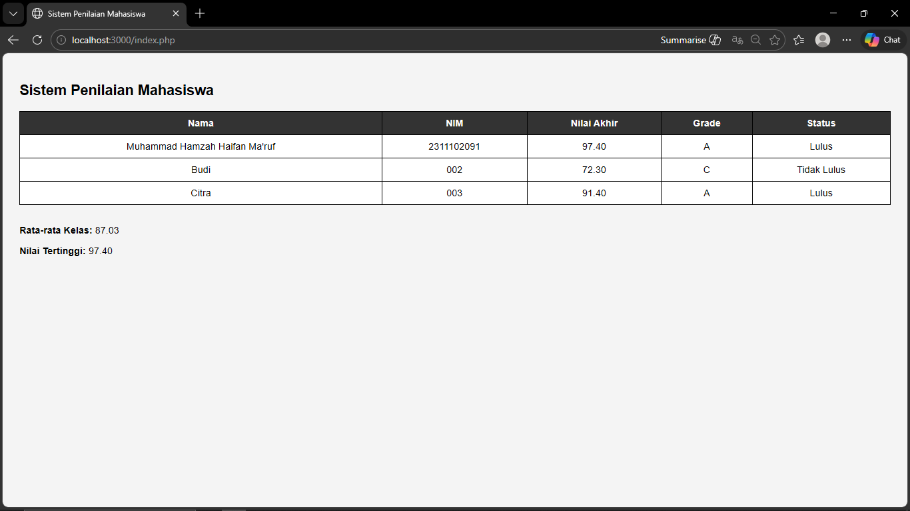

<div align="center">
  <br />
  <h1>LAPORAN PRAKTIKUM <br>APLIKASI BERBASIS PLATFORM</h1>
  <br />
  <h3>MODUL 9 <br> PHP</h3>
  <br />
  <br />
   
  <br />
  <br />
  <br />
  <br />
  <h3>Disusun Oleh :</h3>
  <p>
    <strong>Muhammad Hamzah Haifan Ma'ruf</strong><br>
    <strong>2311102091</strong><br>
    <strong>S1 IF-11-REG01</strong>
  </p>
  <br />
  <br />
  <h3>Dosen Pengampu :</h3>
  <p>
    <strong>Dimas Fanny Hebrasianto Permadi, S.ST., M.Kom</strong>
  </p>
  <br />
  <br />
    <h4>Asisten Praktikum :</h4>
    <strong> Apri Pandu Wicaksono </strong> <br>
    <strong>Rangga Pradarrell Fathi</strong>
  <br />
  <h3>LABORATORIUM HIGH PERFORMANCE
 <br>FAKULTAS INFORMATIKA <br>UNIVERSITAS TELKOM PURWOKERTO <br>2026</h3>
</div>

---

## 1. Dasar Teori

PHP (Hypertext Preprocessor) adalah bahasa pemrograman server-side yang digunakan untuk membuat halaman web dinamis. PHP memungkinkan pengolahan data di server sebelum ditampilkan ke browser, sehingga sangat cocok digunakan untuk membuat sistem sederhana seperti pengolahan data mahasiswa, perhitungan nilai, dan penentuan kelulusan.

Dalam pembuatan sistem penilaian mahasiswa ini digunakan konsep dasar seperti array asosiatif untuk menyimpan data, function untuk menghitung nilai akhir, percabangan (if/else) untuk menentukan grade, operator aritmatika untuk perhitungan nilai, operator perbandingan untuk menentukan status kelulusan, serta perulangan (loop) untuk menampilkan data ke dalam tabel HTML.

---

## 2. Code

### File: `index.php`

```php
<?php
$mahasiswa = [
    [
        "nama" => "Andi",
        "nim" => "001",
        "tugas" => 85,
        "uts" => 80,
        "uas" => 90
    ],
    [
        "nama" => "Budi",
        "nim" => "002",
        "tugas" => 70,
        "uts" => 75,
        "uas" => 72
    ],
    [
        "nama" => "Citra",
        "nim" => "003",
        "tugas" => 90,
        "uts" => 88,
        "uas" => 95
    ]
];

function hitungNilaiAkhir($tugas, $uts, $uas) {
    return ($tugas * 0.3) + ($uts * 0.3) + ($uas * 0.4);
}

function tentukanGrade($nilai) {
    if ($nilai >= 85) {
        return "A";
    } elseif ($nilai >= 75) {
        return "B";
    } elseif ($nilai >= 65) {
        return "C";
    } elseif ($nilai >= 50) {
        return "D";
    } else {
        return "E";
    }
}

function tentukanStatus($nilai) {
    if ($nilai >= 75) {
        return "Lulus";
    } else {
        return "Tidak Lulus";
    }
}

$total = 0;
$nilaiTertinggi = 0;

foreach ($mahasiswa as $mhs) {
    $nilaiAkhir = hitungNilaiAkhir($mhs["tugas"], $mhs["uts"], $mhs["uas"]);
    $total += $nilaiAkhir;

    if ($nilaiAkhir > $nilaiTertinggi) {
        $nilaiTertinggi = $nilaiAkhir;
    }
}

$rataRata = $total / count($mahasiswa);
?>

<!DOCTYPE html>
<html>
<head>
    <title>Sistem Penilaian Mahasiswa</title>
    <style>
        body {
            font-family: Arial;
            background: #f4f4f4;
            padding: 20px;
        }

        table {
            width: 100%;
            border-collapse: collapse;
            background: white;
        }

        th, td {
            padding: 10px;
            border: 1px solid black;
            text-align: center;
        }

        th {
            background: #333;
            color: white;
        }
    </style>
</head>
<body>

<h2>Sistem Penilaian Mahasiswa</h2>

<table>
<tr>
    <th>Nama</th>
    <th>NIM</th>
    <th>Nilai Akhir</th>
    <th>Grade</th>
    <th>Status</th>
</tr>

<?php foreach ($mahasiswa as $mhs): 
    $nilaiAkhir = hitungNilaiAkhir($mhs["tugas"], $mhs["uts"], $mhs["uas"]);
?>
<tr>
    <td><?= $mhs["nama"]; ?></td>
    <td><?= $mhs["nim"]; ?></td>
    <td><?= number_format($nilaiAkhir, 2); ?></td>
    <td><?= tentukanGrade($nilaiAkhir); ?></td>
    <td><?= tentukanStatus($nilaiAkhir); ?></td>
</tr>
<?php endforeach; ?>

</table>

<br>

<p><b>Rata-rata Kelas:</b> <?= number_format($rataRata, 2); ?></p>
<p><b>Nilai Tertinggi:</b> <?= number_format($nilaiTertinggi, 2); ?></p>

</body>
</html>
````

---

### Hasil Tampilan



---

### Penjelasan Code

Program dimulai dengan membuat array asosiatif `$mahasiswa` yang berisi data minimal 3 mahasiswa. Setiap mahasiswa memiliki atribut nama, nim, nilai tugas, nilai uts, dan nilai uas.

Selanjutnya dibuat function `hitungNilaiAkhir()` untuk menghitung nilai akhir menggunakan operator aritmatika dengan bobot 30% tugas, 30% uts, dan 40% uas. Function `tentukanGrade()` menggunakan percabangan if/else untuk menentukan grade berdasarkan nilai akhir, sedangkan function `tentukanStatus()` menggunakan operator perbandingan untuk menentukan apakah mahasiswa lulus atau tidak.

Perulangan `foreach` digunakan untuk menampilkan seluruh data mahasiswa ke dalam tabel HTML. Selain itu, dilakukan perhitungan total nilai untuk mendapatkan rata-rata kelas serta pencarian nilai tertinggi dari seluruh mahasiswa.

---

## 3. Kesimpulan

Berdasarkan praktikum yang telah dilakukan, dapat disimpulkan bahwa PHP dapat digunakan untuk membuat sistem penilaian mahasiswa sederhana. Program ini telah memenuhi seluruh ketentuan tugas, yaitu menggunakan array asosiatif, function, percabangan, operator aritmatika dan perbandingan, serta perulangan. Selain itu, hasil program berhasil ditampilkan dalam bentuk tabel HTML lengkap dengan rata-rata kelas dan nilai tertinggi.