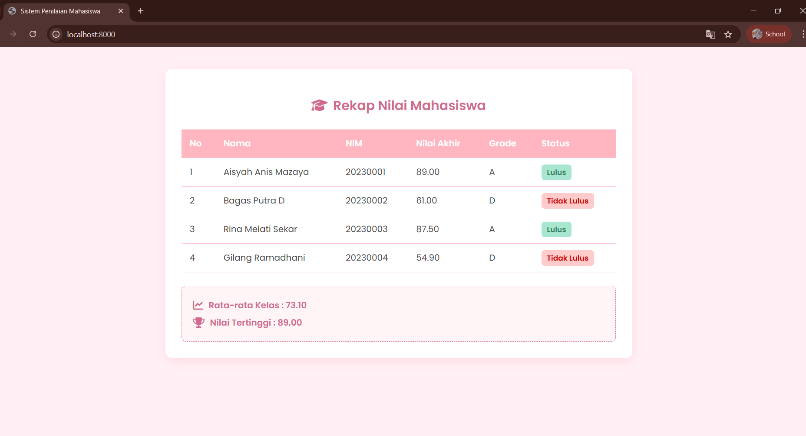

<div align="center">
  <br />

  <h1>LAPORAN PRAKTIKUM <br>
  APLIKASI BERBASIS PLATFORM
  </h1>

  <br />

  <h3>MODUL 9 <br>
  PHP - Sistem Penilaian Mahasiswa
  </h3>

  <br />

  <p align="center">

</p>

  <br />
  <br />
  <br />

  <h3>Disusun Oleh :</h3>

  <p>
    <strong>Aisyah Anis Mazaya</strong><br>
    <strong>2311102095</strong><br>
    <strong>S1 IF-11-REG01</strong>
  </p>

  <br />

  <h3>Dosen Pengampu :</h3>

  <p>
    <strong>Dimas Fanny Hebrasianto Permadi, S.ST., M.Kom</strong>
  </p>
  
  <br />
  <br />
    <h4>Asisten Praktikum :</h4>
    <strong>Apri Pandu Wicaksono </strong> <br>
    <strong>Rangga Pradarrell Fathi</strong>
  <br />

  <h3>LABORATORIUM HIGH PERFORMANCE
 <br>FAKULTAS INFORMATIKA <br>UNIVERSITAS TELKOM PURWOKERTO <br>2026</h3>
</div>

<hr>

### Dasar Teori
1. PHP (Hypertext Preprocessor)
bertindak sebagai "otak" di balik layar yang memproses data sebelum ditampilkan ke pengguna. Berbeda dengan HTML yang hanya berfungsi mengatur kerangka tampilan web PHP bertugas memproses logika perhitungan, pengambilan keputusan, dan pengelolaan data secara dinamis pada sisi server.

2. Aray Asosiatif
program ini menggunakan Array Asosiatif. Berbeda dengan array biasa yang menggunakan urutan angka (index 0, 1, 2) sebagai penunjuk data array asosiatif menggunakan kunci (key) berupa teks seperti "nama", "nim", dan "nilai_tugas". Hal ini membuat struktur data jauh lebih rapi, terstruktur, dan mudah dipanggil sesuai dengan nama labelnya.

3. Function dan Operator
    Function: Digunakan untuk membungkus blok kode (seperti rumus perhitungan) agar bisa digunakan berulang kali untuk banyak mahasiswa tanpa harus menulis ulang kodenya dari awal.

    Operator Aritmatika: Menggunakan simbol perkalian (*) dan penjumlahan (+) di dalam function untuk menghitung nilai akhir berdasarkan bobot persentase Tugas, UTS, dan UAS.

    Operator Perbandingan: Menggunakan simbol seperti lebih besar atau sama dengan (>=) untuk membandingkan nilai akhir mahasiswa dengan standar batas minimum kelulusan.

4. Struktur Kontrol Percabangan (If/Else)
Logika If/Else digunakan agar program bisa mengambil keputusan secara otomatis. Percabangan ini mengevaluasi kondisi secara bertingkat untuk menentukan Grade misalnya: jika nilai >= 85, maka 'A', jika >= 75 maka 'B' dan begitu juga seterusnya. Logika yang sama juga diterapkan untuk memilah mahasiswa yang berstatus "Lulus" atau "Tidak Lulus".

5. Perulangan (Looping) dengan Foreach
Agar seluruh rekap data mahasiswa dapat ditampilkan ke dalam bentuk tabel HTML tanpa perlu mengetik kodenya secara manual satu per satu, program menggunakan fungsi Foreach. Ini adalah fungsi perulangan bawaan PHP yang didesain khusus untuk menelusuri seluruh isi array. Dengan foreach baris tabel akan tercipta secara otomatis menyesuaikan berapapun jumlah data mahasiswa yang tersimpan.

6. Running Program (PHP Built-in Web Server)
Untuk menjalankan sistem penilaian digunakan fitur PHP Built-in Web Server melalui perintah php -S localhost:8000 pada terminal. Perintah ini memungkinkan pengembang untuk menjalankan aplikasi web berbasis PHP secara instan tanpa perlu memindahkan file ke folder htdocs atau mengaktifkan layanan Apache pada XAMPP secara manual. Secara teknis, instruksi php memanggil program utama PHP bendera -S (Server) berfungsi untuk mengaktifkan mode web server lokal, sedangkan localhost:8000 menentukan alamat dan nomor port yang digunakan untuk mengakses aplikasi melalui browser.

### Tampilan Hasil Kode Program:


## Kode program 
### index.php 
```php
<?php
// Function menggunakan operator aritmatika untuk menghitung nilai akhir
function hitungNilaiAkhir($tugas, $uts, $uas) {
    return ($tugas * 0.2) + ($uts * 0.3) + ($uas * 0.5);
}

// Function menggunakan if/else untuk menentukan Grade
function tentukanGrade($nilai_akhir) {
    if ($nilai_akhir >= 85) {
        return 'A';
    } elseif ($nilai_akhir >= 75) {
        return 'B';
    } elseif ($nilai_akhir >= 65) {
        return 'C';
    } elseif ($nilai_akhir >= 50) {
        return 'D';
    } else {
        return 'E';
    }
}

// Function menggunakan operator perbandingan untuk status kelulusan
function tentukanStatus($nilai_akhir) {
    if ($nilai_akhir >= 65) {
        return 'Lulus';
    } else {
        return 'Tidak Lulus';
    }
}

// Data mahasiswa dalam bentuk Array Asosiatif
$data_mahasiswa = [
    [
        "nama" => "Aisyah Anis Mazaya",
        "nim" => "20230001",
        "nilai_tugas" => 85,
        "nilai_uts" => 90,
        "nilai_uas" => 90
    ],
    [
        "nama" => "Bagas Putra D",
        "nim" => "20230002",
        "nilai_tugas" => 60,
        "nilai_uts" => 55,
        "nilai_uas" => 65
    ],
    [
        "nama" => "Rina Melati Sekar",
        "nim" => "20230003",
        "nilai_tugas" => 90,
        "nilai_uts" => 85,
        "nilai_uas" => 88
    ],
    [
        "nama" => "Gilang Ramadhani",
        "nim" => "20230004",
        "nilai_tugas" => 87,
        "nilai_uts" => 50,
        "nilai_uas" => 45
    ]
];

$total_semua_nilai = 0;
$nilai_tertinggi = 0;
$jumlah_mahasiswa = count($data_mahasiswa);

?>

<!DOCTYPE html>
<html lang="id">
<head>
    <meta charset="UTF-8">
    <meta name="viewport" content="width=device-width, initial-scale=1.0">
    <title>Sistem Penilaian Mahasiswa</title>
    
    <link rel="preconnect" href="https://fonts.googleapis.com">
    <link rel="preconnect" href="https://fonts.gstatic.com" crossorigin>
    <link href="https://fonts.googleapis.com/css2?family=Poppins:wght@300;400;600&display=swap" rel="stylesheet">
    
    <link rel="stylesheet" href="https://cdnjs.cloudflare.com/ajax/libs/font-awesome/6.4.0/css/all.min.css">

    <style>
        body {
            /*font Poppins */
            font-family: 'Poppins', sans-serif;
            background-color: #fff0f5; 
            color: #4a4a4a;
            margin: 0;
            padding: 40px 20px;
        }
        .container {
            max-width: 800px;
            margin: 0 auto;
            background-color: #ffffff;
            padding: 30px;
            border-radius: 12px;
            box-shadow: 0 5px 20px rgba(255, 182, 193, 0.4);
        }
        h2 {
            text-align: center;
            color: #d16b8e; 
            margin-bottom: 25px;
            font-weight: 600;
        }
        table {
            width: 100%;
            border-collapse: collapse;
            margin-bottom: 25px;
        }
        th, td {
            padding: 14px 15px;
            text-align: left;
            border-bottom: 1px solid #ffc0cb; 
        }
        th {
            background-color: #ffb6c1; 
            color: #ffffff;
            font-weight: 600;
        }
        tr:hover {
            background-color: #ffe4e1; 
        }
        .badge-lulus {
            background-color: #a8e6cf;
            color: #2b7a5a;
            padding: 5px 10px;
            border-radius: 6px;
            font-size: 0.85em;
            font-weight: 600;
        }
        .badge-gagal {
            background-color: #ffcccb;
            color: #cc0000;
            padding: 5px 10px;
            border-radius: 6px;
            font-size: 0.85em;
            font-weight: 600;
        }
        .summary-box {
            background-color: #fff5f7;
            border: 1px dashed #d16b8e;
            padding: 15px 20px;
            border-radius: 8px;
            color: #d16b8e;
        }
        .summary-box p {
            margin: 8px 0;
            font-weight: 600;
            display: flex;
            align-items: center;
            gap: 10px; /* Jarak antara icon dan teks */
        }
        .summary-box i {
            font-size: 1.2em;
        }
    </style>
</head>
<body>

<div class="container">
    <h2><i class="fa-solid fa-graduation-cap" style="margin-right: 10px;"></i>Rekap Nilai Mahasiswa</h2>

    <table>
        <thead>
            <tr>
                <th>No</th>
                <th>Nama</th>
                <th>NIM</th>
                <th>Nilai Akhir</th>
                <th>Grade</th>
                <th>Status</th>
            </tr>
        </thead>
        <tbody>
            <?php
            $no = 1;
            // loop untuk menampilkan data
            foreach ($data_mahasiswa as $mhs) {
                $nilai_akhir = hitungNilaiAkhir($mhs['nilai_tugas'], $mhs['nilai_uts'], $mhs['nilai_uas']);
                $grade = tentukanGrade($nilai_akhir);
                $status = tentukanStatus($nilai_akhir);

                $total_semua_nilai += $nilai_akhir;

                if ($nilai_akhir > $nilai_tertinggi) {
                    $nilai_tertinggi = $nilai_akhir;
                }

                $status_class = ($status == 'Lulus') ? 'badge-lulus' : 'badge-gagal';

                echo "<tr>";
                echo "<td>" . $no++ . "</td>";
                echo "<td>" . $mhs['nama'] . "</td>";
                echo "<td>" . $mhs['nim'] . "</td>";
                echo "<td>" . number_format($nilai_akhir, 2) . "</td>"; 
                echo "<td>" . $grade . "</td>";
                echo "<td><span class='$status_class'>" . $status . "</span></td>";
                echo "</tr>";
            }
            ?>
        </tbody>
    </table>

    <?php
    $rata_rata_kelas = $total_semua_nilai / $jumlah_mahasiswa;
    ?>

    <div class="summary-box">
        <p><i class="fa-solid fa-chart-line"></i> Rata-rata Kelas : <?php echo number_format($rata_rata_kelas, 2); ?></p>
        <p><i class="fa-solid fa-trophy"></i> Nilai Tertinggi : <?php echo number_format($nilai_tertinggi, 2); ?></p>
    </div>
</div>

</body>
</html>
```
## Penjelasan Kode
Kode PHP tersebut diawali dengan pembuatan tiga buah fungsi utama yang bertugas sebagai mesin pemroses data. Fungsi pertama digunakan untuk menghitung nilai akhir mahasiswa menggunakan operator aritmatika di mana nilai tugas, UTS, dan UAS dikalikan dengan bobot persentasenya masing-masing. Selanjutnya terdapat fungsi penentuan grade yang memanfaatkan logika percabangan if/else untuk mengelompokkan nilai ke dalam huruf mutu dari A hingga E. Fungsi ketiga bertugas menentukan status kelulusan dengan menggunakan operator perbandingan di mana mahasiswa dinyatakan lulus jika nilai akhirnya mencapai angka 65 atau lebih.

Setelah mesin pemroses siap, kode dilanjutkan dengan mendefinisikan sebuah array asosiatif bernama $data_mahasiswa. Array ini berfungsi sebagai tempat penyimpanan database sementara yang berisi profil dan nilai dari beberapa mahasiswa. Tepat di bawahnya program juga menyiapkan variabel penampung awal dengan nilai nol, yang nantinya akan digunakan secara dinamis untuk menjumlahkan seluruh nilai demi mencari rata-rata kelas serta variabel pembantu untuk melacak angka tertinggi di antara semua mahasiswa tersebut.

Memasuki bagian antarmuka atau tampilan HTML kode memadukan elemen tabel dengan PHP melalui proses perulangan menggunakan foreach. Proses ini bertugas membaca data mahasiswa di dalam array satu per satu untuk kemudian dicetak ke dalam bentuk baris-baris tabel. Di dalam perulangan inilah fungsi-fungsi yang telah dibuat sebelumnya dieksekusi untuk memproses nilai akhir, grade, dan status tiap mahasiswa secara instan. Program secara otomatis terus mengakumulasikan nilai ke total keseluruhan dan mengevaluasi angka untuk mencari nilai tertinggi.

Pada bagian penutup kode, setelah perulangan selesai mencetak semua baris tabel program melakukan kalkulasi terakhir untuk mencari rata-rata kelas. Hal ini dilakukan dengan cara membagi total akumulasi nilai akhir dengan jumlah keseluruhan mahasiswa menggunakan fungsi bawaan perhitungan array. Hasil dari perhitungan rata-rata tersebut, bersama dengan data nilai tertinggi yang berhasil direkam pada saat perulangan berjalan kemudian dicetak di bagian paling bawah antarmuka sebagai kotak ringkasan rekapitulasi penilaian.


