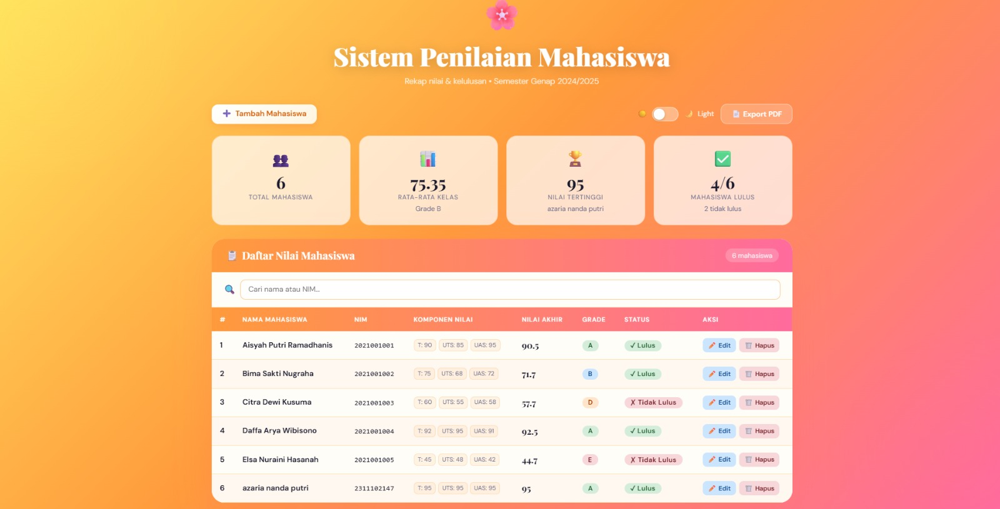

<div align="center">
  <br />
  <h1>LAPORAN PRAKTIKUM <br>APLIKASI BERBASIS PLATFORM</h1>
  <br />
  <h2> MODUL 9 <br> PHP (Sistem Penilaian Mahasiswa) </h2>
  <br />
  <br />
   
  <br />
  <br />
  <br />
  <h3>Disusun Oleh :</h3>
  <p>
    <strong>Rafaldo Al Maqdis</strong><br>
    <strong>2311102099</strong><br>
    <strong>S1 IF-11-REG 01</strong>
  </p>
  <br />
  <h3>Dosen Pengampu :</h3>
  <p>
    <strong>Dimas Fanny Hebrasianto Permadi, S.ST., M.Kom</strong>
  </p>
  <br />
  <br />
    <h4>Asisten Praktikum :</h4>
    <strong> Apri Pandu Wicaksono </strong> <br>
    <strong>Rangga Pradarrell Fathi</strong>
  <br />
  <h2>LABORATORIUM HIGH PERFORMANCE
 <br>FAKULTAS INFORMATIKA <br>UNIVERSITAS TELKOM PURWOKERTO <br>2026</h2>
</div>

---

# 1. Dasar Teori

## 1. Web Server dan Server-Side Scripting

- **Web Server**  
  Web server merupakan software yang bertugas menerima request dari client (browser) melalui protokol HTTP atau HTTPS, lalu mengirimkan kembali response berupa halaman web (biasanya HTML). Contoh web server yang banyak digunakan antara lain Apache, IIS, dan Sun Java System Web Server.

- **Server-Side Scripting**  
  Server-side scripting adalah teknik pemrograman di mana kode dijalankan di sisi server untuk menghasilkan konten web yang dinamis sebelum dikirim ke client. Beberapa bahasa yang umum digunakan adalah PHP, Python, Ruby, dan ASP.NET.

- **Keunggulan PHP**  
  PHP memiliki beberapa kelebihan seperti bersifat open-source (gratis), mudah dipelajari oleh pemula, dapat dijalankan di berbagai platform, memiliki performa yang cukup cepat, serta didukung oleh komunitas yang besar.

---

## 2. Dasar-Dasar Pemrograman PHP

- **Sintaks**  
  Penulisan kode PHP diawali dengan tag khusus `<?php` dan diakhiri dengan `?>`. Setiap instruksi dalam PHP harus diakhiri dengan tanda titik koma (`;`).

- **Variabel**  
  Variabel dalam PHP diawali dengan simbol `$`. Penulisannya bersifat case-sensitive, dan tidak memerlukan deklarasi tipe data karena tipe akan ditentukan secara otomatis saat program dijalankan.

- **Konstanta**  
  Konstanta adalah nilai tetap yang tidak dapat diubah selama program berjalan. Pendefinisiannya biasanya menggunakan fungsi `define()`.

- **Tipe Data**  
  PHP mendukung berbagai tipe data dasar seperti Boolean, Integer, Float, String, Array, Object, Resource, dan Null.

---

## 3. Logika dan Struktur Kontrol

- **Operator**  
  PHP menyediakan berbagai operator, di antaranya:
  - Aritmatika: `+`, `-`, `*`, `/`, `%`
  - Perbandingan: `==`, `!=`, `<`, `>`
  - Logika: `and`, `or`, `&&`, `||`
  - String: operator titik (`.`) untuk menggabungkan teks

- **Percabangan (Conditional)**  
  Untuk pengambilan keputusan, PHP menggunakan:
  - `if-else` untuk kondisi sederhana
  - `switch-case` untuk kondisi dengan banyak kemungkinan nilai

- **Perulangan (Looping)**  
  Beberapa jenis perulangan dalam PHP:
  - `for`: digunakan jika jumlah iterasi sudah diketahui
  - `while` dan `do-while`: digunakan selama kondisi terpenuhi
  - `foreach`: digunakan untuk mengakses setiap elemen dalam array

---

## 4. Fungsi (Function)

Fungsi berfungsi untuk mengelompokkan kode tertentu agar dapat digunakan kembali. PHP mendukung pembuatan fungsi tanpa parameter, dengan parameter, maupun fungsi yang mengembalikan nilai menggunakan `return`.

---

## 5. Array

- **Array Numerik**  
  Array yang menggunakan indeks angka, dimulai dari 0.

- **Array Asosiatif**  
  Array yang menggunakan key berupa string, sehingga lebih mudah digunakan untuk menyimpan data berpasangan seperti nama dengan NIM atau alamat.

---

## 6. 🌸 Sistem Penilaian Mahasiswa (PHP + JSON)

## 📌 Deskripsi Aplikasi

Sistem Penilaian Mahasiswa adalah aplikasi berbasis **PHP Native** yang digunakan untuk mengelola data nilai mahasiswa menggunakan **JSON sebagai database sederhana**.

Aplikasi ini memiliki fitur utama:

* CRUD data mahasiswa
* Perhitungan nilai akhir otomatis
* Penentuan grade
* Penentuan status kelulusan
* Statistik nilai kelas
* Dark mode
* Live preview nilai
* Export PDF
* Search mahasiswa

Aplikasi dirancang dengan **Bootstrap 5**, **JavaScript**, dan **CSS modern** untuk tampilan yang interaktif dan responsif.

---

# 📁 Struktur Folder

```
project/
│
├── mahasiswa.php
├── mahasiswa_data.json
│
├── assets/
│   ├── home.png
│ 
│
└── README.md
```

Folder **assets** digunakan untuk menyimpan gambar tampilan web.

---

# 🧠 Penjelasan Fungsi Utama

## 1. initData()

### Fungsi

Membuat file JSON secara otomatis jika belum tersedia.

### Tujuan

Agar sistem tetap bisa berjalan walaupun file database belum ada.

### Sample Code

```php
function initData() {
    if (!file_exists(DATA_FILE)) {
        $default = [
            ["id"=>1,"nama"=>"Aisyah","nim"=>"2021","nilai_tugas"=>80,"nilai_uts"=>80,"nilai_uas"=>80]
        ];
        file_put_contents(DATA_FILE, json_encode($default));
    }
}
```

### Penjelasan

* mengecek file JSON
* jika tidak ada → buat file
* isi dengan data default
* simpan ke JSON

---

# 2. loadData()

### Fungsi

Mengambil seluruh data mahasiswa dari file JSON.

### Sample Code

```php
function loadData() {
    return json_decode(file_get_contents(DATA_FILE), true) ?: [];
}
```

### Penjelasan

* membaca file JSON
* mengubah JSON menjadi array PHP
* mengembalikan data

Output berupa:

```
array mahasiswa
```

---

# 3. saveData()

### Fungsi

Menyimpan data mahasiswa ke dalam JSON.

### Sample Code

```php
function saveData($data) {
    file_put_contents(DATA_FILE, json_encode($data, JSON_PRETTY_PRINT));
}
```

### Penjelasan

* array diubah menjadi JSON
* JSON disimpan ke file

---

# 4. nextId()

### Fungsi

Menentukan ID mahasiswa berikutnya.

### Sample Code

```php
function nextId($data) {
    return $data ? max(array_column($data, 'id')) + 1 : 1;
}
```

### Penjelasan

* mencari ID terbesar
* menambahkan 1
* jika kosong → mulai dari 1

Contoh:

```
ID terakhir = 6
ID baru = 7
```

---

# 5. validasiNilai()

### Fungsi

Memastikan nilai mahasiswa berada pada rentang 0 sampai 100.

### Sample Code

```php
function validasiNilai($v) {
    return is_numeric($v) && $v >= 0 && $v <= 100;
}
```

### Penjelasan

* cek angka
* cek batas nilai
* return true atau false

---

# 6. sanitize()

### Fungsi

Membersihkan input pengguna.

### Sample Code

```php
function sanitize($s) {
    return htmlspecialchars(trim($s), ENT_QUOTES, 'UTF-8');
}
```

### Penjelasan

* menghapus spasi
* mengubah karakter HTML
* mencegah XSS

Contoh:

```
<script>
```

menjadi

```
&lt;script&gt;
```

---

# 7. hitungNilaiAkhir()

### Fungsi

Menghitung nilai akhir mahasiswa.

### Sample Code

```php
function hitungNilaiAkhir($tugas, $uts, $uas) {
    return round(($tugas * 0.3) + ($uts * 0.3) + ($uas * 0.4), 2);
}
```

### Penjelasan

Rumus:

```
30% tugas
30% uts
40% uas
```

Contoh:

```
tugas = 80
uts = 70
uas = 90
```

Hasil:

```
80*0.3 + 70*0.3 + 90*0.4 = 81
```

---

# 8. tentukanGrade()

### Fungsi

Menentukan grade mahasiswa.

### Sample Code

```php
function tentukanGrade($n) {
    if ($n >= 85) return 'A';
    elseif ($n >= 70) return 'B';
    elseif ($n >= 60) return 'C';
    elseif ($n >= 50) return 'D';
    else return 'E';
}
```

### Penjelasan

Range:

```
85-100 = A
70-84 = B
60-69 = C
50-59 = D
<50 = E
```

---

# 9. tentukanStatus()

### Fungsi

Menentukan status kelulusan mahasiswa.

### Sample Code

```php
function tentukanStatus($n) {
    return ($n >= 60) ? 'Lulus' : 'Tidak Lulus';
}
```

### Penjelasan

```
>=60 = lulus
<60 = tidak lulus
```

---

# 📊 Proses CRUD

### Create

Menambahkan mahasiswa ke JSON.

Sample:

```php
$data[] = [
    'id' => nextId($data),
    'nama' => $nama,
    'nim' => $nim
];
```

---

### Update

Mengubah data mahasiswa.

Sample:

```php
$row['nama'] = $nama;
$row['nim'] = $nim;
```

---

### Delete

Menghapus data mahasiswa.

Sample:

```php
$data = array_filter($data, fn($r) => $r['id'] !== $id);
```

---

# 🖼️ Tampilan Web

## Halaman Utama




# 📚 Referensi

### PHP Official

https://www.php.net/manual/en/

### JSON

https://www.json.org

### Bootstrap

https://getbootstrap.com

### html2pdf

https://github.com/eKoopmans/html2pdf.js

### Google Fonts

https://fonts.google.com

### JavaScript

https://developer.mozilla.org

---
