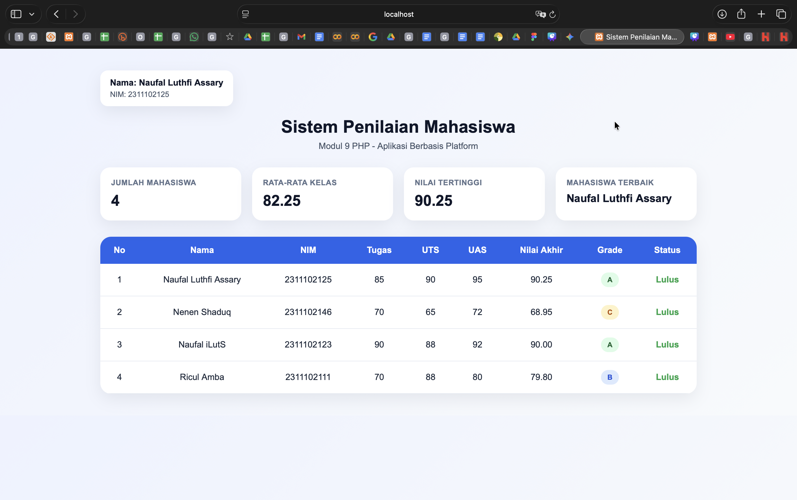

<div align="center">
  <br />
  <h1>LAPORAN PRAKTIKUM <br>APLIKASI BERBASIS PLATFORM</h1>
  <br />
  <h3>MODUL 9 <br> PHP</h3>
  <br />
  <br />
   
  <br />
  <br />
  <br />
  <br />
  <h3>Disusun Oleh :</h3>
  <p>
    <strong>NAUFAL LUTHFI ASSARY</strong><br>
    <strong>2311102125</strong><br>
    <strong>S1 IF-11-REG01</strong>
  </p>
  <br />
  <h3>Dosen Pengampu :</h3>
  <p>
    <strong>Dimas Fanny Hebrasianto Permadi, S.ST., M.Kom</strong>
  </p>
  <br />
  <br />
    <h4>Asisten Praktikum :</h4>
    <strong> Apri Pandu Wicaksono </strong> <br>
    <strong>Rangga Pradarrell Fathi</strong>
  <br />
  <h3>LABORATORIUM HIGH PERFORMANCE
 <br>FAKULTAS INFORMATIKA <br>UNIVERSITAS TELKOM PURWOKERTO <br>2026</h3>
</div>

---

## 1. Dasar Teori

1. Web Server dan Server Side Scripting

Web server merupakan perangkat lunak pada server yang berfungsi menerima permintaan halaman web dari client melalui protokol HTTP atau HTTPS, kemudian mengirimkan kembali hasilnya dalam bentuk dokumen web, umumnya HTML. Dalam pengembangan web dinamis, web server bekerja bersama bahasa pemrograman server-side untuk memproses data sebelum hasil akhirnya ditampilkan ke browser.  

Server side scripting adalah teknik pemrograman web di mana script dijalankan atau diterjemahkan di sisi server. Dengan pendekatan ini, halaman web yang dihasilkan dapat bersifat dinamis karena isi halaman dapat menyesuaikan data, kondisi, atau input pengguna. Beberapa contoh bahasa server-side scripting yang disebutkan dalam modul adalah ASP, ColdFusion, Java Server Pages, Perl, Python, dan PHP.  

2. PHP

**PHP** merupakan singkatan rekursif dari PHP: Hypertext Preprocessor. PHP pertama kali diciptakan oleh Rasmus Lerdorf pada tahun 1994 dan digunakan sebagai bahasa pemrograman berbasis web yang dijalankan di sisi server. Dalam penulisannya, kode PHP dapat ditempatkan di antara tag <?php ... ?>. Setiap statement pada PHP umumnya diakhiri dengan tanda titik koma (;).  

PHP memiliki beberapa keistimewaan sebagai bahasa pemrograman web, yaitu cepat, gratis, mudah dipelajari, multi-platform, memiliki dukungan teknis, didukung banyak komunitas, dan relatif aman. Oleh karena itu, PHP banyak digunakan untuk membangun aplikasi web, termasuk sistem informasi sederhana seperti sistem penilaian mahasiswa.  

3. XAMPP sebagai Lingkungan Pengembangan

**XAMPP** merupakan paket aplikasi yang menyediakan Apache, PHP, dan MySQL dalam satu instalasi sehingga memudahkan proses pembelajaran pemrograman web. Dalam modul, XAMPP digunakan sebagai sarana pendukung untuk menjalankan program PHP pada komputer lokal. Setelah instalasi selesai, pengguna dapat mengaktifkan service seperti Apache melalui XAMPP Control Panel, lalu menguji hasilnya melalui browser menggunakan alamat localhost.    

Modul juga menjelaskan bahwa file PHP disimpan pada direktori htdocs di folder XAMPP, kemudian dijalankan melalui browser dengan format alamat seperti http://localhost/namafile.php. Hal ini menunjukkan bahwa XAMPP berfungsi sebagai web server lokal untuk mengeksekusi kode PHP.  

4. Variabel

Variabel dalam PHP digunakan untuk menyimpan nilai, data, atau informasi. Nama variabel diawali dengan simbol dolar ($) dan tidak perlu dideklarasikan terlebih dahulu. PHP juga bersifat case sensitive terhadap nama variabel yang dibuat pengguna, sehingga huruf besar dan huruf kecil dianggap berbeda. Selain itu, nama variabel tidak boleh mengandung spasi.  

Dalam konteks program sistem penilaian mahasiswa, variabel digunakan untuk menyimpan nilai tugas, nilai UTS, nilai UAS, nilai akhir, grade, status, total nilai, dan rata-rata kelas. Dengan demikian, variabel menjadi komponen dasar dalam proses pengolahan data pada program.  

5. Operator dalam PHP

**Operator** adalah simbol yang digunakan untuk melakukan operasi tertentu terhadap data. Modul menjelaskan beberapa jenis operator dalam PHP, antara lain operator aritmatika, penugasan, bitwise, perbandingan, logika, dan string. Operator aritmatika seperti +, -, *, /, dan % digunakan untuk proses perhitungan matematis.  

Operator perbandingan seperti ==, !=, <, >, <=, dan >= digunakan untuk membandingkan dua nilai. Operator logika seperti and, or, &&, ||, dan ! digunakan untuk menyusun kondisi yang lebih kompleks. Dalam program sistem penilaian mahasiswa, operator aritmatika digunakan untuk menghitung nilai akhir, sedangkan operator perbandingan digunakan untuk menentukan grade dan status kelulusan.  

6. Struktur Kondisi

Struktur kondisi pada PHP digunakan untuk pengambilan keputusan berdasarkan suatu syarat tertentu. Modul menjelaskan bentuk dasar percabangan if-else, yaitu jika kondisi bernilai benar maka program menjalankan perintah tertentu, sedangkan jika kondisi salah maka program menjalankan perintah lain. Selain if-else, PHP juga menyediakan struktur switch-case untuk kondisi dengan banyak kemungkinan nilai.  

Dalam sistem penilaian mahasiswa, struktur kondisi digunakan untuk menentukan grade berdasarkan rentang nilai akhir, serta untuk menentukan apakah mahasiswa dinyatakan lulus atau tidak lulus. Dengan demikian, percabangan memungkinkan program menghasilkan keputusan otomatis dari data nilai yang diolah.  

7. Perulangan

**Perulangan atau looping** digunakan untuk menjalankan perintah secara berulang selama kondisi tertentu terpenuhi. Modul menyebutkan beberapa bentuk perulangan pada PHP, yaitu for, while, do-while, dan foreach. Masing-masing memiliki kegunaan berbeda, tetapi semuanya bertujuan mempermudah proses pengolahan data berulang.  

Pada program sistem penilaian mahasiswa, perulangan digunakan untuk memproses seluruh data mahasiswa satu per satu dan untuk menampilkan data ke dalam tabel HTML. Dengan adanya perulangan, program menjadi lebih efisien karena tidak perlu menulis perintah yang sama secara berulang secara manual.  

8. Function

**Function** adalah sekumpulan perintah yang dirancang untuk menjalankan tugas tertentu dan dapat dipanggil kembali saat dibutuhkan. Modul menjelaskan bahwa function membuat kode program lebih efektif, karena tugas yang sama tidak perlu ditulis berulang-ulang. Function dapat dibuat dengan atau tanpa parameter, serta dapat memiliki return value.  

Dalam program sistem penilaian mahasiswa, function digunakan untuk menghitung nilai akhir, menentukan grade, dan menentukan status kelulusan. Penggunaan function membuat program lebih terstruktur, mudah dibaca, dan lebih mudah dikembangkan kembali.  

9. Array

**Array** merupakan tipe data terstruktur yang digunakan untuk menyimpan sejumlah data. Elemen array dapat diakses melalui index, baik berupa bilangan integer maupun string. PHP mendukung array biasa maupun array asosiatif. Array asosiatif adalah array yang menggunakan string sebagai index atau key.  

Dalam tugas sistem penilaian mahasiswa, array asosiatif sangat sesuai digunakan karena setiap mahasiswa memiliki beberapa atribut data, seperti nama, NIM, nilai tugas, nilai UTS, dan nilai UAS. Dengan array asosiatif, data dapat disimpan dan diakses dengan lebih jelas berdasarkan key yang dimiliki, misalnya nama, nim, tugas, uts, dan uas.  

---

## 2. Penjelasan Kode 

Berikut merupakan implementasi Sistem Penilaian Mahasiswa dengan menggunakan PHP.

### Kode PHP (`Tugas9.php`)

```php
<?php
function hitungNilaiAkhir($tugas, $uts, $uas)
{
    return ($tugas * 0.30) + ($uts * 0.35) + ($uas * 0.35);
}

function tentukanGrade($nilaiAkhir)
{
    if ($nilaiAkhir >= 85) {
        return "A";
    } elseif ($nilaiAkhir >= 75) {
        return "B";
    } elseif ($nilaiAkhir >= 65) {
        return "C";
    } elseif ($nilaiAkhir >= 50) {
        return "D";
    } else {
        return "E";
    }
}

function tentukanStatus($nilaiAkhir)
{
    return $nilaiAkhir >= 60 ? "Lulus" : "Tidak Lulus";
}

$mahasiswa = [
    [
        "nama" => "Naufal Luthfi Assary",
        "nim" => "2311102125",
        "tugas" => 85,
        "uts" => 90,
        "uas" => 95
    ],
    [
        "nama" => "Nenen Shaduq",
        "nim" => "2311102146",
        "tugas" => 70,
        "uts" => 65,
        "uas" => 72
    ],
    [
        "nama" => "Naufal iLutS",
        "nim" => "2311102123",
        "tugas" => 90,
        "uts" => 88,
        "uas" => 92
    ],
    [
        "nama" => "Ricul Amba",
        "nim" => "2311102111",
        "tugas" => 70,
        "uts" => 88,
        "uas" => 80
    ]
];

$totalNilaiAkhir = 0;
$nilaiTertinggi = 0;
$namaNilaiTertinggi = "";

for ($i = 0; $i < count($mahasiswa); $i++) {
    $nilaiAkhir = hitungNilaiAkhir(
        $mahasiswa[$i]["tugas"],
        $mahasiswa[$i]["uts"],
        $mahasiswa[$i]["uas"]
    );

    $grade = tentukanGrade($nilaiAkhir);
    $status = tentukanStatus($nilaiAkhir);

    $mahasiswa[$i]["nilai_akhir"] = $nilaiAkhir;
    $mahasiswa[$i]["grade"] = $grade;
    $mahasiswa[$i]["status"] = $status;

    $totalNilaiAkhir += $nilaiAkhir;

    if ($nilaiAkhir > $nilaiTertinggi) {
        $nilaiTertinggi = $nilaiAkhir;
        $namaNilaiTertinggi = $mahasiswa[$i]["nama"];
    }
}

$rataRataKelas = $totalNilaiAkhir / count($mahasiswa);
?>

<!DOCTYPE html>
<html lang="id">
<head>
    <meta charset="UTF-8">
    <meta name="viewport" content="width=device-width, initial-scale=1.0">
    <title>Sistem Penilaian Mahasiswa</title>
    <style>
        * {
            margin: 0;
            padding: 0;
            box-sizing: border-box;
        }

        body {
            font-family: Arial, Helvetica, sans-serif;
            background: linear-gradient(135deg, #eef2ff, #f8fafc);
            color: #1e293b;
            padding: 40px 20px;
        }

        .container {
            max-width: 1100px;
            margin: 0 auto;
        }

        .identity {
            text-align: left;
            margin-bottom: 20px;
            background: #ffffff;
            padding: 14px 18px;
            border-radius: 14px;
            box-shadow: 0 10px 30px rgba(15, 23, 42, 0.08);
            display: inline-block;
        }

        .identity h4 {
            font-size: 16px;
            color: #0f172a;
            margin-bottom: 4px;
        }

        .identity p {
            font-size: 14px;
            color: #475569;
        }

        .header {
            text-align: center;
            margin-bottom: 30px;
        }

        .header h1 {
            font-size: 32px;
            margin-bottom: 8px;
            color: #0f172a;
        }

        .header p {
            color: #475569;
            font-size: 16px;
        }

        .stats {
            display: grid;
            grid-template-columns: repeat(auto-fit, minmax(240px, 1fr));
            gap: 20px;
            margin-bottom: 30px;
        }

        .card {
            background: #ffffff;
            padding: 20px;
            border-radius: 18px;
            box-shadow: 0 10px 30px rgba(15, 23, 42, 0.08);
        }

        .card h3 {
            font-size: 14px;
            color: #64748b;
            margin-bottom: 10px;
            text-transform: uppercase;
            letter-spacing: 0.5px;
        }

        .card p {
            font-size: 28px;
            font-weight: bold;
            color: #0f172a;
        }

        .table-card {
            background: #ffffff;
            border-radius: 20px;
            overflow: hidden;
            box-shadow: 0 10px 30px rgba(15, 23, 42, 0.08);
        }

        table {
            width: 100%;
            border-collapse: collapse;
        }

        thead {
            background: #2563eb;
            color: white;
        }

        th, td {
            padding: 16px;
            text-align: center;
        }

        tbody tr {
            border-bottom: 1px solid #e2e8f0;
        }

        tbody tr:hover {
            background: #f8fafc;
        }

        .badge {
            display: inline-block;
            padding: 6px 12px;
            border-radius: 999px;
            font-size: 13px;
            font-weight: bold;
        }

        .grade-a { background: #dcfce7; color: #166534; }
        .grade-b { background: #dbeafe; color: #1d4ed8; }
        .grade-c { background: #fef3c7; color: #b45309; }
        .grade-d { background: #fde68a; color: #92400e; }
        .grade-e { background: #fee2e2; color: #b91c1c; }

        .lulus {
            color: #16a34a;
            font-weight: bold;
        }

        .tidak-lulus {
            color: #dc2626;
            font-weight: bold;
        }

        @media (max-width: 768px) {
            .table-card {
                overflow-x: auto;
            }

            table {
                min-width: 900px;
            }

            .header h1 {
                font-size: 26px;
            }
        }
    </style>
</head>
<body>
    <div class="container">
        <div class="identity">
            <h4>Nama: Naufal Luthfi Assary</h4>
            <p>NIM: 2311102125</p>
        </div>

        <div class="header">
            <h1>Sistem Penilaian Mahasiswa</h1>
            <p>Modul 9 PHP - Aplikasi Berbasis Platform</p>
        </div>

        <div class="stats">
            <div class="card">
                <h3>Jumlah Mahasiswa</h3>
                <p><?php echo count($mahasiswa); ?></p>
            </div>
            <div class="card">
                <h3>Rata-rata Kelas</h3>
                <p><?php echo number_format($rataRataKelas, 2); ?></p>
            </div>
            <div class="card">
                <h3>Nilai Tertinggi</h3>
                <p><?php echo number_format($nilaiTertinggi, 2); ?></p>
            </div>
            <div class="card">
                <h3>Mahasiswa Terbaik</h3>
                <p style="font-size: 20px;"><?php echo $namaNilaiTertinggi; ?></p>
            </div>
        </div>

        <div class="table-card">
            <table>
                <thead>
                    <tr>
                        <th>No</th>
                        <th>Nama</th>
                        <th>NIM</th>
                        <th>Tugas</th>
                        <th>UTS</th>
                        <th>UAS</th>
                        <th>Nilai Akhir</th>
                        <th>Grade</th>
                        <th>Status</th>
                    </tr>
                </thead>
                <tbody>
                    <?php
                    $no = 1;
                    foreach ($mahasiswa as $mhs) {
                        $gradeClass = "grade-" . strtolower($mhs["grade"]);
                        $statusClass = $mhs["status"] == "Lulus" ? "lulus" : "tidak-lulus";

                        echo "<tr>";
                        echo "<td>" . $no++ . "</td>";
                        echo "<td>" . $mhs["nama"] . "</td>";
                        echo "<td>" . $mhs["nim"] . "</td>";
                        echo "<td>" . $mhs["tugas"] . "</td>";
                        echo "<td>" . $mhs["uts"] . "</td>";
                        echo "<td>" . $mhs["uas"] . "</td>";
                        echo "<td>" . number_format($mhs["nilai_akhir"], 2) . "</td>";
                        echo "<td><span class='badge $gradeClass'>" . $mhs["grade"] . "</span></td>";
                        echo "<td><span class='$statusClass'>" . $mhs["status"] . "</span></td>";
                        echo "</tr>";
                    }
                    ?>
                </tbody>
            </table>
        </div>
    </div>
</body>
</html>
```

### Hasil Tampilan (Screenshot)



### Penjelasan Code:

1. Tujuan Program
Program ini dibuat untuk menampilkan **sistem penilaian mahasiswa** menggunakan PHP.
Program menghitung:
  - nilai akhir mahasiswa
  - grade
  - status kelulusan
  - rata-rata kelas
  - nilai tertinggi
Hasil ditampilkan dalam bentuk **halaman web modern** dengan tabel HTML.

2. Function `hitungNilaiAkhir()`
```php
function hitungNilaiAkhir($tugas, $uts, $uas)
{
    return ($tugas * 0.30) + ($uts * 0.35) + ($uas * 0.35);
}
```
Function ini digunakan untuk menghitung nilai akhir mahasiswa.
Bobot penilaian yang digunakan:
-	tugas = 30%
-	UTS = 35%
-	UAS = 35%
Pada bagian ini digunakan operator aritmatika:
-	* untuk perkalian
-	+ untuk penjumlahan

3. Function tentukanGrade()
```php
function tentukanGrade($nilaiAkhir)
{
    if ($nilaiAkhir >= 85) {
        return "A";
    } elseif ($nilaiAkhir >= 75) {
        return "B";
    } elseif ($nilaiAkhir >= 65) {
        return "C";
    } elseif ($nilaiAkhir >= 50) {
        return "D";
    } else {
        return "E";
    }
}
```

Function ini digunakan untuk menentukan grade berdasarkan nilai akhir.
Ketentuan grade:
-	A jika nilai >= 85
-	B jika nilai >= 75
-	C jika nilai >= 65
-	D jika nilai >= 50
-	E jika nilai < 50
Pada bagian ini digunakan:
-	percabangan if, elseif, dan else
-	operator perbandingan seperti >=

4. Function tentukanStatus()
```php
function tentukanStatus($nilaiAkhir)
{
    return $nilaiAkhir >= 60 ? "Lulus" : "Tidak Lulus";
}
```
Function ini digunakan untuk menentukan status kelulusan.
Ketentuannya:
-	jika nilai akhir >= 60 maka Lulus
-	jika nilai akhir < 60 maka Tidak Lulus
Pada bagian ini digunakan:
- operator perbandingan >=
-	operator ternary untuk menulis kondisi secara singkat

5. Array Data Mahasiswa
```php
$mahasiswa = [
    [
        "nama" => "Naufal Luthfi Assary",
        "nim" => "2311102125",
        "tugas" => 85,
        "uts" => 90,
        "uas" => 95
    ],
    ...
];
```
Data mahasiswa disimpan dalam array asosiatif.
Setiap mahasiswa memiliki data:
- nama
-	nim
-	tugas
-	uts
-	uas
Array asosiatif digunakan karena setiap data memiliki key yang jelas.

6. Variabel Awal
```php
$totalNilaiAkhir = 0;
$nilaiTertinggi = 0;
$namaNilaiTertinggi = "";
```
- $totalNilaiAkhir digunakan untuk menyimpan total seluruh nilai akhir mahasiswa.
-	$nilaiTertinggi digunakan untuk menyimpan nilai tertinggi dalam kelas.
-	$namaNilaiTertinggi digunakan untuk menyimpan nama mahasiswa dengan nilai tertinggi.

7. Perulangan for untuk Memproses Data
```php
for ($i = 0; $i < count($mahasiswa); $i++) {
    ...
}
```
Perulangan for digunakan untuk memproses seluruh data mahasiswa satu per satu.
Di dalam perulangan, program melakukan:
- menghitung nilai akhir
-	menentukan grade
-	menentukan status
-	menyimpan hasil ke array
-	menjumlahkan nilai akhir
-	mencari nilai tertinggi

8. Menghitung Nilai Akhir, Grade, dan Status
```php
$nilaiAkhir = hitungNilaiAkhir(
    $mahasiswa[$i]["tugas"],
    $mahasiswa[$i]["uts"],
    $mahasiswa[$i]["uas"]
);

$grade = tentukanGrade($nilaiAkhir);
$status = tentukanStatus($nilaiAkhir);
```
-	hitungNilaiAkhir() dipanggil untuk menghitung nilai akhir mahasiswa.
-	tentukanGrade() dipanggil untuk menentukan grade.
-	tentukanStatus() dipanggil untuk menentukan status kelulusan.

9. Menyimpan Hasil ke Array
```php
$mahasiswa[$i]["nilai_akhir"] = $nilaiAkhir;
$mahasiswa[$i]["grade"] = $grade;
$mahasiswa[$i]["status"] = $status;
```
Hasil perhitungan ditambahkan ke dalam data masing-masing mahasiswa.
Key baru yang ditambahkan:
-	nilai_akhir
-	grade
-	status

10. Menjumlahkan Nilai Akhir
```php
$totalNilaiAkhir += $nilaiAkhir;
```
	-	Digunakan untuk menjumlahkan semua nilai akhir mahasiswa.
	-	Hasil total ini nantinya dipakai untuk menghitung rata-rata kelas.

11. Menentukan Nilai Tertinggi
```php
if ($nilaiAkhir > $nilaiTertinggi) {
    $nilaiTertinggi = $nilaiAkhir;
    $namaNilaiTertinggi = $mahasiswa[$i]["nama"];
}
```
-	Program membandingkan nilai akhir setiap mahasiswa dengan nilai tertinggi sebelumnya.
-	Jika nilai sekarang lebih besar, maka:
-	$nilaiTertinggi diperbarui
- $namaNilaiTertinggi diisi dengan nama mahasiswa tersebut

12. Menghitung Rata-rata Kelas
```php
$rataRataKelas = $totalNilaiAkhir / count($mahasiswa);
```
Rata-rata kelas dihitung dengan rumus:
total nilai akhir / jumlah mahasiswa
count($mahasiswa) digunakan untuk menghitung jumlah mahasiswa.

13. Struktur HTML
```html
<!DOCTYPE html>
<html lang="id">
```
Bagian ini menunjukkan bahwa program menampilkan output dalam bentuk halaman HTML.
Bahasa halaman diatur ke Bahasa Indonesia dengan lang="id".

14. Bagian CSS
CSS ditulis di dalam tag <style> untuk mempercantik tampilan web.
Fungsi CSS pada program ini:
- mengatur font
- memberi background gradasi
- membuat card statistik
- mempercantik tabel
- memberi warna grade dan status
- membuat tampilan lebih modern

15. Bagian Identitas
```php
<div class="identity">
    <h4>Nama: Naufal Luthfi Assary</h4>
    <p>NIM: 2311102125</p>
</div>
```
Bagian ini digunakan untuk menampilkan identitas pembuat tugas.
Letaknya ada di kiri atas halaman.

16. Bagian Header
```php
<div class="header">
    <h1>Sistem Penilaian Mahasiswa</h1>
    <p>Modul 9 PHP - Aplikasi Berbasis Platform</p>
</div>
```
Bagian ini menampilkan judul utama halaman.
Tujuannya agar pengguna tahu isi dari website yang dibuat.

17. Bagian Statistik
```php
<p><?php echo count($mahasiswa); ?></p>
<p><?php echo number_format($rataRataKelas, 2); ?></p>
<p><?php echo number_format($nilaiTertinggi, 2); ?></p>
<p style="font-size: 20px;"><?php echo $namaNilaiTertinggi; ?></p>
```
Menampilkan informasi ringkas berupa:
- jumlah mahasiswa
- rata-rata kelas
- nilai tertinggi
- mahasiswa terbaik
number_format(..., 2) digunakan agar angka tampil dengan 2 angka di belakang koma.

18. Menampilkan Data dalam Tabel
```php
foreach ($mahasiswa as $mhs) {
    ...
}
```
Perulangan foreach digunakan untuk menampilkan seluruh data mahasiswa ke dalam tabel HTML.
Setiap mahasiswa ditampilkan dalam satu baris tabel.

19. Menentukan Warna Grade
```php
$gradeClass = "grade-" . strtolower($mhs["grade"]);
```
Digunakan untuk menyesuaikan warna badge grade.
Contoh:
- grade A menjadi class grade-a
- grade B menjadi class grade-b

20. Menentukan Warna Status
```php
$statusClass = $mhs["status"] == "Lulus" ? "lulus" : "tidak-lulus";
```
- Digunakan untuk memberi warna pada status:
- hijau untuk Lulus
- merah untuk Tidak Lulus

21. Menampilkan Isi Tabel
```php
echo "<td>" . $mhs["nama"] . "</td>";
echo "<td>" . $mhs["nim"] . "</td>";
echo "<td>" . $mhs["tugas"] . "</td>";
echo "<td>" . $mhs["uts"] . "</td>";
echo "<td>" . $mhs["uas"] . "</td>";
echo "<td>" . number_format($mhs["nilai_akhir"], 2) . "</td>";
echo "<td><span class='badge $gradeClass'>" . $mhs["grade"] . "</span></td>";
echo "<td><span class='$statusClass'>" . $mhs["status"] . "</span></td>";
```
Bagian ini mencetak data mahasiswa ke dalam kolom tabel.
Data yang ditampilkan:
- nama
- NIM
-	nilai tugas
-	nilai UTS
-	nilai UAS
-	nilai akhir
-	grade
-	status


## Referensi
- [Materi Modul 9](https://drive.google.com/file/d/1Fgj2rbye0s7QZ5VBigpSiTyPBl8TjpKB/view?usp=sharing)