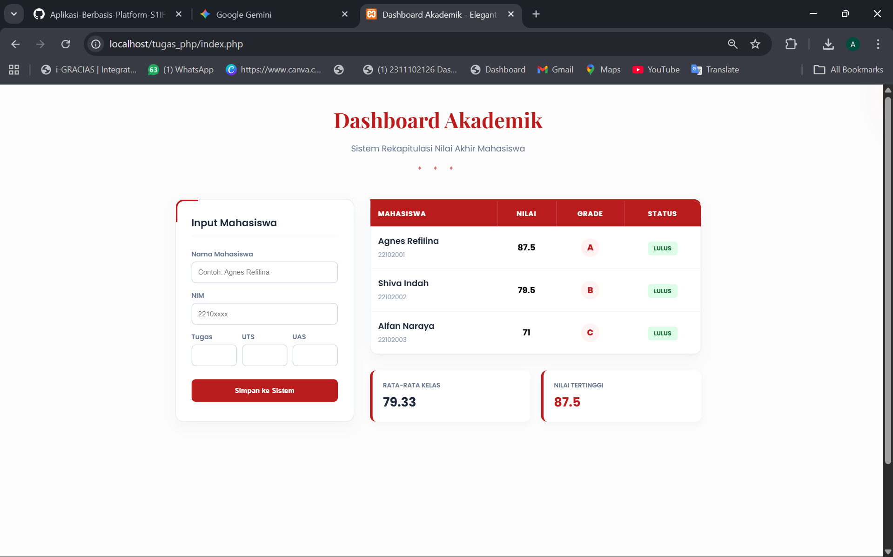

<div align="center">
  <br />
  <h1>LAPORAN PRAKTIKUM <br> APLIKASI BERBASIS PLATFORM</h1>
  <br />
  <h3>MODUL 9 <br> PHP</h3>
  <br />
  
  <br />
  <br />
  <br />
  <h3>Disusun Oleh :</h3>
  <p>
    <strong>Agnes Refilina Fiska</strong><br>
    <strong>2311102126</strong><br>
    <strong>S1 IF-11-01</strong>
  </p>
  <br />
  <h3>Dosen Pengampu :</h3>
  <p>
    <strong>Dimas Fanny Hebrasianto Permadi, S.ST., M.Kom</strong>
  </p>
  <br />
  <br />
  <h4>Asisten Praktikum :</h4>
  <strong>Apri Pandu Wicaksono</strong> <br>
  <strong>Rangga Pradarrell Fathi</strong>
  <br />
  <br />
  <br />
  <br />
  <h3>LABORATORIUM HIGH PERFORMANCE <br> FAKULTAS INFORMATIKA <br> UNIVERSITAS TELKOM PURWOKERTO <br> 2026</h3>
</div>

---

## 1. Dasar Teori

**PHP** adalah bahasa pemrograman server-side yang krusial dalam menciptakan website dinamis. Berbeda dengan HTML atau CSS yang fokus pada aspek visual, PHP bekerja di balik layar untuk mengolah logika, memproses data input, dan menghasilkan konten yang berubah sesuai kebutuhan pengguna sebelum dikirimkan ke peramban.

**Pengelolaan Data dengan Array dan Function**
Dalam tahap pembelajaran awal, PHP memungkinkan pengolahan data tanpa database melalui penggunaan array asosiatif. Struktur ini menyimpan data dalam pasangan key (kunci) dan value (nilai), sehingga informasi mahasiswa seperti nama, NIM, dan komponen nilai lebih mudah diorganisir dan diakses.

**Logika Program dan Visualisasi Data**
Sistem penilaian ini memanfaatkan berbagai elemen logika dasar, antara lain:

- Operator Aritmatika & Perbandingan: Digunakan untuk menghitung nilai akhir berdasarkan bobot serta membandingkannya dengan standar kelulusan.

- Struktur Percabangan (if/else): Berperan dalam menentukan grade (A, B, C, dst.) serta status kelulusan mahasiswa.

- Perulangan (foreach): Berfungsi untuk menyisir seluruh data dalam array dan menampilkannya secara otomatis ke dalam format tabel HTML.

**Implementasi Praktikum: Sistem Penilaian Mahasiswa**
Pada praktikum ini, kolaborasi antara PHP, HTML, dan CSS digunakan untuk membangun sebuah Sistem Penilaian Mahasiswa. Program ini tidak hanya sekadar mengolah angka, tetapi juga mampu melakukan analisis data seperti:

1. Penghitungan nilai akhir secara otomatis.

2. Penentuan status kelulusan dan predikat nilai.

3. Penyajian statistik kelas, termasuk rata-rata nilai dan skor tertinggi.

4. Tampilan antarmuka yang rapi, profesional, dan mudah dipahami oleh pengguna.
---

## 2. Penjelasan Kode PHP, HTML, dan CSS

### Kode Program (`index.php`)

```php
<?php
/**
 * Logika Sistem Penilaian
 */
function hitungNilaiAkhir($tugas, $uts, $uas) {
    return ($tugas * 0.2) + ($uts * 0.3) + ($uas * 0.5);
}

function tentukanGrade($nilai) {
    if ($nilai >= 85) return "A";
    elseif ($nilai >= 75) return "B";
    elseif ($nilai >= 60) return "C";
    elseif ($nilai >= 50) return "D";
    else return "E";
}

// Data Awal
$daftarMahasiswa = [
    ["nama" => "Agnes Refilina", "nim" => "22102001", "tugas" => 90, "uts" => 85, "uas" => 88],
    ["nama" => "Shiva Indah", "nim" => "22102002", "tugas" => 80, "uts" => 75, "uas" => 82],
    ["nama" => "Alfan Naraya", "nim" => "22102003", "tugas" => 70, "uts" => 65, "uas" => 75]
];

if ($_SERVER["REQUEST_METHOD"] == "POST" && isset($_POST['tambah'])) {
    $mhsBaru = [
        "nama" => $_POST['nama'], "nim" => $_POST['nim'],
        "tugas" => (int)$_POST['tugas'], "uts" => (int)$_POST['uts'], "uas" => (int)$_POST['uas']
    ];
    array_push($daftarMahasiswa, $mhsBaru);
}

$totalNilai = 0;
$nilaiTertinggi = 0;
?>

<!DOCTYPE html>
<html lang="id">
<head>
    <meta charset="UTF-8">
    <meta name="viewport" content="width=device-width, initial-scale=1.0">
    <title>Dashboard Akademik - Elegant Edition</title>
    <style>
        @import url('https://fonts.googleapis.com/css2?family=Playfair+Display:wght@700&family=Poppins:wght@300;400;600&display=swap');

        :root {
            --primary-red: #b91c1c;
            --soft-red: #fef2f2;
            --white: #ffffff;
            --dark-slate: #1e293b;
        }

        body {
            font-family: 'Poppins', sans-serif;
            background-color: #fcfcfc;
            margin: 0;
            padding: 40px 20px;
            display: flex;
            justify-content: center;
            min-height: 100vh;
            overflow-x: hidden;
            position: relative;
        }

        /* ORNAMEN POJOK MINIMALIS (Halus & Bersih) */
        .ornament-corner {
            position: fixed;
            width: 250px;
            height: 250px;
            background: radial-gradient(circle, rgba(185, 28, 28, 0.05) 0%, transparent 70%);
            z-index: -1;
            pointer-events: none;
        }
        .top-right { top: -100px; right: -100px; }
        .bottom-left { bottom: -100px; left: -100px; }

        .container {
            width: 100%;
            max-width: 1000px;
            position: relative;
            z-index: 1;
        }

        .header {
            text-align: center;
            margin-bottom: 50px;
        }

        .header h1 {
            font-family: 'Playfair Display', serif;
            color: var(--primary-red);
            font-size: 2.5rem;
            margin: 0;
        }

        .header::after {
            content: "♦ ♦ ♦";
            display: block;
            color: var(--primary-red);
            margin-top: 10px;
            letter-spacing: 10px;
            font-size: 0.8rem;
            opacity: 0.6;
        }

        .main-layout {
            display: grid;
            grid-template-columns: 340px 1fr;
            gap: 30px;
        }

        /* Card Styling */
        .card {
            background: var(--white);
            border-radius: 15px;
            padding: 30px;
            box-shadow: 0 10px 25px rgba(0, 0, 0, 0.03);
            border: 1px solid #e2e8f0;
            position: relative;
        }

        .card::before {
            content: "";
            position: absolute;
            top: 0; left: 0;
            width: 40px; height: 40px;
            border-top: 3px solid var(--primary-red);
            border-left: 3px solid var(--primary-red);
            border-top-left-radius: 15px;
        }

        .card h3 {
            color: var(--dark-slate);
            font-weight: 600;
            margin-top: 0;
            margin-bottom: 25px;
            border-bottom: 1px solid #f1f5f9;
            padding-bottom: 10px;
        }

        /* Form Styling */
        .form-group { margin-bottom: 15px; }
        label { font-size: 0.8rem; font-weight: 600; color: #64748b; margin-bottom: 5px; display: block; }
        input {
            width: 100%;
            padding: 12px;
            border: 1px solid #cbd5e1;
            border-radius: 8px;
            background: #ffffff;
            transition: 0.3s;
            box-sizing: border-box;
        }
        input:focus { outline: none; border-color: var(--primary-red); box-shadow: 0 0 0 3px rgba(185, 28, 28, 0.1); }

        .btn-submit {
            width: 100%;
            background: var(--primary-red);
            color: white;
            border: none;
            padding: 14px;
            border-radius: 8px;
            font-weight: 600;
            cursor: pointer;
            transition: 0.3s;
            margin-top: 10px;
        }
        .btn-submit:hover { background: #991b1b; transform: translateY(-2px); }

        /* Table Styling */
        table { width: 100%; border-collapse: collapse; }
        thead { background-color: var(--primary-red); color: white; }
        th { padding: 15px; text-align: left; font-size: 0.8rem; text-transform: uppercase; letter-spacing: 1px; }
        td { padding: 15px; border-bottom: 1px solid #f1f5f9; }
        tr:hover { background-color: #fff9f9; }

        .mhs-name { font-weight: 600; color: var(--dark-slate); display: block; }
        .mhs-nim { font-size: 0.75rem; color: #94a3b8; }

        .grade-circle {
            display: inline-block;
            width: 35px; height: 35px;
            line-height: 35px;
            text-align: center;
            background: var(--soft-red);
            color: var(--primary-red);
            border-radius: 50%;
            font-weight: 800;
        }

        .status-badge {
            padding: 5px 12px;
            border-radius: 6px;
            font-size: 0.7rem;
            font-weight: 700;
        }
        .lulus { background: #dcfce7; color: #166534; }
        .gagal { background: #fee2e2; color: #b91c1c; }

        .stats-container { display: grid; grid-template-columns: 1fr 1fr; gap: 20px; margin-top: 30px; }
        .stat-card {
            background: var(--white);
            padding: 20px;
            border-radius: 12px;
            border-left: 5px solid var(--primary-red);
            box-shadow: 0 4px 12px rgba(0,0,0,0.03);
        }
        .stat-label { font-size: 0.75rem; color: #64748b; font-weight: 600; text-transform: uppercase; }
        .stat-value { font-size: 1.5rem; font-weight: 700; color: var(--dark-slate); margin-top: 5px; }

        @media (max-width: 850px) { .main-layout { grid-template-columns: 1fr; } }
    </style>
</head>
<body>

    <div class="ornament-corner top-right"></div>
    <div class="ornament-corner bottom-left"></div>

    <div class="container">
        <div class="header">
            <h1>Dashboard Akademik</h1>
            <p style="color:#64748b">Sistem Rekapitulasi Nilai Akhir Mahasiswa</p>
        </div>

        <div class="main-layout">
            <section class="card">
                <h3>Input Mahasiswa</h3>
                <form method="POST">
                    <div class="form-group">
                        <label>Nama Mahasiswa</label>
                        <input type="text" name="nama" required placeholder="Contoh: Agnes Refilina">
                    </div>
                    <div class="form-group">
                        <label>NIM</label>
                        <input type="text" name="nim" required placeholder="2210xxxx">
                    </div>
                    <div style="display:flex; gap:10px;">
                        <div class="form-group">
                            <label>Tugas</label>
                            <input type="number" name="tugas" required>
                        </div>
                        <div class="form-group">
                            <label>UTS</label>
                            <input type="number" name="uts" required>
                        </div>
                        <div class="form-group">
                            <label>UAS</label>
                            <input type="number" name="uas" required>
                        </div>
                    </div>
                    <button type="submit" name="tambah" class="btn-submit">Simpan ke Sistem</button>
                </form>
            </section>

            <div>
                <div class="card" style="padding: 0; overflow: hidden; border-top: 4px solid var(--primary-red); border-top-left-radius: 0;">
                    <table>
                        <thead>
                            <tr>
                                <th>Mahasiswa</th>
                                <th style="text-align:center">Nilai</th>
                                <th style="text-align:center">Grade</th>
                                <th style="text-align:center">Status</th>
                            </tr>
                        </thead>
                        <tbody>
                            <?php foreach ($daftarMahasiswa as $mhs) : 
                                $na = hitungNilaiAkhir($mhs['tugas'], $mhs['uts'], $mhs['uas']);
                                $grade = tentukanGrade($na);
                                $lulus = $na >= 60;
                                $totalNilai += $na;
                                if ($na > $nilaiTertinggi) $nilaiTertinggi = $na;
                            ?>
                            <tr>
                                <td>
                                    <span class="mhs-name"><?= htmlspecialchars($mhs['nama']) ?></span>
                                    <span class="mhs-nim"><?= htmlspecialchars($mhs['nim']) ?></span>
                                </td>
                                <td style="text-align:center; font-weight:700"><?= $na ?></td>
                                <td style="text-align:center">
                                    <span class="grade-circle"><?= $grade ?></span>
                                </td>
                                <td style="text-align:center">
                                    <span class="status-badge <?= $lulus ? 'lulus' : 'gagal' ?>">
                                        <?= $lulus ? 'LULUS' : 'REMIDI' ?>
                                    </span>
                                </td>
                            </tr>
                            <?php endforeach; ?>
                        </tbody>
                    </table>
                </div>

                <div class="stats-container">
                    <div class="stat-card">
                        <div class="stat-label">Rata-rata Kelas</div>
                        <div class="stat-value"><?= round($totalNilai / count($daftarMahasiswa), 2) ?></div>
                    </div>
                    <div class="stat-card">
                        <div class="stat-label">Nilai Tertinggi</div>
                        <div class="stat-value" style="color: var(--primary-red)"><?= $nilaiTertinggi ?></div>
                    </div>
                </div>
            </div>
        </div>
    </div>

</body>
</html>
```
---

### Penjelasan Kode

---

### 1. PHP

Kode ini diawali dengan blok PHP yang berfungsi sebagai pusat kendali data. Di dalamnya, terdapat dua fungsi utama yang mewakili logika bisnis aplikasi: hitungNilaiAkhir dan tentukanGrade. Fungsi hitungNilaiAkhir menerapkan prinsip bobot persentase, di mana nilai UAS diberikan porsi terbesar (50%) karena dianggap sebagai indikator kompetensi akhir yang paling krusial, sementara UTS (30%) dan Tugas (20%) melengkapinya. Setelah nilai angka diperoleh, fungsi tentukanGrade bekerja menggunakan struktur kontrol percabangan untuk mengklasifikasikan pencapaian mahasiswa ke dalam skala huruf (A hingga E) berdasarkan ambang batas yang telah ditentukan.

Data mahasiswa dikelola menggunakan Array Multidimensi Asosiatif. Struktur ini dipilih karena sangat fleksibel dalam menyimpan entitas objek (mahasiswa) yang memiliki berbagai atribut seperti Nama, NIM, dan komponen nilai dalam satu variabel tunggal. Selain itu, terdapat mekanisme penanganan form menggunakan metode POST. Ketika pengguna menekan tombol simpan, PHP akan menangkap data global dari array $_POST, melakukan konversi tipe data (casting) menjadi integer untuk nilai angka guna memastikan akurasi perhitungan, lalu menyisipkannya ke dalam daftar mahasiswa yang sudah ada menggunakan fungsi array_push.

---

### 2. HTML

HTML dalam kode ini berperan sebagai kerangka yang menghubungkan pengguna dengan logika program. Bagian ini dibagi menjadi dua area fungsional utama di dalam elemen kontainer. Pertama, terdapat sektor Input Mahasiswa yang menggunakan elemen <form>. Form ini dirancang untuk mengumpulkan data mentah dari pengguna melalui berbagai tipe input, seperti teks untuk nama dan angka untuk nilai, yang kemudian akan dikirimkan kembali ke server untuk diproses.

Kedua, terdapat area Output Data yang menyajikan informasi dalam bentuk tabel. Di sini, terjadi sinergi yang sangat kuat antara HTML dan PHP; kode PHP disisipkan (embedded) langsung di dalam baris-baris tabel (<tr>) menggunakan perulangan `foreach`. Hal ini memungkinkan tabel bersifat dinamis, yang berarti jumlah baris akan bertambah secara otomatis sesuai dengan jumlah data mahasiswa yang ada. Di dalam setiap iterasi perulangan tersebut, aplikasi juga secara cerdas melakukan perhitungan statistik on-the-fly, seperti akumulasi nilai untuk rata-rata kelas dan pengecekan nilai tertinggi, sehingga data statistik di bagian bawah selalu akurat dan sinkron dengan daftar mahasiswa yang ditampilkan.

---

### 3. CSS

Sisi visual dari aplikasi ini dibangun dengan CSS yang mengedepankan prinsip modernitas dan keterbacaan. Penggunaan variabel CSS (:root) menunjukkan praktik pengkodean yang baik, di mana warna utama didefinisikan secara global agar mudah dimodifikasi di masa depan. Desainnya menggunakan tipografi berlapis; font 'Playfair Display' memberikan kesan formal dan akademis pada judul, sementara font 'Poppins' memastikan teks informasi tetap bersih dan mudah dibaca pada layar perangkat apa pun.

Tata letak (layout) aplikasi ini memanfaatkan teknologi CSS Grid, yang memungkinkan pengaturan kolom yang presisi antara form input di sebelah kiri dan tabel data di sebelah kanan. Pengembang juga memperhatikan aspek psikologi warna melalui penggunaan "Badges" atau lencana status; mahasiswa yang lulus ditandai dengan warna hijau yang menenangkan, sedangkan mahasiswa yang memerlukan remedial ditandai dengan warna merah yang tegas. Sentuhan akhir berupa ornament-corner dengan gradasi radial memberikan kedalaman visual pada latar belakang tanpa mengganggu fokus pengguna, menciptakan pengalaman pengguna yang profesional sekaligus elegan.

---

### Hasil Tampilan (Screenshot)



---

## 3. Kesimpulan

Dari hasil praktikum pembuatan Sistem Penilaian Mahasiswa ini, dapat disimpulkan bahwa penggunaan PHP sangat efektif untuk mengolah data secara dinamis di sisi server. Dengan memanfaatkan array asosiatif dan fungsi, data mahasiswa yang kompleks dapat diorganisir dengan rapi serta dihitung secara otomatis berdasarkan bobot nilai yang ditentukan.

Selain itu, penggunaan logika percabangan (if/else) dan perulangan (foreach) terbukti mempermudah penyajian informasi penting, seperti penentuan grade, status kelulusan, hingga statistik kelas. Hasil akhir praktikum ini juga menunjukkan bahwa sinergi antara logika PHP dengan tampilan HTML dan CSS mampu menciptakan antarmuka dashboard yang profesional, komunikatif, dan mudah dipahami oleh pengguna.

---

## 4. Referensi

- Modul Praktikum Aplikasi Berbasis Platform – Modul 9 PHP  
- W3Schools PHP Tutorial : https://www.w3schools.com/php/ 
- website PHP : https://sko.dev/referensi/php/
 
