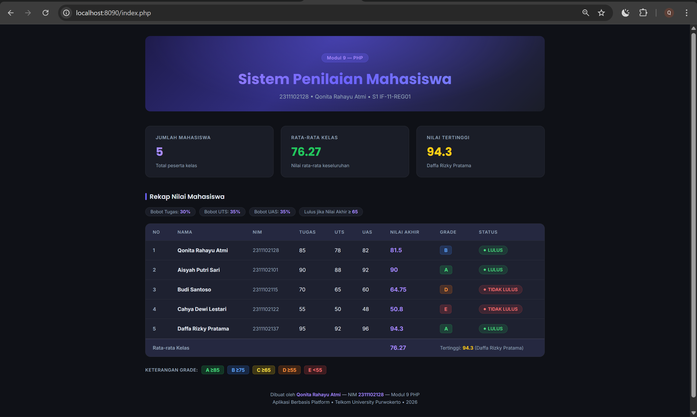

<div align="center">
  <br />
  <h1>LAPORAN PRAKTIKUM <br>APLIKASI BERBASIS PLATFORM</h1>
  <br />
  <h3>MODUL 9 <br> PHP</h3>
  <br />
  <br />
  
  <br />
  <br />
  <br />
  <h3>Disusun Oleh :</h3>
  <p>
    <strong>Qonita Rahayu Atmi</strong><br>
    <strong>2311102128</strong><br>
    <strong>S1 IF-11-REG01</strong><br>
  </p>
  <br />
  <h3>Dosen Pengampu :</h3>
  <p>
    <strong>Dimas Fanny Hebrasianto Permadi, S.ST., M.Kom</strong>
  </p>
  <br />
  <h3>Asisten Praktikum :</h3>
  <p>
    <strong>Apri Pandu Wicaksono</strong><br>
    <strong>Rangga Pradarrell Fathi</strong><br>
  </p>
  <br />
  <h3>LABORATORIUM HIGH PERFORMANCE<br>FAKULTAS INFORMATIKA <br>TELKOM UNIVERSITY PURWOKERTO <br>2026</h3>
</div>

---

# A. Dasar Teori

- **PHP (Hypertext Preprocessor)** adalah  bahasa pelengkap  HTML  yang  memungkinkan  dibuatnya aplikasi    dinamis    yang    memungkinkan    adanya pengolahan data dan pemrosesan data. Semua sintaxyang  diberikan  akan  sepenuhnya  dijalankan  pada server sedangkan yang dikirimkan ke browserhanya hasilnya     saja. Kemudian     merupakan     bahasa berbentuk scriptyang ditempatkan dalam serverdan diproses  di server.  Hasilnya  akan  dikirimkan  ke client, tempat  pemakai  menggunakan browser.  PHP dikenal   sebagai   sebuah   bahasa scripting,   yang menyatu dengan tag-tag HTML, dieksekusi di server, dan  digunakan  untuk  membuat  halaman  web  yang dinamis  seperti  halnya Active  Server  Pages(ASP) atau Java   Server   Pages(JSP).   PHP   merupakan sebuah software Open Source.

- **Array** adalah tipe data terstruktur yang digunakan untuk menyimpan sekumpulan data dengan tipe yang sama dalam satu variabel. Data yang tersimpan di dalam array disebut elemen array, dan setiap elemen dapat diakses secara individual menggunakan index.

- **Array Asosiatif** adalah array yang menggunakan string sebagai kunci (key) untuk setiap elemennya. Berbeda dengan array biasa yang menggunakan indeks angka (0, 1, 2, ...), array asosiatif memungkinkan akses data menggunakan nama yang deskriptif seperti `"nama"`, `"nim"`, atau `"nilai_tugas"`. Hal ini membuat kode lebih mudah dibaca dan dipahami.

- **Function (Fungsi)** adalah bagian dari program yang berisi sekumpulan instruksi atau perintah yang dirancang untuk melakukan tugas tertentu dan dapat dipanggil kembali dari program utama. Fungsi dibuat untuk menghindari penulisan kode yang sama secara berulang-ulang sehingga program menjadi lebih terstruktur, mudah dipahami, dan lebih efisien.

- **Operator Aritmatika** digunakan untuk melakukan perhitungan matematika meliputi: penjumlahan (`+`), pengurangan (`-`), perkalian (`*`), pembagian (`/`), dan modulus (`%`). Pada program penilaian, operator `*` digunakan untuk mengalikan nilai dengan bobot dan `+` untuk menjumlahkan hasilnya.

- **Operator Perbandingan** digunakan untuk membandingkan dua nilai dan menghasilkan `true` atau `false`. Operator yang digunakan adalah `>=` (lebih besar atau sama dengan) untuk membandingkan nilai akhir dengan ambang batas kelulusan dan batas rentang grade.

- **Struktur Kendali if/else** memungkinkan program menjalankan blok kode yang berbeda berdasarkan kondisi. Pernyataan `if` dieksekusi jika kondisi bernilai `true`, sedangkan `else` dieksekusi jika kondisi bernilai `false`. `elseif` digunakan untuk menambahkan kondisi tambahan di antara keduanya.

---

# B. Soal

## Deskripsi Tugas

Buat program PHP sederhana untuk menampilkan data beberapa mahasiswa, menghitung nilai akhir, menentukan grade, dan status kelulusan.

## Ketentuan & Penjelasan Implementasi

### 1. Gunakan Array Asosiatif untuk menyimpan minimal 3 data mahasiswa

Program menggunakan **array asosiatif multidimensi** yang disimpan di file `data.php`. Setiap elemen array mewakili satu mahasiswa dengan kunci string yang deskriptif, sehingga akses data lebih mudah dibandingkan indeks angka biasa.

```php
// data.php
$mahasiswa = [
    [
        "nama"        => "Qonita Rahayu Atmi",
        "nim"         => "2311102128",
        "nilai_tugas" => 85,
        "nilai_uts"   => 78,
        "nilai_uas"   => 82,
    ],
    // ... dan seterusnya (total 5 mahasiswa)
];
```

Pada kode di atas, variabel `$mahasiswa` merupakan array yang di dalamnya terdapat beberapa elemen, di mana setiap elemen adalah **array asosiatif** yang menyimpan data satu mahasiswa. Setiap pasang `"key" => value` mendefinisikan satu atribut mahasiswa — misalnya `"nama" => "Qonita Rahayu Atmi"` artinya kunci `nama` memiliki nilai `Qonita Rahayu Atmi`. Cara mengakses datanya adalah `$mhs["nama"]`, `$mhs["nim"]`, dan seterusnya.

Program ini menyimpan **5 data mahasiswa** yang masing-masing memiliki 5 atribut: `nama`, `nim`, `nilai_tugas`, `nilai_uts`, dan `nilai_uas`, sehingga memenuhi dan melebihi persyaratan minimal 3 mahasiswa. Penyimpanan data dalam file terpisah (`data.php`) juga memudahkan penambahan atau perubahan data tanpa perlu mengubah logika program di file lain.

---

### 2. Gunakan Function untuk Menghitung Nilai Akhir

Function `hitungNilaiAkhir()` dibuat di file `penilaian.php` untuk menghitung nilai akhir mahasiswa. Fungsi ini menerima tiga parameter nilai (tugas, UTS, UAS) dan mengembalikan hasil perhitungan.

```php
// penilaian.php
function hitungNilaiAkhir($tugas, $uts, $uas) {
    $nilai_akhir = ($tugas * 0.30) + ($uts * 0.35) + ($uas * 0.35);
    return round($nilai_akhir, 2);
}
```

Fungsi `hitungNilaiAkhir()` menggunakan **operator aritmatika** perkalian (`*`) untuk mengalikan setiap nilai dengan bobot persentasenya: nilai tugas dikalikan 0.30 (30%), nilai UTS dikalikan 0.35 (35%), dan nilai UAS dikalikan 0.35 (35%). Selanjutnya operator penjumlahan (`+`) digunakan untuk menjumlahkan ketiga hasil perkalian tersebut menjadi nilai akhir. Fungsi `round($nilai_akhir, 2)` digunakan untuk membulatkan hasil ke 2 angka desimal. Penggunaan fungsi ini memastikan perhitungan dilakukan secara konsisten untuk semua mahasiswa hanya dengan memanggil `hitungNilaiAkhir($mhs["nilai_tugas"], $mhs["nilai_uts"], $mhs["nilai_uas"])` di dalam loop.

---

### 3. Gunakan if/else atau switch untuk Menentukan Grade

Function `tentukanGrade()` menggunakan struktur `if/elseif/else` untuk menentukan grade berdasarkan rentang nilai akhir yang diperoleh mahasiswa.

```php
// penilaian.php
function tentukanGrade($nilai_akhir) {
    if ($nilai_akhir >= 85) {
        return "A";
    } elseif ($nilai_akhir >= 75) {
        return "B";
    } elseif ($nilai_akhir >= 65) {
        return "C";
    } elseif ($nilai_akhir >= 55) {
        return "D";
    } else {
        return "E";
    }
}
```

Struktur `if/elseif/else` pada fungsi ini bekerja secara berurutan dari atas ke bawah. PHP akan memeriksa kondisi pertama (`$nilai_akhir >= 85`) terlebih dahulu — jika terpenuhi, langsung mengembalikan `"A"` dan berhenti memeriksa kondisi berikutnya. Jika tidak, PHP lanjut memeriksa kondisi `elseif` berikutnya, dan seterusnya hingga kondisi `else` yang menangkap semua nilai di bawah 55.

Berikut rentang nilai untuk setiap grade:

| Grade | Syarat Nilai Akhir | Keterangan |
|---|---|---|
| A | ≥ 85 | Sangat Baik |
| B | ≥ 75 dan < 85 | Baik |
| C | ≥ 65 dan < 75 | Cukup |
| D | ≥ 55 dan < 65 | Kurang |
| E | < 55 | Sangat Kurang |

Penentuan grade dilakukan secara bertingkat menggunakan **operator perbandingan** `>=` sehingga setiap nilai akhir hanya akan masuk ke satu kategori grade yang tepat.

---

### 4. Gunakan Operator Perbandingan untuk Menentukan Lulus/Tidak

Function `tentukanStatus()` menggunakan **operator perbandingan** `>=` di dalam struktur `if/else` untuk memutuskan apakah mahasiswa dinyatakan lulus atau tidak lulus.

```php
// penilaian.php
function tentukanStatus($nilai_akhir) {
    if ($nilai_akhir >= 65) {
        return "LULUS";
    } else {
        return "TIDAK LULUS";
    }
}
```

Operator perbandingan `>=` (lebih besar atau sama dengan) pada kondisi `$nilai_akhir >= 65` akan menghasilkan nilai `true` jika nilai akhir mahasiswa sama dengan atau di atas 65, dan `false` jika nilai akhir di bawah 65. Nilai ambang batas kelulusan 65 dipilih karena setara dengan grade C, yaitu batas minimum kelulusan yang umum digunakan.

Contoh penerapannya:
- Qonita (nilai akhir 81.5): `81.5 >= 65` → `true` → **LULUS**
- Budi (nilai akhir 64.75): `64.75 >= 65` → `false` → **TIDAK LULUS**
- Cahya (nilai akhir 50.8): `50.8 >= 65` → `false` → **TIDAK LULUS**

Di dalam loop pada `penilaian.php`, fungsi ini dipanggil setelah nilai akhir dihitung: `$mahasiswa[$key]["status"] = tentukanStatus($na);` sehingga status setiap mahasiswa langsung tersimpan dalam array untuk kemudian ditampilkan di tabel HTML.

---

### 5. Gunakan Loop untuk Menampilkan Seluruh Data

Loop `foreach` digunakan **dua kali** dalam program ini, masing-masing memiliki peran berbeda:

**Loop 1 — di `penilaian.php` untuk memproses data:**

```php
// penilaian.php - Loop untuk memproses data
foreach ($mahasiswa as $key => $mhs) {
    $na = hitungNilaiAkhir($mhs["nilai_tugas"], $mhs["nilai_uts"], $mhs["nilai_uas"]);
    $mahasiswa[$key]["nilai_akhir"] = $na;
    $mahasiswa[$key]["grade"]       = tentukanGrade($na);
    $mahasiswa[$key]["status"]      = tentukanStatus($na);
    $total_nilai += $na;
    if ($na > $nilai_tertinggi) {
        $nilai_tertinggi = $na;
        $nama_tertinggi  = $mhs["nama"];
    }
}
```

Loop pertama menggunakan sintaks `foreach ($mahasiswa as $key => $mhs)` di mana `$key` adalah indeks numerik elemen array dan `$mhs` adalah data satu mahasiswa pada iterasi tersebut. Di setiap iterasi, program: (1) memanggil fungsi `hitungNilaiAkhir()` untuk menghitung nilai akhir, (2) memanggil `tentukanGrade()` dan `tentukanStatus()`, (3) menambahkan hasil ke `$total_nilai` menggunakan operator `+=`, dan (4) membandingkan nilai akhir dengan `$nilai_tertinggi` menggunakan **operator perbandingan** `>` untuk mencatat siapa yang mendapat nilai tertinggi.

**Loop 2 — di `index.php` untuk menampilkan tabel:**

```php
// index.php - Loop untuk menampilkan tabel HTML
<?php
$no = 1;
foreach ($mahasiswa as $mhs) :
    $grade        = $mhs["grade"];
    $status       = $mhs["status"];
    $status_class = ($status === "LULUS") ? "status-lulus" : "status-tidak-lulus";
?>
<tr>
    <td class="rank"><?= $no++ ?></td>
    <td><strong><?= htmlspecialchars($mhs["nama"]) ?></strong></td>
    <td><?= htmlspecialchars($mhs["nim"]) ?></td>
    <td><?= $mhs["nilai_tugas"] ?></td>
    <td><?= $mhs["nilai_uts"] ?></td>
    <td><?= $mhs["nilai_uas"] ?></td>
    <td><?= $mhs["nilai_akhir"] ?></td>
    <td><span class="grade-badge grade-<?= $grade ?>"><?= $grade ?></span></td>
    <td><span class="status-badge <?= $status_class ?>"><?= $status ?></span></td>
</tr>
<?php endforeach; ?>
```

Loop kedua menggunakan sintaks alternatif `foreach (...) : ... endforeach;` yang lebih mudah dibaca di dalam template HTML. Setiap iterasi menghasilkan satu baris `<tr>` yang berisi data lengkap satu mahasiswa. Variabel `$no++` digunakan untuk menampilkan nomor urut yang otomatis bertambah di setiap baris. Fungsi `htmlspecialchars()` dipanggil untuk setiap output string guna mencegah karakter HTML khusus diinterpretasi sebagai kode oleh browser.

---

### 6. Tampilkan Hasil dalam Bentuk Tabel HTML

Hasil ditampilkan dalam elemen `<table>` HTML yang terstruktur, terdiri dari tiga bagian utama: `<thead>` (header kolom), `<tbody>` (isi data), dan `<tfoot>` (baris ringkasan) di file `index.php`.

```html
<!-- index.php -->
<div class="table-wrap">
    <table>
        <thead>
            <tr>
                <th>NO</th>
                <th>Nama</th>
                <th>NIM</th>
                <th>Tugas</th>
                <th>UTS</th>
                <th>UAS</th>
                <th>Nilai Akhir</th>
                <th>Grade</th>
                <th>Status</th>
            </tr>
        </thead>
        <tbody>
            <!-- Diisi secara dinamis oleh loop foreach -->
        </tbody>
        <tfoot>
            <tr>
                <td colspan="6">Rata-rata Kelas</td>
                <td><?= $rata_rata ?></td>
                <td colspan="2">Tertinggi: <?= $nilai_tertinggi ?> (<?= $nama_tertinggi ?>)</td>
            </tr>
        </tfoot>
    </table>
</div>
```

Struktur tabel dibagi menjadi tiga bagian HTML semantik yang masing-masing memiliki fungsi berbeda:
- **`<thead>`**: Berisi satu baris `<tr>` dengan 9 elemen `<th>` yang mendefinisikan nama-nama kolom tabel. Elemen `<th>` secara otomatis ditampilkan tebal dan digunakan sebagai header kolom.
- **`<tbody>`**: Bagian isi tabel yang diisi secara dinamis oleh loop `foreach`. Setiap iterasi menghasilkan satu baris `<tr>` yang berisi Nama, NIM, nilai Tugas, UTS, UAS, Nilai Akhir, Grade, dan Status masing-masing mahasiswa.
- **`<tfoot>`**: Baris ringkasan di bagian bawah tabel yang menampilkan **rata-rata kelas** dan **nilai tertinggi** beserta nama mahasiswanya — memenuhi output minimal yang dipersyaratkan.

Selain tabel, program juga menampilkan **tiga stat card** di bagian atas yang merangkum: jumlah mahasiswa, rata-rata kelas, dan nilai tertinggi secara lebih menonjol secara visual. Dengan demikian seluruh output minimal yang dipersyaratkan — Nama, NIM, Nilai Akhir, Grade, Status, Rata-rata Kelas, dan Nilai Tertinggi — telah terpenuhi.

---

# C. Kode Program

## 1. `data.php` — Array Asosiatif Data Mahasiswa

```php
<?php
/* ============================================================
   2311102128 - Qonita Rahayu Atmi
   ============================================================ */
$mahasiswa = [
    [
        "nama"        => "Qonita Rahayu Atmi",
        "nim"         => "2311102128",
        "nilai_tugas" => 85,
        "nilai_uts"   => 78,
        "nilai_uas"   => 82,
    ],
    [
        "nama"        => "Aisyah Putri Sari",
        "nim"         => "2311102101",
        "nilai_tugas" => 90,
        "nilai_uts"   => 88,
        "nilai_uas"   => 92,
    ],
    [
        "nama"        => "Budi Santoso",
        "nim"         => "2311102115",
        "nilai_tugas" => 70,
        "nilai_uts"   => 65,
        "nilai_uas"   => 60,
    ],
    [
        "nama"        => "Cahya Dewi Lestari",
        "nim"         => "2311102122",
        "nilai_tugas" => 55,
        "nilai_uts"   => 50,
        "nilai_uas"   => 48,
    ],
    [
        "nama"        => "Daffa Rizky Pratama",
        "nim"         => "2311102137",
        "nilai_tugas" => 95,
        "nilai_uts"   => 92,
        "nilai_uas"   => 96,
    ],
];
```

**Penjelasan `data.php`:**
- Pada baris 1–4, terdapat tag pembuka `<?php` yang menandakan awal skrip PHP, serta komentar yang digunakan sebagai identitas atau keterangan kode program. Komentar tersebut berisi NIM (2311102128) dan nama penulis (Qonita Rahayu Atmi) sehingga memudahkan identifikasi pembuat program.
- Pada baris 5, variabel `$mahasiswa` dideklarasikan sebagai array yang akan digunakan untuk menyimpan kumpulan data mahasiswa.
- Pada baris 6–38, dibuat sebuah array multidimensi yang berisi beberapa data mahasiswa. Setiap elemen array merepresentasikan satu mahasiswa dan ditulis menggunakan tanda kurung siku [ ].
- Pada baris 7–12, elemen array pertama berisi data mahasiswa dengan atribut nama, NIM, nilai tugas, nilai UTS, dan nilai UAS. Data tersebut disimpan dalam bentuk array asosiatif dengan pasangan key => value.
- Pada baris 13–18, elemen array kedua menyimpan data mahasiswa Aisyah Putri Sari beserta NIM dan nilai akademiknya.
- Pada baris 19–24, elemen array ketiga menyimpan data mahasiswa Budi Santoso dengan nilai tugas, UTS, dan UAS yang berbeda dari mahasiswa lainnya.
- Pada baris 25–30, elemen array keempat menyimpan data mahasiswa Cahya Dewi Lestari yang memiliki nilai tugas, UTS, dan UAS relatif lebih rendah.
- Pada baris 31–36, elemen array kelima menyimpan data mahasiswa Daffa Rizky Pratama dengan nilai tugas, UTS, dan UAS yang tinggi.
---

## 2. `penilaian.php` — Functions & Proses Data

```php
<?php
// ============================================================
// 2311102128 - Qonita Rahayu Atmi
// ============================================================

require_once 'data.php'; // Array asosiatif $mahasiswa

// Fungsi untuk menghitung nilai akhir
function hitungNilaiAkhir($tugas, $uts, $uas) {
    $nilai_akhir = ($tugas * 0.30) + ($uts * 0.35) + ($uas * 0.35);
    return round($nilai_akhir, 2);
}

// Fungsi untuk menentukan grade
function tentukanGrade($nilai_akhir) {
    if ($nilai_akhir >= 85) {
        return "A";
    } elseif ($nilai_akhir >= 75) {
        return "B";
    } elseif ($nilai_akhir >= 65) {
        return "C";
    } elseif ($nilai_akhir >= 55) {
        return "D";
    } else {
        return "E";
    }
}

// Fungsi untuk menentukan status lulus/tidak
function tentukanStatus($nilai_akhir) {
    if ($nilai_akhir >= 65) {
        return "LULUS";
    } else {
        return "TIDAK LULUS";
    }
}

// ============================================================
// PROSES DATA & HITUNG STATISTIK
// ============================================================

$total_nilai     = 0;
$nilai_tertinggi = 0;
$nama_tertinggi  = "";

foreach ($mahasiswa as $key => $mhs) {
    $na = hitungNilaiAkhir($mhs["nilai_tugas"], $mhs["nilai_uts"], $mhs["nilai_uas"]);
    $mahasiswa[$key]["nilai_akhir"] = $na;

    $mahasiswa[$key]["grade"] = tentukanGrade($na);

    $mahasiswa[$key]["status"] = tentukanStatus($na);
    $total_nilai += $na;
    if ($na > $nilai_tertinggi) {
        $nilai_tertinggi = $na;
        $nama_tertinggi  = $mhs["nama"];
    }
}

$jumlah_mahasiswa = count($mahasiswa);
$rata_rata        = round($total_nilai / $jumlah_mahasiswa, 2);
```

**Penjelasan `penilaian.php`:**
- Pada baris 6, perintah `require_once 'data.php';` digunakan untuk memanggil file `data.php` yang berisi array `$mahasiswa` sehingga data mahasiswa dapat digunakan dalam program.
- Pada baris 9–12, dibuat fungsi `hitungNilaiAkhir($tugas, $uts, $uas)` yang berfungsi untuk menghitung nilai akhir mahasiswa berdasarkan bobot 30% nilai tugas, 35% nilai UTS, dan 35% nilai UAS. Hasil perhitungan disimpan pada variabel `$nilai_akhir` lalu dikembalikan menggunakan `return` setelah dibulatkan dengan fungsi `round()`.
- Pada baris 15–25, dibuat fungsi `tentukanGrade($nilai_akhir)` yang digunakan untuk menentukan grade nilai mahasiswa. Penentuan grade dilakukan menggunakan percabangan `if` dan `elseif` berdasarkan rentang nilai akhir.
- Pada baris 28–34, dibuat fungsi `tentukanStatus($nilai_akhir)` yang berfungsi untuk menentukan status kelulusan mahasiswa. Jika nilai akhir lebih besar atau sama dengan 65 maka statusnya LULUS, jika kurang dari 65 maka TIDAK LULUS.
- Pada baris 42–44, dideklarasikan beberapa variabel yaitu `$total_nilai` untuk menyimpan jumlah seluruh nilai akhir mahasiswa, `$nilai_tertinggi` untuk menyimpan nilai akhir tertinggi, dan `$nama_tertinggi` untuk menyimpan nama mahasiswa dengan nilai tertinggi.
- Pada baris 46–57, digunakan perulangan `foreach` untuk memproses setiap data mahasiswa yang terdapat dalam array `$mahasiswa`.
- Pada baris 47, fungsi `hitungNilaiAkhir()` dipanggil untuk menghitung nilai akhir dari nilai tugas, UTS, dan UAS yang dimiliki setiap mahasiswa.
- Pada baris 48, nilai akhir yang diperoleh disimpan kembali ke dalam array `$mahasiswa` dengan key `nilai_akhir`.
- Pada baris 50, fungsi `tentukanGrade()` digunakan untuk menentukan grade berdasarkan nilai akhir dan hasilnya disimpan dalam key `grade`.
- Pada baris 52, fungsi `tentukanStatus()` digunakan untuk menentukan status kelulusan mahasiswa dan hasilnya disimpan dalam key `status`.
- Pada baris 53, nilai akhir mahasiswa ditambahkan ke variabel `$total_nilai` untuk menghitung total nilai akhir seluruh mahasiswa.
- Pada baris 54–57, dilakukan pengecekan untuk menentukan nilai tertinggi. Jika nilai akhir lebih besar dari nilai tertinggi sebelumnya, maka nilai tersebut disimpan sebagai `$nilai_tertinggi` dan nama mahasiswa disimpan pada `$nama_tertinggi`.
- Pada baris 60, fungsi `count($mahasiswa)` digunakan untuk menghitung jumlah data mahasiswa yang ada di dalam array.
- Pada baris 61, nilai rata-rata kelas dihitung dengan membagi `$total_nilai` dengan jumlah mahasiswa, kemudian hasilnya dibulatkan menggunakan fungsi `round()` dan disimpan dalam variabel `$rata_rata`.


---

## 3. `index.php` — Tampilan HTML

```php
<?php require_once 'penilaian.php'; ?>
<!DOCTYPE html>
<html lang="id">
<head>
    <meta charset="UTF-8">
    <meta name="viewport" content="width=device-width, initial-scale=1.0">
    <meta name="description" content="Sistem Penilaian Mahasiswa - Modul 9 PHP - Qonita Rahayu Atmi">
    <title>Sistem Penilaian Mahasiswa | Modul 9 PHP</title>
    <link rel="stylesheet" href="style.css">
</head>
<body>

<div style="max-width:1100px; margin:0 auto;">

    <!-- Hero -->
    <div class="hero">
        <div class="badge">Modul 9 &mdash; PHP</div>
        <h1>Sistem Penilaian Mahasiswa</h1>
        <p>2311102128 &bull; Qonita Rahayu Atmi &bull; S1 IF-11-REG01</p>
    </div>

    <!-- Stat Cards -->
    <div class="stat-grid">
        <div class="stat-card purple">
            <div class="label">Jumlah Mahasiswa</div>
            <div class="value"><?= $jumlah_mahasiswa ?></div>
            <div class="sub">Total peserta kelas</div>
        </div>
        <div class="stat-card green">
            <div class="label">Rata-rata Kelas</div>
            <div class="value"><?= $rata_rata ?></div>
            <div class="sub">Nilai rata-rata keseluruhan</div>
        </div>
        <div class="stat-card yellow">
            <div class="label">Nilai Tertinggi</div>
            <div class="value"><?= $nilai_tertinggi ?></div>
            <div class="sub"><?= htmlspecialchars($nama_tertinggi) ?></div>
        </div>
    </div>

    <!-- Bobot Penilaian -->
    <p class="section-title">Rekap Nilai Mahasiswa</p>
    <div class="bobot-info">
        <div class="bobot-chip">Bobot Tugas: <strong>30%</strong></div>
        <div class="bobot-chip">Bobot UTS: <strong>35%</strong></div>
        <div class="bobot-chip">Bobot UAS: <strong>35%</strong></div>
        <div class="bobot-chip">Lulus jika Nilai Akhir &ge; <strong>65</strong></div>
    </div>

    <!-- Tabel HTML -->
    <div class="table-wrap">
        <table>
            <thead>
                <tr>
                    <th>NO</th>
                    <th>Nama</th>
                    <th>NIM</th>
                    <th>Tugas</th>
                    <th>UTS</th>
                    <th>UAS</th>
                    <th>Nilai Akhir</th>
                    <th>Grade</th>
                    <th>Status</th>
                </tr>
            </thead>
            <tbody>
                <?php
                $no = 1;
                foreach ($mahasiswa as $mhs) :
                    $grade        = $mhs["grade"];
                    $status       = $mhs["status"];
                    $status_class = ($status === "LULUS") ? "status-lulus" : "status-tidak-lulus";
                ?>
                <tr>
                    <td class="rank"><?= $no++ ?></td>
                    <td><strong><?= htmlspecialchars($mhs["nama"]) ?></strong></td>
                    <td style="color:var(--text-muted); font-size:.85rem;"><?= htmlspecialchars($mhs["nim"]) ?></td>
                    <td><?= $mhs["nilai_tugas"] ?></td>
                    <td><?= $mhs["nilai_uts"] ?></td>
                    <td><?= $mhs["nilai_uas"] ?></td>
                    <td><span class="na-value"><?= $mhs["nilai_akhir"] ?></span></td>
                    <td>
                        <span class="grade-badge grade-<?= $grade ?>"><?= $grade ?></span>
                    </td>
                    <td>
                        <span class="status-badge <?= $status_class ?>">
                            <span class="dot"></span>
                            <?= $status ?>
                        </span>
                    </td>
                </tr>
                <?php endforeach; ?>
            </tbody>
            <tfoot>
                <tr style="background:var(--bg-header); border-top: 2px solid var(--border);">
                    <td colspan="6" style="padding:.9rem 1.25rem; font-weight:600; color:var(--text-muted); font-size:.85rem;">
                        Rata-rata Kelas
                    </td>
                    <td><span class="na-value"><?= $rata_rata ?></span></td>
                    <td colspan="2" style="color:var(--text-muted); font-size:.82rem;">
                        Tertinggi: <strong style="color:var(--yellow)"><?= $nilai_tertinggi ?></strong>
                        (<?= htmlspecialchars($nama_tertinggi) ?>)
                    </td>
                </tr>
            </tfoot>
        </table>
    </div>

    <div class="legend">
        <span class="legend-title">Keterangan Grade:</span>
        <span class="grade-badge grade-A">A &ge;85</span>
        <span class="grade-badge grade-B">B &ge;75</span>
        <span class="grade-badge grade-C">C &ge;65</span>
        <span class="grade-badge grade-D">D &ge;55</span>
        <span class="grade-badge grade-E">E &lt;55</span>
    </div>

    <footer>
        <p>Dibuat oleh <span>Qonita Rahayu Atmi</span> &mdash; NIM <span>2311102128</span> &mdash; Modul 9 PHP</p>
        <p style="margin-top:.3rem;">Aplikasi Berbasis Platform &bull; Telkom University Purwokerto &bull; 2026</p>
    </footer>

</div>

</body>
</html>

```

**Penjelasan `index.php`:**
- Pada baris 1, perintah `require_once 'penilaian.php';` digunakan untuk memanggil file **penilaian.php** yang berisi proses perhitungan nilai mahasiswa seperti nilai akhir, grade, status kelulusan, jumlah mahasiswa, rata-rata nilai, serta nilai tertinggi.
- Pada baris 2–10, dituliskan struktur dasar **dokumen HTML** yang terdiri dari deklarasi `<!DOCTYPE html>`, tag `<html>` dengan atribut `lang="id"` sebagai penanda bahasa Indonesia, serta bagian `<head>` yang berisi pengaturan karakter (`UTF-8`), pengaturan tampilan responsif (`viewport`), deskripsi halaman, judul halaman, dan pemanggilan file **`style.css`** untuk mengatur tampilan halaman.
- Pada baris 12–14, elemen `<body>` dimulai dan dibuat sebuah `<div>` utama dengan pengaturan lebar maksimum dan posisi tengah halaman menggunakan style `max-width:1100px; margin:0 auto;`.
- Pada baris 16–20, elemen `<div class="hero">` digunakan sebagai **bagian header atau hero section** yang menampilkan informasi utama halaman, yaitu badge modul, judul **Sistem Penilaian Mahasiswa**, serta identitas mahasiswa (NIM, nama, dan kelas).
- Pada baris 23–40, elemen `<div class="stat-grid">` berfungsi sebagai **wadah kartu statistik** yang menampilkan ringkasan informasi nilai, yaitu jumlah mahasiswa, rata-rata kelas, dan nilai tertinggi. Nilai-nilai tersebut ditampilkan menggunakan **PHP echo singkat `<?= ?>`** yang mengambil data dari variabel `$jumlah_mahasiswa`, `$rata_rata`, `$nilai_tertinggi`, dan `$nama_tertinggi`.
- Pada baris 42–49, ditampilkan bagian **informasi bobot penilaian** menggunakan elemen `<p>` dan `<div>` dengan beberapa `<div class="bobot-chip">` yang menunjukkan bobot penilaian tugas (30%), UTS (35%), UAS (35%), serta syarat kelulusan yaitu nilai akhir minimal 65.
- Pada baris 52–66, dibuat struktur tabel menggunakan elemen `<table>`, `<thead>`, dan `<tr>` untuk menampilkan **header tabel** yang berisi kolom nomor, nama mahasiswa, NIM, nilai tugas, nilai UTS, nilai UAS, nilai akhir, grade, dan status kelulusan.
- Pada baris 67–73, bagian `<tbody>` dimulai dengan kode **PHP** yang mendeklarasikan variabel `$no = 1` sebagai nomor urut, lalu menggunakan perulangan `foreach ($mahasiswa as $mhs)` untuk menampilkan data mahasiswa satu per satu dari array `$mahasiswa`.
- Pada baris 71–73, variabel `$grade` dan `$status` diambil dari data mahasiswa, kemudian dibuat variabel `$status_class` menggunakan operator ternary untuk menentukan kelas CSS berdasarkan status kelulusan apakah **LULUS** atau **TIDAK LULUS**.
- Pada baris 75–93, dibuat baris tabel `<tr>` yang menampilkan data setiap mahasiswa. Data seperti nama, NIM, nilai tugas, nilai UTS, nilai UAS, nilai akhir, grade, dan status diambil dari array `$mhs`. Fungsi `htmlspecialchars()` digunakan untuk menghindari masalah keamanan saat menampilkan teks ke HTML.
- Pada baris 82–87, ditampilkan nilai akhir dan grade mahasiswa. Grade ditampilkan menggunakan elemen `<span>` dengan kelas CSS dinamis `grade-<?= $grade ?>` sehingga warna tampilan dapat menyesuaikan dengan grade yang diperoleh.
- Pada baris 88–92, status kelulusan mahasiswa ditampilkan menggunakan `<span class="status-badge">` dengan tambahan kelas CSS yang ditentukan oleh `$status_class`, serta ikon titik kecil menggunakan `<span class="dot">`.
- Pada baris 94, perulangan `foreach` diakhiri menggunakan `endforeach;` sehingga semua data mahasiswa telah ditampilkan dalam tabel.
- Pada baris 96–107, bagian `<tfoot>` digunakan untuk menampilkan **ringkasan tabel**, yaitu rata-rata kelas serta nilai tertinggi beserta nama mahasiswa yang memperoleh nilai tersebut.
- Pada baris 110–116, dibuat bagian **legend atau keterangan grade** yang menjelaskan rentang nilai untuk setiap grade dari A hingga E menggunakan elemen `<span>`.
- Pada baris 118–121, elemen `<footer>` digunakan untuk menampilkan informasi pembuat aplikasi, yaitu nama **Qonita Rahayu Atmi**, NIM **2311102128**, serta keterangan bahwa aplikasi dibuat untuk **Modul 9 PHP di Telkom University Purwokerto**.
- Pada baris 123–124, dokumen HTML ditutup dengan tag `</body>` dan `</html>` yang menandakan akhir dari struktur halaman web.


---

## 4. `style.css` — Styling CSS 

```css
/* ============================================================
   2311102128 - Qonita Rahayu Atmi
   ============================================================ */

@import url('https://fonts.googleapis.com/css2?family=Inter:wght@300;400;500;600;700&family=Poppins:wght@400;600;700&display=swap');

*, *::before, *::after { box-sizing: border-box; margin: 0; padding: 0; }

:root {
    --bg-main:    #0f1117;
    --bg-card:    #1a1d27;
    --bg-table:   #1e2130;
    --bg-header:  #252840;
    --accent:     #6c63ff;
    --accent-2:   #a78bfa;
    --green:      #22c55e;
    --red:        #ef4444;
    --yellow:     #facc15;
    --text-main:  #e2e8f0;
    --text-muted: #94a3b8;
    --border:     rgba(255,255,255,0.08);
    --radius:     14px;
}

body {
    font-family: 'Inter', sans-serif;
    background: var(--bg-main);
    color: var(--text-main);
    min-height: 100vh;
    padding: 2rem 1rem 4rem;
}

/* ---- Hero ---- */
.hero {
    text-align: center;
    padding: 3rem 1rem 2rem;
    background: linear-gradient(135deg, #1e1b4b 0%, #312e81 40%, #1a1d27 100%);
    border-radius: var(--radius);
    margin-bottom: 2.5rem;
    position: relative;
    overflow: hidden;
}
.hero::before {
    content: '';
    position: absolute;
    inset: 0;
    background: radial-gradient(ellipse at 50% 0%, rgba(108,99,255,.35) 0%, transparent 70%);
}
.hero h1 {
    font-family: 'Poppins', sans-serif;
    font-size: clamp(1.6rem, 4vw, 2.5rem);
    font-weight: 700;
    background: linear-gradient(90deg, #a78bfa, #6c63ff, #818cf8);
    -webkit-background-clip: text;
    -webkit-text-fill-color: transparent;
    background-clip: text;
    position: relative;
}
.hero p {
    color: var(--text-muted);
    margin-top: .6rem;
    font-size: .95rem;
    position: relative;
}
.hero .badge {
    display: inline-block;
    background: rgba(108,99,255,.25);
    border: 1px solid rgba(108,99,255,.4);
    color: var(--accent-2);
    padding: .25rem .9rem;
    border-radius: 99px;
    font-size: .78rem;
    font-weight: 600;
    letter-spacing: .5px;
    margin-bottom: 1rem;
    position: relative;
}

/* ---- Stat Cards ---- */
.stat-grid {
    display: grid;
    grid-template-columns: repeat(auto-fit, minmax(220px, 1fr));
    gap: 1.25rem;
    margin-bottom: 2.5rem;
}
.stat-card {
    background: var(--bg-card);
    border: 1px solid var(--border);
    border-radius: var(--radius);
    padding: 1.5rem 1.75rem;
    transition: transform .25s, box-shadow .25s;
}
.stat-card:hover {
    transform: translateY(-4px);
    box-shadow: 0 12px 32px rgba(0,0,0,.4);
}
.stat-card .label {
    font-size: .78rem;
    font-weight: 600;
    text-transform: uppercase;
    letter-spacing: 1px;
    color: var(--text-muted);
    margin-bottom: .5rem;
}
.stat-card .value {
    font-size: 2rem;
    font-weight: 700;
    font-family: 'Poppins', sans-serif;
}
.stat-card .sub {
    font-size: .8rem;
    color: var(--text-muted);
    margin-top: .3rem;
}
.stat-card.purple .value { color: var(--accent-2); }
.stat-card.green  .value { color: var(--green); }
.stat-card.yellow .value { color: var(--yellow); }

/* ---- Section Title ---- */
.section-title {
    font-family: 'Poppins', sans-serif;
    font-size: 1.1rem;
    font-weight: 600;
    color: var(--text-main);
    margin-bottom: 1rem;
    display: flex;
    align-items: center;
    gap: .5rem;
}
.section-title::before {
    content: '';
    display: inline-block;
    width: 4px;
    height: 1.1em;
    background: var(--accent);
    border-radius: 2px;
}

/* ---- Bobot Info ---- */
.bobot-info {
    display: flex;
    flex-wrap: wrap;
    gap: .6rem;
    margin-bottom: 1.25rem;
}
.bobot-chip {
    background: var(--bg-card);
    border: 1px solid var(--border);
    border-radius: 99px;
    padding: .25rem .85rem;
    font-size: .78rem;
    color: var(--text-muted);
}
.bobot-chip strong { color: var(--accent-2); }

/* ---- Table ---- */
.table-wrap {
    background: var(--bg-table);
    border: 1px solid var(--border);
    border-radius: var(--radius);
    overflow-x: auto;
}
table {
    width: 100%;
    border-collapse: collapse;
    font-size: .9rem;
}
thead th {
    background: var(--bg-header);
    padding: 1rem 1.25rem;
    text-align: left;
    font-size: .75rem;
    font-weight: 600;
    text-transform: uppercase;
    letter-spacing: .8px;
    color: var(--text-muted);
    border-bottom: 1px solid var(--border);
    white-space: nowrap;
}
tbody tr {
    border-bottom: 1px solid var(--border);
    transition: background .2s;
}
tbody tr:last-child { border-bottom: none; }
tbody tr:hover { background: rgba(255,255,255,.04); }
td {
    padding: .9rem 1.25rem;
    vertical-align: middle;
}
.rank {
    font-weight: 700;
    color: var(--text-muted);
    font-size: .85rem;
}
.na-value {
    font-weight: 700;
    color: var(--accent-2);
    font-size: 1rem;
}

/* ---- Grade Badge ---- */
.grade-badge {
    display: inline-block;
    padding: .2rem .7rem;
    border-radius: 6px;
    font-weight: 700;
    font-size: .85rem;
    min-width: 2rem;
    text-align: center;
}
.grade-A { background: rgba(34,197,94,.2);  color: #4ade80; border: 1px solid rgba(34,197,94,.3); }
.grade-B { background: rgba(59,130,246,.2); color: #60a5fa; border: 1px solid rgba(59,130,246,.3); }
.grade-C { background: rgba(250,204,21,.2); color: #fde047; border: 1px solid rgba(250,204,21,.3); }
.grade-D { background: rgba(249,115,22,.2); color: #fb923c; border: 1px solid rgba(249,115,22,.3); }
.grade-E { background: rgba(239,68,68,.2);  color: #f87171; border: 1px solid rgba(239,68,68,.3); }

/* ---- Status Badge ---- */
.status-badge {
    display: inline-flex;
    align-items: center;
    gap: .35rem;
    padding: .25rem .8rem;
    border-radius: 99px;
    font-size: .78rem;
    font-weight: 600;
}
.status-lulus       { background: rgba(34,197,94,.15);  color: #4ade80; border: 1px solid rgba(34,197,94,.3); }
.status-tidak-lulus { background: rgba(239,68,68,.15);  color: #f87171; border: 1px solid rgba(239,68,68,.3); }
.dot { width: 6px; height: 6px; border-radius: 50%; }
.status-lulus       .dot { background: #4ade80; }
.status-tidak-lulus .dot { background: #f87171; }

/* ---- Legend ---- */
.legend {
    margin-top: 1.5rem;
    display: flex;
    flex-wrap: wrap;
    gap: .6rem;
    align-items: center;
}
.legend-title {
    font-size: .78rem;
    color: var(--text-muted);
    font-weight: 600;
    text-transform: uppercase;
    letter-spacing: .5px;
}

/* ---- Footer ---- */
footer {
    text-align: center;
    margin-top: 3rem;
    color: var(--text-muted);
    font-size: .8rem;
}
footer span { color: var(--accent-2); font-weight: 600; }

```

**Penjelasan `style.css`:**
- Pada baris 5, perintah `@import` digunakan untuk **mengambil font dari Google Fonts**, yaitu **Inter** dan **Poppins**, yang akan digunakan sebagai font utama dalam tampilan halaman web.
- Pada baris 7–8, selector `*, *::before, *::after` digunakan untuk melakukan **reset CSS**, yaitu mengatur `box-sizing: border-box` serta menghapus margin dan padding bawaan browser agar tata letak elemen lebih konsisten di berbagai browser.
- Pada baris 10–23, pseudo-class `:root` digunakan untuk **mendefinisikan variabel CSS** yang berisi berbagai pengaturan warna, border, dan radius. Variabel ini memudahkan pengaturan tema dan menjaga konsistensi desain pada seluruh elemen halaman.
- Pada baris 25–31, selector `body` digunakan untuk mengatur **tampilan dasar halaman**, termasuk penggunaan font **Inter**, warna latar belakang utama, warna teks, tinggi minimum halaman, serta padding agar tidak menempel pada tepi layar.
- Pada baris 33–48, selector `.hero` dan pseudo-element `.hero::before` digunakan untuk membuat **bagian header atau hero section** dengan teks di tengah, latar belakang gradasi warna, sudut membulat, serta efek cahaya radial dekoratif di bagian atas.
- Pada baris 49–63, selector `.hero h1` dan `.hero p` digunakan untuk mengatur **tampilan judul dan deskripsi pada bagian hero**, termasuk penggunaan font **Poppins**, ukuran font responsif, efek teks gradasi, serta warna teks yang lebih lembut untuk deskripsi.
- Pada baris 64–75, selector `.hero .badge` digunakan untuk membuat **label kecil berbentuk kapsul** yang menampilkan informasi modul dengan background transparan, border, warna aksen, serta padding yang rapi.
- Pada baris 78–105, selector `.stat-grid`, `.stat-card`, `.stat-card:hover`, serta elemen `.label`, `.value`, dan `.sub` digunakan untuk membuat **kartu statistik** yang menampilkan informasi seperti jumlah mahasiswa, rata-rata nilai, dan nilai tertinggi dengan tata letak grid yang responsif dan efek animasi saat hover.
- Pada baris 108–118, selector `.section-title` dan `.section-title::before` digunakan untuk membuat **judul bagian** yang menampilkan teks dengan font lebih tegas serta tambahan garis dekoratif di sebelah kiri judul.
- Pada baris 121–130, selector `.bobot-info`, `.bobot-chip`, dan `.bobot-chip strong` digunakan untuk membuat **elemen informasi bobot penilaian** yang ditampilkan dalam bentuk label kecil berbentuk kapsul yang menjelaskan persentase bobot tugas, UTS, UAS, serta syarat kelulusan.
- Pada baris 133–173, selector `.table-wrap`, `table`, `thead th`, `tbody tr`, `td`, `.rank`, dan `.na-value` digunakan untuk mengatur **tampilan tabel data mahasiswa**, termasuk pembungkus tabel, header tabel, baris data, efek hover pada baris, serta tampilan khusus untuk nomor urut dan nilai akhir.
- Pada baris 176–188, selector `.grade-badge` serta `.grade-A`, `.grade-B`, `.grade-C`, `.grade-D`, dan `.grade-E` digunakan untuk membuat **badge nilai grade** dengan warna berbeda untuk setiap kategori nilai.
- Pada baris 191–207, selector `.status-badge`, `.status-lulus`, `.status-tidak-lulus`, dan `.dot` digunakan untuk membuat **badge status kelulusan mahasiswa**, lengkap dengan indikator titik kecil dan warna yang berbeda antara status lulus dan tidak lulus.
- Pada baris 210–216, selector `.legend` dan `.legend-title` digunakan untuk menampilkan **keterangan grade**, yang menjelaskan rentang nilai untuk setiap kategori grade.
- Pada baris 219–224, selector `footer` dan `footer span` digunakan untuk mengatur **tampilan bagian footer**, termasuk teks yang berada di tengah, warna teks, serta warna aksen pada nama atau informasi penting.

---

## D. Hasil Tampilan (Screenshot)



---

## E. Kesimpulan

Berdasarkan hasil praktikum Modul 9, program PHP **Sistem Penilaian Mahasiswa** terdapat  4 file yang masing-masing memiliki tanggung jawab berbeda: `data.php` array asosiatif, `penilaian.php` sebagai logika dan fungsi, `index.php` sebagai tampilan HTML, dan `style.css` sebagai styling halaman.

Seluruh ketentuan tugas berhasil diimplementasikan. **Array asosiatif multidimensi** digunakan di `data.php` untuk menyimpan data 5 mahasiswa, melebihi persyaratan minimal 3 mahasiswa, dengan 5 atribut per mahasiswa (`nama`, `nim`, `nilai_tugas`, `nilai_uts`, `nilai_uas`) yang dapat diakses menggunakan kunci string yang deskriptif. Tiga **function** PHP dibuat di `penilaian.php`: `hitungNilaiAkhir()` menggunakan **operator aritmatika** (`*` dan `+`) untuk menghitung nilai akhir berdasarkan bobot Tugas 30%, UTS 35%, UAS 35%; `tentukanGrade()` menggunakan struktur **`if/elseif/else`** dengan **operator perbandingan** `>=` untuk menentukan grade A hingga E; dan `tentukanStatus()` menggunakan **operator perbandingan** `>=` dengan batas nilai 65 untuk memutuskan status LULUS atau TIDAK LULUS.

**Loop `foreach`** digunakan dua kali dengan peran berbeda: pertama di `penilaian.php` untuk memproses setiap data mahasiswa (menghitung nilai, menentukan grade dan status, serta menghitung statistik kelas), dan kedua di `index.php` untuk menghasilkan baris tabel HTML secara dinamis dari setiap elemen array mahasiswa. Seluruh output minimal yang dipersyaratkan — Nama, NIM, Nilai Akhir, Grade, Status, Rata-rata Kelas (76.27), dan Nilai Tertinggi (94.3 oleh Daffa Rizky Pratama) — ditampilkan secara lengkap dalam tabel HTML yang responsif dengan desain *dark theme* profesional menggunakan CSS murni.

## F. Referensi

- [Materi Modul 9 - PHP](https://drive.google.com/file/d/1Fgj2rbye0s7QZ5VBigpSiTyPBl8TjpKB/view?usp=sharing)
- [R. Hermiati, A. Asnawati, dan I. Kanedi, “Pembuatan E-Commerce pada Raja Komputer Menggunakan Bahasa Pemrograman PHP dan Database MySQL,” Jurnal Media Infotama, vol. 17, no. 1, Feb. 2021.](https://jurnal.unived.ac.id/index.php/jmi/article/view/1317/1077)

