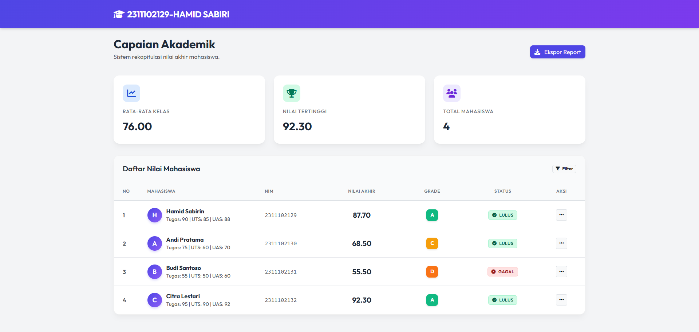

<div align="center">
  <br />
  <h1>LAPORAN PRAKTIKUM <br>APLIKASI BERBASIS PLATFORM</h1>
  <br />
  <h3>TUGAS MODUL 9 <br> PHP: SISTEM PENILAIAN MAHASISWA</h3>
  <br />
  <br />
   
  <br />
  <br />
  <br />
  <br />
  <h3>Disusun Oleh :</h3>
  <p>
    <strong>HAMID SABIRIN</strong><br>
    <strong>2311102129</strong><br>
    <strong>S1 IF-11-REG01</strong>
  </p>
  <br />
  <br />
  <h3>Dosen Pengampu :</h3>
  <p>
    <strong>Dimas Fanny Hebrasianto Permadi, S.ST., M.Kom</strong>
  </p>
  <br />
  <br />
    <h4>Asisten Praktikum :</h4>
    <strong> Apri Pandu Wicaksono </strong> <br>
    <strong>Rangga Pradarrell Fathi</strong>
  <br />
  <h3>LABORATORIUM HIGH PERFORMANCE
 <br>FAKULTAS INFORMATIKA <br>UNIVERSITAS TELKOM PURWOKERTO <br>2026</h3>
</div>

---

## Dasar Teori

Dalam praktikum pengembangan sistem penilaian mahasiswa menggunakan PHP, terdapat beberapa konsep teori dasar yang digunakan:

1. **PHP (Hypertext Preprocessor):** Bahasa skrip *server-side* sumber terbuka yang ditanamkan pada HTML, digunakan secara luas untuk pengembangan web dinamis dan pemrosesan sistem logika di sisi *backend*.
2. **Array Asosiatif:** Merupakan jenis struktur data koleksi *array* di PHP dimana setiap nilainya dipetakan ke kunci (*key*) bertipe *string* alih-alih indeks numerik. Ini sangat berguna untuk menyimpan data berpasangan secara spesifik menyerupai baris pada *record* basis data (contoh: `"nama" => "Hamid Sabirin"`).
3. **Fungsi (Function):** Blok set instruksi kode terisolasi yang dapat dipanggil kembali yang menerima parameter *(input)* dan mengembalikan nilai *(output)* untuk menjalankan tugas spesifik. Menggunakan fungsi membuat kode lebih efisien, modular, dan dapat digunakan ulang *(reusable)* tanpa harus dituli berulang.
4. **Struktur Kontrol (Kondisional & Perulangan):** Elemen logika krusial untuk mengatur alur program. **Kondisional** (`if`, `else if`, `else`) menentukan blok percabangan tugas yang dieksekusi berdasarkan kondisi *true/false*. Sedangkan **Perulangan iterasi** (`foreach`) digunakan untuk menavigasi setiap item di dalam struktur *Array* secara berulang untuk efisiensi *rendering* data.

---

## 1. Implementasi Persyaratan Tugas (Kebutuhan Sistem)

Program Sistem Penilaian Mahasiswa ini telah dirancang untuk memenuhi semua syarat wajib pada soal dengan mengimplementasikan komponen-komponen utama PHP sebagaimana dicontohkan pada cuplikan kode berikut:

### 1.1 Array Asosiatif untuk Menyimpan Data Mahasiswa (Minimal 3 Data)
Penyimpanan data statis dimasukkan menggunakan struktur _Array Asosiatif_, sehingga setiap index (seperti *"nama"*, *"nim"*, dll.) memiliki _key_-nya masing-masing. *File Referensi: `php/data.php`*
```php
<?php
$mahasiswa = [
    [
        "nama" => "Hamid Sabirin",
        "nim" => "2311102129",
        "nilai_tugas" => 90,
        "nilai_uts" => 85,
        "nilai_uas" => 88
    ],
    // Terdapat total 4 data mahasiswa di file aslinya
    // ...
];
?>
```

### 1.2 Gunakan *Function* dan *Operator Aritmatika* Menghitung Nilai Akhir
Perhitungan melibatkan tipe pengolahan variabel (*float*) dengan menggunakan operator aritmatika (*+* untuk penambahan dan *** untuk pengkalian bobot persentase). Operasi ini dibungkus pada satu fungsi bernama `hitungNilaiAkhir`. *File Referensi: `php/functions.php`*
```php
<?php
function hitungNilaiAkhir($tugas, $uts, $uas) {
    // Menggunakan operator aritmatika penjumlahan & perkalian
    return ($tugas * 0.3) + ($uts * 0.3) + ($uas * 0.4);
}
?>
```

### 1.3 Gunakan *If/Else* atau *Switch* Menentukan Grade
Untuk mengkonversi angka ke huruf skala grade, saya mempergunakan operasi kondisional `If/Elseif/Else`. Pemilihan fungsi lebih cocok karena cakupan gradasinya luas (ex: >= 85 hingga <= 100). *File Referensi: `php/functions.php`*
```php
<?php
function tentukanGrade($nilai_akhir) {
    if ($nilai_akhir >= 85) {
        return "A";
    } elseif ($nilai_akhir >= 75) {
        return "B";
    } elseif ($nilai_akhir >= 65) {
        return "C";
    } elseif ($nilai_akhir >= 50) {
        return "D";
    } else {
        return "E";
    }
}
?>
```

### 1.4 Gunakan *Operator Perbandingan* untuk Menentukan Kelulusan
Operator komparasi digunakan guna menyeleksi ambang batas bawah angka kelulusan. Disini digunakan operator **Lebih Besar Sama Dengan (`>=`)**. *File Referensi: `php/functions.php`*
```php
<?php
function tentukanStatus($nilai_akhir) {
    // Jika Nilai Akhir memenuhi syarat angka 65, Status Lulus.
    return $nilai_akhir >= 65 ? "Lulus" : "Tidak Lulus";
}
?>
```

### 1.5 Gunakan *Looping (Perulangan)* untuk Menampilkan Data dalam Tabel HTML
Proses rekapitulasi data menggunakan skema *looping* `foreach` sehingga semua *array* dimuntahkan dalam rupa tabel baris HTML terurut 1 - N. Ini juga dilakukan sembari berbarengan menyisipkan data pada UI Frontend. *File Referensi: `php/index.php`*
```php
<tbody>
    <?php 
    $no = 1;
    // Loop menggunakan foreach untuk memutar semua array 
    foreach ($mahasiswa as $mhs) : 
    ?>
    <tr>
        <td><?php echo $no++; ?></td>
        <td><?php echo $mhs['nama']; ?></td>
        <td><?php echo $mhs['nim']; ?></td>
        <td><?php echo number_format($mhs['nilai_akhir'], 2); ?></td>
        <td><?php echo $mhs['grade']; ?></td>
        <td><?php echo $mhs['status']; ?></td>
    </tr>
    <?php endforeach; ?>
</tbody>
```

---

## 2. Penjelasan Kode Sumber Berbasis Folder Modular (Arsitektur MVC)

Sesuai dari praktik web modern, seluruh file dalam aplikasi telah terbagi (Modular) dalam keranjang root *folder* `php/` agar mudah dirawat dan kodenya lebih *clean*.

1. **`php/data.php` (Model Data):** Bertanggung jawab hanya terfokus pada konfigurasi variabel pendataan mentah siswa.
2. **`php/functions.php` (Controller Logika):** Menjadi penyimpanan pusat terhadap API fungsional terkait logika perolehan *value* (Nilai bobot, Grade, Lulus dsb.). Berisikan semua operator aritmatika dan percabangan struktur kondisional.
3. **`php/index.php` (View Presentasi HTML):** Skrip terakhir yang berisikan raga kode HTML, `<table class="table">` Bootstrap, pemanggil import via `require_once` terhadap kepingan data model & utilitas model kontrolernya.
4. **`php/css/style.css` (Gaya Antarmuka Frontend):** Blok style visualisasi CSS ditempatkan secara terpisah supaya tampilan (*Navbar, Shadow-Card, Table-hover*, hingga desain lencana kelulusan *Badge*) tetap konsisten.


---

## 3. Hasil Tampilan (Screenshots) Aplikasi Penilaian HTML Murni

Berikut adalah lampiran *mock-up* / screenshot dari Web Sistem Nilai ketika berhasil dieksekusi melalui Web Localhost. Website juga memiliki output berupa Rata-Rata Kelas dan Nilai Tertinggi di header dashboard.


* Screenshot Penyelaruhan Web Sistem Penilaian Terestetik (Full):




---

## 4. Referensi

Laporan praktikum ini disusun menggunakan komponen pendukung serta wawasan referensi dari platform / modul terkait berikut:

- **PHP Documentation - Arrays**: [https://www.php.net/manual/en/language.types.array.php](https://www.php.net/manual/en/language.types.array.php)
- **PHP Documentation - Functions**: [https://www.php.net/manual/en/language.functions.php](https://www.php.net/manual/en/language.functions.php)
- **PHP Documentation - Control Structures**: [https://www.php.net/manual/en/language.control-structures.php](https://www.php.net/manual/en/language.control-structures.php)
- **Bootstrap 5 (CSS Interaktif)**: [https://getbootstrap.com/docs/5.3/getting-started/introduction/](https://getbootstrap.com/docs/5.3/getting-started/introduction/)