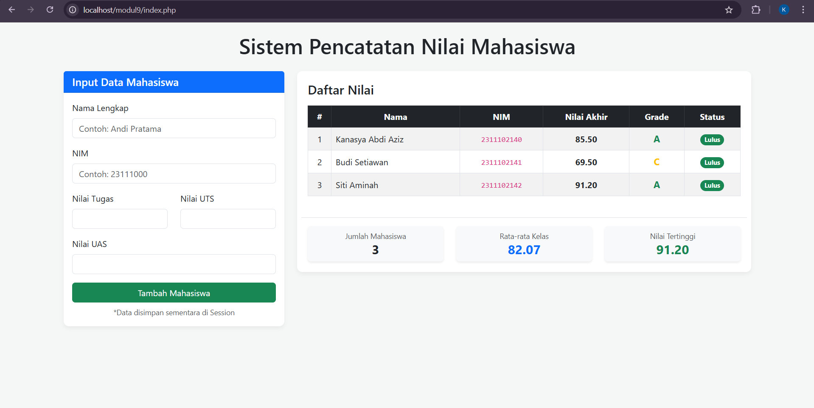

<div align="center">
  <br />
  <h1>LAPORAN PRAKTIKUM <br> APLIKASI BERBASIS PLATFORM</h1>
  <br />
  <h3>MODUL 9 <br> PHP</h3>
  <br />
  
  <br />
  <br />
  <br />
  <h3>Disusun Oleh :</h3>
  <p>
    <strong>Kanasya Abdi Aziz</strong><br>
    <strong>2311102140</strong><br>
    <strong>S1 IF-11-01</strong>
  </p>
  <br />
  <h3>Dosen Pengampu :</h3>
  <p>
    <strong>Dimas Fanny Hebrasianto Permadi, S.ST., M.Kom</strong>
  </p>
  <br />
  <br />
  <h4>Asisten Praktikum :</h4>
  <strong>Apri Pandu Wicaksono</strong> <br>
  <strong>Rangga Pradarrell Fathi</strong>
  <br />
  <br />
  <br />
  <br />
  <h3>LABORATORIUM HIGH PERFORMANCE <br> FAKULTAS INFORMATIKA <br> UNIVERSITAS TELKOM PURWOKERTO <br> 2026</h3>
</div>

---

## 1. Dasar Teori

**PHP** adalah bahasa pemrograman server-side yang sangat penting untuk membuat website dinamis. PHP bekerja di balik layar untuk mengolah logika, memproses data input, dan menghasilkan konten yang diubah sesuai kebutuhan pengguna sebelum dikirimkan ke peramban. Ini berbeda dengan HTML atau CSS, yang berfokus pada elemen visual.

**Pengelolaan Data dengan Array dan Function**
Selama tahap pengajaran awal, PHP memungkinkan pengolahan data tanpa database dengan menggunakan array asosiatif. Struktur ini menyimpan data dalam pasangan kunci dan nilai. Ini membuat informasi siswa seperti nama, NIM, dan komponen nilai lebih mudah diatur dan diakses.

**Logika Program dan Visualisasi Data**
Salah satu elemen logika utama yang digunakan oleh sistem penilaian ini adalah:

- Operator Aritmatika dan Perbandingan: Digunakan untuk menghitung nilai akhir berdasarkan bobot dan membandingkannya dengan standar kelulusan.

- Struktur percabangan (if/else): berfungsi untuk menentukan nilai siswa (A, B, C, dst.) dan status kelulusan mereka.

- Perulangan, juga dikenal sebagai "foreach", memungkinkan Anda menyisir seluruh data dalam array dan secara otomatis menampilkannya dalam format tabel HTML.

**Implementasi Praktikum: Sistem Penilaian Mahasiswa**
Praktikum ini menggunakan PHP, HTML, dan CSS untuk membuat Sistem Penilaian Mahasiswa. Selain mengolah angka, program ini dapat melakukan analisis data seperti:

1. Penghitungan nilai akhir yang dilakukan secara otomatis.

2. Mengidentifikasi status kelulusan dan predikat nilai.

3. Menampilkan data kelas dengan skor tertinggi dan rata-rata.

4. Tampilan antarmuka yang bersih, profesional, dan mudah digunakan.
---

## 2. Penjelasan Kode PHP, HTML, dan CSS

### Kode Program (`index.php`)

```php
<?php
// Memulai session untuk menyimpan data sementara (tanpa database)
session_start();

// 1. Array Asosiasi Default untuk menyimpan data awal jika session kosong
if (!isset($_SESSION['daftar_mahasiswa'])) {
    $_SESSION['daftar_mahasiswa'] = [
        [
            "nama" => "Kanasya Abdi Aziz",
            "nim" => "2311102140",
            "tugas" => 85,
            "uts" => 80,
            "uas" => 90
        ],
        [
            "nama" => "Budi Setiawan",
            "nim" => "2311102141",
            "tugas" => 70,
            "uts" => 75,
            "uas" => 65
        ],
        [
            "nama" => "Siti Aminah",
            "nim" => "2311102142",
            "tugas" => 95,
            "uts" => 88,
            "uas" => 92
        ]
    ];
}

// 2. Fungsi-fungsi Logika (Function, Aritmatika, Perbandingan, If/Else)

// Hitung nilai akhir (Bobot: Tugas 20%, UTS 35%, UAS 45%)
function hitungNilaiAkhir($tugas, $uts, $uas) {
    return ($tugas * 0.2) + ($uts * 0.35) + ($uas * 0.45);
}

// Tentukan grade berdasarkan Nilai Akhir
function tentukanGrade($nilai) {
    if ($nilai >= 85) return ["A", "text-success"];
    elseif ($nilai >= 75) return ["B", "text-primary"];
    elseif ($nilai >= 60) return ["C", "text-warning"];
    elseif ($nilai >= 50) return ["D", "text-danger"];
    else return ["E", "text-danger"];
}

// Tentukan status lulus/tidak
function tentukanStatus($nilai) {
    return ($nilai >= 60) ? ["Lulus", "bg-success"] : ["Tidak Lulus", "bg-danger"];
}

// 3. Logika untuk Menangani Input Form
$pesan = "";
if ($_SERVER["REQUEST_METHOD"] == "POST" && isset($_POST['tambah'])) {
    // Mengambil data dari form dan sanitasi ringan
    $nama = htmlspecialchars($_POST['nama']);
    $nim = htmlspecialchars($_POST['nim']);
    $tugas = floatval($_POST['tugas']);
    $uts = floatval($_POST['uts']);
    $uas = floatval($_POST['uas']);

    // Validasi sederhana (pastikan tidak kosong)
    if (!empty($nama) && !empty($nim)) {
        // Masukkan data baru ke dalam array session
        $_SESSION['daftar_mahasiswa'][] = [
            "nama" => $nama,
            "nim" => $nim,
            "tugas" => $tugas,
            "uts" => $uts,
            "uas" => $uas
        ];
        $pesan = "<div class='alert alert-success'>Data $nama berhasil ditambahkan!</div>";
    } else {
        $pesan = "<div class='alert alert-danger'>Nama dan NIM wajib diisi.</div>";
    }
}

// Inisialisasi statistik
$total_nilai_kelas = 0;
$nilai_tertinggi = 0;
$jumlah_mahasiswa = count($_SESSION['daftar_mahasiswa']);
?>

<!DOCTYPE html>
<html lang="id">
<head>
    <meta charset="UTF-8">
    <meta name="viewport" content="width=device-width, initial-scale=1.0">
    <title>Sistem Penilaian Mahasiswa - Modul 9</title>
    <link href="https://cdn.jsdelivr.net/npm/bootstrap@5.3.0/dist/css/bootstrap.min.min.css" rel="stylesheet">
    <style>
        body { background-color: #f4f7f6; padding-top: 20px; }
        .card { border: none; border-radius: 10px; box-shadow: 0 4px 8px rgba(0,0,0,0.05); }
        .table-container { background-color: white; padding: 20px; border-radius: 10px; box-shadow: 0 4px 8px rgba(0,0,0,0.05); }
        th { text-align: center; }
        td { vertical-align: middle; text-align: center; }
        .grade-cell { font-weight: bold; font-size: 1.1em; }
    </style>
</head>
<body>

<div class="container">
    <h1 class="text-center mb-4">Sistem Pencatatan Nilai Mahasiswa</h1>
    
    <?php echo $pesan; // Menampilkan pesan sukses/error ?>

    <div class="row">
        <div class="col-md-4 mb-4">
            <div class="card">
                <div class="card-header bg-primary text-white">
                    <h5 class="card-title mb-0">Input Data Mahasiswa</h5>
                </div>
                <div class="card-body">
                    <form action="" method="post">
                        <div class="mb-3">
                            <label for="nama" class="form-label">Nama Lengkap</label>
                            <input type="text" class="form-control" id="nama" name="nama" required placeholder="Contoh: Andi Pratama">
                        </div>
                        <div class="mb-3">
                            <label for="nim" class="form-label">NIM</label>
                            <input type="text" class="form-control" id="nim" name="nim" required placeholder="Contoh: 23111000">
                        </div>
                        <div class="row mb-3">
                            <div class="col">
                                <label for="tugas" class="form-label">Nilai Tugas</label>
                                <input type="number" class="form-control" id="tugas" name="tugas" required min="0" max="100">
                            </div>
                            <div class="col">
                                <label for="uts" class="form-label">Nilai UTS</label>
                                <input type="number" class="form-control" id="uts" name="uts" required min="0" max="100">
                            </div>
                        </div>
                        <div class="mb-3">
                            <label for="uas" class="form-label">Nilai UAS</label>
                            <input type="number" class="form-control" id="uas" name="uas" required min="0" max="100">
                        </div>
                        <button type="submit" name="tambah" class="btn btn-success w-100">Tambah Mahasiswa</button>
                    </form>
                    <small class="text-muted d-block mt-2 text-center">*Data disimpan sementara di Session</small>
                </div>
            </div>
        </div>

        <div class="col-md-8">
            <div class="table-container">
                <h4 class="mb-3">Daftar Nilai</h4>
                <div class="table-responsive">
                    <table class="table table-striped table-hover table-bordered">
                        <thead class="table-dark">
                            <tr>
                                <th>#</th>
                                <th>Nama</th>
                                <th>NIM</th>
                                <th>Nilai Akhir</th>
                                <th>Grade</th>
                                <th>Status</th>
                            </tr>
                        </thead>
                        <tbody>
                            <?php 
                            // 5. Loop untuk menampilkan seluruh data (dari session)
                            $no = 1;
                            foreach ($_SESSION['daftar_mahasiswa'] as $mhs) : 
                                // Perhitungan menggunakan function
                                $nilai_akhir = hitungNilaiAkhir($mhs['tugas'], $mhs['uts'], $mhs['uas']);
                                
                                // Ambil data grade dan status (array berisi text dan kelas CSS)
                                list($grade, $grade_class) = tentukanGrade($nilai_akhir);
                                list($status, $status_class) = tentukanStatus($nilai_akhir);

                                // Update statistik untuk bagian bawah
                                $total_nilai_kelas += $nilai_akhir;
                                if ($nilai_akhir > $nilai_tertinggi) {
                                    $nilai_tertinggi = $nilai_akhir;
                                }
                            ?>
                            <tr>
                                <td><?= $no++; ?></td>
                                <td class="text-start"><?= $mhs['nama']; ?></td>
                                <td><code><?= $mhs['nim']; ?></code></td>
                                <td class="fw-bold"><?= number_format($nilai_akhir, 2); ?></td>
                                <td class="grade-cell <?= $grade_class; ?>"><?= $grade; ?></td>
                                <td>
                                    <span class="badge <?= $status_class; ?> rounded-pill">
                                        <?= $status; ?>
                                    </span>
                                </td>
                            </tr>
                            <?php endforeach; ?>
                        </tbody>
                    </table>
                </div>

                <div class="row mt-4 pt-3 border-top">
                    <?php 
                    $rata_rata = ($jumlah_mahasiswa > 0) ? ($total_nilai_kelas / $jumlah_mahasiswa) : 0;
                    ?>
                    <div class="col-6 col-sm-4 text-center">
                        <div class="p-2 bg-light rounded shadow-sm">
                            <small class="text-muted d-block">Jumlah Mahasiswa</small>
                            <span class="h4 fw-bold"><?= $jumlah_mahasiswa; ?></span>
                        </div>
                    </div>
                    <div class="col-6 col-sm-4 text-center">
                        <div class="p-2 bg-light rounded shadow-sm">
                            <small class="text-muted d-block">Rata-rata Kelas</small>
                            <span class="h4 fw-bold text-primary"><?= number_format($rata_rata, 2); ?></span>
                        </div>
                    </div>
                    <div class="col-12 col-sm-4 text-center mt-3 mt-sm-0">
                        <div class="p-2 bg-light rounded shadow-sm">
                            <small class="text-muted d-block">Nilai Tertinggi</small>
                            <span class="h4 fw-bold text-success"><?= number_format($nilai_tertinggi, 2); ?></span>
                        </div>
                    </div>
                </div>
            </div>
        </div>
    </div>

</div>

<script src="https://cdn.jsdelivr.net/npm/bootstrap@5.3.0/dist/js/bootstrap.bundle.min.js"></script>
</body>
</html>
```
---

### Penjelasan Kode

---

### 1. PHP

Pemisahan kode dimulai pada bagian logika PHP yang berfungsi sebagai "otak" dari aplikasi. Di sini, sistem menggunakan session untuk menyimpan data mahasiswa ke dalam array asosiasi agar data tetap tersimpan selama peramban belum ditutup. Fungsi-fungsi khusus didefinisikan untuk menangani perhitungan matematis nilai akhir berdasarkan bobot tugas, UTS, dan UAS, serta menentukan grade dan status kelulusan menggunakan operator perbandingan dan struktur kendali if/else. Selain itu, bagian ini juga bertugas memproses input dari form secara aman dengan teknik sanitasi data sebelum memasukkannya ke dalam daftar utama.

---

### 2. HTML

Pada bagian struktur HTML, fokus utamanya adalah membangun kerangka tampilan yang membagi halaman menjadi dua area utama menggunakan sistem grid. Di satu sisi, terdapat formulir interaktif yang berfungsi sebagai alat input data mahasiswa baru, sementara di sisi lain terdapat tabel dinamis yang menampilkan seluruh data mahasiswa hasil iterasi dari array PHP. Struktur ini dirancang agar data statistik seperti rata-rata kelas dan nilai tertinggi dapat langsung dikalkulasi dan ditampilkan di bagian bawah tabel setiap kali terjadi perubahan data, memberikan umpan balik instan kepada pengguna.

---

### 3. CSS

Terakhir, bagian CSS berperan dalam aspek estetika dan pengalaman pengguna agar aplikasi tidak terlihat kaku. Dengan memisahkan gaya ke dalam file eksternal, kita dapat mengatur tipografi, warna spesifik untuk setiap grade (seperti hijau untuk nilai A atau merah untuk E), serta memberikan efek bayangan (shadow) dan sudut melengkung pada elemen kartu dan tabel. Penggunaan CSS ini juga memastikan bahwa antarmuka tetap responsif dan tertata rapi di berbagai ukuran layar, menciptakan kesan aplikasi profesional yang terorganisir dengan baik antara fungsi teknis dan tampilan visual.

---

### Hasil Tampilan (Screenshot)



---

## 3. Kesimpulan

Penggunaan Array Asosiasi terbukti sangat efektif untuk mengelola data terstruktur seperti profil mahasiswa, karena memungkinkan penyimpanan berbagai jenis informasi (nama, NIM, dan nilai) dalam satu variabel yang mudah diakses. Dengan mengombinasikan Function dan Operator Aritmatika, perhitungan nilai akhir berdasarkan bobot persentase menjadi lebih akurat dan otomatis, sehingga meminimalisir kesalahan manual dalam pengolahan data akademis.

Penerapan Struktur Kendali If/Else dan Operator Perbandingan memberikan kemampuan pada sistem untuk melakukan pengambilan keputusan otomatis dalam menentukan grade dan status kelulusan. Selain itu, penggunaan Session menjadi solusi cerdas untuk menjaga persistensi data sementara tanpa memerlukan database fisik, sehingga pengguna dapat menambah atau memperbarui data secara dinamis selama sesi peramban berlangsung.

Dari sisi antarmuka, pemisahan antara Logika PHP, Struktur HTML, dan Desain CSS menciptakan kode yang bersih, profesional, dan mudah dikelola (maintainable). Integrasi dengan framework CSS seperti Bootstrap tidak hanya mempercantik tampilan tabel dan form, tetapi juga memastikan informasi statistik seperti rata-rata kelas dan nilai tertinggi dapat disajikan secara informatif dan responsif di berbagai perangkat.

---

## 4. Referensi

- Modul Praktikum Aplikasi Berbasis Platform – Modul 9 PHP  
- W3Schools PHP Tutorial : https://www.w3schools.com/php/ 