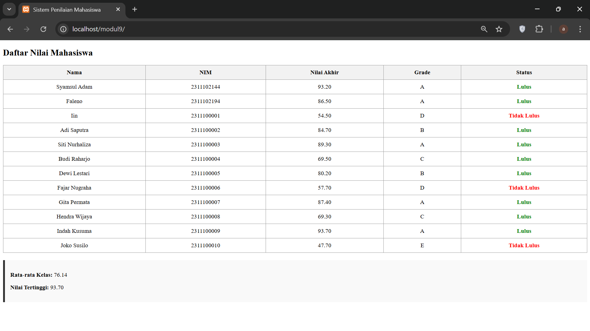

<div align="center">
  <br />
  <h1>LAPORAN PRAKTIKUM <br>APLIKASI BERBASIS PLATFORM</h1>
  <br />
  <h3>MODUL 9 <br> PHP</h3>
  <br />
  <br />
   
  <br />
  <br />
  <br />
  <br />
  <h3>Disusun Oleh :</h3>
  <p>
    <strong>Syamsul Adam</strong><br>
    <strong>2311102144</strong><br>
    <strong>S1 IF-11-01</strong>
  </p>
  <br />
  <h3>Dosen Pengampu :</h3>
  <p>
    <strong>Dimas Fanny Hebrasianto Permadi, S.ST., M.Kom</strong>
  </p>
  <br />
  <br />
    <h4>Asisten Praktikum :</h4>
    <strong> Apri Pandu Wicaksono </strong> <br>
    <strong>Rangga Pradarrell Fathi</strong>
  <br />
  <h3>LABORATORIUM HIGH PERFORMANCE
 <br>FAKULTAS INFORMATIKA <br>UNIVERSITAS TELKOM PURWOKERTO <br>2026</h3>
</div>

---

## 1. Dasar Teori

PHP (Hypertext Preprocessor)
PHP adalah bahasa pemrograman server-side scripting yang dirancang khusus untuk pengembangan web. Tidak seperti HTML yang diproses di sisi klien (browser), skrip PHP dieksekusi di server, dan hasilnya dikirimkan ke browser dalam bentuk HTML murni. PHP digunakan untuk menciptakan halaman web yang dinamis, mengolah data formulir, dan berinteraksi dengan database.

Array Asosiatif
Array adalah tipe data yang digunakan untuk menyimpan kumpulan nilai dalam satu variabel. Array Asosiatif secara spesifik menggunakan key atau kunci berupa string (kata) untuk mengakses nilainya, bukan menggunakan indeks angka (0, 1, 2, ...).

Contoh: "nama" => "Adam" di mana "nama" adalah key dan "Adam" adalah nilainya.

Fungsi (Function) dalam PHP
Fungsi adalah sekumpulan instruksi yang dibungkus dalam satu blok kode yang dapat dipanggil berkali-kali. Penggunaan fungsi bertujuan untuk meningkatkan modularitas kode dan menghindari penulisan kode yang berulang (reusable code). Dalam sistem penilaian, fungsi digunakan untuk mengisolasi logika perhitungan nilai akhir agar kode lebih rapi.

Struktur Kendali (Control Structure)
Struktur kendali digunakan untuk mengatur alur jalannya program berdasarkan kondisi tertentu:

Percabangan (If-Else): Digunakan untuk menentukan keputusan. Dalam laporan ini, if-else digunakan untuk mengonversi nilai angka menjadi Grade (A, B, C, D, E) dan menentukan status kelulusan.

Perulangan (Foreach): Merupakan cara paling efisien dalam PHP untuk mengiterasi atau menampilkan seluruh elemen yang ada di dalam sebuah array, terutama array asosiatif.

Operator Aritmatika dan Perbandingan
Operator Aritmatika: Digunakan untuk melakukan operasi matematika seperti penjumlahan (+), perkalian (*), dan pembagian (/). Digunakan dalam menghitung nilai rata-rata dan nilai akhir berdasarkan bobot.

Operator Perbandingan: Digunakan untuk membandingkan dua nilai (seperti >, <, >=). Operator ini krusial untuk menentukan apakah seorang mahasiswa memenuhi standar kelulusan atau tidak.

Integrasi PHP ke dalam HTML
PHP dapat disisipkan langsung ke dalam tag HTML menggunakan tag pembuka <?php dan penutup ?>. Hal ini memungkinkan pembuatan tabel dinamis di mana jumlah baris tabel akan otomatis bertambah mengikuti jumlah data yang ada di dalam array.


### Kode

```php
<?php
// 1. Data Mahasiswa menggunakan Array Asosiatif
$daftar_mahasiswa = [
    [
        "nama" => "Syamsul Adam",
        "nim"  => "2311102144",
        "tugas" => 98,
        "uts"   => 90,
        "uas"   => 92,5
    ],
    [
        "nama" => "Faleno",
        "nim"  => "2311102194",
        "tugas" => 80,
        "uts"   => 95,
        "uas"   => 85
    ],
    [
        "nama" => "Iin",
        "nim"  => "2311100001",
        "tugas" => 60,
        "uts"   => 55,
        "uas"   => 50
    ],
    [
        "nama" => "Adi Saputra",
        "nim"  => "2311100002",
        "tugas" => 85,
        "uts"   => 80,
        "uas"   => 88
    ],
    [
        "nama" => "Siti Nurhaliza",
        "nim"  => "2311100003",
        "tugas" => 90,
        "uts"   => 85,
        "uas"   => 92
    ],
    [
        "nama" => "Budi Raharjo",
        "nim"  => "2311100004",
        "tugas" => 75,
        "uts"   => 70,
        "uas"   => 65
    ],
    [
        "nama" => "Dewi Lestari",
        "nim"  => "2311100005",
        "tugas" => 80,
        "uts"   => 78,
        "uas"   => 82
    ],
    [
        "nama" => "Fajar Nugraha",
        "nim"  => "2311100006",
        "tugas" => 55,
        "uts"   => 60,
        "uas"   => 58
    ],
    [
        "nama" => "Gita Permata",
        "nim"  => "2311100007",
        "tugas" => 88,
        "uts"   => 90,
        "uas"   => 85
    ],
    [
        "nama" => "Hendra Wijaya",
        "nim"  => "2311100008",
        "tugas" => 70,
        "uts"   => 65,
        "uas"   => 72
    ],
    [
        "nama" => "Indah Kusuma",
        "nim"  => "2311100009",
        "tugas" => 95,
        "uts"   => 92,
        "uas"   => 94
    ],
    [
        "nama" => "Joko Susilo",
        "nim"  => "2311100010",
        "tugas" => 45,
        "uts"   => 50,
        "uas"   => 48
    ]
];

// 2. Function untuk menghitung nilai akhir
function hitungNilaiAkhir($tugas, $uts, $uas) {
    return ($tugas * 0.3) + ($uts * 0.3) + ($uas * 0.4);
}

// 3. Function untuk menentukan Grade
function tentukanGrade($nilai) {
    if ($nilai >= 85) return "A";
    elseif ($nilai >= 75) return "B";
    elseif ($nilai >= 60) return "C";
    elseif ($nilai >= 50) return "D";
    else return "E";
}

// Inisialisasi variabel untuk statistik
$total_nilai_kelas = 0;
$nilai_tertinggi = 0;
?>

<!DOCTYPE html>
<html lang="id">
<head>
    <meta charset="UTF-8">
    <title>Sistem Penilaian Mahasiswa</title>
    <style>
        table { width: 100%; border-collapse: collapse; margin-top: 20px; }
        th, td { border: 1px solid 
        th { background-color:
        .lulus { color: green; font-weight: bold; }
        .tidak-lulus { color: red; font-weight: bold; }
        .statistik { margin-top: 20px; padding: 15px; background:
    </style>
</head>
<body>

    <h2>Daftar Nilai Mahasiswa</h2>

    <table>
        <thead>
            <tr>
                <th>Nama</th>
                <th>NIM</th>
                <th>Nilai Akhir</th>
                <th>Grade</th>
                <th>Status</th>
            </tr>
        </thead>
        <tbody>
            <?php 
            // 4. Loop untuk menampilkan data
            foreach ($daftar_mahasiswa as $mhs) : 
                $nilai_akhir = hitungNilaiAkhir($mhs['tugas'], $mhs['uts'], $mhs['uas']);
                $grade = tentukanGrade($nilai_akhir);
                
                // 5. Operator Perbandingan untuk status kelulusan
                $status = ($nilai_akhir >= 60) ? "Lulus" : "Tidak Lulus";
                $class_status = ($status == "Lulus") ? "lulus" : "tidak-lulus";

                // Update statistik
                $total_nilai_kelas += $nilai_akhir;
                if ($nilai_akhir > $nilai_tertinggi) {
                    $nilai_tertinggi = $nilai_akhir;
                }
            ?>
            <tr>
                <td><?= $mhs['nama']; ?></td>
                <td><?= $mhs['nim']; ?></td>
                <td><?= number_format($nilai_akhir, 2); ?></td>
                <td><?= $grade; ?></td>
                <td class="<?= $class_status; ?>"><?= $status; ?></td>
            </tr>
            <?php endforeach; ?>
        </tbody>
    </table>

    <div class="statistik">
        <?php 
            $rata_rata = $total_nilai_kelas / count($daftar_mahasiswa);
        ?>
        <p><strong>Rata-rata Kelas:</strong> <?= number_format($rata_rata, 2); ?></p>
        <p><strong>Nilai Tertinggi:</strong> <?= number_format($nilai_tertinggi, 2); ?></p>
    </div>

</body>
</html>
```

### Hasil Tampilan (Screenshot)

 

### Penjelasan Code

Saya menggunakan Array Asosiatif multidimensi untuk menyimpan seluruh data mahasiswa. Di dalam array tersebut, saya memasukkan 12 data mahasiswa yang masing-masing memiliki atribut seperti Nama, NIM, nilai Tugas, nilai UTS, dan nilai UAS. Untuk menghitung nilai, saya membuat sebuah Function bernama hitungNilaiAkhir(). Fungsi ini bekerja dengan menjumlahkan bobot nilai yang sudah ditentukan, yaitu Tugas 30%, UTS 30%, dan UAS 40%. Menggunakan fungsi seperti ini membuat kode saya jadi lebih rapi dan mudah dikelola. Saya menerapkan struktur kendali If-Else untuk menentukan Grade (A, B, C, D, atau E) berdasarkan hasil nilai akhir. Selain itu, saya menggunakan operator perbandingan untuk mengecek apakah mahasiswa tersebut "Lulus" (nilai $\ge 60$) atau "Tidak Lulus". Agar data enak dibaca, saya menggunakan perulangan Foreach untuk menampilkan data dari array ke dalam tabel HTML. Saya juga menambahkan sedikit CSS supaya tampilan status kelulusan punya warna yang berbeda; hijau untuk yang lulus dan merah untuk yang tidak lulus. Di bagian akhir, program saya secara otomatis menghitung Rata-rata Nilai dari seluruh mahasiswa dan mencari siapa yang mendapatkan Nilai Tertinggi di kelas tersebut menggunakan logika perbandingan di dalam perulangan.

## Refrensi

- [Materi Modul](https://drive.google.com/file/d/1TW5Y0AdzkVk24ThPUf1OQNs2Mnw3XNO5/view?usp=sharing)