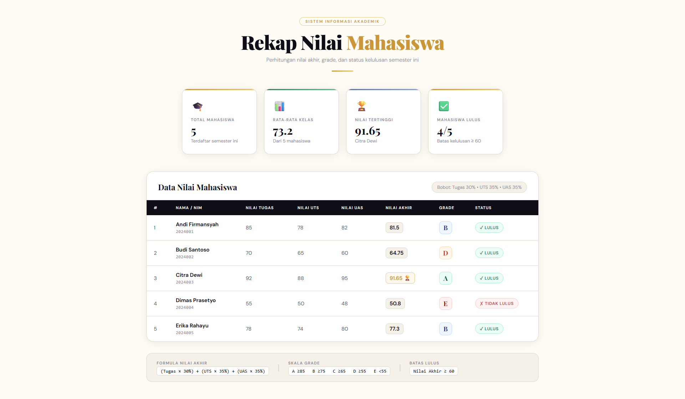

<div align="center">
  <br />
  <h1>LAPORAN PRAKTIKUM <br>APLIKASI BERBASIS PLATFORM</h1>
  <br />
  <h3>MODUL 9 <br> PHP </h3>
  <br />
  <br />
   
  <br />
  <br />
  <br />
  <br />
  <h3>Disusun Oleh :</h3>
  <p>
    <strong>DANENDRA ARDEN SHADUQ</strong><br>
    2311102146<br>
    S1 IF-11-REG01
  </p>
  <br />
  <br />
  <h3>Dosen Pengampu :</h3>
  <p>
    <strong>Dimas Fanny Hebrasianto Permadi, S.ST., M.Kom</strong>
  </p>
  <br />
  <br />
  <br />
  <h3>PROGRAM STUDI S1 INFORMATIKA <br>FAKULTAS INFORMATIKA <br>UNIVERSITAS TELKOM PURWOKERTO <br>2025/2026</h3>
</div>

---

## 1. Dasar Teori

Web Server merupakan sebuah perangkat lunak dalam server yang berfungsi menerima permintaan
(request) berupa halaman web melalui HTTP atau HTTPS dari client yang dikenal dengan web browser dan
mengirimkan kembali (response) hasilnya dalam bentuk halaman-halaman web yang umumnya berbentuk
dokumen HTML.

Beberapa web server yang banyak digunakan antara lain seperti berikut:
1. Apache Web Server 
2. Internet Information Service, IIS 
3. Xitami Web Server
4. Sun Java System Web Server
Server Side Scripting merupakan sebuah teknologi scripting atau pemrograman web dimana script
(program) dikompilasi atau diterjemahkan di server. Dengan server side scripting, memungkinkan untuk
menghasilkan halaman web yang dinamis.
Beberapa contoh Server Side Scripting (Programming) :
1. ASP (Active Server Page) dan ASP.NET
2. ColdFusion
3. Java Server Pages 
4. Perl 
5. Python 
6. PHP 
Keistimewaan PHP sebagai bahasa pemrograman berbasis web adalah :
1. Cepat
2. Free
3. Mudah dipelajari
4. Multi-platform
5. Dukungan technical support
6. Banyaknya komunitas PHP
7. Aman

---

## 2. Penjelasan Kode PHP

### Kode PHP (`mahasiswa.php`)

```php
<?php

// =============================================
//  DATA MAHASISWA (Array Asosiatif)
// =============================================
$mahasiswa = [
    [
        "nama"         => "Andi Firmansyah",
        "nim"          => "2024001",
        "nilai_tugas"  => 85,
        "nilai_uts"    => 78,
        "nilai_uas"    => 82,
    ],
    [
        "nama"         => "Budi Santoso",
        "nim"          => "2024002",
        "nilai_tugas"  => 70,
        "nilai_uts"    => 65,
        "nilai_uas"    => 60,
    ],
    [
        "nama"         => "Citra Dewi",
        "nim"          => "2024003",
        "nilai_tugas"  => 92,
        "nilai_uts"    => 88,
        "nilai_uas"    => 95,
    ],
    [
        "nama"         => "Dimas Prasetyo",
        "nim"          => "2024004",
        "nilai_tugas"  => 55,
        "nilai_uts"    => 50,
        "nilai_uas"    => 48,
    ],
    [
        "nama"         => "Erika Rahayu",
        "nim"          => "2024005",
        "nilai_tugas"  => 78,
        "nilai_uts"    => 74,
        "nilai_uas"    => 80,
    ],
];

// =============================================
//  FUNCTION: Hitung Nilai Akhir
//  Bobot: Tugas 30% | UTS 35% | UAS 35%
// =============================================
function hitungNilaiAkhir($tugas, $uts, $uas) {
    return ($tugas * 0.30) + ($uts * 0.35) + ($uas * 0.35);
}

// =============================================
//  FUNCTION: Tentukan Grade (if/else)
// =============================================
function tentukanGrade($nilai) {
    if ($nilai >= 85) {
        return "A";
    } elseif ($nilai >= 75) {
        return "B";
    } elseif ($nilai >= 65) {
        return "C";
    } elseif ($nilai >= 55) {
        return "D";
    } else {
        return "E";
    }
}

// =============================================
//  FUNCTION: Tentukan Status Kelulusan
// =============================================
function tentukanStatus($nilai) {
    // Operator perbandingan: lulus jika nilai akhir >= 60
    return ($nilai >= 60) ? "LULUS" : "TIDAK LULUS";
}

// =============================================
//  PROSES DATA (Loop)
// =============================================
$totalNilai    = 0;
$nilaiTertinggi = 0;
$namaTertinggi  = "";

foreach ($mahasiswa as &$mhs) {
    $na = hitungNilaiAkhir(
        $mhs["nilai_tugas"],
        $mhs["nilai_uts"],
        $mhs["nilai_uas"]
    );
    $mhs["nilai_akhir"] = round($na, 2);
    $mhs["grade"]       = tentukanGrade($na);
    $mhs["status"]      = tentukanStatus($na);

    // Operator aritmatika: akumulasi untuk rata-rata
    $totalNilai += $mhs["nilai_akhir"];

    // Operator perbandingan: cari nilai tertinggi
    if ($mhs["nilai_akhir"] > $nilaiTertinggi) {
        $nilaiTertinggi = $mhs["nilai_akhir"];
        $namaTertinggi  = $mhs["nama"];
    }
}
unset($mhs);

$jumlahMahasiswa = count($mahasiswa);
$rataRataKelas   = round($totalNilai / $jumlahMahasiswa, 2);

?>
<!DOCTYPE html>
<html lang="id">
<head>
    <meta charset="UTF-8">
    <meta name="viewport" content="width=device-width, initial-scale=1.0">
    <title>Sistem Penilaian Mahasiswa</title>
    <link href="https://fonts.googleapis.com/css2?family=Playfair+Display:wght@700;900&family=DM+Sans:wght@300;400;500;600&display=swap" rel="stylesheet">
    <style>
        :root {
            --ink:        #0f0e17;
            --paper:      #fffcf5;
            --cream:      #f5f0e8;
            --gold:       #c9973a;
            --gold-light: #e8c97a;
            --rust:       #c94a3a;
            --sage:       #3a7a5a;
            --slate:      #4a5568;
            --muted:      #8a8a96;
            --border:     #ddd8cc;
            --shadow:     0 4px 24px rgba(15,14,23,.08);
        }

        *, *::before, *::after { box-sizing: border-box; margin: 0; padding: 0; }

        body {
            font-family: 'DM Sans', sans-serif;
            background: var(--paper);
            color: var(--ink);
            min-height: 100vh;
            padding: 48px 24px;
        }

        /* ── HEADER ── */
        .header {
            text-align: center;
            margin-bottom: 48px;
        }
        .header-label {
            display: inline-block;
            font-size: 11px;
            font-weight: 600;
            letter-spacing: .18em;
            text-transform: uppercase;
            color: var(--gold);
            border: 1.5px solid var(--gold-light);
            padding: 4px 16px;
            border-radius: 40px;
            margin-bottom: 16px;
        }
        .header h1 {
            font-family: 'Playfair Display', serif;
            font-size: clamp(2rem, 5vw, 3.4rem);
            font-weight: 900;
            line-height: 1.1;
            letter-spacing: -.02em;
        }
        .header h1 span { color: var(--gold); }
        .header p {
            margin-top: 10px;
            color: var(--muted);
            font-size: 15px;
            font-weight: 300;
        }
        .divider {
            width: 60px;
            height: 3px;
            background: linear-gradient(90deg, var(--gold), var(--gold-light));
            margin: 20px auto 0;
            border-radius: 2px;
        }

        /* ── STAT CARDS ── */
        .stats-grid {
            display: grid;
            grid-template-columns: repeat(auto-fit, minmax(200px, 1fr));
            gap: 20px;
            max-width: 900px;
            margin: 0 auto 48px;
        }
        .stat-card {
            background: #fff;
            border: 1px solid var(--border);
            border-radius: 16px;
            padding: 28px 24px;
            box-shadow: var(--shadow);
            position: relative;
            overflow: hidden;
        }
        .stat-card::before {
            content: '';
            position: absolute;
            top: 0; left: 0; right: 0;
            height: 3px;
        }
        .stat-card.gold::before  { background: linear-gradient(90deg, var(--gold), var(--gold-light)); }
        .stat-card.sage::before  { background: linear-gradient(90deg, var(--sage), #6ab890); }
        .stat-card.slate::before { background: linear-gradient(90deg, #5a72a0, #8ba4cc); }
        .stat-icon {
            font-size: 28px;
            margin-bottom: 12px;
            display: block;
        }
        .stat-label {
            font-size: 11px;
            font-weight: 600;
            letter-spacing: .12em;
            text-transform: uppercase;
            color: var(--muted);
            margin-bottom: 6px;
        }
        .stat-value {
            font-family: 'Playfair Display', serif;
            font-size: 2rem;
            font-weight: 700;
            color: var(--ink);
            line-height: 1;
        }
        .stat-sub {
            font-size: 13px;
            color: var(--muted);
            margin-top: 6px;
        }

        /* ── TABLE WRAPPER ── */
        .table-wrap {
            max-width: 1100px;
            margin: 0 auto;
            background: #fff;
            border: 1px solid var(--border);
            border-radius: 20px;
            box-shadow: var(--shadow);
            overflow: hidden;
        }
        .table-header {
            padding: 28px 32px 20px;
            border-bottom: 1px solid var(--border);
            display: flex;
            align-items: center;
            justify-content: space-between;
            flex-wrap: wrap;
            gap: 12px;
        }
        .table-title {
            font-family: 'Playfair Display', serif;
            font-size: 1.4rem;
            font-weight: 700;
        }
        .table-meta {
            font-size: 13px;
            color: var(--muted);
            background: var(--cream);
            border: 1px solid var(--border);
            padding: 6px 14px;
            border-radius: 40px;
        }

        table {
            width: 100%;
            border-collapse: collapse;
        }
        thead th {
            background: var(--ink);
            color: #fff;
            font-size: 11px;
            font-weight: 600;
            letter-spacing: .1em;
            text-transform: uppercase;
            padding: 14px 20px;
            text-align: left;
        }
        thead th:first-child { border-radius: 0; }
        tbody tr {
            border-bottom: 1px solid var(--border);
            transition: background .15s;
        }
        tbody tr:last-child { border-bottom: none; }
        tbody tr:hover { background: var(--cream); }
        tbody td {
            padding: 16px 20px;
            font-size: 14.5px;
            color: var(--slate);
            vertical-align: middle;
        }

        /* ── INLINE ELEMENTS ── */
        .nama-cell strong {
            display: block;
            color: var(--ink);
            font-weight: 600;
            font-size: 15px;
        }
        .nama-cell span {
            font-size: 12px;
            color: var(--muted);
            font-family: 'DM Mono', monospace;
            letter-spacing: .05em;
        }
        .nilai-badge {
            display: inline-block;
            padding: 4px 10px;
            border-radius: 8px;
            font-weight: 700;
            font-size: 15px;
            background: var(--cream);
            color: var(--ink);
            border: 1px solid var(--border);
        }
        .nilai-badge.top { background: #fef9ec; border-color: var(--gold-light); color: var(--gold); }

        /* ── GRADE BADGE ── */
        .grade {
            display: inline-flex;
            align-items: center;
            justify-content: center;
            width: 36px; height: 36px;
            border-radius: 10px;
            font-family: 'Playfair Display', serif;
            font-size: 18px;
            font-weight: 700;
        }
        .grade-A { background: #ecfdf5; color: #065f46; border: 1.5px solid #a7f3d0; }
        .grade-B { background: #eff6ff; color: #1e40af; border: 1.5px solid #bfdbfe; }
        .grade-C { background: #fffbeb; color: #92400e; border: 1.5px solid #fde68a; }
        .grade-D { background: #fff7ed; color: #c2410c; border: 1.5px solid #fed7aa; }
        .grade-E { background: #fef2f2; color: #991b1b; border: 1.5px solid #fecaca; }

        /* ── STATUS ── */
        .status {
            display: inline-flex;
            align-items: center;
            gap: 6px;
            padding: 5px 12px;
            border-radius: 40px;
            font-size: 12px;
            font-weight: 600;
            letter-spacing: .06em;
            text-transform: uppercase;
        }
        .status-lulus {
            background: #ecfdf5;
            color: var(--sage);
            border: 1.5px solid #a7f3d0;
        }
        .status-tidak {
            background: #fef2f2;
            color: var(--rust);
            border: 1.5px solid #fecaca;
        }

        /* ── FORMULA BOX ── */
        .formula-box {
            max-width: 1100px;
            margin: 32px auto 0;
            background: var(--cream);
            border: 1px solid var(--border);
            border-radius: 16px;
            padding: 20px 28px;
            display: flex;
            flex-wrap: wrap;
            gap: 24px;
            align-items: center;
        }
        .formula-box .f-title {
            font-size: 11px;
            font-weight: 600;
            letter-spacing: .12em;
            text-transform: uppercase;
            color: var(--muted);
            margin-bottom: 4px;
        }
        .formula-box code {
            font-size: 13px;
            color: var(--ink);
            background: #fff;
            border: 1px solid var(--border);
            padding: 4px 10px;
            border-radius: 6px;
        }
        .formula-box .sep {
            color: var(--border);
            font-size: 24px;
        }

        /* ── FOOTER ── */
        footer {
            text-align: center;
            margin-top: 48px;
            font-size: 12px;
            color: var(--muted);
        }
    </style>
</head>
<body>

<!-- HEADER -->
<div class="header">
    <div class="header-label">Sistem Informasi Akademik</div>
    <h1>Rekap Nilai <span>Mahasiswa</span></h1>
    <p>Perhitungan nilai akhir, grade, dan status kelulusan semester ini</p>
    <div class="divider"></div>
</div>

<!-- STAT CARDS -->
<div class="stats-grid">
    <div class="stat-card gold">
        <span class="stat-icon">🎓</span>
        <div class="stat-label">Total Mahasiswa</div>
        <div class="stat-value"><?= $jumlahMahasiswa ?></div>
        <div class="stat-sub">Terdaftar semester ini</div>
    </div>
    <div class="stat-card sage">
        <span class="stat-icon">📊</span>
        <div class="stat-label">Rata‑rata Kelas</div>
        <div class="stat-value"><?= $rataRataKelas ?></div>
        <div class="stat-sub">Dari <?= $jumlahMahasiswa ?> mahasiswa</div>
    </div>
    <div class="stat-card slate">
        <span class="stat-icon">🏆</span>
        <div class="stat-label">Nilai Tertinggi</div>
        <div class="stat-value"><?= $nilaiTertinggi ?></div>
        <div class="stat-sub"><?= htmlspecialchars($namaTertinggi) ?></div>
    </div>
    <div class="stat-card gold">
        <span class="stat-icon">✅</span>
        <div class="stat-label">Mahasiswa Lulus</div>
        <?php
            $lulusCount = 0;
            foreach ($mahasiswa as $m) {
                if ($m["status"] === "LULUS") $lulusCount++;
            }
        ?>
        <div class="stat-value"><?= $lulusCount ?>/<?= $jumlahMahasiswa ?></div>
        <div class="stat-sub">Batas kelulusan ≥ 60</div>
    </div>
</div>

<!-- TABLE -->
<div class="table-wrap">
    <div class="table-header">
        <div class="table-title">Data Nilai Mahasiswa</div>
        <div class="table-meta">Bobot: Tugas 30% &bull; UTS 35% &bull; UAS 35%</div>
    </div>
    <table>
        <thead>
            <tr>
                <th>#</th>
                <th>Nama / NIM</th>
                <th>Nilai Tugas</th>
                <th>Nilai UTS</th>
                <th>Nilai UAS</th>
                <th>Nilai Akhir</th>
                <th>Grade</th>
                <th>Status</th>
            </tr>
        </thead>
        <tbody>
            <?php
            $no = 1;
            foreach ($mahasiswa as $mhs):
                $isTop = ($mhs["nilai_akhir"] == $nilaiTertinggi);
            ?>
            <tr>
                <td><?= $no++ ?></td>
                <td class="nama-cell">
                    <strong><?= htmlspecialchars($mhs["nama"]) ?></strong>
                    <span><?= htmlspecialchars($mhs["nim"]) ?></span>
                </td>
                <td><?= $mhs["nilai_tugas"] ?></td>
                <td><?= $mhs["nilai_uts"] ?></td>
                <td><?= $mhs["nilai_uas"] ?></td>
                <td>
                    <span class="nilai-badge <?= $isTop ? 'top' : '' ?>">
                        <?= $mhs["nilai_akhir"] ?>
                        <?= $isTop ? ' 🏆' : '' ?>
                    </span>
                </td>
                <td>
                    <span class="grade grade-<?= $mhs['grade'] ?>">
                        <?= $mhs["grade"] ?>
                    </span>
                </td>
                <td>
                    <?php if ($mhs["status"] === "LULUS"): ?>
                        <span class="status status-lulus">✓ Lulus</span>
                    <?php else: ?>
                        <span class="status status-tidak">✗ Tidak Lulus</span>
                    <?php endif; ?>
                </td>
            </tr>
            <?php endforeach; ?>
        </tbody>
    </table>
</div>

<!-- FORMULA BOX -->
<div class="formula-box">
    <div>
        <div class="f-title">Formula Nilai Akhir</div>
        <code>(Tugas × 30%) + (UTS × 35%) + (UAS × 35%)</code>
    </div>
    <div class="sep">|</div>
    <div>
        <div class="f-title">Skala Grade</div>
        <code>A ≥85 &nbsp; B ≥75 &nbsp; C ≥65 &nbsp; D ≥55 &nbsp; E &lt;55</code>
    </div>
    <div class="sep">|</div>
    <div>
        <div class="f-title">Batas Lulus</div>
        <code>Nilai Akhir ≥ 60</code>
    </div>
</div>
</body>
</html>
}
```

### Hasil Tampilan (Screenshot)



### Penjelasan code:

#### 1. Function untuk Menghitung Nilai Akhir 

Fungsi `hitungNilaiAkhir($tugas, $uts, $uas)` dibuat untuk menerima tiga argumen berupa angka (nilai tugas, UTS, dan UAS). Fungsi ini mengembalikan (return) hasil perhitungan nilai akhir sesuai bobot yang ditentukan, yaitu 30% untuk Tugas (dikali 0.30), 35% untuk UTS (dikali 0.35), dan 35% untuk UAS (dikali 0.35).

#### 2. Operator Aritmatika untuk Perhitungan Nilai Akhir

Fungsi `hitungNilaiAkhir (return ($tugas * 0.30) + ($uts * 0.35) + ($uas * 0.35);)`.Terdapat dua operator aritmatika utama yang digunakan di sini:
- Operator Perkalian (`*`): Digunakan untuk mengalikan masing-masing nilai mahasiswa dengan desimal persentase bobotnya.
- Operator Penjumlahan (`+`): Digunakan untuk menjumlahkan ketiga hasil perkalian tersebut agar menjadi satu kesatuan nilai akhir.

- Di bagian bawah pada proses loop, terdapat juga operator Penjumlahan Penugasan (`+=`) pada `$totalNilai += $mhs["nilai_akhir"];` untuk mengakumulasi nilai seluruh mahasiswa, serta Pembagian (`/`) pada `$totalNilai / $jumlahMahasiswa` untuk mencari rata-rata kelas.

#### 3. Penggunaan If/Else untuk Menentukan Grade
Fungsi `tentukanGrade` menggunakan struktur kontrol `if`, `elseif`, dan `else` untuk mengonversi angka menjadi huruf (Grade). Logikanya dievaluasi dari atas ke bawah:
- Jika nilai lebih dari atau sama dengan 85 (`>= 85`), maka dikembalikan grade "A".
- Jika tidak terpenuhi, kode turun mengecek apakah nilai `>= 75`, jika iya maka "B".
- Proses ini terus berlanjut hingga kondisi `else` terakhir yang bertindak sebagai fallback. Jika semua pengecekan `if` dan `elseif` sebelumnya bernilai salah (artinya nilai di bawah 55), maka yang dikembalikan adalah grade "E".

#### 4. Operator Perbandingan untuk Menentukan Lulus/Tidak
Fungsi `tentukanStatus` penentuan kelulusan menggunakan operator perbandingan Lebih Besar Sama Dengan (`>=`) pada ekspresi `$nilai >= 60`.
- Daripada menggunakan `if/else` panjang, kode ini menggunakan Ternary Operator yang lebih ringkas dengan format: `(Kondisi) ? "Nilai jika Benar" : "Nilai jika Salah"`.
- Jika `$nilai` memenuhi syarat lebih dari atau sama dengan 60, maka mengembalikan teks "LULUS", dan jika di bawah 60 mengembalikan "TIDAK LULUS".

#### 5. Loop (Perulangan) untuk Menampilkan Seluruh Data
Di dalam kode ini, perulangan foreach digunakan dua kali dengan tujuan yang berbeda, namun berkaitan:
- Di bawah komentar // PROSES DATA (Loop): menggunakan `foreach ($mahasiswa as &$mhs)`. Loop ini berjalan menelusuri array `$mahasiswa`. Di dalamnya, kode memanggil fungsi hitung nilai, grade, dan status, lalu menyuntikkan (menambahkan) data-data baru tersebut langsung ke dalam array tiap mahasiswa.
- Di dalam tag HTML `<tbody>` di bagian bawah tabel: menggunakan foreach (`$mahasiswa as $mhs`): dan ditutup dengan `<?php endforeach; ?>`. Loop ini secara berulang mencetak baris HTML (`<tr>`) dan kolom (`<td>`) untuk menjejerkan data dari array `$mahasiswa` satu per satu ke layar pengguna.

#### 6. Hasil dalam Bentuk Tabel HTML
Mulai dari tag `<div class="table-wrap">`, membungkus tag `<table>`, `<thead>`, dan `<tbody>`.
Tabel digunakan untuk menyajikan seluruh data mahasiswa secara terstruktur, rapi, dan mudah dibaca:
- `<thead>`: Memuat judul-judul kolom (Header) seperti "#", "Nama / NIM", "Nilai Akhir", hingga "Status".
- `<tbody>`: Merupakan badan tabel tempat data mahasiswa dicetak (oleh loop yang dijelaskan pada poin 5).
- Tampilan Visual Dinamis: Di dalam kolom `<td>`, kode menyisipkan sintaks PHP kondisional untuk memanipulasi class CSS. Contohnya, jika status kelulusan adalah "LULUS", ia mencetak tag `<span>` dengan warna hijau (`class="status status-lulus"`), sedangkan jika tidak, ia mencetak warna merah (`class="status status-tidak"`). Hal yang sama berlaku pada warna kotak Grade sesuai huruf (A, B, C, D, E) dan logo 🏆 untuk mahasiswa dengan nilai tertinggi.

## Refrensi
- [Materi Modul 9](https://drive.google.com/file/d/1Fgj2rbye0s7QZ5VBigpSiTyPBl8TjpKB/view?usp=drive_link)