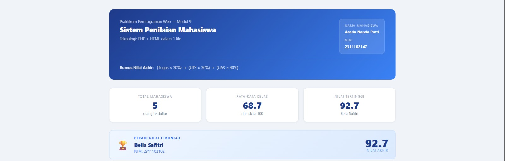
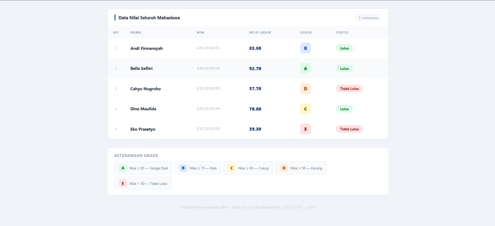

<div align="center">
  <br />
  <h1>LAPORAN PRAKTIKUM <br>APLIKASI BERBASIS PLATFORM</h1>
  <br />
  <h2> MODUL 9 <br> PHP (Sistem Penilaian Mahasiswa) </h2>
  <br />
  <br />
   
  <br />
  <br />
  <br />
  <h3>Disusun Oleh :</h3>
  <p>
    <strong>Azaria Nanda Putri</strong><br>
    <strong>2311102147</strong><br>
    <strong>S1 IF-11-REG 01</strong>
  </p>
  <br />
  <h3>Dosen Pengampu :</h3>
  <p>
    <strong>Dimas Fanny Hebrasianto Permadi, S.ST., M.Kom</strong>
  </p>
  <br />
  <br />
    <h4>Asisten Praktikum :</h4>
    <strong> Apri Pandu Wicaksono </strong> <br>
    <strong>Rangga Pradarrell Fathi</strong>
  <br />
  <h2>LABORATORIUM HIGH PERFORMANCE
 <br>FAKULTAS INFORMATIKA <br>UNIVERSITAS TELKOM PURWOKERTO <br>2026</h2>
</div>

---

# 1. Dasar Teori

### 1. Web Server dan Server-Side Scripting
* **Web Server**: Perangkat lunak yang menerima permintaan HTTP/HTTPS dari browser dan mengirimkan kembali respons berupa halaman HTML. Contoh populer meliputi Apache, IIS, dan Sun Java System Web Server.
* **Server-Side Scripting**: Teknologi di mana program dieksekusi di server untuk menghasilkan halaman web dinamis. Contoh bahasanya antara lain PHP, Python, Ruby, dan ASP.NET.
* **Kelebihan PHP**: Dikenal cepat, gratis (*free*), mudah dipelajari, bersifat *multi-platform*, serta memiliki dukungan komunitas yang besar.


### 2. Dasar-Dasar Pemrograman PHP
* **Sintaks**: Kode PHP ditulis di dalam tag khusus, paling umum adalah `<?php ... ?>`. Setiap pernyataan diakhiri dengan titik koma (`;`).
* **Variabel**: Nama variabel diawali tanda `$`, bersifat *case-sensitive*, dan tipe datanya ditentukan secara otomatis oleh interpreter (tidak perlu deklarasi tipe manual).
* **Konstanta**: Nilai tetap yang tidak berubah, didefinisikan menggunakan fungsi `define()`.
* **Tipe Data**: Mendukung 8 tipe data primitif, termasuk Boolean, Integer, Float, String, Array, Object, Resource, dan Null.

### 3. Logika dan Struktur Kontrol
* **Operator**: PHP menyediakan berbagai operator untuk Aritmatika (`+`, `-`, `*`, `/`, `%`), Perbandingan (`==`, `!=`, `<`, `>`), Logika (`and`, `or`, `&&`, `||`), dan String (titik `.` untuk penggabungan).
* **Kondisional**: Menggunakan struktur `if-else` untuk percabangan logika sederhana dan `switch-case` untuk mengevaluasi variabel dengan banyak kemungkinan nilai.
* **Perulangan (Looping)**:
    * `for`: Digunakan jika jumlah perulangan sudah diketahui pasti.
    * `while` & `do-while`: Digunakan berdasarkan pemenuhan kondisi tertentu.
    * `foreach`: Sangat efektif untuk mengiterasi elemen-elemen di dalam Array.

### 4. Fungsi (Function)
Fungsi digunakan untuk membungkus kode tugas spesifik agar dapat dipanggil berulang kali secara efisien. PHP mendukung fungsi tanpa parameter, fungsi dengan parameter, serta fungsi yang mengembalikan nilai (*return value*).

### 5. Array
* **Array Numerik**: Menggunakan indeks angka (dimulai dari 0) untuk mengakses elemennya.
* **Array Asosiatif**: Menggunakan indeks berupa *string* (kunci), yang mempermudah representasi data seperti pasangan nama dan NIM atau nama dan alamat.
---

# 2. Unguided

## `modul9.php`

File ini berisi logika backend PHP untuk memproses data mahasiswa dan menampilkannya dalam antarmuka HTML yang responsif menggunakan CSS internal.

```php
<?php
/**
 * MODUL 9 — Sistem Penilaian Mahasiswa
 * Nama  : Azaria Nanda Putri
 * NIM   : 2311102147
 */

// 1. DATA MAHASISWA (Array Asosiatif)
$mahasiswa = [
    [
        "nama"        => "Andi Firmansyah",
        "nim"         => "2311102101",
        "nilai_tugas" => 88, "nilai_uts" => 78, "nilai_uas" => 85,
    ],
    // ... data mahasiswa lainnya ...
];

// 2. FUNCTION: Hitung Nilai Akhir
function hitungNilaiAkhir($tugas, $uts, $uas) {
    return ($tugas * 0.30) + ($uts * 0.30) + ($uas * 0.40);
}

// 3. FUNCTION: Tentukan Grade & Status
function tentukanGrade($nilaiAkhir) {
    if ($nilaiAkhir >= 85) return "A";
    elseif ($nilaiAkhir >= 75) return "B";
    elseif ($nilaiAkhir >= 65) return "C";
    elseif ($nilaiAkhir >= 50) return "D";
    else return "E";
}

function tentukanStatus($nilaiAkhir) {
    return ($nilaiAkhir >= 60) ? "Lulus" : "Tidak Lulus";
}

// 4. PROSES DATA
foreach ($mahasiswa as &$mhs) {
    $mhs["nilai_akhir"] = hitungNilaiAkhir($mhs["nilai_tugas"], $mhs["nilai_uts"], $mhs["nilai_uas"]);
    $mhs["grade"] = tentukanGrade($mhs["nilai_akhir"]);
    $mhs["status"] = tentukanStatus($mhs["nilai_akhir"]);
}
?>
````

-----

# 3. Hasil Tampilan

### Screenshot Output

1.  **Header & Statistik**: Menampilkan identitas, rumus, dan ringkasan nilai kelas. </br>


2.  **Highlight Nilai Tertinggi**: Komponen visual yang menampilkan peraih nilai terbaik. </br>



3.  **Tabel Data**: Hasil pengolahan array yang ditampilkan ke dalam tabel HTML. </br>



-----

# 4. Hasil dan Pembahasan

Program ini berhasil mengimplementasikan sistem manajemen nilai sederhana menggunakan PHP murni. Seluruh instruksi praktikum telah dipenuhi dengan detail sebagai berikut:

### A. Pengelolaan Data

  * **Array Asosiasi**: Menggunakan struktur array multidimensi untuk menyimpan 5 data mahasiswa (Andi, Bella, Cahyo, Dina, Eko).
  * **Fungsi Modular**: Logika perhitungan dipisah ke dalam tiga fungsi utama: `hitungNilaiAkhir()`, `tentukanGrade()`, dan `tentukanStatus()`. Hal ini membuat kode lebih bersih dan mudah dirawat.

### B. Algoritma Perhitungan

  * **Bobot Nilai**: Menggunakan operator aritmatika untuk menghitung nilai akhir dengan bobot Tugas (30%), UTS (30%), dan UAS (40%).
  * **Logika Grade**: Menggunakan struktur `if-elseif-else` untuk menentukan grade A hingga E berdasarkan rentang nilai tertentu.
  * **Statistik Kelas**: Program secara otomatis menghitung rata-rata kelas dan mencari nilai tertinggi beserta pemiliknya menggunakan iterasi `foreach`.

### C. Antarmuka (UI/UX)

  * **Tabel HTML**: Seluruh data ditampilkan dalam elemen `<table>` yang rapi.
  * **Visual Feedback**: Penggunaan CSS dinamis (Badge) untuk membedakan Grade (Warna hijau untuk A, merah untuk E) serta status kelulusan memudahkan pengguna dalam membaca data.
  * **Responsif**: Layout menggunakan Grid dan Flexbox agar tetap rapi saat dibuka di perangkat dengan layar lebih kecil.

### D. Kesimpulan

Implementasi PHP dalam satu file (*monolithic*) ini menunjukkan efisiensi PHP dalam menangani logika bisnis sekaligus menyajikan tampilan. Pemisahan referensi variabel `unset($mhs)` setelah loop selesai merupakan praktik baik (*best practice*) untuk menghindari bug pada memori.

----
# 5. Referensi

  - *PHP Manual: Associative Arrays.* [https://www.php.net/manual/en/language.types.array.php](https://www.php.net/manual/en/language.types.array.php)
  - *W3Schools: PHP Functions.* [https://www.w3schools.com/php/php\_functions.asp](https://www.w3schools.com/php/php_functions.asp)
  - *MDN Web Docs: CSS Flexbox & Grid.* [https://developer.mozilla.org/en-US/docs/Web/CSS](https://developer.mozilla.org/en-US/docs/Web/CSS)
```