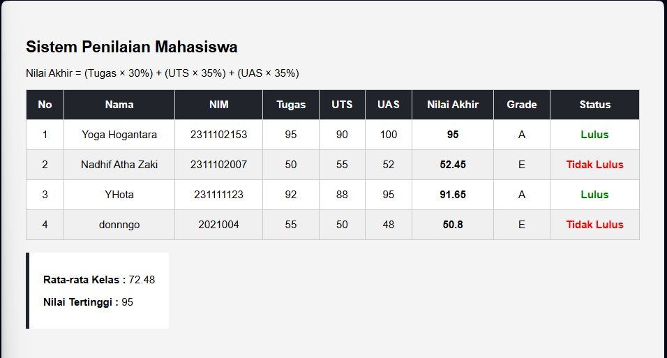

<div align="center">
  <br />
  <h1>LAPORAN PRAKTIKUM <br>APLIKASI BERBASIS PLATFORM</h1>
  <br />
  <h3>TUGAS MODUL 9 <br> PHP: SISTEM PENILAIAN MAHASISWA</h3>
  <br />
  <br />
   
  <br />
  <br />
  <br />
  <br />
  <h3>Disusun Oleh :</h3>
  <p>
    <strong>Yoga Hogantara</strong><br>
    <strong>2311102153</strong><br>
    <strong>S1 IF-11-REG01</strong>
  </p>
  <br />
  <br />
  <h3>Dosen Pengampu :</h3>
  <p>
    <strong>Dimas Fanny Hebrasianto Permadi, S.ST., M.Kom</strong>
  </p>
  <br />
  <br />
    <h4>Asisten Praktikum :</h4>
    <strong> Apri Pandu Wicaksono </strong> <br>
    <strong>Rangga Pradarrell Fathi</strong>
  <br />
  <h3>LABORATORIUM HIGH PERFORMANCE
 <br>FAKULTAS INFORMATIKA <br>UNIVERSITAS TELKOM PURWOKERTO <br>2026</h3>
</div>

---

## Dasar Teori

Dalam praktikum pengembangan sistem penilaian mahasiswa menggunakan PHP, terdapat beberapa konsep teori dasar yang digunakan:

1. **PHP (Hypertext Preprocessor):** Bahasa skrip *server-side* sumber terbuka yang ditanamkan pada HTML, digunakan secara luas untuk pengembangan web dinamis dan pemrosesan logika di sisi *backend*.
2. **Array Asosiatif:** Merupakan jenis struktur data di PHP di mana setiap nilainya dipetakan ke kunci (*key*) bertipe *string* alih-alih indeks numerik. Sangat berguna untuk menyimpan data berpasangan secara spesifik menyerupai baris pada *record* basis data (contoh: `"nama" => "Yoga Hogantara"`).
3. **Fungsi (Function):** Blok kode terisolasi yang dapat dipanggil kembali, menerima parameter *(input)* dan mengembalikan nilai *(output)* untuk menjalankan tugas spesifik. Menggunakan fungsi membuat kode lebih efisien, modular, dan dapat digunakan ulang *(reusable)*.
4. **Struktur Kontrol (Kondisional & Perulangan):** Elemen logika krusial untuk mengatur alur program. **Kondisional** (`if`, `elseif`, `else`) menentukan blok yang dieksekusi berdasarkan kondisi *true/false*. Sedangkan **perulangan** (`foreach`) digunakan untuk menavigasi setiap item di dalam *array* secara berulang untuk efisiensi *rendering* data.

---

## 1. Implementasi Persyaratan Tugas (Kebutuhan Sistem)

Program Sistem Penilaian Mahasiswa ini memenuhi semua syarat wajib pada soal dengan mengimplementasikan komponen-komponen utama PHP dalam **satu file tunggal** (`index.php`).

---

### 1.1 Array Asosiatif untuk Menyimpan Data Mahasiswa (4 Data)

Penyimpanan data menggunakan struktur *array asosiatif* bersarang, sehingga setiap mahasiswa memiliki *key* seperti `"nama"`, `"nim"`, `"nilai_tugas"`, `"nilai_uts"`, dan `"nilai_uas"`.

```php
<?php
$mahasiswa = [
    ["nama" => "Yoga Hogantara",  "nim" => "2311102153", "nilai_tugas" => 95, "nilai_uts" => 90, "nilai_uas" => 100],
    ["nama" => "Nadhif Atha Zaki","nim" => "2311102007", "nilai_tugas" => 50, "nilai_uts" => 55, "nilai_uas" => 52],
    ["nama" => "YHota",           "nim" => "231111123",  "nilai_tugas" => 92, "nilai_uts" => 88, "nilai_uas" => 95],
    ["nama" => "donnngo",         "nim" => "2021004",    "nilai_tugas" => 55, "nilai_uts" => 50, "nilai_uas" => 48],
];
?>
```

---

### 1.2 Function & Operator Aritmatika untuk Menghitung Nilai Akhir

Perhitungan nilai akhir menggunakan **operator aritmatika** perkalian (`*`) dan penjumlahan (`+`) dengan bobot: Tugas 30%, UTS 35%, UAS 35%. Hasilnya dibulatkan menggunakan `round()`.

```php
<?php
function hitungNilaiAkhir($tugas, $uts, $uas) {
    return round(($tugas * 0.30) + ($uts * 0.35) + ($uas * 0.35), 2);
}
?>
```

---

### 1.3 If/Elseif/Else untuk Menentukan Grade

Konversi nilai angka ke huruf menggunakan struktur kondisional `if/elseif/else` dengan 5 tingkatan grade.

```php
<?php
function tentukanGrade($nilai) {
    if ($nilai >= 85)      return "A";
    elseif ($nilai >= 75)  return "B";
    elseif ($nilai >= 65)  return "C";
    elseif ($nilai >= 55)  return "D";
    else                   return "E";
}
?>
```

---

### 1.4 Operator Perbandingan untuk Menentukan Status Kelulusan

Operator **lebih besar sama dengan** (`>=`) digunakan sebagai ambang batas kelulusan. Mahasiswa dengan nilai akhir ≥ 60 dinyatakan **Lulus**, di bawahnya **Tidak Lulus**. Ditulis menggunakan *ternary operator*.

```php
<?php
$mhs["status"] = ($mhs["nilai_akhir"] >= 60) ? "Lulus" : "Tidak Lulus";
?>
```

---

### 1.5 Loop `foreach` untuk Memproses & Menampilkan Data

Loop `foreach` digunakan dua kali: pertama untuk **menghitung** nilai akhir, grade, dan status setiap mahasiswa (sekaligus mengakumulasi total dan nilai tertinggi), kemudian kedua untuk **merender** setiap baris tabel HTML.

**Loop pemrosesan data:**

```php
<?php
$total = 0;
$tertinggi = 0;

foreach ($mahasiswa as &$mhs) {
    $mhs["nilai_akhir"] = hitungNilaiAkhir($mhs["nilai_tugas"], $mhs["nilai_uts"], $mhs["nilai_uas"]);
    $mhs["grade"]       = tentukanGrade($mhs["nilai_akhir"]);
    $mhs["status"]      = ($mhs["nilai_akhir"] >= 60) ? "Lulus" : "Tidak Lulus";

    $total += $mhs["nilai_akhir"];
    if ($mhs["nilai_akhir"] > $tertinggi) $tertinggi = $mhs["nilai_akhir"];
}
unset($mhs); // Wajib setelah foreach by-reference

$rata_rata = round($total / count($mahasiswa), 2);
?>
```

**Loop rendering tabel HTML:**

```php
<tbody>
    <?php foreach ($mahasiswa as $i => $mhs): ?>
    <tr>
        <td><?= $i + 1 ?></td>
        <td><?= $mhs["nama"] ?></td>
        <td><?= $mhs["nim"] ?></td>
        <td><?= $mhs["nilai_tugas"] ?></td>
        <td><?= $mhs["nilai_uts"] ?></td>
        <td><?= $mhs["nilai_uas"] ?></td>
        <td><strong><?= $mhs["nilai_akhir"] ?></strong></td>
        <td><?= $mhs["grade"] ?></td>
        <td class="<?= $mhs["status"] === 'Lulus' ? 'lulus' : 'tidak' ?>">
            <?= $mhs["status"] ?>
        </td>
    </tr>
    <?php endforeach; ?>
</tbody>
```

---

## 2. Source Code Lengkap (`index.php`)

```php
<?php

// Data mahasiswa (array asosiatif)
$mahasiswa = [
    ["nama" => "Yoga Hogantara",   "nim" => "2311102153", "nilai_tugas" => 95, "nilai_uts" => 90, "nilai_uas" => 100],
    ["nama" => "Nadhif Atha Zaki", "nim" => "2311102007", "nilai_tugas" => 50, "nilai_uts" => 55, "nilai_uas" => 52],
    ["nama" => "YHota",            "nim" => "231111123",  "nilai_tugas" => 92, "nilai_uts" => 88, "nilai_uas" => 95],
    ["nama" => "donnngo",          "nim" => "2021004",    "nilai_tugas" => 55, "nilai_uts" => 50, "nilai_uas" => 48],
];

// Function menghitung nilai akhir
function hitungNilaiAkhir($tugas, $uts, $uas) {
    return round(($tugas * 0.30) + ($uts * 0.35) + ($uas * 0.35), 2);
}

// Function menentukan grade
function tentukanGrade($nilai) {
    if ($nilai >= 85)      return "A";
    elseif ($nilai >= 75)  return "B";
    elseif ($nilai >= 65)  return "C";
    elseif ($nilai >= 55)  return "D";
    else                   return "E";
}

$total    = 0;
$tertinggi = 0;

foreach ($mahasiswa as &$mhs) {
    $mhs["nilai_akhir"] = hitungNilaiAkhir($mhs["nilai_tugas"], $mhs["nilai_uts"], $mhs["nilai_uas"]);
    $mhs["grade"]       = tentukanGrade($mhs["nilai_akhir"]);
    $mhs["status"]      = ($mhs["nilai_akhir"] >= 60) ? "Lulus" : "Tidak Lulus";

    $total += $mhs["nilai_akhir"];
    if ($mhs["nilai_akhir"] > $tertinggi) $tertinggi = $mhs["nilai_akhir"];
}
unset($mhs);

$rata_rata = round($total / count($mahasiswa), 2);

?>
<!DOCTYPE html>
<html lang="id">
<head>
    <meta charset="UTF-8">
    <title>Penilaian Mahasiswa</title>
    <style>
        body { font-family: Arial, sans-serif; padding: 20px; background: #f4f4f4; }
        h2   { margin-bottom: 10px; }
        table { border-collapse: collapse; width: 100%; background: white; }
        th, td { border: 1px solid #ccc; padding: 10px; text-align: center; }
        th { background: #21252b; color: white; }
        tr:nth-child(even) { background: #f0f0f0; }
        .lulus { color: green; font-weight: bold; }
        .tidak { color: red;   font-weight: bold; }
        .summary {
            margin-top: 15px; background: white; padding: 12px 16px;
            border-left: 4px solid #21252b; display: inline-block;
        }
    </style>
</head>
<body>

<h2>Sistem Penilaian Mahasiswa</h2>
<p>Nilai Akhir = (Tugas × 30%) + (UTS × 35%) + (UAS × 35%)</p>

<table>
    <thead>
        <tr>
            <th>No</th>
            <th>Nama</th>
            <th>NIM</th>
            <th>Tugas</th>
            <th>UTS</th>
            <th>UAS</th>
            <th>Nilai Akhir</th>
            <th>Grade</th>
            <th>Status</th>
        </tr>
    </thead>
    <tbody>
        <?php foreach ($mahasiswa as $i => $mhs): ?>
        <tr>
            <td><?= $i + 1 ?></td>
            <td><?= $mhs["nama"] ?></td>
            <td><?= $mhs["nim"] ?></td>
            <td><?= $mhs["nilai_tugas"] ?></td>
            <td><?= $mhs["nilai_uts"] ?></td>
            <td><?= $mhs["nilai_uas"] ?></td>
            <td><strong><?= $mhs["nilai_akhir"] ?></strong></td>
            <td><?= $mhs["grade"] ?></td>
            <td class="<?= $mhs["status"] === 'Lulus' ? 'lulus' : 'tidak' ?>">
                <?= $mhs["status"] ?>
            </td>
        </tr>
        <?php endforeach; ?>
    </tbody>
</table>

<div class="summary">
    <p><strong>Rata-rata Kelas :</strong> <?= $rata_rata ?></p>
    <p><strong>Nilai Tertinggi :</strong> <?= $tertinggi ?></p>
</div>

</body>
</html>
```

---

## 3. Hasil Tampilan (Screenshot)

> Jalankan file `index.php` melalui web server lokal (XAMPP/Laragon), lalu akses `http://localhost/[folder]/index.php`.



---

## 4. Referensi

- **PHP Documentation — Arrays:** https://www.php.net/manual/en/language.types.array.php
