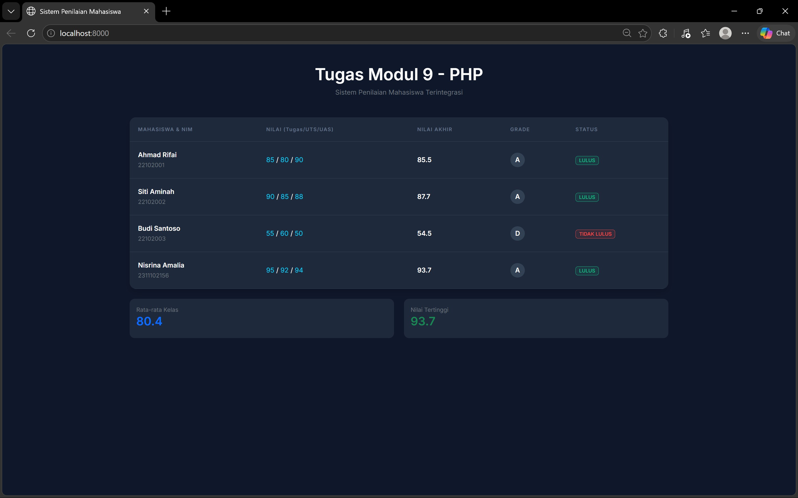

<div align="center">
  <br />
  <h1>LAPORAN PRAKTIKUM <br>APLIKASI BERBASIS PLATFORM</h1>
  <br />
  <h3> MODUL 09 <br> PHP </h3>
  <br />
   
  <br />
  <br />
  <br />
  <h3>Disusun Oleh :</h3>
  <p>
    <strong>Nisrina Amalia Iffatunnisa</strong><br>
    <strong>2311102156</strong><br>
    <strong>S1 IF-11-01</strong>
  </p>
  <br />
  <h3>Dosen Pengampu :</h3>
  <p>
    <strong>Dimas Fanny Hebrasianto Permadi, S.ST., M.Kom</strong>
  </p>
  <br />
  <br />
    <h4>Asisten Praktikum :</h4>
    <strong> Apri Pandu Wicaksono </strong> <br>
    <strong>Rangga Pradarrell Fathi</strong>
  <br />
  <h3>LABORATORIUM HIGH PERFORMANCE
 <br>FAKULTAS INFORMATIKA <br>UNIVERSITAS TELKOM PURWOKERTO <br>2026</h3>
</div>

---

## 1. Dasar Teori

### PHP 
PHP (Hypertext Preprocessor) adalah suatu bahasa pemrograman yang digunakan untuk menterjemahkan basis kode program menjadi kode mesin yang dapat dimengerti oleh komputer yang bersifat server-side yang ditambahkan ke HTML. Hypertext preprocessor (PHP) merupakan bahasa pemrograman untuk pembuatan website dinamis, yang mampu berinteraksi dengan pengunjung atau penggunanya. Dalam pengolahan data, PHP menyediakan berbagai fitur seperti array, function, serta kontrol alur program yang sangat membantu dalam membangun sistem sederhana seperti sistem penilaian mahasiswa.

### Array asosiatif 
Array Asosiatif adalah struktur data yang menyimpan pasangan key dan value, sehingga memudahkan pengelolaan data kompleks seperti data mahasiswa yang memiliki beberapa atribut (nama, NIM, nilai).

### Function 
Digunakan untuk mengorganisir kode agar lebih modular dan reusable. Dalam sistem ini, function digunakan untuk menghitung nilai akhir, menentukan grade, dan status kelulusan.

### Operator  
Digunakan untuk melakukan perhitungan matematis, seperti penjumlahan dan perkalian dalam menghitung nilai akhir. Sedangkan operator perbandingan digunakan untuk menentukan kondisi seperti lulus atau tidak lulus.

### Struktur Kontrol 
struktur kontrol dalam pemrograman yang digunakan untuk menjalankan kode tertentu berdasarkan kondisi atau keputusan. Seperti if/else digunakan untuk pengambilan keputusan, dan loop sebagai proses mengulang instruksi atau blok kode dalam program selama kondisi tertentu terpenuhi digunakan untuk menampilkan data secara berulang dalam bentuk tabel HTML.

## 2. Sourcecode 

### Sourcecode functions.php
``` PHP
<?php
// Fungsi menghitung nilai akhir dengan bobot (Tugas: 30%, UTS: 30%, UAS: 40%)
function hitungNilaiAkhir($tugas, $uts, $uas) {
    return ($tugas * 0.3) + ($uts * 0.3) + ($uas * 0.4);
}

// Fungsi menentukan Grade
function tentukanGrade($nilai) {
    if ($nilai >= 85) return "A";
    if ($nilai >= 75) return "B";
    if ($nilai >= 60) return "C";
    if ($nilai >= 45) return "D";
    return "E";
}

// Fungsi menentukan Status Kelulusan
function cekKelulusan($nilai) {
    return $nilai >= 60 ? "LULUS" : "TIDAK LULUS";
}

// Fungsi mendapatkan warna badge berdasarkan status
function getStatusBadge($status) {
    return $status == "LULUS" ? "badge-lulus" : "badge-tidak-lulus";
}
?>
```

### Sourcecode index.php
``` PHP
<?php
include 'functions.php';

// Array Asosiasi Data Mahasiswa
$mahasiswa = [
    ["nama" => "Ahmad Rifai", "nim" => "22102001", "tugas" => 85, "uts" => 80, "uas" => 90],
    ["nama" => "Siti Aminah", "nim" => "22102002", "tugas" => 90, "uts" => 85, "uas" => 88],
    ["nama" => "Budi Santoso", "nim" => "22102003", "tugas" => 55, "uts" => 60, "uas" => 50],
    ["nama" => "Nisrina Amalia", "nim" => "2311102156", "tugas" => 95, "uts" => 92, "uas" => 94]
];

// Inisialisasi variabel untuk statistik
$totalNilai = 0;
$nilaiTertinggi = 0;
?>

<!DOCTYPE html>
<html lang="id">
<head>
    <meta charset="UTF-8">
    <meta name="viewport" content="width=device-width, initial-scale=1.0">
    <title>Sistem Penilaian Mahasiswa</title>
    <link href="https://cdn.jsdelivr.net/npm/bootstrap@5.3.0/dist/css/bootstrap.min.css" rel="stylesheet">
    <link href="https://fonts.googleapis.com/css2?family=Inter:wght@300;400;600&display=swap" rel="stylesheet">
    <link rel="stylesheet" href="style.css">
</head>
<body>

<div class="container mt-5">
    <div class="text-center mb-5">
        <h1 class="fw-bold text-white header-title">Tugas Modul 9 - PHP</h1>
        <p class="text-secondary">Sistem Penilaian Mahasiswa Terintegrasi</p>
        <div class="header-line"></div>
    </div>
    <div class="card main-card border-0 shadow">
        <div class="card-body p-0">
            <div class="table-responsive">
                <table class="table table-dark table-hover mb-0">
                    <thead>
                        <tr>
                            <th>MAHASISWA & NIM</th>
                            <th>NILAI (Tugas/UTS/UAS)</th>
                            <th>NILAI AKHIR</th>
                            <th>GRADE</th>
                            <th>STATUS</th>
                        </tr>
                    </thead>
                    <tbody>
                        <?php foreach ($mahasiswa as $mhs) : 
                            $na = hitungNilaiAkhir($mhs['tugas'], $mhs['uts'], $mhs['uas']);
                            $grade = tentukanGrade($na);
                            $status = cekKelulusan($na);
                            
                            // Update statistik
                            $totalNilai += $na;
                            if ($na > $nilaiTertinggi) $nilaiTertinggi = $na;
                        ?>
                        <tr>
                            <td>
                                <div class="fw-bold"><?= $mhs['nama'] ?></div>
                                <small class="text-secondary"><?= $mhs['nim'] ?></small>
                            </td>
                            <td>
                                <span class="text-info"><?= $mhs['tugas'] ?></span> / 
                                <span class="text-info"><?= $mhs['uts'] ?></span> / 
                                <span class="text-info"><?= $mhs['uas'] ?></span>
                            </td>
                            <td class="fw-bold"><?= number_format($na, 1) ?></td>
                            <td><span class="grade-circle"><?= $grade ?></span></td>
                            <td>
                                <span class="badge <?= getStatusBadge($status) ?>">
                                    <?= $status ?>
                                </span>
                            </td>
                        </tr>
                        <?php endforeach; ?>
                    </tbody>
                </table>
            </div>
        </div>
    </div>

    <div class="row mt-4">
        <div class="col-md-6">
            <div class="card stat-card bg-dark text-white border-0 p-3 mb-3">
                <small class="text-secondary">Rata-rata Kelas</small>
                <h3 class="fw-bold text-primary"><?= number_format($totalNilai / count($mahasiswa), 1) ?></h3>
            </div>
        </div>
        <div class="col-md-6">
            <div class="card stat-card bg-dark text-white border-0 p-3 mb-3">
                <small class="text-secondary">Nilai Tertinggi</small>
                <h3 class="fw-bold text-success"><?= number_format($nilaiTertinggi, 1) ?></h3>
            </div>
        </div>
    </div>
</div>

</body>
</html>
```

### Sourcecode style.css
``` CSS
body {
    background-color: #0f172a; /* Dark Navy Background */
    font-family: 'Inter', sans-serif;
    color: #f8fafc;
}

.main-card {
    background-color: #1e293b;
    border-radius: 15px;
    overflow: hidden;
}

.table-dark {
    background-color: transparent !important;
    --bs-table-bg: transparent;
}

thead th {
    background-color: #1e293b !important;
    color: #64748b !important;
    font-size: 0.75rem;
    letter-spacing: 0.1em;
    padding: 20px !important;
    border-bottom: 1px solid #334155 !important;
}

tbody td {
    padding: 20px !important;
    vertical-align: middle;
    border-bottom: 1px solid #334155 !important;
}

.btn-custom {
    background-color: #2563eb;
    border: none;
    border-radius: 8px;
    padding: 10px 20px;
    font-weight: 600;
}

.badge-lulus {
    background-color: rgba(16, 185, 129, 0.1);
    color: #10b981;
    border: 1px solid #10b981;
}

.badge-tidak-lulus {
    background-color: rgba(239, 68, 68, 0.1);
    color: #ef4444;
    border: 1px solid #ef4444;
}

.grade-circle {
    display: inline-block;
    width: 35px;
    height: 35px;
    line-height: 35px;
    text-align: center;
    background: #334155;
    border-radius: 50%;
    font-weight: bold;
}

.stat-card {
    border-radius: 12px;
    background-color: #1e293b !important;
}
```


## 3. Penjelasan Implementasi Sistem 
Pada praktikum ini dibuat sebuah program Sistem Penilaian Mahasiswa yang menampikan data nilai mahasiswa secara sederhana. Program ini terdiri dari tiga file utama, yaitu `functions.php`, `index.php`, dan `style.css`.

Tampilan Website


### a. File functions.php
File ini berisi kumpulan function yang digunakan dalam program:
- hitungNilaiAkhir(): Menghitung nilai akhir dengan bobot Tugas 30%, UTS: 30%, UAS: 40%
- tentukanGrade(): Menentukan grade berdasarkan nilai akhir, diantaranya A ≥ 85, B ≥ 75, C ≥ 60, D ≥ 45, dan E < 45
- cekKelulusan(): Menentukan status kelulusan LULUS jika nilai ≥ 60 dan TIDAK LULUS jika < 60
- getStatusBadge(): Mengatur tampilan warna badge berdasarkan status

### b. File index.php
File ini merupakan utama yang menjalankan program
- Inisialisasi Data: Data mahasiswa disimpan dalam array asosiatif yang berisi: Nama NIM Nilai tugas, UTS, dan UAS. 
- Perhitungan Data: Menggunakan loop foreach untuk Menghitung nilai akhir, Menentukan grade, Menentukan status kelulusan, Menghitung total nilai untuk rata-rata, dan Menentukan nilai tertinggi.
- Tampilan HTML: Data ditampilkan dalam bentuk tabel dengan kolom: Mahasiswa & NIM, Nilai, Nilai akhir, Grade, dan Status.
- Statistik Tambahan: Rata-rata kelas dihitung dari total nilai dibagi jumlah mahasiswa Nilai tertinggi ditampilkan sebagai informasi tambahan.

### c. File style.css
Digunakan untuk memperindah tampilan dengan konsep dark mode modern:
- Background gelap (dark navy)
- Card dengan rounded corner
- Badge warna hijau (lulus) dan merah (tidak lulus)
- Tampilan grade dalam bentuk lingkaran
- Styling tabel agar lebih rapi dan profesional


## Kesimpulan
Praktikum ini berhasil memenuhi seluruh ketentuan praktikum. Program sistem penilaian mahasiswa ini berhasil diimplementasikan menggunakan PHP dengan memanfaatkan array asosiatif, function, serta struktur kontrol seperti loop dan percabangan. Program mampu menghitung nilai akhir, menentukan grade, dan status kelulusan secara otomatis. Selain itu, ditampilkan juga statistik berupa rata-rata kelas dan nilai tertinggi. Tampilan yang dibuat menggunakan Bootstrap dan CSS memberikan nilai tambah dari segi user interface sehingga lebih menarik dan mudah dibaca.

## Referensi
[1] Prahasti, P., Sapri, S., & Utami, F. H. (2022). Aplikasi Pelayanan Antrian Pasien Menggunakan Metode FCFS Menggunakan PHP dan MySQL. Jurnal Media Infotama, 18(1), 153-160.

[2] [Modul 09 PHP](https://drive.google.com/drive/folders/1ug7dmm-aVF-NG9-YT5kT519HdGmkXaD-) </br>
