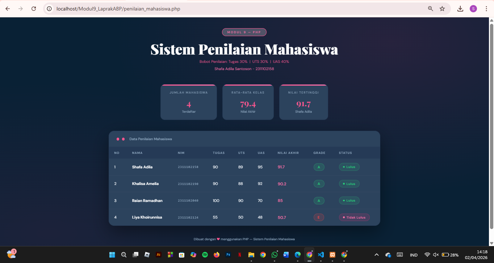

<div align="center">

# LAPORAN PRAKTIKUM  
# APLIKASI BERBASIS PLATFORM

## MODUL 9
## PHP


### Disusun Oleh
**Shafa Adila Santoso**  
2311102158  
S1 IF-11-REG01

### Dosen Pengampu
**Dimas Fanny Hebrasianto Permadi, S.ST., M.Kom**

### Asisten Praktikum
Apri Pandu Wicaksono  
Rangga Pradarrell Fathi  

### LABORATORIUM HIGH PERFORMANCE  
FAKULTAS INFORMATIKA  
UNIVERSITAS TELKOM PURWOKERTO  
2026

</div>

---

<div align="justify">

# 1. Dasar Teori

PHP (Hypertext Preprocessor) merupakan bahasa pemrograman berbasis server-side scripting yang digunakan untuk mengembangkan aplikasi web dinamis. PHP bekerja di sisi server, sehingga kode program akan diproses terlebih dahulu oleh web server sebelum dikirimkan ke browser dalam bentuk HTML.

1. Web Server dan Server Side Scripting
    
    Web server adalah perangkat lunak yang berfungsi menerima request dari client (browser) melalui protokol    HTTP/HTTPS dan mengirimkan response berupa halaman web. Server-side scripting memungkinkan pembuatan halaman web yang dinamis karena proses pengolahan data dilakukan di server. Beberapa contoh web server antara lain Apache dan IIS, sedangkan contoh server-side scripting adalah PHP, ASP, dan JSP.

2. Instalasi Lingkungan PHP

    Untuk menjalankan PHP diperlukan web server dan database. Salah satu paket yang sering digunakan adalah XAMPP, yang sudah mencakup Apache, PHP, dan MySQL dalam satu instalasi sehingga memudahkan proses pengembangan web.

3. Pengenalan PHP

    PHP pertama kali dikembangkan oleh Rasmus Lerdorf pada tahun 1994. Penulisan kode PHP dilakukan di dalam tag khusus seperti: `<?php ... ?>` Setiap pernyataan diakhiri dengan tanda titik koma (;). PHP juga bersifat case sensitive untuk identifier buatan pengguna.

4. Variabel dan Tipe Data

    Variabel dalam PHP digunakan untuk menyimpan data dan diawali dengan simbol $. PHP tidak memerlukan deklarasi tipe data secara eksplisit karena tipe data akan ditentukan secara otomatis. Tipe data pada PHP meliputi:

    - Boolean
    - Integer
    - Float
    - String
    - Array
    - Object
    - Resource
    - NULL

5. Konstanta

    Konstanta adalah nilai tetap yang tidak dapat diubah selama program berjalan. Konstanta dibuat menggunakan fungsi define().

6. Operator dalam PHP

    PHP memiliki berbagai jenis operator, antara lain:

    - Operator aritmatika (+, -, *, /, %)
    - Operator penugasan (=)
    - Operator perbandingan (==, !=, >, <, dll)
    - Operator logika (&&, ||, !)
    - Operator string (.)

    Operator digunakan untuk melakukan operasi terhadap data atau variabel.

7. Struktur Kondisi

    Struktur kondisi digunakan untuk pengambilan keputusan dalam program, seperti:

    - if-else → untuk kondisi sederhana
    - switch-case → untuk banyak pilihan kondisi

    Struktur ini memungkinkan program menentukan aksi berdasarkan kondisi tertentu.

8. Perulangan (Looping)

    Perulangan digunakan untuk menjalankan perintah secara berulang, antara lain:

    - for
    - while
    - do-while
    - foreach

    Looping sangat berguna untuk memproses data dalam jumlah banyak secara efisien.

9. Function (Fungsi)

    Fungsi adalah sekumpulan perintah yang digunakan untuk menjalankan tugas tertentu dan dapat dipanggil berulang kali. Fungsi dapat memiliki parameter dan nilai kembalian (return value), sehingga membuat kode lebih terstruktur dan efisien.

10. Array

    Array adalah struktur data yang digunakan untuk menyimpan banyak nilai dalam satu variabel. Array pada PHP dapat berupa:

    - Array indeks (numerik)
    - Array asosiatif (menggunakan key berupa string)

    Array memudahkan pengelolaan data dalam jumlah banyak.

**Kesimpulan**

PHP merupakan bahasa pemrograman server-side yang banyak digunakan dalam pengembangan web karena mudah dipelajari, fleksibel, dan mendukung pembuatan web dinamis. Dengan memahami konsep dasar seperti variabel, operator, struktur kontrol, fungsi, dan array, pengguna dapat membangun aplikasi web yang lebih kompleks dan terstruktur.

---

**Code :**

```php
<?php

// =============================================
// DATA MAHASISWA (Array Asosiatif)
// =============================================
$mahasiswa = [
    [
        "nama"         => "Shafa Adila",
        "nim"          => "2311102158",
        "nilai_tugas"  => 90,
        "nilai_uts"    => 89,
        "nilai_uas"    => 95,
    ],
    [
        "nama"         => "Khalisa Amelia",
        "nim"          => "2311102190",
        "nilai_tugas"  => 90,
        "nilai_uts"    => 88,
        "nilai_uas"    => 92,
    ],
    [
        "nama"         => "Raian Ramadhan",
        "nim"          => "2311102040",
        "nilai_tugas"  => 100,
        "nilai_uts"    => 90,
        "nilai_uas"    => 70,
    ],
    [
        "nama"         => "Liya Khoirunnisa",
        "nim"          => "2311102124",
        "nilai_tugas"  => 55,
        "nilai_uts"    => 50,
        "nilai_uas"    => 48,
    ],
];

// =============================================
// FUNCTION: Hitung Nilai Akhir
// Bobot: Tugas 30%, UTS 30%, UAS 40%
// =============================================
function hitungNilaiAkhir($tugas, $uts, $uas) {
    $nilai_akhir = ($tugas * 0.30) + ($uts * 0.30) + ($uas * 0.40);
    return round($nilai_akhir, 2);
}

// =============================================
// FUNCTION: Tentukan Grade
// =============================================
function tentukanGrade($nilai_akhir) {
    if ($nilai_akhir >= 85) {
        return "A";
    } elseif ($nilai_akhir >= 75) {
        return "B";
    } elseif ($nilai_akhir >= 65) {
        return "C";
    } elseif ($nilai_akhir >= 55) {
        return "D";
    } else {
        return "E";
    }
}

// =============================================
// FUNCTION: Tentukan Status Kelulusan
// =============================================
function tentukanStatus($nilai_akhir) {
    if ($nilai_akhir >= 65) {
        return "LULUS";
    } else {
        return "TIDAK LULUS";
    }
}

// =============================================
// PROSES DATA: Hitung semua nilai, cari rata-rata & tertinggi
// =============================================
$total_nilai   = 0;
$nilai_tertinggi = 0;
$nama_tertinggi  = "";
$jumlah_mahasiswa = count($mahasiswa);

// Loop pertama: hitung nilai akhir untuk setiap mahasiswa
foreach ($mahasiswa as &$mhs) {
    $mhs["nilai_akhir"] = hitungNilaiAkhir($mhs["nilai_tugas"], $mhs["nilai_uts"], $mhs["nilai_uas"]);
    $mhs["grade"]       = tentukanGrade($mhs["nilai_akhir"]);
    $mhs["status"]      = tentukanStatus($mhs["nilai_akhir"]);

    // Akumulasi total untuk rata-rata
    $total_nilai += $mhs["nilai_akhir"];

    // Cek nilai tertinggi
    if ($mhs["nilai_akhir"] > $nilai_tertinggi) {
        $nilai_tertinggi = $mhs["nilai_akhir"];
        $nama_tertinggi  = $mhs["nama"];
    }
}
unset($mhs); // Hapus referensi

$rata_rata_kelas = round($total_nilai / $jumlah_mahasiswa, 2);

?>
<!DOCTYPE html>
<html lang="id">
<head>
    <meta charset="UTF-8">
    <meta name="viewport" content="width=device-width, initial-scale=1.0">
    <title>Sistem Penilaian Mahasiswa</title>
    <link href="https://fonts.googleapis.com/css2?family=Playfair+Display:wght@700;900&family=DM+Sans:wght@400;500;600&display=swap" rel="stylesheet">
    <style>
        :root {
            --navy:      #092135;
            --navy-mid:  #2c435d;
            --navy-light:#253a56;
            --pink:      #fa568f;
            --pink-soft: #ff6fa8;
            --pink-glow: rgba(248, 233, 239, 0.25);
            --white:     #ffffff;
            --off-white: #f0f4f8;
            --text-dim:  #8fa8c0;
        }

        * {
            margin: 0;
            padding: 0;
            box-sizing: border-box;
        }

        body {
            font-family: 'DM Sans', sans-serif;
            background-color: var(--navy);
            color: var(--white);
            min-height: 100vh;
            padding: 40px 20px 60px;
            background-image:
                radial-gradient(ellipse at 80% 10%, rgba(255, 45, 120, 0.12) 0%, transparent 50%),
                radial-gradient(ellipse at 10% 90%, rgba(255, 45, 120, 0.08) 0%, transparent 50%);
        }

        /* ── HEADER ── */
        .header {
            text-align: center;
            margin-bottom: 48px;
            animation: fadeDown 0.7s ease both;
        }

        .header .badge {
            display: inline-block;
            background: var(--pink-glow);
            border: 1px solid var(--pink);
            color: var(--pink-soft);
            font-size: 11px;
            font-weight: 600;
            letter-spacing: 3px;
            text-transform: uppercase;
            padding: 6px 18px;
            border-radius: 50px;
            margin-bottom: 18px;
        }

        .header h1 {
            font-family: 'Playfair Display', serif;
            font-size: clamp(28px, 5vw, 52px);
            font-weight: 900;
            line-height: 1.1;
            color: var(--white);
        }

        .header h1 span {
            color: var(--pink);
        }

        .header p {
            margin-top: 10px;
            color: var(--text-dim);
            font-size: 14px;
        }

        /* ── STAT CARDS ── */
        .stats {
            display: flex;
            gap: 20px;
            justify-content: center;
            flex-wrap: wrap;
            margin-bottom: 40px;
            animation: fadeUp 0.7s 0.2s ease both;
        }

        .stat-card {
            background: var(--navy-mid);
            border: 1px solid var(--navy-light);
            border-radius: 16px;
            padding: 22px 32px;
            text-align: center;
            min-width: 180px;
            position: relative;
            overflow: hidden;
            transition: transform 0.2s, box-shadow 0.2s;
        }

        .stat-card::before {
            content: '';
            position: absolute;
            top: 0; left: 0; right: 0;
            height: 3px;
            background: linear-gradient(90deg, var(--pink), var(--pink-soft));
        }

        .stat-card:hover {
            transform: translateY(-4px);
            box-shadow: 0 12px 32px rgba(255, 45, 120, 0.2);
        }

        .stat-card .stat-label {
            font-size: 11px;
            letter-spacing: 2px;
            text-transform: uppercase;
            color: var(--text-dim);
            margin-bottom: 8px;
        }

        .stat-card .stat-value {
            font-family: 'Playfair Display', serif;
            font-size: 32px;
            font-weight: 700;
            color: var(--pink);
        }

        .stat-card .stat-sub {
            font-size: 12px;
            color: var(--text-dim);
            margin-top: 4px;
        }

        /* ── TABLE WRAPPER ── */
        .table-wrapper {
            max-width: 1000px;
            margin: 0 auto;
            background: var(--navy-mid);
            border: 1px solid var(--navy-light);
            border-radius: 20px;
            overflow: hidden;
            box-shadow: 0 24px 64px rgba(0, 0, 0, 0.4);
            animation: fadeUp 0.7s 0.35s ease both;
        }

        .table-header-bar {
            padding: 20px 28px;
            border-bottom: 1px solid var(--navy-light);
            display: flex;
            align-items: center;
            gap: 10px;
        }

        .table-header-bar .dot {
            width: 10px; height: 10px;
            border-radius: 50%;
        }
        .dot-r { background: #fa568f; }
        .dot-y { background: #fa568f; }

        .table-header-bar span {
            margin-left: 8px;
            font-size: 13px;
            color: var(--text-dim);
            font-weight: 500;
        }

        table {
            width: 100%;
            border-collapse: collapse;
        }

        thead th {
            background: var(--navy-light);
            color: var(--text-dim);
            font-size: 11px;
            letter-spacing: 1.5px;
            text-transform: uppercase;
            font-weight: 600;
            padding: 14px 20px;
            text-align: left;
        }

        tbody tr {
            border-bottom: 1px solid rgba(255,255,255,0.04);
            transition: background 0.2s;
        }

        tbody tr:last-child {
            border-bottom: none;
        }

        tbody tr:hover {
            background: rgba(255, 45, 120, 0.05);
        }

        tbody td {
            padding: 16px 20px;
            font-size: 14px;
            color: var(--off-white);
            vertical-align: middle;
        }

        .td-nama {
            font-weight: 600;
            color: var(--white);
        }

        .td-nim {
            color: var(--text-dim);
            font-size: 12px;
            font-family: monospace;
            letter-spacing: 1px;
        }

        .td-nilai {
            font-weight: 600;
            font-size: 15px;
            color: var(--pink-soft);
        }

        /* ── GRADE BADGE ── */
        .grade-badge {
            display: inline-block;
            padding: 4px 14px;
            border-radius: 50px;
            font-weight: 700;
            font-size: 13px;
            letter-spacing: 1px;
        }

        .grade-A { background: rgba(40, 200, 120, 0.15); color: #28c878; border: 1px solid rgba(40,200,120,0.3); }
        .grade-B { background: rgba(80, 180, 255, 0.15); color: #50b4ff; border: 1px solid rgba(80,180,255,0.3); }
        .grade-C { background: rgba(255, 200, 50, 0.15);  color: #ffc832;  border: 1px solid rgba(255,200,50,0.3); }
        .grade-D { background: rgba(255, 140, 50, 0.15);  color: #ff8c32;  border: 1px solid rgba(255,140,50,0.3); }
        .grade-E { background: rgba(255, 70, 70, 0.15);   color: #ff4646;  border: 1px solid rgba(255,70,70,0.3); }

        /* ── STATUS BADGE ── */
        .status-badge {
            display: inline-flex;
            align-items: center;
            gap: 6px;
            padding: 5px 14px;
            border-radius: 50px;
            font-size: 12px;
            font-weight: 600;
            letter-spacing: 0.5px;
        }

        .status-lulus {
            background: rgba(40, 200, 120, 0.12);
            color: #28c878;
            border: 1px solid rgba(40, 200, 120, 0.25);
        }

        .status-tidak {
            background: rgba(255, 45, 120, 0.12);
            color: var(--pink-soft);
            border: 1px solid rgba(255, 45, 120, 0.25);
        }

        .status-dot {
            width: 6px; height: 6px;
            border-radius: 50%;
            background: currentColor;
        }

        /* ── FOOTER ── */
        .footer {
            text-align: center;
            margin-top: 40px;
            color: var(--text-dim);
            font-size: 12px;
            animation: fadeUp 0.7s 0.5s ease both;
        }

        .footer span { color: var(--pink); }

        /* ── ANIMATIONS ── */
        @keyframes fadeDown {
            from { opacity: 0; transform: translateY(-20px); }
            to   { opacity: 1; transform: translateY(0); }
        }

        @keyframes fadeUp {
            from { opacity: 0; transform: translateY(20px); }
            to   { opacity: 1; transform: translateY(0); }
        }

        /* ── RESPONSIVE ── */
        @media (max-width: 700px) {
            tbody td, thead th { padding: 12px 12px; font-size: 12px; }
            .stat-card { min-width: 140px; padding: 18px 20px; }
        }
    </style>
</head>
<body>

    <!-- HEADER -->
    <div class="header">
        <div class="badge">Modul 9 — PHP</div>
        <h1>Sistem Penilaian Mahasiswa</h1>
        <p style="color: var(--pink);"> Bobot Penilaian: Tugas 30% &nbsp;|&nbsp; UTS 30% &nbsp;|&nbsp; UAS 40%</p>
        <p style="color: var(--pink-soft);"> Shafa Adila Santoson - 2311102158</p>   
    </div>

    <!-- STAT CARDS -->
    <div class="stats">
        <div class="stat-card">
            <div class="stat-label">Jumlah Mahasiswa</div>
            <div class="stat-value"><?= $jumlah_mahasiswa ?></div>
            <div class="stat-sub">Terdaftar</div>
        </div>
        <div class="stat-card">
            <div class="stat-label">Rata-rata Kelas</div>
            <div class="stat-value"><?= $rata_rata_kelas ?></div>
            <div class="stat-sub">Nilai Akhir</div>
        </div>
        <div class="stat-card">
            <div class="stat-label">Nilai Tertinggi</div>
            <div class="stat-value"><?= $nilai_tertinggi ?></div>
            <div class="stat-sub"><?= $nama_tertinggi ?></div>
        </div>
    </div>

    <!-- TABLE -->
    <div class="table-wrapper">
        <div class="table-header-bar">
            <div class="dot dot-r"></div>
            <div class="dot dot-y"></div>
            <span>Data Penilaian Mahasiswa</span>
        </div>

        <table>
            <thead>
                <tr>
                    <th>No</th>
                    <th>Nama</th>
                    <th>NIM</th>
                    <th>Tugas</th>
                    <th>UTS</th>
                    <th>UAS</th>
                    <th>Nilai Akhir</th>
                    <th>Grade</th>
                    <th>Status</th>
                </tr>
            </thead>
            <tbody>
                <?php $no = 1; ?>
                <?php foreach ($mahasiswa as $mhs) : ?>
                <tr>
                    <td><?= $no++ ?></td>
                    <td class="td-nama"><?= htmlspecialchars($mhs["nama"]) ?></td>
                    <td class="td-nim"><?= htmlspecialchars($mhs["nim"]) ?></td>
                    <td><?= $mhs["nilai_tugas"] ?></td>
                    <td><?= $mhs["nilai_uts"] ?></td>
                    <td><?= $mhs["nilai_uas"] ?></td>
                    <td class="td-nilai"><?= $mhs["nilai_akhir"] ?></td>
                    <td>
                        <span class="grade-badge grade-<?= $mhs["grade"] ?>">
                            <?= $mhs["grade"] ?>
                        </span>
                    </td>
                    <td>
                        <?php if ($mhs["status"] === "LULUS") : ?>
                            <span class="status-badge status-lulus">
                                <span class="status-dot"></span> Lulus
                            </span>
                        <?php else : ?>
                            <span class="status-badge status-tidak">
                                <span class="status-dot"></span> Tidak Lulus
                            </span>
                        <?php endif; ?>
                    </td>
                </tr>
                <?php endforeach; ?>
            </tbody>
        </table>
    </div>

    <!-- FOOTER -->
    <div class="footer">
        Dibuat dengan <span>&#10084;</span> menggunakan PHP &mdash; Sistem Penilaian Mahasiswa
    </div>

</body>
</html>
```


Program ini digunakan untuk mengolah data nilai mahasiswa menggunakan PHP. Program menghitung nilai akhir, menentukan grade, serta status kelulusan, kemudian menampilkannya dalam bentuk tabel web.

1. Struktur Data

    Data disimpan dalam array asosiatif multidimensi yang berisi:

    - Nama
    - NIM
    - Nilai tugas, UTS, dan UAS

2. Fungsi Program

    Program memiliki beberapa fungsi utama:

    - hitungNilaiAkhir() → menghitung nilai akhir (Tugas 30%, UTS 30%, UAS 40%)
    - tentukanGrade() → menentukan grade (A–E) berdasarkan nilai akhir
    - tentukanStatus() → menentukan kelulusan (≥65 Lulus, <65 Tidak Lulus)

3. Proses Pengolahan

    Data diproses menggunakan perulangan foreach, dengan langkah:

    - Menghitung nilai akhir
    - Menentukan grade dan status
    - Menghitung rata-rata kelas
    - Menentukan nilai tertinggi

4. Output Program

    Hasil ditampilkan dalam:

    - Statistik: jumlah mahasiswa, rata-rata, nilai tertinggi
    - Tabel: berisi nama, NIM, nilai, nilai akhir, grade, dan status
5. Fitur Tambahan
    - htmlspecialchars() → untuk keamanan (mencegah XSS)
    - PHP dalam HTML (<?= ?>) → untuk tampilan dinamis
    - if-else → untuk menentukan status kelulusan

**Kesimpulan**

    Program ini menerapkan konsep dasar PHP seperti array, function, percabangan, dan perulangan untuk membangun sistem penilaian mahasiswa yang sederhana dan dinamis.

**Output:**

<p align="center">  </p> 

# 2. Referensi
- [Materi Modul 9](https://drive.google.com/file/d/1Fgj2rbye0s7QZ5VBigpSiTyPBl8TjpKB/view?usp=sharing)
