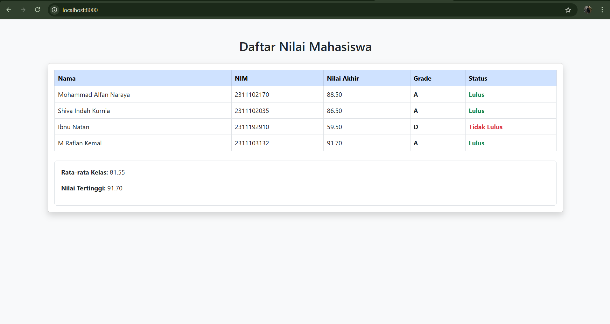

<div align="center">
  <br />
  <h1>LAPORAN PRAKTIKUM <br> APLIKASI BERBASIS PLATFORM</h1>
  <br />
  <h3>MODUL 9 <br> PHP</h3>
  <br />
  
  <br />
  <br />
  <br />
  <h3>Disusun Oleh :</h3>
  <p>
    <strong>Mohammad Alfan Naraya</strong><br>
    <strong>2311102170</strong><br>
    <strong>S1 IF-11-01</strong>
  </p>
  <br />
  <h3>Dosen Pengampu :</h3>
  <p>
    <strong>Dimas Fanny Hebrasianto Permadi, S.ST., M.Kom</strong>
  </p>
  <br />
  <br />
  <h4>Asisten Praktikum :</h4>
  <strong>Apri Pandu Wicaksono</strong> <br>
  <strong>Rangga Pradarrell Fathi</strong>
  <br />
  <br />
  <br />
  <br />
  <h3>LABORATORIUM HIGH PERFORMANCE <br> FAKULTAS INFORMATIKA <br> UNIVERSITAS TELKOM PURWOKERTO <br> 2026</h3>
</div>

---

## 1. Dasar Teori

**PHP** adalah bahasa pemrograman server-side yang sangat penting untuk membuat website dinamis. PHP bekerja di balik layar untuk mengolah logika, memproses data input, dan menghasilkan konten yang diubah sesuai kebutuhan pengguna sebelum dikirimkan ke peramban. Ini berbeda dengan HTML atau CSS, yang berfokus pada elemen visual.

**Pengelolaan Data dengan Array dan Function**
Selama tahap pengajaran awal, PHP memungkinkan pengolahan data tanpa database dengan menggunakan array asosiatif. Struktur ini menyimpan data dalam pasangan kunci dan nilai. Ini membuat informasi siswa seperti nama, NIM, dan komponen nilai lebih mudah diatur dan diakses.

**Logika Program dan Visualisasi Data**
Salah satu elemen logika utama yang digunakan oleh sistem penilaian ini adalah:

- Operator Aritmatika dan Perbandingan: Digunakan untuk menghitung nilai akhir berdasarkan bobot dan membandingkannya dengan standar kelulusan.

- Struktur percabangan (if/else): berfungsi untuk menentukan nilai siswa (A, B, C, dst.) dan status kelulusan mereka.

- Perulangan, juga dikenal sebagai "foreach", memungkinkan Anda menyisir seluruh data dalam array dan secara otomatis menampilkannya dalam format tabel HTML.

**Implementasi Praktikum: Sistem Penilaian Mahasiswa**
Praktikum ini menggunakan PHP, HTML, dan CSS untuk membuat Sistem Penilaian Mahasiswa. Selain mengolah angka, program ini dapat melakukan analisis data seperti:

1. Penghitungan nilai akhir yang dilakukan secara otomatis.

2. Mengidentifikasi status kelulusan dan predikat nilai.

3. Menampilkan data kelas dengan skor tertinggi dan rata-rata.

4. Tampilan antarmuka yang bersih, profesional, dan mudah digunakan.
---

## 2. Penjelasan Kode PHP, HTML, dan CSS

### Kode Program (`index.php`)

```php
<?php

$daftarMahasiswa = [
    [
        "nama" => "Mohammad Alfan Naraya",
        "nim" => "2311102170",
        "tugas" => 90,
        "uts" => 85,
        "uas" => 90
    ],
    [
        "nama" => "Shiva Indah Kurnia",
        "nim" => "2311102035",
        "tugas" => 85,
        "uts" => 90,
        "uas" => 85
    ],
    [
        "nama" => "Ibnu Natan",
        "nim" => "2311192910",
        "tugas" => 60,
        "uts" => 65,
        "uas" => 55
    ],
    [
        "nama" => "M Raflan Kemal",
        "nim" => "2311103132",
        "tugas" => 95,
        "uts" => 88,
        "uas" => 92
    ]
];


function hitungNilaiAkhir($tugas, $uts, $uas) {
    return ($tugas * 0.3) + ($uts * 0.3) + ($uas * 0.4);
}


function tentukanGrade($nilai) {
    if ($nilai >= 80) return "A";
    elseif ($nilai >= 70) return "B";
    elseif ($nilai >= 60) return "C";
    elseif ($nilai >= 50) return "D";
    else return "E";
}


function tentukanStatus($nilai) {
    return ($nilai >= 60) ? "Lulus" : "Tidak Lulus";
}


$totalNilai = 0;
$nilaiTertinggi = 0;
?>

<!DOCTYPE html>
<html lang="id">
<head>
    <meta charset="UTF-8">
    <title>Sistem Penilaian Mahasiswa</title>
    <link href="https://cdn.jsdelivr.net/npm/bootstrap@5.3.0/dist/css/bootstrap.min.css" rel="stylesheet">
</head>
<body class="bg-light">

<div class="container mt-5">
    <h2 class="text-center mb-4">Daftar Nilai Mahasiswa</h2>
    
    <div class="card shadow">
        <div class="card-body">
            <table class="table table-hover table-bordered">
                <thead class="table-primary">
                    <tr>
                        <th>Nama</th>
                        <th>NIM</th>
                        <th>Nilai Akhir</th>
                        <th>Grade</th>
                        <th>Status</th>
                    </tr>
                </thead>
                <tbody>
                    <?php 
                   
                    foreach ($daftarMahasiswa as $mhs) : 
                        $nilaiAkhir = hitungNilaiAkhir($mhs['tugas'], $mhs['uts'], $mhs['uas']);
                        $grade = tentukanGrade($nilaiAkhir);
                        $status = tentukanStatus($nilaiAkhir);
                        
                       
                        $totalNilai += $nilaiAkhir;
                        if ($nilaiAkhir > $nilaiTertinggi) {
                            $nilaiTertinggi = $nilaiAkhir;
                        }

                        
                        $statusClass = ($status == "Lulus") ? "text-success fw-bold" : "text-danger fw-bold";
                    ?>
                    <tr>
                        <td><?= $mhs['nama']; ?></td>
                        <td><?= $mhs['nim']; ?></td>
                        <td><?= number_format($nilaiAkhir, 2); ?></td>
                        <td><strong><?= $grade; ?></strong></td>
                        <td class="<?= $statusClass; ?>"><?= $status; ?></td>
                    </tr>
                    <?php endforeach; ?>
                </tbody>
            </table>

            <div class="mt-4 p-3 border rounded bg-white">
                <?php 
                    $rataRata = $totalNilai / count($daftarMahasiswa);
                ?>
                <p><strong>Rata-rata Kelas:</strong> <?= number_format($rataRata, 2); ?></p>
                <p><strong>Nilai Tertinggi:</strong> <?= number_format($nilaiTertinggi, 2); ?></p>
            </div>
        </div>
    </div>
</div>

</body>
</html>
```
---

### Penjelasan Kode

---

### 1. PHP

PHP berfungsi sebagai otak atau pemroses logika utama dalam program ini. Dimulai dengan penggunaan array asosiasi multidimensi bernama $daftarMahasiswa untuk menyimpan data mentah seperti nama, NIM, dan rincian nilai. Di dalamnya terdapat tiga fungsi utama, yaitu hitungNilaiAkhir yang menerapkan operator aritmatika untuk menghitung bobot nilai (30% tugas, 30% UTS, 40% UAS), tentukanGrade yang menggunakan struktur percabangan if-else untuk menentukan peringkat huruf, serta tentukanStatus yang menggunakan operator perbandingan untuk mengecek kelulusan. Semua data ini diproses di dalam perulangan foreach, di mana program sekaligus melakukan perhitungan statistik secara dinamis untuk mencari total nilai kelas (guna menghitung rata-rata) serta mencari nilai tertinggi di antara seluruh mahasiswa.

---

### 2. HTML

HTML bertugas sebagai kerangka struktural yang menentukan bagaimana informasi tersebut akan ditampilkan di layar. Kode ini mengikuti standar dokumen HTML5 dengan elemen head untuk mengatur metadata serta body untuk menampung konten visual. Struktur utamanya menggunakan elemen table untuk menyajikan data mahasiswa secara terorganisir dalam baris dan kolom. Bagian header tabel (thead) mendefinisikan label informasi, sementara bagian isi tabel (tbody) dirender secara dinamis menggunakan PHP sehingga setiap barisnya merepresentasikan satu objek mahasiswa dari array. Di bagian bawah, terdapat elemen div tambahan yang berfungsi sebagai area ringkasan untuk menampilkan hasil perhitungan statistik kelas agar mudah dibaca oleh pengguna.


### 3. CSS

CSS dalam kode ini diimplementasikan menggunakan framework Bootstrap 5 melalui tautan CDN, sehingga penataan gaya tidak perlu ditulis secara manual satu per satu. Penggunaan kelas-kelas seperti bg-light memberikan warna latar belakang abu-abu muda yang bersih, sementara card dan shadow memberikan efek kotak timbul yang modern pada tabel. Untuk meningkatkan pengalaman pengguna, digunakan kelas table-hover agar baris tabel berubah warna saat disorot kursor. Selain itu, terdapat logika CSS dinamis di mana warna teks pada kolom Status akan berubah secara otomatis menjadi hijau (text-success) jika lulus atau merah (text-danger) jika tidak lulus, sesuai dengan pengkondisian yang dibuat di dalam kode PHP.

---

### Hasil Tampilan (Screenshot)



---

## 3. Kesimpulan

Program ini adalah sebuah aplikasi sistem penilaian mahasiswa berbasis web yang berhasil mengintegrasikan logika PHP dengan struktur HTML dan estetika Bootstrap. Melalui pemanfaatan array asosiasi dan fungsi-fungsi kustom, program mampu memproses data akademik secara otomatis, mulai dari penghitungan nilai akhir dengan pembobotan tertentu, penentuan grade menggunakan logika percabangan, hingga penyajian statistik kelas seperti rata-rata dan nilai tertinggi. Penggunaan elemen tabel yang dinamis dan pewarnaan status kelulusan memberikan antarmuka yang informatif serta mudah dipahami oleh pengguna, sehingga program ini tidak hanya memenuhi kriteria teknis tugas pemrograman server-side, tetapi juga fungsional dalam menyajikan data yang rapi dan terorganisir.

---

## 4. Referensi

- Modul Praktikum Aplikasi Berbasis Platform – Modul 9 PHP  
- W3Schools PHP Tutorial : https://www.w3schools.com/php/
- Bootstrap 5 Official Documentation - Tables : https://getbootstrap.com/docs/5.3/content/tables/
