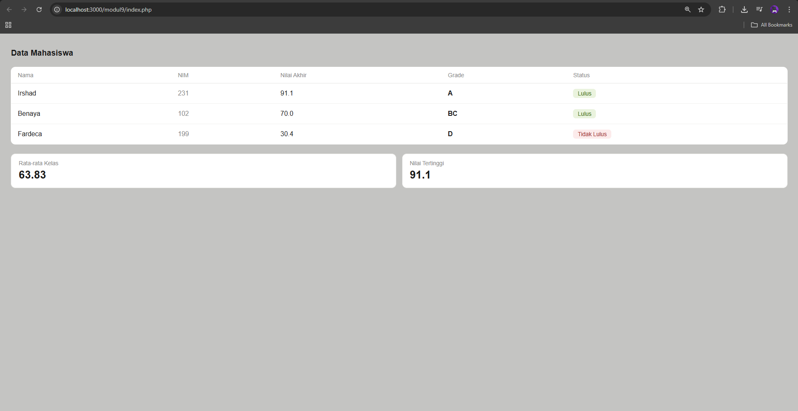

<div align="center">
  <br>

  <h1>LAPORAN PRAKTIKUM <br>
  APLIKASI BERBASIS PLATFORM
  </h1>

  <br>

  <h3>MODUL 9 <br>
  PHP
  </h3>

  <br>

  


  <br>
  <br>
  <br>

  <h3>Disusun Oleh :</h3>

  <p>
    <strong>Irshad Benaya Fardeca</strong><br>
    <strong>2311102199</strong><br>
    <strong>S1 IF-11-REG01</strong>
  </p>

  <br>

  <h3>Dosen Pengampu :</h3>

  <p>
    <strong>Dimas Fanny Hebrasianto Permadi, S.ST., M.Kom</strong>
  </p>
  
  <br>
  <br>
    <h4>Asisten Praktikum :</h4>
    <strong>Apri Pandu Wicaksono </strong> <br>
    <strong>Rangga Pradarrell Fathi</strong>
  <br>

  <h3>LABORATORIUM HIGH PERFORMANCE
 <br>FAKULTAS INFORMATIKA <br>UNIVERSITAS TELKOM PURWOKERTO <br>2026</h3>
</div>
<hr>

# Dasar Teori
## 9.1. Web Server dan Server Side Scripting

**Web Server** adalah perangkat lunak dalam server yang berfungsi menerima permintaan (*request*) berupa halaman web melalui HTTP atau HTTPS dari *client* (web browser) dan mengirimkan kembali (*response*) hasilnya dalam bentuk dokumen HTML.

### Web Server yang Umum Digunakan

- Apache Web Server — https://httpd.apache.org/
- Internet Information Service (IIS) — https://www.iis.net/
- Xitami Web Server
- Sun Java System Web Server

### Server Side Scripting

**Server Side Scripting** adalah teknologi scripting/pemrograman web di mana script dikompilasi atau diterjemahkan di sisi server, memungkinkan pembuatan halaman web yang dinamis.

Contoh Server Side Scripting:

- ASP (Active Server Page) dan ASP.NET
- ColdFusion
- Java Server Pages (JSP)
- Perl
- Python
- **PHP**

### Keistimewaan PHP

1. Cepat
2. Free (gratis)
3. Mudah dipelajari
4. Multi-platform
5. Dukungan technical support
6. Komunitas PHP yang besar
7. Aman

---

## 9.2. Instalasi Apache, PHP dan MySQL dengan XAMPP

Paket instalasi yang tersedia untuk memudahkan setup:

- **XAMPP** (Windows) / **LAMPP** (Linux) — https://www.apachefriends.org/download.html
- WAMP Server
- APPServ
- PHPTriad

### Persiapan Instalasi

1. Pastikan tidak ada web server lain (IIS/PWS) yang terinstall agar tidak konflik dengan Apache.
2. Download XAMPP versi 5.6.32 dari https://www.apachefriends.org/download.html (tersedia untuk Windows, Linux, dan Mac).

### Langkah-langkah Instalasi

1. Jalankan file installer XAMPP.
2. Pada peringatan antivirus, pilih **Yes**.
3. Pada peringatan UAC (*User Account Control*), klik **OK**.
4. Di jendela awal instalasi, klik **Next**.
5. Pilih komponen yang akan dipasang di jendela **Select Component**, lalu klik **Next**.
6. Tentukan lokasi instalasi, lalu klik **Next**.
7. Di jendela **Bitnami for XAMPP**, hilangkan centang pada "Learn more about Bitnami for XAMPP", klik **Next**.
8. Konfirmasi instalasi dengan klik **Next** dan tunggu proses selesai.
9. Centang "Do you want to start the Control Panel now?" untuk menjalankan XAMPP.
10. Di jendela **Control Panel**, tekan **Start** pada service Apache dan MySQL.
11. Buka browser dan ketikkan `localhost` untuk memverifikasi instalasi berhasil.

---

## 9.3. Pengenalan PHP

PHP adalah singkatan rekursif dari **PHP: Hypertext Preprocessor**, pertama kali diciptakan oleh **Rasmus Lerdorf** pada tahun **1994**.

### Tag PHP

PHP ditulis di antara tag berikut:

```php
<?php ... ?>
```

Tag alternatif (kurang umum):

```
<? ... ?>
<script language="php"> ... </script>
<% ... %>
```

### Aturan Dasar

- Setiap statement diakhiri dengan titik-koma (`;`).
- PHP **case sensitive** untuk nama identifier buatan user.
- Identifier bawaan PHP **tidak case sensitive**.

### Contoh Program Pertama

```php
<?php echo "Hello World!"; ?>
```

Simpan sebagai `hello.php` di folder `htdocs` XAMPP, lalu akses melalui browser di `http://localhost/hello.php`.

---

## 9.4. Variabel

Variabel digunakan untuk menyimpan nilai, data, atau informasi.

### Aturan Penamaan Variabel

- Diawali dengan tanda `$`.
- Setelah `$`, dapat dimulai dengan huruf atau underscore (`_`).
- Karakter berikutnya boleh berupa huruf, angka, atau karakter ASCII 127–255.
- **Case sensitive**.
- Tidak boleh mengandung spasi.
- Tidak perlu dideklarasikan terlebih dahulu.

### Contoh

```php
<?php
$nim = "1301165454";
$nama = "Baharudin";

echo "NIM : " . $nim;
echo "Nama : " . $nama;
?>
```

### Tipe Data PHP

PHP mendukung 8 tipe data primitif:

| No | Tipe Data |
|----|-----------|
| 1  | Boolean   |
| 2  | Integer   |
| 3  | Float     |
| 4  | String    |
| 5  | Array     |
| 6  | Object    |
| 7  | Resource  |
| 8  | NULL      |

---

## 9.5. Konstanta

Konstanta adalah variabel yang nilainya tidak berubah, didefinisikan menggunakan fungsi `define()`.

```php
<?php
define("NAMA", "Baharuddin");
define("NIM", "1301165454");

echo "Nama : " . NAMA;
echo "NIM : " . NIM;
?>
```

---

## 9.6. Operator dalam PHP

### Operator Aritmatika

| Operator | Contoh      | Keterangan            |
|----------|-------------|-----------------------|
| `+`      | `$a + $b`   | Pertambahan           |
| `-`      | `$a - $b`   | Pengurangan           |
| `*`      | `$a * $b`   | Perkalian             |
| `/`      | `$a / $b`   | Pembagian             |
| `%`      | `$a % $b`   | Modulus (sisa bagi)   |

### Operator Penugasan

| Operator | Contoh   | Keterangan                  |
|----------|----------|-----------------------------|
| `=`      | `$a = 4` | Variabel `$a` diisi nilai 4 |

### Operator Bitwise

| Operator | Contoh       | Keterangan  |
|----------|--------------|-------------|
| `&`      | `$a & $b`    | Bitwise AND |
| `\|`     | `$a \| $b`   | Bitwise OR  |
| `^`      | `$a ^ $b`    | Bitwise XOR |
| `~`      | `~$a`        | Bitwise NOT |
| `<<`     | `$a << $b`   | Shift Left  |
| `>>`     | `$a >> $b`   | Shift Right |

### Operator Perbandingan

| Operator | Contoh       | Keterangan              |
|----------|--------------|-------------------------|
| `==`     | `$a == $b`   | Sama dengan             |
| `===`    | `$a === $b`  | Identik                 |
| `!=`     | `$a != $b`   | Tidak sama dengan       |
| `<>`     | `$a <> $b`   | Tidak sama dengan       |
| `!==`    | `$a !== $b`  | Tidak identik           |
| `<`      | `$a < $b`    | Kurang dari             |
| `>`      | `$a > $b`    | Lebih dari              |
| `<=`     | `$a <= $b`   | Kurang dari sama dengan |
| `>=`     | `$a >= $b`   | Lebih dari sama dengan  |

### Operator Logika

| Operator | Contoh        | Keterangan                          |
|----------|---------------|-------------------------------------|
| `and`    | `$a and $b`   | TRUE jika `$a` dan `$b` TRUE        |
| `&&`     | `$a && $b`    | TRUE jika `$a` dan `$b` TRUE        |
| `or`     | `$a or $b`    | TRUE jika `$a` atau `$b` TRUE       |
| `\|\|`   | `$a \|\| $b`  | TRUE jika `$a` atau `$b` TRUE       |
| `xor`    | `$a xor $b`   | TRUE jika salah satu TRUE (bukan keduanya) |
| `!`      | `!$b`         | TRUE jika `$b` FALSE                |

### Operator String

| Operator | Contoh     | Keterangan                    |
|----------|------------|-------------------------------|
| `.`      | `$a . $b`  | Penggabungan string `$a` dan `$b` |

---

## 9.7. Struktur Kondisi

### If-Then-Else

```php
if (kondisi) {
    statement-jika-kondisi-TRUE;
} else {
    statement-jika-kondisi-FALSE;
}
```

**Contoh:**

```php
$nilai = 80;
if ($nilai > 50) {
    echo "Nilai Anda adalah " . $nilai . ". Selamat, Anda lulus";
} else {
    echo "Nilai Anda adalah " . $nilai . ". Maaf, Anda tidak lulus";
}
```

### Switch-Case

```php
switch ($var) {
    case '1' : statement-1; break;
    case '2' : statement-2; break;
    // ...
}
```

**Contoh:**

```php
$nilai = 80;
switch ($nilai) {
    case ($nilai > 50 && $nilai <= 60) : echo "Indeks nilai anda C"; break;
    case ($nilai > 60 && $nilai <= 70) : echo "Indeks nilai anda BC"; break;
    case ($nilai > 70 && $nilai <= 75) : echo "Indeks nilai anda B"; break;
    case ($nilai > 75 && $nilai <= 80) : echo "Indeks nilai anda AB"; break;
    case ($nilai > 80 && $nilai <= 100): echo "Indeks nilai anda A"; break;
    default: echo "Maaf, Anda tidak lulus"; break;
}
```

---

## 9.8. Perulangan (Looping)

### 1. For

```php
for (init_awal; kondisi; counter) {
    statement;
}
```

### 2. While

```php
init_awal;
while (kondisi) {
    statement;
    counter;
}
```

### 3. Do-While

```php
init_awal;
do {
    statement;
    counter;
} while (kondisi);
```

### 4. Foreach

```php
foreach (array_expression as $value) {
    statement;
}
```

### Contoh Penggunaan Perulangan

```php
<?php
// Perulangan for
echo "Perulangan for: ";
for ($i = 1; $i <= 10; $i++) {
    echo $i . " ";
}

// Perulangan while
echo "<br>Perulangan while: ";
$i = 1;
while ($i <= 20) {
    echo $i . " ";
    $i += 2;
}

// Perulangan do-while
echo "<br>Perulangan do-while: ";
$i = 1;
do {
    echo $i . " ";
    $i += 3;
} while ($i < 30);
?>
```

---

## 9.9. Function

Fungsi digunakan untuk mengelompokkan kode yang melakukan tugas yang sama agar lebih efektif dan modular.

### Sintaks Dasar

```php
function nama_fungsi(parameter1, parameter2, ...) {
    statement;
}
```

### Fungsi Tanpa Parameter dan Return Value

```php
<?php
function cetakGenap() {
    for ($i = 1; $i <= 100; $i++) {
        if ($i % 2 == 0) {
            echo "$i ";
        }
    }
}

cetakGenap(); // pemanggilan fungsi
?>
```

### Fungsi dengan Parameter, Tanpa Return Value

```php
<?php
function cetakGenap($awal, $akhir) {
    for ($i = $awal; $i <= $akhir; $i++) {
        if ($i % 2 == 0) {
            echo "$i ";
        }
    }
}

$a = 10;
$b = 50;
echo "Bilangan genap dari $a sampai $b adalah: <br>";
cetakGenap($a, $b);
?>
```

### Fungsi dengan Return Value

```php
<?php
function luasSegitiga($alas, $tinggi) {
    return 0.5 * $alas * $tinggi;
}

$a = 10;
$t = 50;
echo "Luas Segitiga dengan alas $a dan tinggi $t adalah: " . luasSegitiga($a, $t);
?>
```

---

## 9.10. Array

Array adalah tipe data terstruktur untuk menyimpan sejumlah data bertipe sama. Setiap elemen diakses melalui **index** (berupa integer atau string).

### Deklarasi Array

```php
<?php
// Array dengan index integer
$arrKendaraan = ["Mobil", "Pesawat", "Kereta Api", "Kapal Laut"];
echo $arrKendaraan[0]; // Mobil
echo $arrKendaraan[2]; // Kereta Api

// Array dengan push elemen
$arrKota = [];
$arrKota[] = "Jakarta";
$arrKota[] = "Medan";
$arrKota[] = "Bandung";
$arrKota[] = "Malang";
$arrKota[] = "Sulawesi";
echo $arrKota[1]; // Medan
echo $arrKota[4]; // Sulawesi
?>
```

### Array Assosiatif (Index String)

```php
<?php
$arrAlamat = [
    "Rona"  => "Banjarmasin",
    "Dhiva" => "Bandung",
    "Ilham" => "Medan",
    "Oku"   => "Hongkong",
];
echo $arrAlamat["Dhiva"]; // Bandung
echo $arrAlamat["Oku"];   // Hongkong

$arrNim = [];
$arrNim["Rona"]   = "11011112";
$arrNim["Dhiva"]  = "11011101";
$arrNim["Ilham"]  = "11011309";
$arrNim["Oku"]    = "11014765";
$arrNim["Fadhlan"]= "11011113";
echo $arrNim["Ilham"];   // 11011309
echo $arrNim["Fadhlan"]; // 11011113
?>
```

# Tugas
## 1. *Tugas Modul 9 - PHP: Buat Sistem Penilaian Mahasiswa*

*Deskripsi*

Buat program PHP sederhana untuk menampilkan data beberapa mahasiswa, menghitung nilai akhir, menentukan grade, dan status kelulusan.

*Ketentuan*
* Gunakan array Asosiasi untuk menyimpan minimal 3 data mahasiswa

*Setiap mahasiswa punya:*
* nama
* nim
* nilai tugas
* nilai uts
* nilai uas
* Gunakan function untuk menghitung nilai akhir
* Gunakan if/else atau switch untuk menentukan grade
* Gunakan operator aritmatika untuk perhitungan nilai akhir
* Gunakan operator perbandingan untuk menentukan lulus/tidak
* Gunakan loop untuk menampilkan seluruh data
* Tampilkan hasil dalam bentuk tabel HTML

*Output minimal*
* Nama
* NIM
* Nilai akhir
* Grade
* Status
* Tampilkan rata-rata kelas
* Tampilkan nilai tertinggi

## Source Code
### 1. Data Source
```php
    $dataMahasiswa = [
        [
            "nama" => "Irshad",
            "nim" => "231",
            "nilaiTugas" => "90",
            "nilaiUts" => "87",
            "nilaiUas" => "94"
        ],
        [
            "nama" => "Benaya",
            "nim" => "102",
            "nilaiTugas" => "65",
            "nilaiUts" => "45",
            "nilaiUas" => "87"
        ],
        [
            "nama" => "Fardeca",
            "nim" => "199",
            "nilaiTugas" => "40",
            "nilaiUts" => "33",
            "nilaiUas" => "25"
        ],
    ];
```
Data disimpan dalam array multidimensi `$dataMahasiswa`. Struktur ini memungkinkan penambahan data secara fleksibel tanpa mengubah logika tampilan.


### 2. Functions
```php
    function nilaiAkhir($tugas, $uts, $uas)
    {
        return $tugas * 0.2 + $uts * 0.3 + $uas * 0.5;
    }

    function apaLulus($nilai)
    {
        return ($nilai > 50) ? "Lulus" : "Tidak Lulus";
    }


    function tentukanGrade($nilai)
    {
        switch ($nilai) {
            case ($nilai > 50 && $nilai <= 60):
                return "C";
                break;
            case ($nilai > 60 && $nilai <= 70):
                return "BC";
                break;
            case ($nilai > 70 && $nilai <= 75):
                return "B";
                break;
            case ($nilai > 75 && $nilai <= 80):
                return "AB";
                break;
            case ($nilai > 80 && $nilai <= 100):
                return "A";
                break;
            default:
                return "D";
                break;
        }
    }
```
* `nilaiAkhir($tugas, $uts, $uas)`: Mengembalikan nilai float hasil pembobotan.
* `apaLulus($nilai)`: Logika seleksi sederhana untuk menentukan ambang batas kelulusan (50).
* `tentukanGrade($nilai)`: Klasifikasi nilai ke dalam kategori huruf (A, AB, B, BC, C, D).

### 3. Iterasi
```php
<tbody>
            <?php foreach ($dataMahasiswa as $mhs):
                $nilaiAkhir = nilaiAkhir($mhs["nilaiTugas"], $mhs["nilaiUts"], $mhs["nilaiUas"]);
                $grade = tentukanGrade($nilaiAkhir);
                $status = apaLulus($nilaiAkhir);
                $totalNilai += $nilaiAkhir;
                if ($nilaiAkhir > $nilaiTertinggi) $nilaiTertinggi = $nilaiAkhir;
                $badgeClass = ($status === "Lulus") ? "lulus" : "tidak";
            ?>
                <tr>
                    <td><?= $mhs["nama"] ?></td>
                    <td style="color:#888"><?= $mhs["nim"] ?></td>
                    <td><?= number_format($nilaiAkhir, 1) ?></td>
                    <td><strong><?= $grade ?></strong></td>
                    <td><span class="badge <?= $badgeClass ?>"><?= $status ?></span></td>
                </tr>
            <?php endforeach; ?>
        </tbody>
```
Menggunakan loop `foreach` untuk melakukan pemrosesan data sekaligus perulangan elemen HTML `<tr>`. Variabel akumulator `$totalNilai` dan `$nilaiTertinggi` dihitung di dalam loop untuk efisiensi eksekusi.

## Output
