<div align="center">
  <br />

  <h1>LAPORAN PRAKTIKUM <br>
  APLIKASI BERBASIS PLATFORM
  </h1>

  <br />

  <h3>MODUL 9 <br>
  PHP
  </h3>

  <br />

  


  <br />
  <br />
  <br />

  <h3>Disusun Oleh :</h3>

  <p>
    <strong>Boutefhika Nuha Ziyadatul Khair</strong><br>
    <strong>2311102316</strong><br>
    <strong>S1 IF-11-01</strong>
  </p>

  <br />

  <h3>Dosen Pengampu :</h3>

  <p>
    <strong>Dimas Fanny Hebrasianto Permadi, S.ST., M.Kom</strong>
  </p>
  
  <br />
  <br />
    <h4>Asisten Praktikum :</h4>
    <strong>Apri Pandu Wicaksono </strong> <br>
    <strong>Rangga Pradarrell Fathi</strong>
  <br />

  <h3>LABORATORIUM HIGH PERFORMANCE
 <br>FAKULTAS INFORMATIKA <br>UNIVERSITAS TELKOM PURWOKERTO <br>2026</h3>
</div>

<hr>

# Dasar Teori

## 1.1 Web Server dan Server Side Scripting 
Web Server merupakan sebuah perangkat lunak dalam server yang berfungsi menerima permintaan (request) berupa halaman web melalui HTTP atau HTTPS dari client yang dikenal dengan web browser dan mengirimkan kembali (response) hasilnya dalam bentuk halaman-halaman web yang umumnya berbentuk dokumen HTML.

<p align="center">
  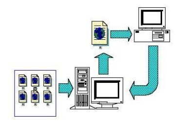<br>
  <b>Gambar 1.1 Arsitektur web standar</b>
</p>

<p align="center">
  <br>
  <b>Gambar 1.1 Arsitektur web dinamis</b>
</p>


Beberapa web server yang banyak digunakan antara lain seperti berikut: 
1. Apache Web Server (https://httpd.apache.org/)
2. Internet Information Service, IIS (https://www.iis.net/)
3. Xitami Web Server 
4. Sun Java System Web Server 

Server Side Scripting merupakan sebuah teknologi scripting atau pemrograman web dimana script (program) dikompilasi atau diterjemahkan di server. Dengan server side scripting, memungkinkan untuk menghasilkan halaman web yang dinamis. Beberapa contoh Server Side Scripting  (Programming) : 
1. ASP (Active Server Page) dan ASP.NET 
2. ColdFusion (http://www.adobe.com/products/coldfusion-family.html)
3. Java Server Pages (http://www.oracle.com/technetwork/java/javaee/jsp/index.html)
4. Perl (https://www.perl.org/)
5. Python (https://www.python.org/)
6. PHP (http://www.php.net/)

Keistimewaan PHP sebagai bahasa pemrograman berbasis web adalah : 
1. Cepat 
2. Free
3. Mudah dipelajari 
4. Multi-platform 
5. Dukungan technical support
6. Banyaknya komunitas PHP 
7. Aman 

## 1.2. Instalasi Apache, PHP dan MySQL dengan XAMPP 
XAMPP sudah teristall di Laptop saya
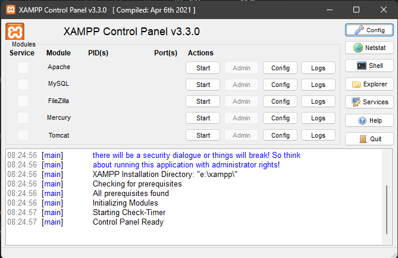

## 1.3 Pengenalan PHP 
Merupakan singkatan rekursif dari PHP : Hypertext Preprocessor. Pertama kali diciptakan oleh Rasmus Lerdorf pada tahun 1994. PHP sendiri harus ditulis diantara tag : 
* ```<? dan ?>```
* ```<?php dan ?>``` 
* ```<script language=”php”> dan </script>```
* ```<% dan %>```

Setiap satu statement (perintah) biasanya diakhiri dengan titik-koma (;). PHP juga case sensitive untuk nama identifier yang dibuat oleh user sedangkan identifier bawaan dari PHP tidak case sensitive. Contoh program yang ditulis dengan bahasa PHP 
```
<?php echo “Hello World!”; ?> 
```
Simpan file tersebut dengan nama hello.php pada direktori htdocs yang ada di folder XAMPP. Kemudian, jalankan pada browser dengan mengetikkan alamat http://localhost/hello.php . Hasilnya akan muncul di web browser seperti berikut: 

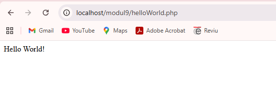

## 1.4 Variabel 
Variabel digunakan untuk menyimpan sebuah value (nilai), data atau informasi. Nama variabel pada PHP diawali dengan tanda ```$```. Panjang dari suatu variabel tidak terbatas dan variabel tidak perlu dideklarasi terlebih dahulu sebelumnya. Setelah tanda ```$```, dapat diawali dengan huruf atau under-score (_). Karakter berikutnya bisa terdiri dari huruf, angka dan atau karakter tertentu yang diperbolehkan (karakter ASCII dari 127 – 255). 
Variabel pada PHP bersifat case sensitive artinya besar kecilnya suatu karakter berpengaruh pada variabel tersebut. Suatu karakter pada PHP tidak boleh mengandung spasi. 

Berikut adalah contoh penggunaan variabel pada PHP: 
```
<?php 
    $nim = "1301165454"; 
    $nama = "Baharudin"; 

    echo "NIM : " . $nim; 
    echo "Nama : " . $nama; 
?> 
```
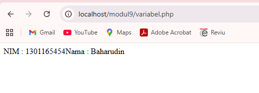

Pada PHP, tipe data dari suatu variabel tidak didefinisikan langsung oleh programmer, akan tetapi secara otomatis akan ditentukan oleh interpreter PHP. Namun demikian, PHP mendukung 8 (delapan) buah tipe data primitif, yaitu: 
1. Boolean
2. Integer
3. Float
4. String
5. Array
6. Object
7. Resource
8. Null

## 1.5 Konstanta
Konstanta merupakan variabel konstan yang nilainya tidak berubah-ubah. Untuk mendefinisikan konstanta pada PHP, dapat menggunakan fungsi define() yang telah tersedia pada PHP. Berikut adalah contohnya : 
```
<?php 
    define("NAMA" , "Baharuddin"); 
    define("NIM" , "1301165454"); 
    echo "Nama : " . NAMA; 
    echo "NIM : " . NIM; 
?>
```
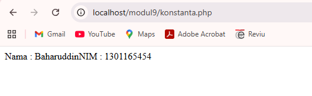

## 1.6 Operator dalam PHP
Ada beberapa jenis operator pada PHP, yaitu:

| Jenis        | Operator | Contoh       | Keterangan                                      |
|-------------|----------|-------------|------------------------------------------------|
| Aritmatika  | +        | $a + $b     | Pertambahan                                    |
|             | -        | $a - $b     | Pengurangan                                    |
|             | *        | $a * $b     | Perkalian                                      |
|             | /        | $a / $b     | Pembagian                                      |
|             | %        | $a % $b     | Modulus, sisa hasil bagi                       |
| Penugasan   | =        | $a = 4      | Variabel $a akan diisi oleh 4                  |
| Bitwise     | &        | $a & $b     | Bitwise AND                                    |
|             | \|       | $a \| $b    | Bitwise OR                                     |
|             | ^        | $a ^ $b     | Bitwise XOR                                    |
|             | ~        | ~$a         | Bitwise NOT                                    |
|             | <<       | $a << $b    | Shift Left                                     |
|             | >>       | $a >> $b    | Shift Right                                    |
| Perbandingan| ==       | $a == $b    | Sama dengan                                    |
|             | ===      | $a === $b   | Identik                                        |
|             | !=       | $a != $b    | Tidak sama dengan                              |
|             | <>       | $a <> $b    | Tidak sama dengan                              |
|             | !==      | $a !== $b   | Tidak identik                                  |
|             | <        | $a < $b     | Kurang dari                                    |
|             | >        | $a > $b     | Lebih dari                                     |
|             | <=       | $a <= $b    | Kurang dari sama dengan                        |
|             | >=       | $a >= $b    | Lebih dari sama dengan                         |
| Logika      | and      | $a and $b   | TRUE jika $a dan $b TRUE                       |
|             | &&       | $a && $b    | TRUE jika $a dan $b TRUE                       |
|             | or       | $a or $b    | TRUE jika $a atau $b TRUE                      |
|             | \|\|     | $a \|\| $b  | TRUE jika $a atau $b TRUE                      |
|             | xor      | $a xor $b   | TRUE jika salah satu TRUE, tidak keduanya      |
|             | !        | !$b         | TRUE jika $b FALSE                             |
| String      | .        | $a . $b     | Penggabungan string $a dan $b                  |

## 1.7 Struktur Kondisi
Struktur kondisi pada PHP sama halnya dengan bahasa pemrograman lainnya seperti Java. Berikut adalah contoh penulisan struktur kondisi if-then pada PHP: 

```
if (kondisi) { 
 statement-jika-kondisi-TRUE; 
} else { 
 Statement-jika-kondisi-FALSE; } 
```
Selain struktur kondisi if-then, terdapat pula struktur kondisi switch-case seperti berikut: 
```
switch ($var) { 
    case ‘1’ : statement-1; break; case ‘2’ : statement-2; break; 
 . . . . 
} 
```

Berikut adalah contoh ketika statement kondisi if-then dijalankan :
```
<?php 
    $nilai = 80; if ($nilai > 50) { 
        echo "Nilai Anda adalah " . $nilai . ". Selamat, Anda lulus"; 
    } else { 
        echo "Nilai Anda adalah " . $nilai . ". Maaf, Anda tidak lulus"; 
    }
?>
```
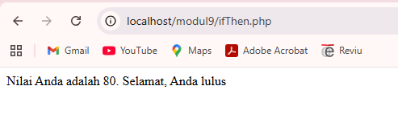

Dan berikut ini adalah contoh ketika statement switch-case dijalankan: 
```
<?php
$nilai = 80;
switch ($nilai) {
    case ($nilai > 50 && $nilai <= 60):
        echo "Nilai Anda adalah " .
            $nilai . ". Indeks nilai anda C";
        break;
    case ($nilai > 60 && $nilai <= 70):
        echo "Nilai Anda adalah "
            . $nilai . ". Indeks nilai anda BC";
        break;
    case ($nilai > 70 && $nilai <= 75):
        echo "Nilai Anda adalah "
            . $nilai . ". Indeks nilai anda B";
        break;
    case ($nilai > 75 && $nilai <= 80):
        echo "Nilai Anda adalah "
            . $nilai . ". Indeks nilai anda AB";
        break;
    case ($nilai > 80 && $nilai <= 100):
        echo "Nilai Anda adalah "
            . $nilai . ". Indeks nilai anda A";
        break;
    default:
        echo "Nilai Anda adalah " . $nilai . ". Maaf, Anda tidak lulus";
        break;
}
?>
```
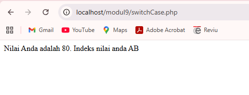

## 1.8 Perulangan (Looping)
Banyak jenis perulangan yang terdapat pada PHP. Adapun beberapa diantaranya adalah : 
1. Perulangan for
```
for (init_awal, kondisi, counter) { 
        statement; 
} 
```
2. Perulangan while
```
init_awal; while (kondisi) { 
       statement; 
       counter; 
}
``` 
3. Perulangan do-while
```
init_awal; 
do { 
        statement; counter; 
} while (kondisi); 
```
4. Perulangan foreach
```
foreach (array_expression as $value) { 
        statement; 
} 
```
Berikut adalah contoh penggunaan perulangan:
```
<?php
echo "Ini adalah contoh perulangan for";
echo "<br>";
for ($i = 1; $i <= 10; $i++) {
    echo $i . " ";
}
echo "<br>";
echo "<br>";
echo "Ini adalah contoh perulangan while";
echo "<br>";
$i = 1;
while ($i <= 20) {
    echo $i . " ";
    $i += 2;
}
echo "<br>";
echo "<br>";
echo "Ini adalah contoh perulangan do-while";
echo "<br>";
$i = 1;
do {
    echo $i . " ";
    $i += 3;
} while ($i < 30);
?>
```
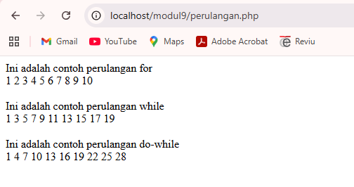

## 1.9 Function
Dalam merancang kode program, kadang kita sering membuat kode yang melakukan tugas yang sama secara berulang-ulang, seperti membaca tabel dari database, menampilkan penjumlahan, dan lainlain. Tugas yang sama ini akan lebih efektif jika dipisahkan dari program utama, dan dirancang menjadi sebuah fungsi. 
Fungsi dipanggil dengan menulis nama dari fungsi tersebut, dan diikuti dengan argumen (jika ada). Argumen ditulis di dalam tanda kurung, dan jika jumlah argumen lebih dari satu, maka diantaranya dipisahkan oleh karakter koma. 
Bentuk umum pendefinisian fungsi pada PHP adalah sebagai berikut: 
```
function nama_fungsi(parameter1, parameter2, 
…. , n) { 
        statement; 
} 
```
Contoh fungsi pada PHP tanpa menggunakan parameter dan return value:
```
<?php
function cetakGenap()
{
    for ($i = 1; $i <= 100; $i++) {
        if ($i % 2 == 0) {
            echo "$i ";
        }
    }
}
//pemanggilan fungsi
cetakGenap();
?>
```
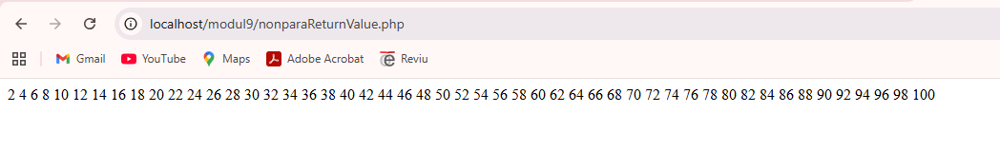

Contoh fungsi pada PHP menggunakan parameter dan tanpa return value: 
```
<?php
function cetakGenap($awal, $akhir)
{
    for ($i = $awal; $i <= $akhir; $i++) {
        if ($i % 2 == 0) {
            echo "$i ";
        }
    }
}
//pemanggilan fungsi
$a = 10;
$b = 50;
echo "Bilangan ganjil dari $a sampai $b adalah : <br>";
cetakGenap($a, $b);
?>
```
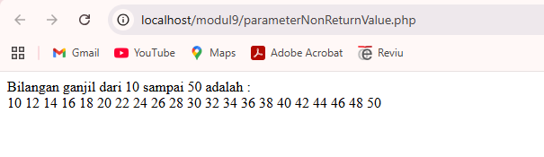

Contoh fungsi pada PHP dengan return value:
```
<?php function luasSegitiga($alas, $tinggi)
{
    return 0.5 * $alas * $tinggi;
}
//pemanggilan fungsi
$a = 10;
$t = 50;
echo "Luas Segitiga dengan alas $a dan tinggi $t adalah : " . luasSegitiga(
    $a,
    $t
);
?>
```
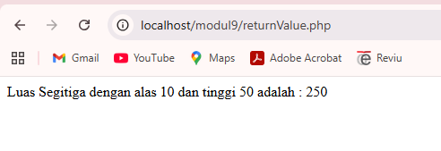

## 1.10 Array
Array merupakan tipe data terstruktur yang berguna untuk menyimpan sejumlah data yang bertipe sama. Bagian yang menyusun array disebut elemen array, yang masing-masing elemen dapat diakses tersendiri melalui index array. Index array dapat berupa bilangan integer atau string. 
Untuk mendeklarasikan atau mendefinisikan sebuah array di PHP bisa menggunakan keyword array(). Jumlah elemen array tidak perlu disebutkan saat deklarasi. Sedangkan untuk menampilkan isi array pada elemen tertentu, cukup dengan menyebutkan nama array beserta index array-nya. 
Berikut adalah cara mendeklarasikan suatu array di PHP :

```
<?php
$arrKendaraan = ["Mobil", "Pesawat", "Kereta Api", "Kapal Laut"];
echo $arrKendaraan[0] . "<br>"; //Mobil
echo $arrKendaraan[2] . "<br>"; //Kereta Api

$arrKota = [];
$arrKota[] = "Jakarta";
$arrKota[] = "Medan";
$arrKota[] = "Bandung";
$arrKota[] = "Malang";
$arrKota[] = "Sulawesi";

echo $arrKota[1] . "<br>"; //Medan 
echo $arrKota[2] . "<br>"; //Bandung 
echo $arrKota[4] . "<br>"; //Sulawesi
?>
```
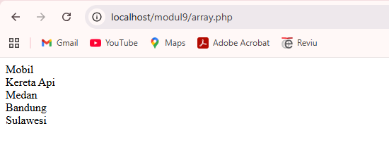

Cara mendeklarasikan suatu array pada PHP bisa dengan index string atau yang dinamakan dengan array assosiatif. Berikut adalah contoh pendeklarasian array assosiatif :
```
<?php
$arrAlamat = [
    "Rona" => "Banjarmasin",
    "Dhiva" => "Bandung",
    "Ilham" => "Medan",
    "Oku" => "Hongkong",
];

echo $arrAlamat["Dhiva"] . "<br>"; //Bandung 
echo $arrAlamat['Oku'] . "<br>"; //Hongkong

$arrNim = [];
$arrNim["Rona"] = "11011112";
$arrNim["Dhiva"] = "11011101";
$arrNim["Ilham"] = "11011309";
$arrNim["Oku"] = "11014765";
$arrNim["Fadhlan"] = "11011113";

echo $arrNim["Ilham"] . "<br>"; //11011309 
echo $arrNim['Fadhlan'] . "<br>"; //11011113
?>
```
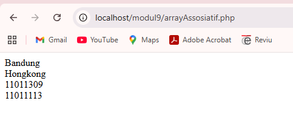

# UNGUIDED
Deskripsi:
Buat program PHP sederhana untuk menampilkan data beberapa mahasiswa, menghitung nilai akhir, menentukan grade, dan status kelulusan.

Ketentuan:
* Gunakan array Asosiasi untuk menyimpan minimal 3 data mahasiswa

Setiap mahasiswa punya:
* nama
* nim
* nilai tugas
* nilai uts
* nilai uas
* Gunakan function untuk menghitung nilai akhir
* Gunakan if/else atau switch untuk menentukan grade
* Gunakan operator aritmatika untuk perhitungan nilai akhir
* Gunakan operator perbandingan untuk menentukan lulus/tidak
* Gunakan loop untuk menampilkan seluruh data
* Tampilkan hasil dalam bentuk tabel HTML

Output minimal:
* Nama
* NIM
* Nilai akhir
* Grade
* Status
* Tampilkan rata-rata kelas
* Tampilkan nilai tertinggi

Source Code:
```
<?php
// ARRAY ASOSIATIF (Data Mahasiswa)
$mahasiswa = [
    [
        "nama" => "Boutefhika Nuha Z. K",
        "nim" => "2311102316",
        "tugas" => 80,
        "uts" => 75,
        "uas" => 85
    ],
    [
        "nama" => "Andika Nevtro",
        "nim" => "2311102167",
        "tugas" => 70,
        "uts" => 65,
        "uas" => 60
    ],
    [
        "nama" => "Bintang Sagara",
        "nim" => "2311102214",
        "tugas" => 90,
        "uts" => 85,
        "uas" => 88
    ],
    [
        "nama" => "Dinda Olivia",
        "nim" => "2311102116",
        "tugas" => 85,
        "uts" => 65,
        "uas" => 70
    ],
    [
        "nama" => "Budianto",
        "nim" => "2311102012",
        "tugas" => 50,
        "uts" => 30,
        "uas" => 55
    ]
];

// FUNCTION menghitung nilai akhir menggunakan OPERATOR ARITMATIKA (*, +)
function hitungNilaiAkhir($tugas, $uts, $uas) {
    return ($tugas * 0.3) + ($uts * 0.3) + ($uas * 0.4);
}

// FUNCTION menentukan grade menggunakan IF / ELSE
function tentukanGrade($nilai) {
    if ($nilai >= 85) return "A";
    elseif ($nilai >= 75) return "B";
    elseif ($nilai >= 65) return "C";
    elseif ($nilai >= 50) return "D";
    else return "E";
}

// Variabel tambahan
$totalNilai = 0;
$nilaiTertinggi = 0;

// TAMPILAN TABEL HTML
echo "<h2>Sistem Penilaian Mahasiswa</h2>";
echo "<table border='1' cellpadding='10'>
<tr>
    <th>Nama</th>
    <th>NIM</th>
    <th>Nilai Akhir</th>
    <th>Grade</th>
    <th>Status</th>
</tr>";

// LOOP (foreach) untuk menampilkan data
foreach ($mahasiswa as $mhs) {

    // hitung nilai akhir
    $nilaiAkhir = hitungNilaiAkhir($mhs['tugas'], $mhs['uts'], $mhs['uas']);

    // tentukan grade
    $grade = tentukanGrade($nilaiAkhir);

    // OPERATOR PERBANDINGAN (>=) menentukan status lulus / tidak
    if ($nilaiAkhir >= 60) {
        $status = "Lulus";
    } else {
        $status = "Tidak Lulus";
    }

    // hitung total & nilai tertinggi
    $totalNilai += $nilaiAkhir;
    if ($nilaiAkhir > $nilaiTertinggi) {
        $nilaiTertinggi = $nilaiAkhir;
    }

    // tampilkan data ke TABEL HTML
    echo "<tr>
        <td>{$mhs['nama']}</td>
        <td>{$mhs['nim']}</td>
        <td>" . number_format($nilaiAkhir,2) . "</td>
        <td>$grade</td>
        <td>$status</td>
    </tr>";
}

echo "</table>";

// menghitung rata-rata kelas
$rataRata = $totalNilai / count($mahasiswa);

// tampilkan hasil tambahan
echo "<br><b>Rata-rata kelas:</b> " . number_format($rataRata,2);
echo "<br><b>Nilai tertinggi:</b> " . number_format($nilaiTertinggi,2);
?>
```

Output:
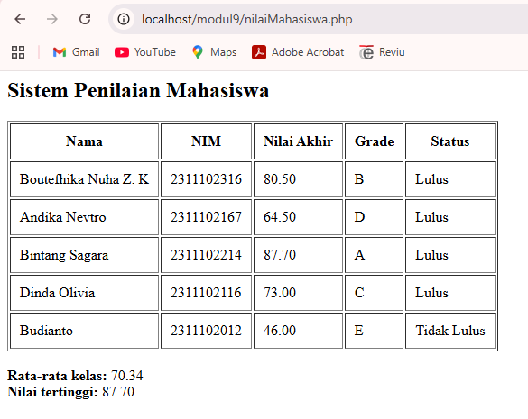

Deskripsi:
Program sistem penilaian mahasiswa ini dibuat menggunakan PHP dengan memanfaatkan array asosiatif untuk menyimpan data mahasiswa. Perhitungan nilai akhir dilakukan menggunakan function dan operator aritmatika, sedangkan penentuan grade dan status kelulusan menggunakan percabangan (if/else) serta operator perbandingan.

Selain itu, penggunaan perulangan (loop) memungkinkan program menampilkan seluruh data mahasiswa secara otomatis dalam bentuk tabel HTML. Program juga mampu menghitung rata-rata kelas dan menentukan nilai tertinggi.
