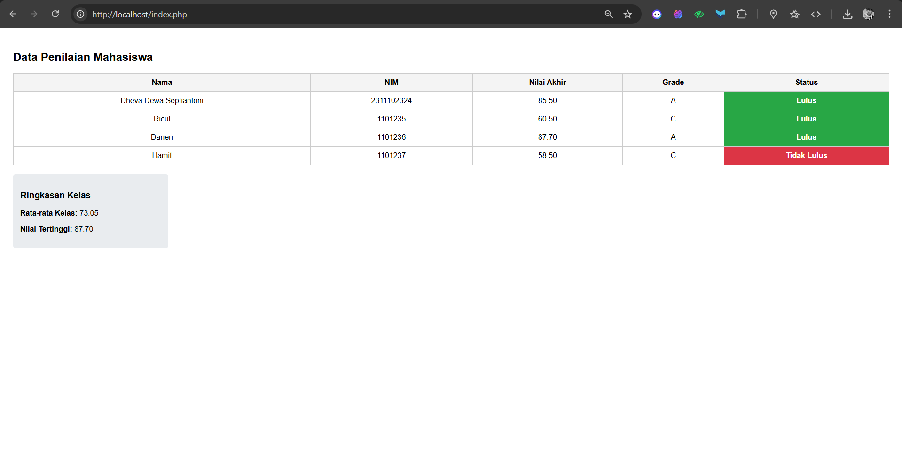

<div align="center">
   <h2>LAPORAN PRAKTIKUM<br>APLIKASI BERBASIS PLATFORM</h2>
   <h>
   <br>
   <h4>MODUL 9<br>PHP</h4>
   <br>
   
   <br><br>
 
**Disusun Oleh :**<br>
DHEVA DEWA SEPTIANTONI<br>
2311102324<br>
IF-11-01
<br><br>
 
**Dosen Pengampu :**<br>
Dimas Fanny Hebrasianto Permadi, S.ST., M.Kom
<br><br>
 
**Assisten Praktikum :**<br>
Apri Pandu Wicaksono
<br>Rangga Pradarrell Fathi
<br><br>
 
PROGRAM STUDI S1 TEKNIK INFORMATIKA<br>
FAKULTAS INFORMATIKA<br>
UNIVERSITAS TELKOM PURWOKERTO<br>
2026

</div>

---

## 1. Dasar Teori

**Web Server** merupakan sebuah perangkat lunak dalam server yang berfungsi menerima permintaan (request) berupa halaman web melalui HTTP atau HTTPS dari client yang dikenal dengan web browser dan mengirimkan kembali (response) hasilnya dalam bentuk halaman-halaman web yang umumnya berbentuk dokumen HTML.

**Server Side Scripting** merupakan sebuah teknologi scripting atau pemrograman web dimana script (program) dikompilasi atau diterjemahkan di server. Dengan server side scripting, memungkinkan untuk menghasilkan halaman web yang dinamis.

**Pengenalan PHP**
Merupakan singkatan rekursif dari PHP : Hypertext Preprocessor. Pertama kali diciptakan oleh Rasmus
Lerdorf pada tahun 1994. PHP sendiri harus ditulis diantara tag :

- `<? dan ?>PEMROGRAMAN WEB 58`
- `<?php dan ?>`
- `<script language=”php”> dan </script>`
- `<% dan %>`

Setiap satu statement (perintah) biasanya diakhiri dengan titik-koma (;). PHP juga case sensitive untuk nama identifier yang dibuat oleh user sedangkan identifier bawaan dari PHP tidak case sensitive. Contoh program yang ditulis dengan bahasa PHP `<?php echo “Hello World!”; ?>` Simpan file tersebut dengan nama hello.php pada direktori htdocs yang ada di folder XAMPP. Kemudian, jalankan pada browser dengan mengetikkan alamat http://localhost/hello.php . Hasilnya akan muncul di web browser.

**Variabel** digunakan untuk menyimpan sebuah value (nilai), data atau informasi. Nama variabel pada PHP diawali dengan tanda `$`. Panjang dari suatu variabel tidak terbatas dan variabel tidak perlu dideklarasi terlebih dahulu sebelumnya. Setelah tanda `$`, dapat diawali dengan huruf atau under-score (`\_`). Karakter berikutnya bisa terdiri dari huruf, angka dan atau karakter tertentu yang diperbolehkan (karakter ASCII dari `127 – 255`). Variabel pada PHP bersifat case sensitive artinya besar kecilnya suatu karakter berpengaruh pada variabel tersebut. Suatu karakter pada PHP tidak boleh mengandung spasi. Pada PHP, tipe data dari suatu variabel tidak didefinisikan langsung oleh programmer, akan tetapi secara otomatis akan ditentukan oleh interpreter PHP. Namun demikian, PHP mendukung 8 (delapan) buah tipe data primitif, yaitu:

1. Boolean
2. Integer
3. Float
4. String
5. Array
6. Object
7. Resource
8. NULL.

**Konstanta** Konstanta merupakan variabel konstan yang nilainya tidak berubah-ubah. Untuk mendefinisikan konstanta pada PHP, dapat menggunakan fungsi define() yang telah tersedia pada PHP.

**Struktur Kondisi** Struktur kondisi pada PHP sama halnya dengan bahasa pemrograman lainnya seperti Java.

**Perulangan (Looping)**
Banyak jenis perulangan yang terdapat pada PHP. Adapun beberapa diantaranya adalah :

1. Perulangan for
2. Perulangan while
3. Perulangan do-while
4. Perulangan foreach

**Function** Dalam merancang kode program, kadang kita sering membuat kode yang melakukan tugas yang sama secara berulang-ulang, seperti membaca tabel dari database, menampilkan penjumlahan, dan lainlain. Tugas yang sama ini akan lebih efektif jika dipisahkan dari program utama, dan dirancang menjadi sebuah fungsi. Fungsi dipanggil dengan menulis nama dari fungsi tersebut, dan diikuti dengan argumen (jika ada). Argumen ditulis di dalam tanda kurung, dan jika jumlah argumen lebih dari satu, maka diantaranya dipisahkan oleh karakter koma.

**Array** merupakan tipe data terstruktur yang berguna untuk menyimpan sejumlah data yang bertipe sama. Bagian yang menyusun array disebut elemen array, yang masing-masing elemen dapat diakses tersendiri melalui index array. Index array dapat berupa bilangan integer atau string. Untuk mendeklarasikan atau mendefinisikan sebuah array di PHP bisa menggunakan keyword array(). Jumlah elemen array tidak perlu disebutkan saat deklarasi. Sedangkan untuk menampilkan isi array pada
elemen tertentu, cukup dengan menyebutkan nama array beserta index array-nya.

## 2. Kode Program Unguided

_Tugas Modul 9 - PHP: Buat Sistem Penilaian Mahasiswa_

_Deskripsi_

Buat program PHP sederhana untuk menampilkan data beberapa mahasiswa, menghitung nilai akhir, menentukan grade, dan status kelulusan.

_Ketentuan_

- Gunakan array Asosiasi untuk menyimpan minimal 3 data mahasiswa

_Setiap mahasiswa punya:_

- nama
- nim
- nilai tugas
- nilai uts
- nilai uas
- Gunakan function untuk menghitung nilai akhir
- Gunakan if/else atau switch untuk menentukan grade
- Gunakan operator aritmatika untuk perhitungan nilai akhir
- Gunakan operator perbandingan untuk menentukan lulus/tidak
- Gunakan loop untuk menampilkan seluruh data
- Tampilkan hasil dalam bentuk tabel HTML

_Output minimal_

- Nama
- NIM
- Nilai akhir
- Grade
- Status
- Tampilkan rata-rata kelas
- Tampilkan nilai tertinggi

_note: Jangan lupa source code serta SS hasil disertakan di repository github masing-masing yahh_

### Kode PHP (index.php)

```php
<?php
$data_mahasiswa = [
    [
        "nama" => "Dheva Dewa Septiantoni",
        "nim" => "2311102324",
        "nilai_tugas" => 85,
        "nilai_uts" => 80,
        "nilai_uas" => 90
    ],
    [
        "nama" => "Ricul",
        "nim" => "1101235",
        "nilai_tugas" => 70,
        "nilai_uts" => 65,
        "nilai_uas" => 50
    ],
    [
        "nama" => "Danen",
        "nim" => "1101236",
        "nilai_tugas" => 90,
        "nilai_uts" => 85,
        "nilai_uas" => 88
    ],
    [
        "nama" => "Hamit",
        "nim" => "1101237",
        "nilai_tugas" => 55,
        "nilai_uts" => 60,
        "nilai_uas" => 60
    ]
];

function hitungNilaiAkhir($tugas, $uts, $uas) {
    return ($tugas * 0.3) + ($uts * 0.3) + ($uas * 0.4);
}

function tentukanGrade($nilai) {
    if ($nilai >= 85) {
        return "A";
    } elseif ($nilai >= 70) {
        return "B";
    } elseif ($nilai >= 55) {
        return "C";
    } elseif ($nilai >= 40) {
        return "D";
    } else {
        return "E";
    }
}

function tentukanStatus($nilai) {
    if ($nilai >= 60) {
        return "Lulus";
    } else {
        return "Tidak Lulus";
    }
}

$total_nilai_kelas = 0;
$nilai_tertinggi = 0;
$jumlah_mahasiswa = count($data_mahasiswa);
?>

<!DOCTYPE html>
<html lang="id">
<head>
    <meta charset="UTF-8">
    <title>Sistem Penilaian Mahasiswa</title>
    <style>
        body { font-family: sans-serif; padding: 20px; }
        table { width: 100%; border-collapse: collapse; margin-bottom: 20px; }
        th, td { border: 1px solid #ccc; padding: 10px; text-align: center; }
        th { background-color: #f4f4f4; }
        .lulus { color: white; background-color: #28a745; font-weight: bold; }
        .gagal { color: white; background-color: #dc3545; font-weight: bold; }
        .ringkasan { background-color: #e9ecef; padding: 15px; border-radius: 5px; width: 300px; }
    </style>
</head>
<body>

    <h2>Data Penilaian Mahasiswa</h2>

    <table>
        <tr>
            <th>Nama</th>
            <th>NIM</th>
            <th>Nilai Akhir</th>
            <th>Grade</th>
            <th>Status</th>
        </tr>

        <?php
        // 5. Loop untuk menampilkan seluruh data
        foreach ($data_mahasiswa as $mhs) {
            $nilai_akhir = hitungNilaiAkhir($mhs['nilai_tugas'], $mhs['nilai_uts'], $mhs['nilai_uas']);
            $grade = tentukanGrade($nilai_akhir);
            $status = tentukanStatus($nilai_akhir);

            // Akumulasi untuk rata-rata dan pencarian nilai tertinggi
            $total_nilai_kelas += $nilai_akhir;
            if ($nilai_akhir > $nilai_tertinggi) {
                $nilai_tertinggi = $nilai_akhir;
            }

            // CSS class untuk warna status kelulusan
            $status_class = ($status == "Lulus") ? "lulus" : "gagal";

            echo "<tr>";
            echo "<td>{$mhs['nama']}</td>";
            echo "<td>{$mhs['nim']}</td>";
            echo "<td>" . number_format($nilai_akhir, 2) . "</td>";
            echo "<td>{$grade}</td>";
            echo "<td class='{$status_class}'>{$status}</td>";
            echo "</tr>";
        }
        ?>
    </table>

    <?php
    // Menghitung rata-rata dari total nilai dibagi jumlah mahasiswa
    $rata_rata_kelas = $total_nilai_kelas / $jumlah_mahasiswa;
    ?>

    <div class="ringkasan">
        <h3>Ringkasan Kelas</h3>
        <p><b>Rata-rata Kelas:</b> <?php echo number_format($rata_rata_kelas, 2); ?></p>
        <p><b>Nilai Tertinggi:</b> <?php echo number_format($nilai_tertinggi, 2); ?></p>
    </div>

</body>
</html>
```

### Hasil Output



### Penjelasan Kode PHP

#### 1. Deklarasi Data (Array Asosiatif)
```php
$data_mahasiswa = [ ... ];
```
Di bagian paling atas, kita membuat sebuah variabel bernama $data_mahasiswa. Ini adalah sebuah Array Multidimensi yang di dalamnya berisi sekumpulan Array Asosiatif.

Array asosiatif digunakan karena kita menggunakan key (kunci) berupa teks seperti "nama", "nim", "nilai_tugas", bukan indeks angka biasa (0, 1, 2).

Cara ini sangat memudahkan kita untuk memanggil data yang spesifik nanti (misalnya memanggil mhs['nama']). Sesuai ketentuan tugas, ada lebih dari 3 data mahasiswa yang dimasukkan di sini.

#### 2. Pembuatan Fungsi (Functions)

Ada tiga fungsi utama yang dibuat untuk memecah logika program agar lebih rapi:

`hitungNilaiAkhir($tugas, $uts, $uas)`:
Fungsi ini menerima tiga parameter nilai. Di dalamnya, kita menggunakan operator aritmatika (* untuk perkalian dan + untuk penjumlahan). Rumusnya menggunakan bobot standar: Tugas dikali 30% (0.3), UTS 30% (0.3), dan UAS 40% (0.4). Hasilnya kemudian dikembalikan (return) ke pemanggil fungsi.

`tentukanGrade($nilai)`:
Fungsi ini menggunakan logika if/elseif/else. Program akan mengecek dari nilai tertinggi ke terendah. Jika nilai lebih dari atau sama dengan 85, maka langsung mendapat "A". Jika tidak, ia akan turun mengecek ke kondisi di bawahnya ("B", "C", dst).

tentukanStatus($nilai):
Fungsi ini menggunakan operator perbandingan >= (lebih dari atau sama dengan). Jika nilai akhir 60 atau lebih, statusnya "Lulus", selain itu "Tidak Lulus".

#### 3. Persiapan Variabel Ringkasan Kelas
```php
$total_nilai_kelas = 0;
$nilai_tertinggi = 0;
$jumlah_mahasiswa = count($data_mahasiswa);
```
Sebelum memulai perulangan, kita menyiapkan wadah kosong:

`$total_nilai_kelas` untuk menampung jumlah keseluruhan nilai akhir nantinya (untuk mencari rata-rata).

`$nilai_tertinggi` dimulai dari 0. Nanti setiap nilai mahasiswa akan diadu dengan angka ini untuk mencari siapa yang paling besar.

`$jumlah_mahasiswa` menghitung otomatis ada berapa data di dalam array menggunakan fungsi count().

#### 4. Perulangan (Looping) dan Menampilkan Tabel
```php
foreach ($data_mahasiswa as $mhs) { ... }
```
Bagian ini adalah inti dari tampilan data:

Kita menggunakan foreach untuk mengulang (loop) array $data_mahasiswa. Di setiap perulangan, satu data mahasiswa akan diwakili oleh variabel $mhs.

Di dalam loop, kita memanggil ketiga fungsi yang sudah dibuat sebelumnya untuk menghitung Nilai Akhir, Grade, dan Status untuk masing-masing mahasiswa.

Logika Nilai Tertinggi & Rata-rata:

```php
$total_nilai_kelas += $nilai_akhir;
if ($nilai_akhir > $nilai_tertinggi) {
    $nilai_tertinggi = $nilai_akhir;
}
```
Setiap loop berjalan, nilai akhir mahasiswa tersebut akan ditambahkan ke `$total_nilai_kelas`. Selanjutnya, program mengecek: apakah nilai mahasiswa saat ini lebih besar dari $nilai_tertinggi yang tersimpan? Jika iya, maka nilai tertinggi akan diganti dengan nilai mahasiswa tersebut.

Mencetak Baris Tabel: Perintah echo digunakan untuk mencetak tag HTML `<tr>` (baris) dan `<td>` (kolom) secara dinamis, diisi dengan data `$mhs['nama']`, hasil perhitungan, dll. Terdapat juga logika kecil $status_class untuk memberi warna hijau jika lulus dan merah jika gagal melalui CSS.

#### 5. Menampilkan Ringkasan Kelas
```php
$rata_rata_kelas = $total_nilai_kelas / $jumlah_mahasiswa;
```
Setelah perulangan selesai, program sudah memiliki total seluruh nilai dan nilai tertinggi. Untuk mencari rata-rata kelas, kita menggunakan operator aritmatika pembagian (/) dengan membagi total nilai dengan jumlah mahasiswa. Terakhir, variabel `$rata_rata_kelas` dan `$nilai_tertinggi` dicetak ke dalam elemen HTML di bagian bawah tabel menggunakan fungsi number_format() agar tampil rapi dengan maksimal 2 angka di belakang koma.

## 3. Kesimpulan dan Penutup

Modul ini menjelaskan konsep dasar dan implementasi bahasa pemrograman PHP sebagai server-side scripting untuk menghasilkan halaman web yang dinamis, dengan fokus materi pada pemahaman sintaks dasar, penggunaan variabel , struktur kondisi , perulangan , pembuatan fungsi, hingga manipulasi array asosiatif. Cocok digunakan sebagai panduan pembelajaran praktikum pemrograman web bagi mahasiswa program studi Informatika untuk membangun membangun fondasi aplikasi back-end yang fungsional dan terstruktur.

## 4. Referensi

- [Materi Modul 9](https://drive.google.com/file/d/1Fgj2rbye0s7QZ5VBigpSiTyPBl8TjpKB/view?usp=sharing)
