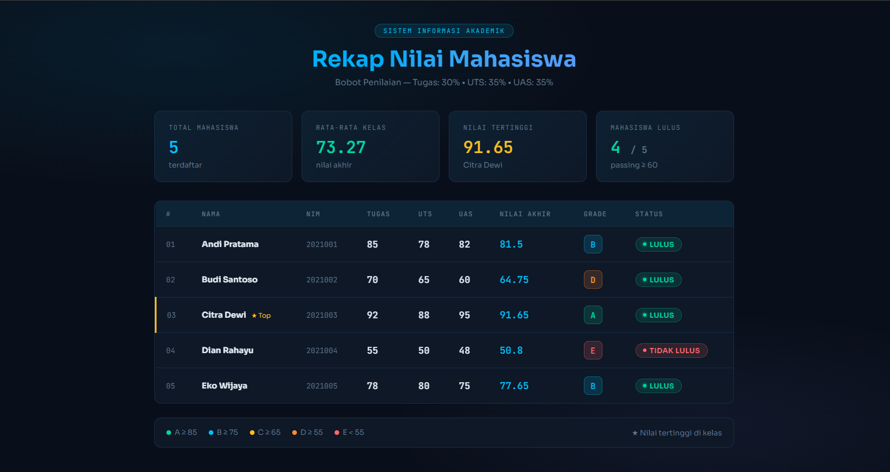

<div align="center">
  <br />
  <h1>LAPORAN PRAKTIKUM <br>APLIKASI BERBASIS PLATFORM</h1>
  <br />
  <h3>MODUL 9 <br> PHP</h3>
  <br />
  <br />
    
  <br />
  <br />
  <br />
  <br />
  <h3>Disusun Oleh :</h3>
  <p>
    <strong>M. Faleno Albar Firjatulloh</strong><br>
    <strong>2311102297</strong><br>
    <strong>S1 IF-11-01</strong>
  </p>
  <br />
  <h3>Dosen Pengampu :</h3>
  <p>
    <strong>Dimas Fanny Hebrasianto Permadi, S.ST., M.Kom</strong>
  </p>
  <br />
  <br />
    <h4>Asisten Praktikum :</h4>
    <strong> Apri Pandu Wicaksono </strong> <br>
    <strong>Rangga Pradarrell Fathi</strong>
  <br />
  <h3>LABORATORIUM HIGH PERFORMANCE
 <br>FAKULTAS INFORMATIKA <br>UNIVERSITAS TELKOM PURWOKERTO <br>2026</h3>
</div>

---

## 1. Dasar Teori

PHP (Hypertext Preprocessor)
PHP merupakan bahasa pemrograman berbasis server-side yang dioptimalkan untuk membangun ekosistem web. Berbeda dengan HTML yang bersifat statis dan diproses langsung oleh peramban (browser), instruksi PHP dijalankan sepenuhnya di sisi peladen (server). Hasil pemrosesan tersebut kemudian dikonversi menjadi format HTML sebelum dikirimkan kepada pengguna. Kemampuan utama PHP terletak pada pembuatan konten web yang dinamis, pemrosesan data dari input pengguna, serta integrasi dengan sistem basis data.

Array Asosiatif
Dalam pemrograman, array berfungsi sebagai wadah untuk menyimpan berbagai nilai dalam satu variabel terstruktur. Jenis array asosiatif memiliki karakteristik unik di mana setiap elemen diakses menggunakan kunci (key) berupa string atau label tertentu, bukan melalui urutan angka atau indeks numerik.

Contoh: Struktur "nama" => "Adam" menunjukkan bahwa kata "nama" bertindak sebagai label pengenal untuk memanggil data "Adam".

Fungsi (Function) dalam PHP
Fungsi adalah blok kode terorganisir yang dirancang untuk menjalankan tugas spesifik dan dapat digunakan kembali di berbagai bagian program (reusable). Implementasi fungsi sangat penting untuk menjaga modularitas kode agar tidak terjadi duplikasi instruksi. Sebagai contoh, pada sistem penilaian, fungsi berperan dalam memisahkan logika kalkulasi nilai akhir agar struktur kode menjadi lebih bersih dan sistematis.

Struktur Kendali (Control Structure)
Struktur kendali berperan sebagai pengatur alur logika program melalui mekanisme berikut:

Percabangan (If-Else): Berfungsi sebagai pengambil keputusan berdasarkan kondisi yang ditetapkan. Pada sistem ini, if-else digunakan untuk mentransformasikan skor angka menjadi klasifikasi Grade (A-E) serta menentukan status kelulusan mahasiswa.

Perulangan (Foreach): Merupakan metode paling efektif dalam PHP untuk memproses dan menampilkan seluruh data yang tersimpan dalam array, khususnya array asosiatif, secara berurutan.

Operator Aritmatika dan Perbandingan
Operator Aritmatika: Mencakup simbol matematika standar seperti penjumlahan (+), perkalian (*), dan pembagian (/). Operator ini digunakan secara intensif untuk mengolah rata-rata skor berdasarkan bobot nilai yang telah ditentukan.

Operator Perbandingan: Melibatkan simbol relasional seperti lebih besar dari (>), lebih kecil dari (<), atau sama dengan (>=). Fungsi utamanya adalah mengevaluasi apakah pencapaian nilai mahasiswa telah memenuhi kriteria ketuntasan minimal.

Integrasi PHP ke dalam HTML
PHP memiliki fleksibilitas untuk disisipkan langsung ke dalam dokumen HTML menggunakan sintaks khusus <?php ... ?>. Integrasi ini memungkinkan pembuatan elemen antarmuka yang adaptif, seperti tabel data yang barisnya dapat bertambah secara otomatis menyesuaikan volume informasi yang ada di dalam array sumber.

### Kode

```php
<?php
$mahasiswa = [
    [
        "nama"        => "Andi Pratama",
        "nim"         => "2021001",
        "nilai_tugas" => 85,
        "nilai_uts"   => 78,
        "nilai_uas"   => 82,
    ],
    [
        "nama"        => "Budi Santoso",
        "nim"         => "2021002",
        "nilai_tugas" => 70,
        "nilai_uts"   => 65,
        "nilai_uas"   => 60,
    ],
    [
        "nama"        => "Citra Dewi",
        "nim"         => "2021003",
        "nilai_tugas" => 92,
        "nilai_uts"   => 88,
        "nilai_uas"   => 95,
    ],
    [
        "nama"        => "Dian Rahayu",
        "nim"         => "2021004",
        "nilai_tugas" => 55,
        "nilai_uts"   => 50,
        "nilai_uas"   => 48,
    ],
    [
        "nama"        => "Eko Wijaya",
        "nim"         => "2021005",
        "nilai_tugas" => 78,
        "nilai_uts"   => 80,
        "nilai_uas"   => 75,
    ],
];
function hitungNilaiAkhir($tugas, $uts, $uas) {
    $nilai_akhir = ($tugas * 0.30) + ($uts * 0.35) + ($uas * 0.35);
    return round($nilai_akhir, 2);
}
function tentukanGrade($nilai) {
    if ($nilai >= 85) {
        return "A";
    } elseif ($nilai >= 75) {
        return "B";
    } elseif ($nilai >= 65) {
        return "C";
    } elseif ($nilai >= 55) {
        return "D";
    } else {
        return "E";
    }
}
function tentukanStatus($nilai) {
    return ($nilai >= 60) ? "LULUS" : "TIDAK LULUS";
}
$total_nilai   = 0;
$nilai_tertinggi = 0;
$nama_tertinggi  = "";

foreach ($mahasiswa as &$mhs) {
    $na = hitungNilaiAkhir($mhs["nilai_tugas"], $mhs["nilai_uts"], $mhs["nilai_uas"]);
    $mhs["nilai_akhir"] = $na;
    $mhs["grade"]       = tentukanGrade($na);
    $mhs["status"]      = tentukanStatus($na);

    $total_nilai += $na;

    if ($na > $nilai_tertinggi) {
        $nilai_tertinggi = $na;
        $nama_tertinggi  = $mhs["nama"];
    }
}
unset($mhs);

$jumlah_mahasiswa = count($mahasiswa);
$rata_rata        = round($total_nilai / $jumlah_mahasiswa, 2);

?>
<!DOCTYPE html>
<html lang="id">
<head>
    <meta charset="UTF-8">
    <meta name="viewport" content="width=device-width, initial-scale=1.0">
    <title>Sistem Nilai Mahasiswa</title>
    <link href="https://fonts.googleapis.com/css2?family=Sora:wght@300;400;600;700&family=JetBrains+Mono:wght@400;600&display=swap" rel="stylesheet">
    <style>
        :root {
            --bg:        #0b0f1a;
            --surface:   #111827;
            --border:    #1e2d45;
            --accent:    #38bdf8;
            --accent2:   #818cf8;
            --gold:      #fbbf24;
            --green:     #34d399;
            --red:       #f87171;
            --text:      #e2e8f0;
            --muted:     #64748b;
            --radius:    12px;
        }

        * { box-sizing: border-box; margin: 0; padding: 0; }

        body {
            font-family: 'Sora', sans-serif;
            background: var(--bg);
            color: var(--text);
            min-height: 100vh;
            padding: 40px 20px;
            background-image:
                radial-gradient(ellipse 80% 50% at 20% 10%, rgba(56,189,248,.08) 0%, transparent 60%),
                radial-gradient(ellipse 60% 40% at 80% 90%, rgba(129,140,248,.07) 0%, transparent 60%);
        }

        .container { max-width: 1000px; margin: 0 auto; }

        header {
            text-align: center;
            margin-bottom: 40px;
            animation: fadeDown .6s ease both;
        }
        header .badge {
            display: inline-block;
            font-family: 'JetBrains Mono', monospace;
            font-size: .7rem;
            letter-spacing: .15em;
            text-transform: uppercase;
            color: var(--accent);
            background: rgba(56,189,248,.1);
            border: 1px solid rgba(56,189,248,.25);
            padding: 4px 14px;
            border-radius: 999px;
            margin-bottom: 14px;
        }
        header h1 {
            font-size: clamp(1.6rem, 4vw, 2.4rem);
            font-weight: 700;
            line-height: 1.2;
            background: linear-gradient(120deg, var(--accent), var(--accent2));
            -webkit-background-clip: text;
            -webkit-text-fill-color: transparent;
            background-clip: text;
        }
        header p {
            margin-top: 8px;
            color: var(--muted);
            font-size: .9rem;
        }

        .stats {
            display: grid;
            grid-template-columns: repeat(auto-fit, minmax(200px, 1fr));
            gap: 16px;
            margin-bottom: 32px;
            animation: fadeUp .6s .15s ease both;
        }
        .card {
            background: var(--surface);
            border: 1px solid var(--border);
            border-radius: var(--radius);
            padding: 20px 24px;
            position: relative;
            overflow: hidden;
            transition: transform .2s, border-color .2s;
        }
        .card:hover { transform: translateY(-3px); border-color: var(--accent); }
        .card::before {
            content: '';
            position: absolute;
            inset: 0;
            background: linear-gradient(135deg, rgba(56,189,248,.05), transparent);
            pointer-events: none;
        }
        .card .label {
            font-size: .72rem;
            letter-spacing: .1em;
            text-transform: uppercase;
            color: var(--muted);
            margin-bottom: 8px;
            font-family: 'JetBrains Mono', monospace;
        }
        .card .value {
            font-size: 1.8rem;
            font-weight: 700;
            color: var(--accent);
            font-family: 'JetBrains Mono', monospace;
        }
        .card .sub {
            margin-top: 4px;
            font-size: .8rem;
            color: var(--muted);
        }
        .card.gold .value  { color: var(--gold); }
        .card.green .value { color: var(--green); }

        .table-wrap {
            background: var(--surface);
            border: 1px solid var(--border);
            border-radius: var(--radius);
            overflow: hidden;
            animation: fadeUp .6s .3s ease both;
        }
        table { width: 100%; border-collapse: collapse; font-size: .88rem; }

        thead tr {
            background: rgba(56,189,248,.07);
            border-bottom: 1px solid var(--border);
        }
        thead th {
            padding: 14px 18px;
            text-align: left;
            font-weight: 600;
            font-size: .72rem;
            letter-spacing: .1em;
            text-transform: uppercase;
            color: var(--muted);
            font-family: 'JetBrains Mono', monospace;
        }
        tbody tr {
            border-bottom: 1px solid var(--border);
            transition: background .15s;
        }
        tbody tr:last-child { border-bottom: none; }
        tbody tr:hover { background: rgba(56,189,248,.04); }

        td { padding: 14px 18px; vertical-align: middle; }

        .nim-cell {
            font-family: 'JetBrains Mono', monospace;
            color: var(--muted);
            font-size: .8rem;
        }
        .score {
            font-family: 'JetBrains Mono', monospace;
            font-weight: 600;
            font-size: 1rem;
        }

        .grade {
            display: inline-block;
            width: 32px; height: 32px;
            line-height: 32px;
            text-align: center;
            border-radius: 8px;
            font-weight: 700;
            font-size: .9rem;
            font-family: 'JetBrains Mono', monospace;
        }
        .grade-A { background: rgba(52,211,153,.15); color: #34d399; border: 1px solid rgba(52,211,153,.3); }
        .grade-B { background: rgba(56,189,248,.15); color: #38bdf8; border: 1px solid rgba(56,189,248,.3); }
        .grade-C { background: rgba(251,191,36,.15);  color: #fbbf24; border: 1px solid rgba(251,191,36,.3);  }
        .grade-D { background: rgba(251,146,60,.15);  color: #fb923c; border: 1px solid rgba(251,146,60,.3);  }
        .grade-E { background: rgba(248,113,113,.15); color: #f87171; border: 1px solid rgba(248,113,113,.3); }

        .status {
            display: inline-flex;
            align-items: center;
            gap: 6px;
            padding: 4px 12px;
            border-radius: 999px;
            font-size: .75rem;
            font-weight: 600;
            letter-spacing: .05em;
        }
        .status::before { content: ''; width: 6px; height: 6px; border-radius: 50%; }
        .lulus      { background: rgba(52,211,153,.12); color: var(--green); border: 1px solid rgba(52,211,153,.25); }
        .lulus::before      { background: var(--green); box-shadow: 0 0 6px var(--green); }
        .tidak-lulus { background: rgba(248,113,113,.12); color: var(--red); border: 1px solid rgba(248,113,113,.25); }
        .tidak-lulus::before { background: var(--red); }

        tr.top td:first-child { border-left: 3px solid var(--gold); }

        .info {
            margin-top: 24px;
            padding: 16px 20px;
            background: var(--surface);
            border: 1px solid var(--border);
            border-radius: var(--radius);
            font-size: .8rem;
            color: var(--muted);
            display: flex;
            flex-wrap: wrap;
            gap: 20px;
            animation: fadeUp .6s .45s ease both;
        }
        .info span { display: flex; align-items: center; gap: 6px; }
        .dot { width: 8px; height: 8px; border-radius: 50%; display: inline-block; }

        @keyframes fadeDown {
            from { opacity: 0; transform: translateY(-16px); }
            to   { opacity: 1; transform: translateY(0); }
        }
        @keyframes fadeUp {
            from { opacity: 0; transform: translateY(16px); }
            to   { opacity: 1; transform: translateY(0); }
        }
    </style>
</head>
<body>
<div class="container">

    <!-- Header -->
    <header>
        <div class="badge">Sistem Informasi Akademik</div>
        <h1>Rekap Nilai Mahasiswa</h1>
        <p>Bobot Penilaian &mdash; Tugas: 30% &bull; UTS: 35% &bull; UAS: 35%</p>
    </header>

    <!-- Stats Cards -->
    <div class="stats">
        <div class="card">
            <div class="label">Total Mahasiswa</div>
            <div class="value"><?= $jumlah_mahasiswa ?></div>
            <div class="sub">terdaftar</div>
        </div>
        <div class="card green">
            <div class="label">Rata-rata Kelas</div>
            <div class="value"><?= $rata_rata ?></div>
            <div class="sub">nilai akhir</div>
        </div>
        <div class="card gold">
            <div class="label">Nilai Tertinggi</div>
            <div class="value"><?= $nilai_tertinggi ?></div>
            <div class="sub"><?= htmlspecialchars($nama_tertinggi) ?></div>
        </div>
        <div class="card">
            <div class="label">Mahasiswa Lulus</div>
            <div class="value" style="color:var(--green)">
                <?= count(array_filter($mahasiswa, fn($m) => $m['status'] === 'LULUS')) ?>
                <span style="font-size:1rem;color:var(--muted)"> / <?= $jumlah_mahasiswa ?></span>
            </div>
            <div class="sub">passing &ge; 60</div>
        </div>
    </div>

    <!-- Table -->
    <div class="table-wrap">
        <table>
            <thead>
                <tr>
                    <th>#</th>
                    <th>Nama</th>
                    <th>NIM</th>
                    <th>Tugas</th>
                    <th>UTS</th>
                    <th>UAS</th>
                    <th>Nilai Akhir</th>
                    <th>Grade</th>
                    <th>Status</th>
                </tr>
            </thead>
            <tbody>
                <?php foreach ($mahasiswa as $i => $mhs): ?>
                <tr <?= ($mhs['nilai_akhir'] == $nilai_tertinggi) ? 'class="top"' : '' ?>>
                    <td style="color:var(--muted);font-family:'JetBrains Mono',monospace;font-size:.8rem">
                        <?= str_pad($i + 1, 2, '0', STR_PAD_LEFT) ?>
                    </td>
                    <td>
                        <strong><?= htmlspecialchars($mhs['nama']) ?></strong>
                        <?php if ($mhs['nilai_akhir'] == $nilai_tertinggi): ?>
                            <span style="font-size:.7rem;color:var(--gold);margin-left:6px">★ Top</span>
                        <?php endif; ?>
                    </td>
                    <td class="nim-cell"><?= htmlspecialchars($mhs['nim']) ?></td>
                    <td class="score"><?= $mhs['nilai_tugas'] ?></td>
                    <td class="score"><?= $mhs['nilai_uts'] ?></td>
                    <td class="score"><?= $mhs['nilai_uas'] ?></td>
                    <td class="score" style="color:var(--accent);font-size:1.05rem"><?= $mhs['nilai_akhir'] ?></td>
                    <td>
                        <span class="grade grade-<?= $mhs['grade'] ?>"><?= $mhs['grade'] ?></span>
                    </td>
                    <td>
                        <?php
                            $cls = ($mhs['status'] === 'LULUS') ? 'lulus' : 'tidak-lulus';
                        ?>
                        <span class="status <?= $cls ?>"><?= $mhs['status'] ?></span>
                    </td>
                </tr>
                <?php endforeach; ?>
            </tbody>
        </table>
    </div>

    <!-- Legend -->
    <div class="info">
        <span><span class="dot" style="background:#34d399"></span> A &ge; 85</span>
        <span><span class="dot" style="background:#38bdf8"></span> B &ge; 75</span>
        <span><span class="dot" style="background:#fbbf24"></span> C &ge; 65</span>
        <span><span class="dot" style="background:#fb923c"></span> D &ge; 55</span>
        <span><span class="dot" style="background:#f87171"></span> E &lt; 55</span>
        <span style="margin-left:auto">★ Nilai tertinggi di kelas</span>
    </div>

</div>
</body>
</html>
```

### Hasil Tampilan (Screenshot)

 

### Penjelasan Code

Pertama, penggunaan Array Multidimensi dan Asosiatif sebagai struktur penyimpanan data. PHP menyusun informasi mahasiswa ke dalam satu variabel besar ($mahasiswa), di mana setiap elemennya adalah array yang memiliki kunci (key) spesifik seperti "nama", "nim", dan komponen nilai. Ini memungkinkan pengelompokan data yang kompleks namun tetap mudah diakses secara sistematis.

Kedua, implementasi Logika Modular melalui Fungsi. Kode tersebut memisahkan tugas-tugas spesifik ke dalam tiga fungsi berbeda: hitungNilaiAkhir() untuk operasi aritmatika (perkalian bobot dan penjumlahan), tentukanGrade() untuk logika percabangan (if-else), dan tentukanStatus() untuk operasi perbandingan. Pendekatan ini membuat kode lebih rapi, terorganisir, dan memenuhi prinsip reusable code (kode yang dapat digunakan berulang kali).

Ketiga, mekanisme Iterasi dan Integrasi ke HTML. Menggunakan perulangan foreach, PHP memproses setiap baris data di dalam array untuk menjalankan fungsi logika secara otomatis. Inti dari efisiensi PHP di sini terlihat pada kemampuannya untuk menyisipkan hasil pemrosesan tersebut langsung ke dalam tag HTML (menggunakan <?= $variable ?>), sehingga tabel laporan dapat bertambah secara otomatis dan menampilkan data yang sudah matang tanpa perlu menulis baris tabel satu per satu secara manual.

## Refrensi

- [Materi Modul](https://drive.google.com/file/d/1TW5Y0AdzkVk24ThPUf1OQNs2Mnw3XNO5/view?usp=sharing)